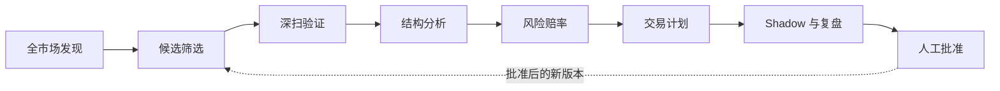
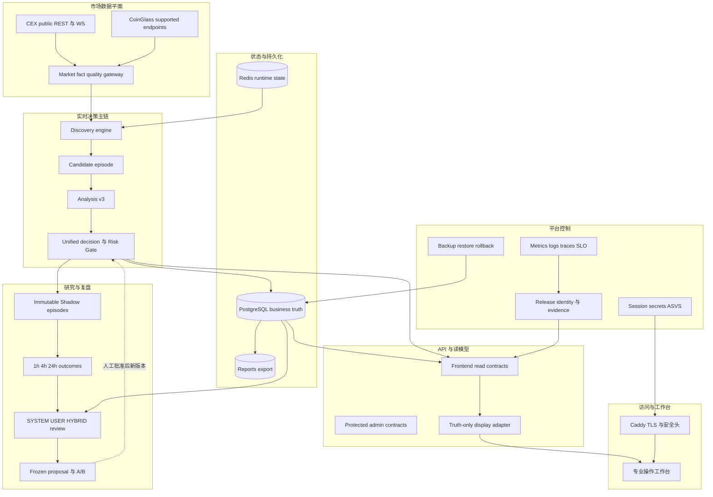
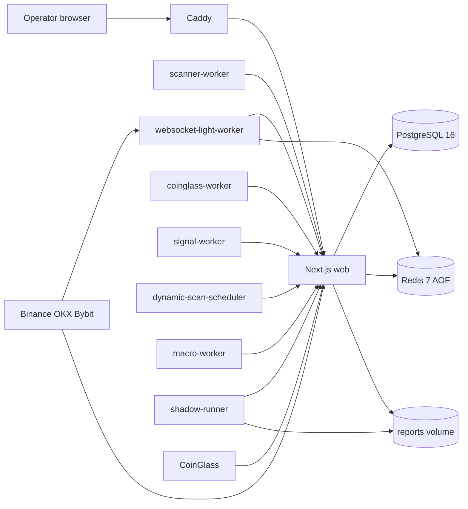
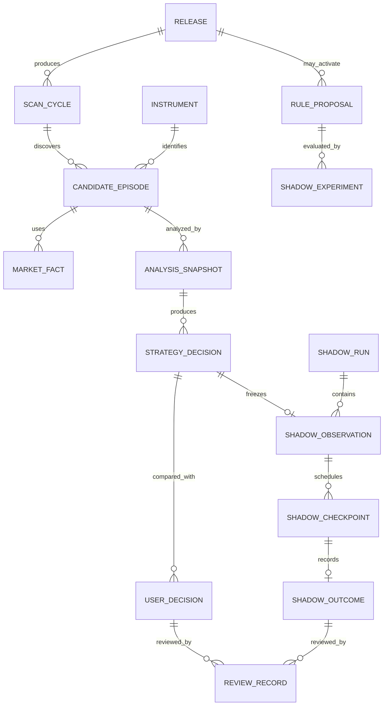

# Market Radar 工程搭建蓝图 v1.0

_2026-07-10；面向架构师、工程执行者、测试人员、生产运维和外部审计员的权威工程参考。_

---

## 1. 文档控制

| 字段 | 值 |
| --- | --- |
| 文档角色 | Engineering build reference / 工程搭建权威参考 |
| 状态 | `PROPOSED`，经用户与外部审计批准后生效 |
| 当前系统等级 | `R1 - 生产研究平台` |
| 目标等级 | `R4 - 受控人工实战决策辅助` |
| 对应路线图 | `docs/superpowers/plans/2026-07-10-market-radar-practical-readiness-master-plan-v3.md` |
| 配套运行蓝图 | `docs/blueprints/MARKET_RADAR_PRODUCTION_RUNTIME_BLUEPRINT_V1.md` |
| 机器可读追踪 | `docs/blueprints/market-radar-blueprint-traceability.v1.json` |
| 变更方法 | 独立 RFC/ADR、定向测试、基础门禁、发布证据、人工批准 |
| 禁止用途 | 不作为自动交易、自动调权、自动发布策略或盈利承诺 |

本蓝图规定系统应该怎样被搭建。它不证明任何目标能力已经实现，也不授权一次性重构、数据库迁移或生产部署。

文档使用以下事实标签：

| 标签 | 含义 |
| --- | --- |
| `CURRENT` | 已在当前代码或生产点样本中观察到 |
| `PARTIAL` | 有实现骨架，但合同、证据或生产闭环不完整 |
| `TARGET` | 目标状态，必须通过对应 Gate 才能声称具备 |
| `RESEARCH_ONLY` | 只允许研究、Shadow 或 Review，不进入实时决策 |
| `PROHIBITED` | 永久禁止进入系统的行为 |

任何文档、页面或报告不得把 `TARGET` 改写成 `CURRENT`。

## 2. 系统使命与工程边界

### 2.1 唯一使命

```text
快速对全市场覆盖性扫描，发现机会，给出策略，自我提升。
```

唯一核心链路：



### 2.2 产品边界

| 范围 | 决定 |
| --- | --- |
| 自动下单 | `PROHIBITED` |
| 交易所交易 API | `PROHIBITED` |
| 前端生成方向、止损、目标、RR | `PROHIBITED` |
| 回测结果回写生产排序 | `PROHIBITED` |
| 自动调权或自动发布规则 | `PROHIBITED` |
| 人工交易决策辅助 | R4 通过后允许 |
| 纸上决策与 Shadow | R2/R3 通过后允许 |
| 空榜、WAIT、BLOCKED、UNAVAILABLE | 永远允许且必须真实显示 |

### 2.3 工程完成定义

一个能力只有同时满足以下条件才算工程完成：

1. 权威合同已定义，字段、状态、来源和 nullable 语义无歧义。
2. 生产代码只有一条权威读写路径，没有平行实现绕过门禁。
3. 单元、合同、集成、浏览器或生产测试与风险相匹配。
4. 错误、限速、过期、缺失和降级路径均被验证。
5. 当前 release、commit、image、content 和 evidence 可对齐。
6. 前端能力不强于后端真实能力。
7. 项目上下文、变更日志和已知问题同步更新。

仅有页面、接口、类型、MVP、骨架、脚本或一次成功样本，均不满足完成定义。

## 3. 当前基线与目标质量

### 3.1 当前工程基线

| 层面 | CURRENT | 主要缺口 |
| --- | --- | --- |
| 应用 | Next.js `16.2.9`、React `19.2.7`、Node.js 22 | 大型合同文件和页面组件需要按职责渐进拆分 |
| 部署 | 腾讯云单机 Docker Compose | 发布身份、HTTPS 和证据正本未完全收口 |
| 数据库 | PostgreSQL 16 | 备份加密、异地保留、恢复演练证据不足 |
| 运行缓存 | Redis 7 AOF | key ownership、容量和恢复策略需要正式登记 |
| 入口 | Caddy 2 配置存在 | 当前公网点样本仍是明文 HTTP |
| 发现 | Binance/OKX/Bybit public + WebSocket | instrument alias 和分母语义未统一 |
| 深扫 | CoinGlass Hobbyist | 配额、端点能力和深扫 SLA 受限 |
| 决策 | v3 analysis + unified decision 骨架 | 多条旧决策路径仍需收敛 |
| Shadow | runner、storage、checkpoint 骨架 | Postgres 权威 outcome 和真实样本未闭环 |
| 前端 | dashboard/signals/token/market/review/system 等页面 | 假 0、合成事实、重复证明和状态映射风险 |
| 交付 | CI、部署、回滚、production evidence 脚本 | Git/image/content/evidence 单一发布记录未闭环 |

### 3.2 目标质量属性

| 属性 | R4 目标 | 证明方式 |
| --- | ---: | --- |
| 核心只读 API 可用性 | 30 天 `>=99.5%` | 外部探测 + 服务端 SLI |
| 轻扫成功周期 | `>=99%` | scan cycle numerator/denominator |
| 轻扫覆盖 | eligible universe `>=95%` | 权威 scan proof |
| 轻扫周期 P95 | `<=120s` | cycle telemetry |
| Tier A 深扫 P95 | `<=5m` | candidate episode trace |
| Tier B 深扫 P95 | `<=30m` | quota scheduler trace |
| Tier A 微观结构覆盖 | `>=90%`，P95 age `<=5s` | WebSocket quality report |
| 核心合同 API P95 | `<=2s` | request metrics |
| 关键首屏数据 P95 | `<=3s` | browser performance evidence |
| Shadow due 完成率 | `>=99%` | canonical checkpoint store |
| 假 READY/假 live/假 0 | `0` | contract tests + E2E + audit |
| 恢复目标 | RPO `<=24h`，RTO `<=2h` | 90 天内真实 restore drill |
| 安全基线 | OWASP ASVS 5.0 Level 2 | requirement-id evidence matrix |

这些数值是初始目标。调整必须通过 ADR，并说明用户影响、成本、证据和是否降低 R4 标准。

## 4. 总体架构

### 4.1 架构选择

目标架构采用“模块化单体 + 独立周期 worker + 权威数据合同”。当前规模不提前拆成分布式微服务：

- Next.js 应用继续承载页面、只读合同 API 和受保护管理 API。
- 高延迟、周期性和数据源连接工作由独立 worker/runner 承担。
- PostgreSQL 保存业务事实和不可变审计记录。
- Redis 保存短生命周期快照、锁、配额计数和 heartbeat。
- reports 目录只保存可再生成的导出物，不成为业务正本。
- GitHub `main`、构建产物身份和生产 release record 共同构成发布正本。

只有容量遥测、故障域或发布独立性证明模块化单体不足时，才允许通过 ADR 拆服务。

### 4.2 逻辑平面



### 4.3 当前部署拓扑



### 4.4 信任区

| 区域 | 内容 | 允许流量 | 禁止事项 |
| --- | --- | --- | --- |
| Internet | 浏览器、CEX、CoinGlass | HTTPS/WSS 到公开入口或官方源 | 直接访问 Postgres/Redis |
| Edge | Caddy | 443 到 web；80 仅重定向 | 明文业务流量、保存 session secret |
| App | web 与 workers | 内网 HTTP、Postgres、Redis | 对公网暴露管理端口 |
| Data | Postgres、Redis、volumes | 仅 App 网络 | 公网映射、共享宿主敏感目录 |
| Control | GitHub Actions、发布脚本、证据 | 只读验证与显式批准发布 | 长期服务器现场改代码 |
| Research | Shadow、backtest、review | 读取当时快照与后续 outcome | 回写 production score/READY |

## 5. 权威领域合同

### 5.1 MarketFactEnvelope

所有关键市场事实必须进入统一包装，不允许各模块自行解释 `null`、时间和来源。

```ts
type MarketFactStatus =
  | 'ready'
  | 'partial'
  | 'stale'
  | 'unavailable'
  | 'rate_limited'
  | 'plan_limited'
  | 'auth_error'
  | 'transport_error';

interface MarketFactEnvelope<T> {
  schemaVersion: 'market-fact.v1';
  factType: string;
  value: T | null;
  sourceId: string;
  canonicalInstrumentId: string;
  venueInstrumentId: string;
  observedAt: string | null;
  receivedAt: string;
  ageMs: number | null;
  status: MarketFactStatus;
  qualityReasons: string[];
  traceId: string;
}
```

硬规则：

- `null` 不能变成 `0`。
- 没有 `observedAt` 不能声称实时。
- proxy 必须在 `sourceId` 或 `qualityReasons` 中明确标识。
- stale fact 不能进入需要 fresh 的策略门禁。
- 原始源失败与市场无机会是两个不同结论。

### 5.2 InstrumentIdentity

```ts
interface InstrumentIdentity {
  schemaVersion: 'instrument-identity.v1';
  canonicalAssetId: string;
  canonicalInstrumentId: string;
  venue: 'BINANCE' | 'OKX' | 'BYBIT' | 'COINGLASS';
  venueInstrumentId: string;
  contractType: 'perpetual' | 'dated_future';
  settlementAsset: string;
  contractSize: number | null;
  aliases: string[];
  resolutionStatus: 'resolved' | 'ambiguous' | 'unresolved';
  resolutionReasons: string[];
}
```

`TAG/1000TAG`、`SKYAI/SKYAI1` 一类关系只有在合约规格可证明时才能合并；无法证明必须保持 `ambiguous/unresolved`。

### 5.3 ScanCycleProof

```ts
interface ScanCycleProof {
  schemaVersion: 'scan-cycle-proof.v1';
  cycleId: string;
  startedAt: string;
  completedAt: string | null;
  observedUniverse: number;
  acceptedUniverse: number;
  eligibleUniverse: number;
  lightScanned: number;
  deepQueued: number;
  deepValidated: number;
  candidateEpisodesCreated: number;
  status: 'running' | 'ready' | 'partial' | 'failed';
  freshness: 'fresh' | 'aging' | 'stale' | 'unknown';
  blockers: string[];
  releaseId: string;
}
```

一个页面只能有一个权威 scan proof。不同分母必须逐项命名，不允许用 light coverage 表示 data trust。

### 5.4 CandidateEpisode

```ts
interface CandidateEpisode {
  schemaVersion: 'candidate-episode.v1';
  episodeId: string;
  canonicalInstrumentId: string;
  firstSeenAt: string;
  lastSeenAt: string;
  observationPrice: number | null;
  observationPriceFactId: string | null;
  discoveryReasons: string[];
  priorityTier: 'A' | 'B' | 'C';
  lifecycle: 'discovered' | 'queued' | 'validated' | 'analyzed' | 'closed';
  maturity: 'light_candidate' | 'deep_candidate' | 'evidence_observe' | 'wait' | 'blocked' | 'trade_plan_ready';
  directionState: 'long' | 'short' | 'neutral' | 'unknown';
  expiresAt: string;
  parentEpisodeId: string | null;
  releaseId: string;
}
```

同一 instrument 在旧 episode 关闭后重新触发时必须创建新 episode；不得修改旧 firstSeen 或 outcome。

### 5.5 AnalysisReadModel

```ts
interface AnalysisReadModel {
  schemaVersion: 'analysis-read-model.v1';
  episodeId: string;
  directionBias: 'long' | 'short' | 'neutral' | 'unknown';
  structureState: string;
  timeframeEvidence: Array<{ timeframe: string; status: string; reasons: string[] }>;
  keyLevels: Array<{ type: string; price: number; source: string; observedAt: string }>;
  confirmations: string[];
  contradictions: string[];
  lateMoveRisk: boolean;
  fakeoutRisk: boolean;
  dataQualityStatus: MarketFactStatus;
  generatedAt: string;
  analysisVersion: string;
}
```

ANALYSIS 只能描述结构、方向倾向、证据、反证和质量；不得生成可执行 entry/stop/target。

### 5.6 StrategyDecisionReadModel

```ts
type DecisionStatus = 'OBSERVE' | 'WAIT' | 'BLOCKED' | 'TRADE_PLAN_READY';

interface StrategyDecisionReadModel {
  schemaVersion: 'strategy-decision.v1';
  decisionId: string;
  episodeId: string;
  status: DecisionStatus;
  direction: 'long' | 'short' | null;
  trigger: string | null;
  plannedEntryPrice: number | null;
  structuralStop: number | null;
  targets: number[];
  structuralRr: number | null;
  invalidation: string | null;
  whyNotNow: string[];
  blockers: string[];
  costEstimate: { fee: number | null; slippage: number | null; funding: number | null };
  riskGate: 'pass' | 'blocked' | 'unavailable';
  generatedAt: string;
  strategyVersion: string;
  releaseId: string;
}
```

`TRADE_PLAN_READY` 必须同时满足：方向、触发、entry、结构止损、至少一个目标、`RR>=3`、失效条件、成本和 Risk Gate。否则只能输出 WAIT/BLOCKED/OBSERVE。

### 5.7 ShadowObservation 与 Outcome

Shadow 保存当时可见事实的不可变快照：

```ts
interface ShadowObservation {
  schemaVersion: 'shadow-observation.v1';
  runId: string;
  eventId: string;
  episodeId: string;
  observedAt: string;
  observationPrice: number | null;
  observationPriceSource: string | null;
  decisionSnapshotHash: string;
  releaseId: string;
  researchOnly: true;
}

interface ShadowOutcome {
  schemaVersion: 'shadow-outcome.v1';
  outcomeId: string;
  eventId: string;
  checkpoint: '1h' | '4h' | '24h';
  status: 'recorded' | 'missed' | 'pending_with_error' | 'data_unavailable';
  windowStart: string;
  windowEnd: string;
  priceSource: string | null;
  mfe: number | null;
  mae: number | null;
  recordedAt: string;
  mutatesProduction: false;
}
```

Observation 和 Outcome 分表、分时间、分权限；Outcome 永远不能成为生产 scan/analysis/strategy 的输入。

### 5.8 ReleaseIdentity

```ts
interface ReleaseIdentity {
  schemaVersion: 'release-identity.v1';
  releaseId: string;
  gitCommit: string;
  imageDigest: string;
  contentHash: string;
  builtAt: string;
  deployedAt: string | null;
  migrationStatus: 'none' | 'planned' | 'applied' | 'failed';
  evidenceGeneratedAt: string | null;
  evidenceExpiresAt: string | null;
  rollbackReleaseId: string | null;
}
```

运行健康、业务能力和发布证据必须引用同一个 `releaseId`，否则 evidence 只能是 partial。

## 6. 模块与所有权

### 6.1 源码边界

| 领域 | 当前主要路径 | 目标责任 | 禁止依赖 |
| --- | --- | --- | --- |
| 市场发现 | `src/lib/market/` | universe、public scan、quality、candidate | review outcome |
| 分析 | `src/lib/analysis/v3/` | structure、levels、evidence、contradictions | future outcome |
| 决策 | `src/lib/decision/`、`src/lib/analysis/v3/trade-plan.ts` | unified decision、WAIT、READY | frontend state |
| 风险 | `src/lib/risk/` | RR、成本、个人风险镜头 | leverage 改变结构 RR |
| 持久化 | `src/lib/persistence/` | repository contract、Postgres adapter | UI formatting |
| 复盘 | `src/lib/journal/`、`src/lib/review/` | outcome、SYSTEM/USER/HYBRID | production ranking write |
| Shadow | `src/lib/shadow/`、`src/scripts/shadow/` | immutable observation/checkpoint/outcome | production mutation |
| API 合同 | `src/lib/api/`、`src/app/api/` | auth、read model、status、rate limit | 组件内业务推理 |
| 前端 | `src/components/`、`src/app/` | 展示、筛选、钻取、人工操作 | 生成交易事实 |
| 运行时 | `src/lib/runtime/`、`deploy/workers/` | heartbeat、telemetry、periodic work | 隐式降级成 pass |
| 交付 | `scripts/deploy/`、`scripts/production/`、`.github/workflows/` | build、release、rollback、evidence | 保存真实 secret |

### 6.2 文件规模治理

大型文件不做无关重写。只有触及该职责时，才按以下顺序渐进拆分：

1. 先固定现有合同测试和行为快照。
2. 抽取纯类型和纯转换函数。
3. 抽取单一读模型 builder 或 adapter。
4. 保留兼容入口，消费者逐个迁移。
5. 删除旧路径前做 repository-wide 引用检查。

目标不是追求小文件数量，而是让每个单元有一个清楚责任和一组可独立测试的接口。

## 7. 数据与持久化架构

### 7.1 存储所有权

| 存储 | 权威数据 | 非权威数据 | 目标保留 |
| --- | --- | --- | --- |
| PostgreSQL | episodes、decisions、journal、Shadow run/checkpoint/outcome、release record | 可再计算摘要 | 按实体策略，审计数据不可静默删除 |
| Redis | WS snapshot、locks、rate counters、heartbeat、short cache | 业务历史 outcome | TTL 明确；持久化仅用于运行恢复 |
| reports volume | evidence export、review report、脱敏 bundle | `latest` 业务正本 | 可重建；按发布/审计周期轮转 |
| Git repository | 代码、schema、文档、migrations、CI | 运行 secret、业务行数据 | 永久历史 |
| 异地对象存储 | 加密备份、release evidence | 明文 secret | 30 天以上，访问审计 |

### 7.2 目标业务实体



### 7.3 Schema 变更规则

- migration 必须独立任务、显式授权和回滚/前滚方案。
- migration 在 CI 中对空库和上一稳定 schema 各验证一次。
- destructive change 使用 expand/contract，两次发布完成。
- 表、列、索引、保留策略和敏感等级必须写入 schema registry。
- 应用发布不得隐式执行 migration。
- restore 后必须运行 schema version、row-count boundary 和核心 contract smoke。

### 7.4 Redis key 规则

目标格式：

```text
market-radar:{scope}:{domain}:{entity}:{id}:{version}
```

每个 key 必须登记 owner、writer、reader、TTL、最大大小、持久化要求和降级行为。锁必须包含 owner/runtimeId、过期时间和 fencing token；不得只依赖“存在一个 key”判断进程健康。

## 8. API 与读模型架构

### 8.1 API 分类

| 类别 | 示例 | 规则 |
| --- | --- | --- |
| Public read | `/api/frontend/*`、`/api/radar/*`、`/api/health` | GET、限速、no secret、明确 freshness |
| Streaming read | `/api/frontend/live-events/stream` | 可恢复 cursor、heartbeat、stale 语义 |
| User write | `/api/journal`、`/api/frontend/ui-state` | private session、CSRF/Origin、审计 |
| Admin action | `/api/admin/*`、POST `/api/scan` | default deny、CRON auth、幂等、审计 |
| Auth | `/api/auth/session` | no-store、rate limit、Secure cookie |

### 8.2 响应外壳

所有核心 read contract 目标使用统一外壳：

```ts
interface ApiEnvelope<T> {
  schemaVersion: string;
  requestId: string;
  releaseId: string;
  generatedAt: string;
  expiresAt: string | null;
  status: 'ready' | 'partial' | 'stale' | 'unavailable' | 'failed';
  data: T | null;
  warnings: string[];
  blockers: string[];
}
```

HTTP 200 可以承载 `partial/stale` 的只读业务结果，但页面必须读取业务状态；认证失败、权限失败、参数错误和服务器错误仍使用正确 4xx/5xx。

### 8.3 Frontend truth adapter

前端 adapter 只允许：

- 单位转换和经过定义的格式化。
- 中文业务标签映射。
- 根据后端 status 显示可用、部分、过期或不可用。
- 对同一后端事实做排序、筛选和分页。

前端 adapter 禁止：

- neutral/unknown 推断 long/short。
- 缺失价格、MFE、MAE、OI、Funding 变为 0。
- 使用数组下标生成 age 或 freshness。
- 使用 leaderboard 排名生成 score、sentiment 或 trade signal。
- 为填满页面创建候选、计划或来源。

## 9. Worker 与调度架构

### 9.1 当前服务责任

| Compose 服务 | 当前默认周期 | 单一责任 | 失败时必须怎样降级 |
| --- | ---: | --- | --- |
| `scanner-worker` | 900s | 触发受保护扫描周期 | scan partial，不影响 public universe 事实 |
| `websocket-light-worker` | snapshot 15s | 三所 public WS 轻扫和盘口代理 | snapshot stale，禁止 last frame 当 live |
| `coinglass-worker` | daily mover 86400s；kline cache 21600s | 受限数据与日榜任务 | rate/plan/auth 分开，不能清空 public scan |
| `signal-worker` | outcome 3600s；forward map 21600s | outcome 与分析复核任务 | review partial，不改变实时决策 |
| `dynamic-scan-scheduler` | 300s | 健康感知的调度提示 | 保守调度，不改 Risk Gate |
| `macro-worker` | 3600s | 市场背景事件 | context unavailable，不生成方向 |
| `shadow-runner` | 300s | capture、due sweep、summary | Shadow partial，禁止声称 outcome 完整 |

### 9.2 Worker 通用合同

每个 worker 必须实现：

```ts
interface WorkerRunRecord {
  workerId: string;
  runtimeId: string;
  releaseId: string;
  scheduledAt: string;
  startedAt: string;
  completedAt: string | null;
  status: 'running' | 'succeeded' | 'partial' | 'failed' | 'skipped';
  inputWatermark: string | null;
  outputWatermark: string | null;
  processed: number;
  succeeded: number;
  failed: number;
  errorClasses: string[];
  nextRunAt: string;
}
```

并满足：幂等、single-flight、超时、指数退避加 jitter、结构化错误分类、heartbeat 与业务成功分离、releaseId 对齐。

## 10. 安全架构

### 10.1 安全基线

安全开发采用 NIST SSDF 1.1 的组织、保护、生产和响应实践，并以 OWASP ASVS 5.0.0 Level 2 建立 Web 控制验证矩阵。每个控制记录版本化 requirement id，防止标准升级后编号漂移。[^1][^2]

### 10.2 身份与会话

- 生产 private mode 明确启用或明确仅受信私网访问，不允许状态不明。
- cookie 使用 `Secure`、`HttpOnly`、`SameSite` 和受限 path/domain。
- session 建立后旋转标识；logout、过期和 secret rotation 可验证。
- 登录按来源和账户限速，失败不泄露账户状态。
- 私有页面、API、SSE 和下载端点使用同一授权策略。
- session 响应和私有 read model 使用 `Cache-Control: no-store`。

### 10.3 Secret 管理

- `.env.production` 仅在服务器或批准的 secret store 中存在。
- GitHub Actions 使用最小权限 environment secret，不把 secret 写入 artifact。
- 日志、evidence、zip、截图和错误对象统一脱敏。
- secret rotation 有 owner、影响服务、重启顺序和回滚方法。
- 发现泄露立即吊销，不继续使用“已暴露但还能工作”的 key。

### 10.4 管理端点

- `/api/admin/*` default deny。
- 所有写操作使用 method、auth、origin、rate limit、request id 和审计记录。
- 重复请求使用 idempotency key 或业务去重键。
- migration、strategy execution、Shadow control 和部署 readiness 分权限。
- 管理响应不得返回环境变量、连接串、token、cookie 或数据库业务行。

### 10.5 软件供应链

- 依赖锁文件必须提交，CI 使用 `npm ci`。
- GitHub Actions 固定受信 action 版本并使用最小 permissions。
- 容器镜像记录 digest、SBOM/依赖审计和构建 provenance。
- 生产只运行 CI 生成并可验证身份的 artifact；GitHub artifact attestation 可作为后续 provenance 增强。[^3]
- 高危依赖或镜像漏洞阻断发布，不以页面可用为例外。

## 11. 可观测性架构

### 11.1 三类信号

OpenTelemetry semantic conventions 用于统一 traces、metrics、logs 和 resource 属性命名，避免 web、worker、数据库和发布脚本各自发明字段。[^4]

最低公共属性：

```text
service.name
service.instance.id
deployment.environment
release.id
git.commit
request.id
trace.id
scan.cycle.id
candidate.episode.id
worker.run.id
data.source
data.status
error.type
```

### 11.2 健康维度

| 维度 | 回答的问题 | 不得替代 |
| --- | --- | --- |
| Liveness | 进程是否活着 | Readiness |
| Readiness | 当前能否处理请求 | Data freshness |
| Freshness | 数据是否在时效窗口内 | Source capability |
| Capability | 数据源/套餐/端点是否支持 | 市场是否有机会 |
| Business gate | 核心链路是否产生可信结果 | Runtime health |
| Release evidence | 当前部署是否与批准产物对齐 | 单次 HTTP 200 |
| Practical readiness | 是否达到 R4 | 上述任一单点 PASS |

### 11.3 禁止高基数与敏感属性

完整 URL query、token、cookie、账户输入、原始 journal、完整 prompt、任意 symbol 列表不得直接成为 metric label。高基数信息进入受控日志或 trace event，并遵守保留和脱敏策略。

## 12. 测试与验证架构

### 12.1 测试层级

| 层级 | 目标 | 典型门禁 |
| --- | --- | --- |
| 类型/静态 | 合同与依赖正确 | `typecheck`、lint、forbidden、secret |
| 单元 | 纯规则和状态机 | exact fixture、边界、反例 |
| 合同 | API/read model/schema | nullable、status、source、version |
| 集成 | Postgres、Redis、worker、provider | 幂等、重试、部分失败 |
| Golden | 已知策略防线 | `backtest:golden`，不是效果证明 |
| Professional audit | 全链路历史审计 | 独立 holdout、无 future leak |
| Browser E2E | 人工工作流和事实一致 | Chromium/Edge/mobile、a11y、visual |
| Load/soak | 时延、配额、内存和稳定性 | P95/P99、30-60m、7/30d SLO |
| Recovery | rollback/restore | 真实隔离恢复、RPO/RTO |
| Production evidence | 当前 release 事实 | health/API/page/worker/data/release |

Playwright projects 用于多浏览器、设备和环境矩阵；可访问性必须结合自动检查和人工检查，不能只看自动扫描。[^5][^6]

### 12.2 每轮基础门禁

```bash
npm run typecheck
npm run lint
npm run test:market
npm run build
npm run backtest:golden
npm run ci:forbidden-files
npm run ci:secret-patterns
npm run security:check
```

`backtest:formal` 只在明确的能力验收轮运行。测试失败时修根因，不删除防线、不硬编码结果、不放宽 RR。

### 12.3 Fixture 纪律

- Production fixture 不含 future outcome。
- Historical/Shadow fixture 明确时间切点。
- neutral、null、stale、429、auth_error、transport_error 均有反例。
- 数据源契约按 plan/endpoint/status 组合测试。
- 同一 holdout 被用于调参后立即失去验收资格。

## 13. 构建、发布与回滚

### 13.1 发布流水线

```mermaid
flowchart LR
    accTitle: Controlled Release Pipeline
    accDescr: Every production release moves from reviewed source through quality gates, immutable artifact identity, explicit approval, production observation, and rollback-capable evidence.

    scoped_change["范围锁定变更"] --> targeted_tests["定向测试"]
    targeted_tests --> base_gates["基础门禁"]
    base_gates --> security_gates["安全与敏感检查"]
    security_gates --> reviewed_commit["审查后的 commit"]
    reviewed_commit --> immutable_artifact["不可变 image 与 provenance"]
    immutable_artifact --> explicit_approval{"显式生产批准"}
    explicit_approval -->|"拒绝"| stop_release["停止发布"]
    explicit_approval -->|"批准"| deploy_release["服务器自拉并部署"]
    deploy_release --> smoke_checks["health API page worker smoke"]
    smoke_checks --> observation["30-60 分钟观察"]
    observation --> evidence_gate{"current evidence PASS"}
    evidence_gate -->|"否"| rollback["回滚上一 release"]
    evidence_gate -->|"是"| active_release["标记 active release"]
```



Docker Compose 的 `service_healthy` 只保证依赖健康后再启动消费者；容器 running 不等于应用 ready，因此每个依赖仍需真实 healthcheck。[^7]

### 13.2 发布不变量

- 生产服务器 tracked worktree 必须 clean。
- `main` commit、image digest、content hash、releaseId 必须一致。
- migration 状态必须显式，不允许“可能执行过”。
- 部署前记录 previous release 和备份状态。
- 部署后验证 Caddy、web、全部 required workers、Postgres、Redis、核心 API 和页面。
- evidence 必须有 generatedAt/expiresAt/releaseId，过期 evidence 自动失效。
- 自动回滚只能回到已知、可验证、schema 兼容的 release。

### 13.3 分阶段发布

单用户系统不强制引入复杂集群 canary。采用以下渐进方法：

1. 本地和 CI 完整验证。
2. research-only 功能先在 Shadow 路径运行。
3. 生产部署后先保持辅助状态关闭或只读。
4. 通过 30-60 分钟观察和 current evidence 后恢复对应能力。
5. SLO 或事实门禁退化时自动降级能力标签，不自动调策略。

## 14. 备份与灾难恢复设计

PostgreSQL 官方提供 SQL dump、文件系统备份和连续归档三类基本方法；本项目当前规模先使用 custom-format logical dump，并在数据量或 RPO 要求提高后评审 PITR。[^8][^9]

| 对象 | 初始方案 | RPO | RTO | 验证 |
| --- | --- | ---: | ---: | --- |
| PostgreSQL | 每日 `pg_dump -Fc`，加密，异地 30 天 | 24h | 2h | 每日 archive verify，90 天 restore drill |
| Redis | AOF everysec + volume；关键业务不得只在 Redis | 1s 运行状态 | 30m | 启动校验、key contract、恢复演练 |
| reports | 按 release/run 导出并备份关键 evidence | 24h | 2h | hash 与 manifest |
| Caddy data | 持久 volume + 配置入 Git | 24h | 1h | TLS renewal/restore check |
| release record | Git + evidence + offsite copy | 0 已提交记录 | 1h | commit/digest/hash 对齐 |

Redis 官方同时提供 RDB、AOF 或二者组合；当前 AOF 不能代替 PostgreSQL 业务正本和异地备份。[^10]

## 15. 工程建设顺序

V3 Gate 是施工顺序，不允许挑视觉或策略部分先做：

| Gate | 工程切片 | 产出 | 最高等级 |
| --- | --- | --- | --- |
| G0 | Truth、lifecycle、HTTPS/session、release identity | 可信 R1 | R1 |
| G1 | SLO、backup/restore、ASVS、E2E/load | 可持续 R1 | R1 |
| G2 | MarketFact、identity、deep SLA、microstructure | 可追溯数据平面 | R1 |
| G3 | CandidateEpisode、RS、pre-move、holdout | 可验证候选层 | R1/R2 candidate |
| G4 | 唯一分析/策略路径、WAIT、成本、风险 | 可验证决策层 | R2 candidate |
| G5 | Postgres Shadow、真实 outcome、A/B governance | Shadow 闭环 | R2 |
| G6 | 专业工作台、三模式复盘、提醒 | 可操作产品 | R2/R3 candidate |
| G7 | 30 天 paper workflow、readiness evaluator | R4 审核包 | R3/R4 review |
| G8 | 180 天治理、退化和成本决策 | 长期专业工作台 | R5 review |

每个 Gate 必须拆成独立 Work Package；不得按本蓝图一次性大改。

## 16. 扩容与演进条件

### 16.1 当前默认

继续使用单机 Compose，先消除事实和运行风险。当前不因为“专业感”引入 Kubernetes、Kafka、服务网格或多区域数据库。

### 16.2 垂直扩容条件

在已排除代码、查询、缓存和调度问题后，满足任一持续条件才评估主机升级：

- CPU 15m P95 `>=70%`。
- memory P95 `>=80%`。
- disk 使用 `>=70%` 或 I/O 持续成为瓶颈。
- 核心 API/scan P95 连续违反 SLO。

### 16.3 服务拆分条件

只有出现明确独立故障域、资源隔离、扩缩需求或发布节奏冲突时拆服务。优先候选顺序：

1. WebSocket ingestion。
2. Scan orchestration。
3. Shadow/outcome processing。
4. Read-model API。

拆分前必须先有稳定合同、traceId、幂等键、容量数据和回滚方案。

### 16.4 高可用演进

R4 并不自动要求多机集群。只有停机成本、RTO 或实际 SLO 证明单机不可接受时，才评估：托管 Postgres、Redis replica、双实例 web、独立 worker host 和对象存储。每项投资必须有故障概率、用户影响和成本证明。

## 17. 架构治理

### 17.1 ADR 触发条件

以下变化必须写 ADR：

- 新数据源或付费套餐。
- 新数据库、消息系统或外部服务。
- schema destructive change。
- SCAN/ANALYSIS/STRATEGY 边界变化。
- readiness、RR、Risk Gate 或状态语义变化。
- 服务拆分、扩容、区域或云迁移。
- 身份认证、上传、secret 或隐私策略变化。

### 17.2 规则生命周期

```text
Proposal -> Research -> Frozen Shadow A/B -> Review -> User Approval
-> Production Candidate -> Release Gate -> Monitoring -> Retirement
```

任何阶段失败都回到 Proposal/Research，不直接改线上权重。

### 17.3 架构合规检查

每次 PR/交付必须回答：

1. 服务核心链路哪一环？
2. 是否新建了平行事实源？
3. 是否让 future outcome 进入 production？
4. null/stale/partial 如何表现？
5. 失败时系统如何降级？
6. 哪个测试证明合同？
7. 哪个生产证据证明上线？
8. 如何回滚？

## 18. R4 工程验收

R4 工程门禁采用一票否决加评分，不以“功能很多”验收。

### 18.1 一票否决摘要

- 明文公网 HTTP 或 private session 状态不明。
- 假 0、假 live、假 direction、假 timeout、重复冲突指标。
- release/evidence/Git/image/content 无法对齐。
- future outcome 污染 production。
- READY 绕过结构止损、目标、`RR>=3`、失效条件或 Risk Gate。
- 关键事实无法追溯 source/instrument/time/status。
- Shadow、holdout、restore 或安全证据不足。
- 自动下单、自动调权或自动发布规则。

### 18.2 最终证据包

| 证据 | 必须包含 |
| --- | --- |
| Release | releaseId、commit、image digest、content hash、rollback target |
| Runtime | 30 天 SLO、workers、Postgres、Redis、TLS、capacity |
| Data | coverage、freshness、quality、identity、source capability |
| Scan | holdout、pre-move、TopN、late/noise、miss denominator |
| Strategy | analysis/strategy score、真实触发、net R、no leak |
| Shadow | 60 天、500 episodes、60 triggered、checkpoint quality |
| Security | ASVS L2 matrix、dependency/container/secret evidence |
| Recovery | 90 天内 restore drill、RPO/RTO |
| UX | E2E、a11y、performance、truth consistency |
| Approval | 外部审计与用户批准 |

只有全部满足，系统才允许标记“具备受控人工实战决策辅助准入”。

## 19. 参考资料

[^1]: NIST. “Secure Software Development Framework (SSDF) Version 1.1.” https://csrc.nist.gov/pubs/sp/800/218/final

[^2]: OWASP Foundation. “Application Security Verification Standard 5.0.0.” https://owasp.org/www-project-application-security-verification-standard/

[^3]: GitHub. “Using artifact attestations to achieve SLSA Build Level 3.” https://docs.github.com/en/actions/how-tos/secure-your-work/use-artifact-attestations/increase-security-rating

[^4]: OpenTelemetry. “Semantic Conventions 1.43.0.” https://opentelemetry.io/docs/specs/semconv/

[^5]: Microsoft. “Playwright Projects.” https://playwright.dev/docs/test-projects

[^6]: Microsoft. “Playwright Accessibility Testing.” https://playwright.dev/docs/accessibility-testing

[^7]: Docker. “Control startup and shutdown order in Compose.” https://docs.docker.com/compose/how-tos/startup-order/

[^8]: PostgreSQL Global Development Group. “Backup and Restore.” https://www.postgresql.org/docs/current/backup.html

[^9]: PostgreSQL Global Development Group. “pg_dump.” https://www.postgresql.org/docs/current/app-pgdump.html

[^10]: Redis. “Redis persistence.” https://redis.io/docs/latest/operate/oss_and_stack/management/persistence/
