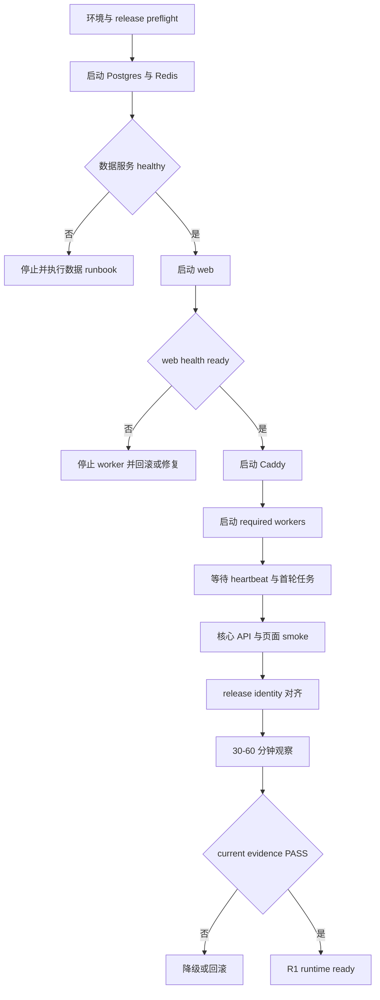
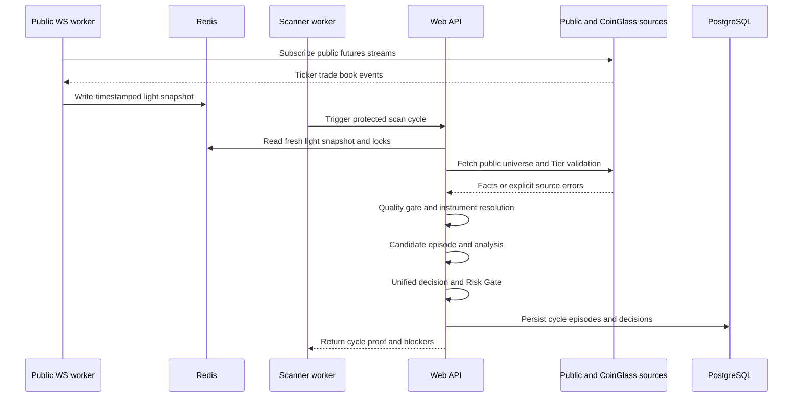
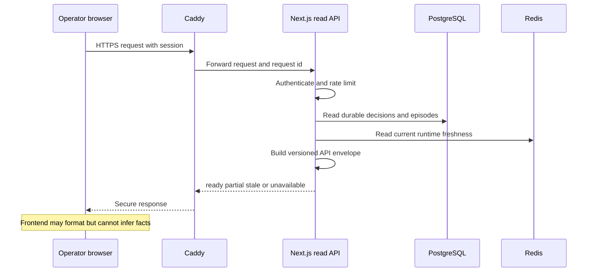
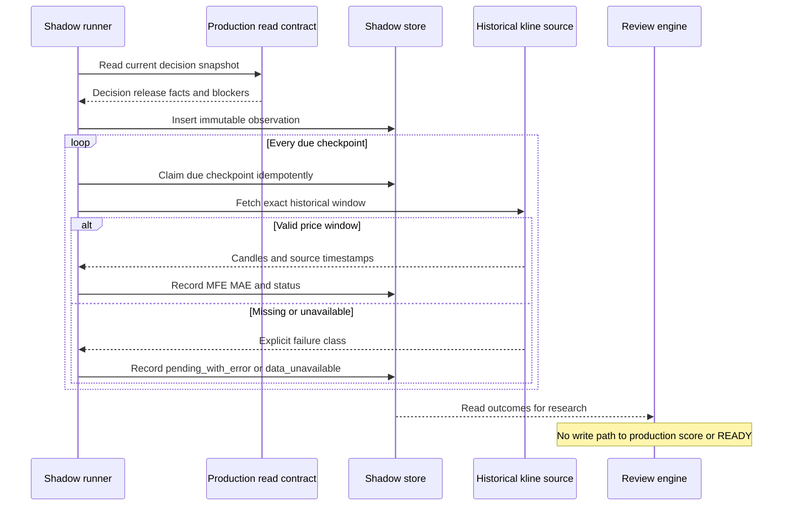
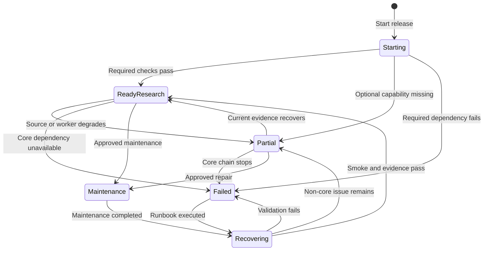
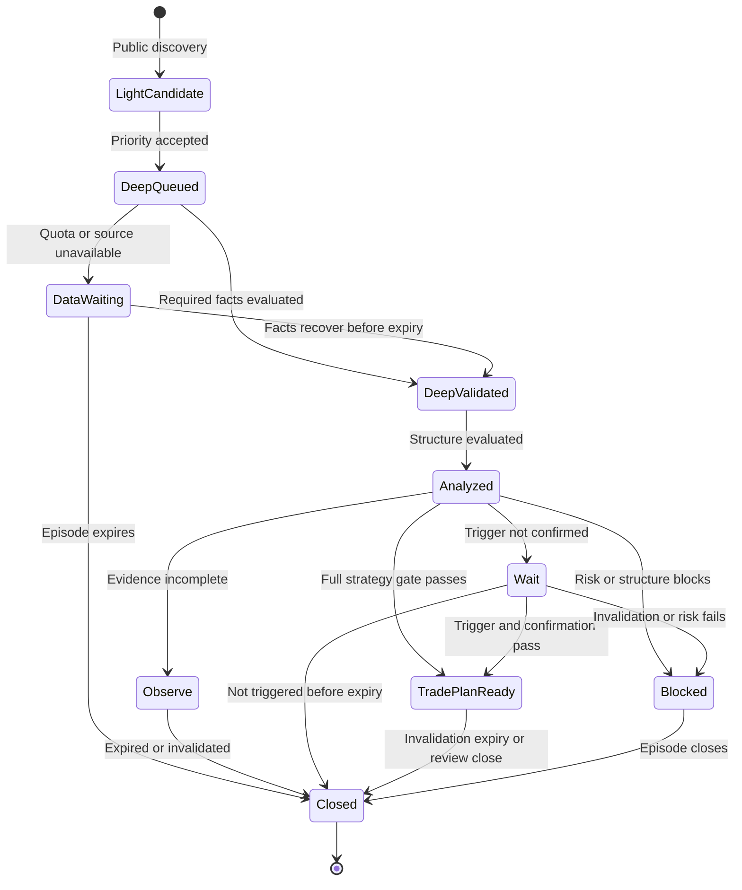
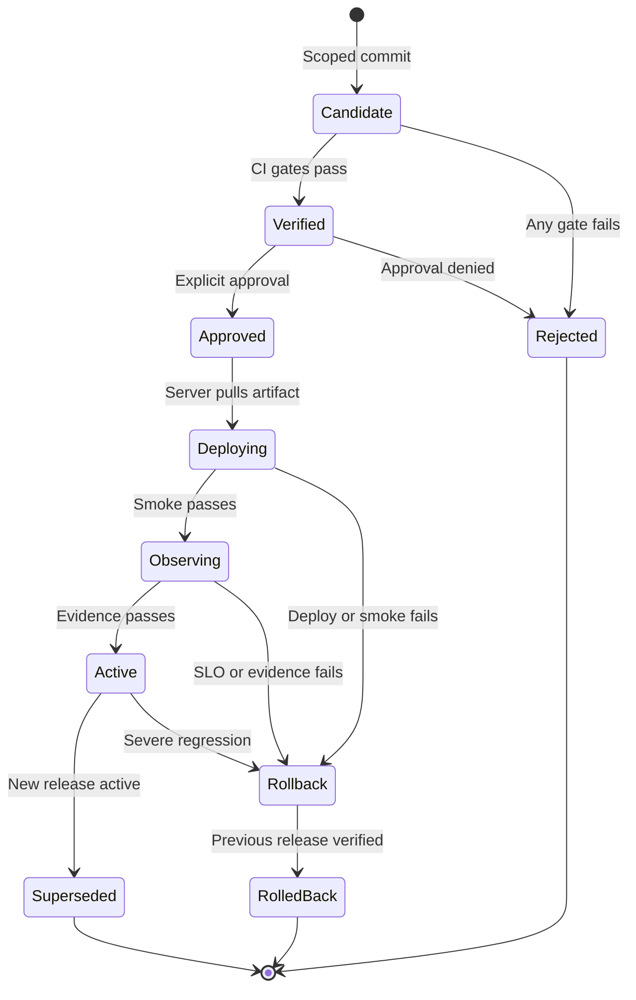

# Market Radar 生产运行蓝图 v1.0

_2026-07-10；面向生产值班、工程执行、事故响应、发布审批和外部审计的权威运行参考。_

---

## 1. 文档控制

| 字段 | 值 |
| --- | --- |
| 文档角色 | Production runtime reference / 生产运行权威参考 |
| 状态 | `PROPOSED`，经用户与外部审计批准后生效 |
| 当前等级 | `R1 - 生产研究平台` |
| 配套工程蓝图 | `docs/blueprints/MARKET_RADAR_ENGINEERING_BUILD_BLUEPRINT_V1.md` |
| 对应路线图 | `docs/superpowers/plans/2026-07-10-market-radar-practical-readiness-master-plan-v3.md` |
| 生产模型 | 腾讯云单机 Docker Compose；GitHub `main` 为代码正本 |
| 时区 | 业务展示 `Asia/Shanghai`；证据和跨系统时间统一保存 ISO 8601/UTC |
| 自动交易 | 永久禁止 |
| 自动策略调权 | 永久禁止 |

本蓝图规定系统上线后怎样启动、运行、降级、报警、发布、恢复和暂停能力。它不允许操作者为了恢复“绿色状态”篡改业务事实或降低交易门禁。

## 2. 运行不变量

以下规则优先于 uptime、信号数量和页面完整度：

1. 假 READY、假 live、假 0、假 source 和假 timeout 的严重性高于页面暂时不可用。
2. CoinGlass、WebSocket 或单一交易所故障不能被解释为“市场无机会”。
3. Postgres 不可用时生产不得回退到 memory repository 保存业务事实。
4. Redis 不可用时锁、配额、heartbeat 和 WS snapshot 必须显式降级。
5. 旧 cache、旧 evidence、旧 heartbeat 和旧 Shadow `latest` 不能证明当前健康。
6. Runtime health、data freshness、business readiness、release evidence 和 R4 readiness 分开计算。
7. Shadow/Review/Backtest 不得修改实时排序、方向、READY、RR 或 Risk Gate。
8. 故障时宁可空榜、WAIT、BLOCKED、PARTIAL 或 UNAVAILABLE，也不补假数据。
9. 所有生产写操作、restore、migration、rollback 和 secret rotation 都需要明确授权与审计。
10. 操作者不得在生产服务器长期现场改代码；紧急修复必须回流 GitHub 正本。

## 3. 运行角色与责任

### 3.1 责任模型

| 角色 | 责任 | 无权执行 |
| --- | --- | --- |
| 用户/Owner | 产品边界、实战准入、付费和高风险操作最终批准 | 绕过证据把 partial 改 pass |
| 架构审计 | 边界、门禁、风险和 readiness 复核 | 直接改生产权重 |
| 工程执行 | 最小实现、测试、发布材料、回滚和证据 | 自动交易、未经批准 migration |
| Runtime operator | 观察、分级、降级、执行 runbook、保全证据 | 修改业务结果掩盖故障 |
| CI/CD | 重复执行质量门禁、构建和 provenance | 无人工批准真实部署 |
| Worker/runner | 按合同执行周期任务并报告状态 | 越层生成交易计划或自动调权 |

当前单用户项目允许同一个人承担多个角色，但每次操作仍要保留角色边界和批准证据。

### 3.2 权威事实顺序

当不同来源冲突时，按以下顺序判断：

1. 当前生产 API/page 的只读点样本。
2. 当前 release identity 和服务器实际 image/content。
3. 当前、未过期且 release 对齐的 production evidence。
4. PostgreSQL 权威业务记录。
5. Redis 当前运行状态。
6. reports 导出物。
7. 历史交付报告和旧 `latest` 文件。

低优先级来源不得覆盖高优先级当前事实。

## 4. 服务拓扑与启动依赖

### 4.1 Compose 服务清单

| 服务 | 类型 | 关键依赖 | 持久状态 | Required |
| --- | --- | --- | --- | --- |
| `postgres` | 数据库 | volume | 业务事实 | 是 |
| `redis` | runtime store | volume/AOF | 短期运行状态 | 是 |
| `web` | Next.js | postgres healthy、redis healthy | reports export | 是 |
| `caddy` | edge | web healthy | certificate/config volume | 是 |
| `scanner-worker` | worker | web healthy | 经 API 写 Postgres/Redis | 是 |
| `websocket-light-worker` | worker | redis healthy、web healthy | Redis snapshot | 是 |
| `coinglass-worker` | worker | web healthy | 经 API 写 Postgres | 是 |
| `signal-worker` | worker | web healthy | journal/outcome | 是 |
| `dynamic-scan-scheduler` | worker | web healthy | runtime scheduling | 是 |
| `macro-worker` | worker | web healthy | macro snapshot | 是 |
| `shadow-runner` | research runner | web healthy、reports volume | Shadow export；目标 Postgres | R2 起 required |

Docker Compose 只有在依赖声明为 `service_healthy` 时才等待 healthcheck；容器进入 running 本身不表示服务 ready。[^1]

### 4.2 启动顺序



### 4.3 安全启动检查

启动前必须确认：

- 目标 commit 和批准 release 一致。
- 生产 tracked worktree clean。
- `.env.production` 存在但不读取原值到终端记录。
- Compose config 可解析且 secret required 条件满足。
- 磁盘、inode、内存和 Docker daemon 可用。
- 最近成功备份未超过 24 小时；涉及数据变更时必须有新备份。
- previous release 和 rollback target 可用。
- migration 明确为 none/planned，不允许 unknown。

## 5. 稳态运行时钟

### 5.1 当前周期

| 周期 | 任务 | 当前默认 | 输出 | 超时/缺失语义 |
| --- | --- | ---: | --- | --- |
| 常驻 | Caddy/web/Postgres/Redis | continuous | Web/API/data | 服务 health 独立判断 |
| 15 秒 | WS snapshot | `15s` | Redis light snapshot | `>180s` stale |
| 5 分钟 | dynamic health watch | `300s` | 调度提示 | worker heartbeat stale |
| 5 分钟 | Shadow capture/due sweep | `300s` | observation/checkpoint/export | Shadow partial |
| 15 分钟 | scanner cycle | `900s` | scan cycle/candidates | scan aging/partial |
| 1 小时 | outcome executor | `3600s` | review outcome | pending/error 分开 |
| 1 小时 | macro ingest | `3600s` | context snapshot | context unavailable |
| 6 小时 | forward map review | `21600s` | analysis review | review partial |
| 6 小时 | kline cache | `21600s` | historical cache | cache stale |
| 1 天 | Daily Movers ingest | `86400s` | counterfactual set | scheduled coverage 降低 |
| 每次发布 | evidence generation | event-driven | release evidence | 旧 evidence 失效 |
| 每日 | Postgres backup | TARGET | encrypted archive | backup alert |

周期任务的业务间隔和 liveness heartbeat 分开。长周期 worker 仍应按 `WORKER_IDLE_HEARTBEAT_SECONDS` 写空闲 heartbeat，不能等下一次业务任务才证明进程活着。

### 5.2 Worker liveness 目标

| Worker 类别 | 正常 heartbeat | Warning | Down |
| --- | ---: | ---: | ---: |
| WebSocket | `<=30s` | `>45s` | `>180s` |
| Dynamic/Shadow | `<=300s` | `>600s` | `>900s` |
| Scanner/Signal/Macro/CoinGlass | idle heartbeat `<=300s` | `>600s` | `>900s` |

业务任务是否成功必须读取 `WorkerRunRecord`，不能用 fresh heartbeat 代替任务 success。

## 6. 核心运行流程

### 6.1 全市场扫描流程



失败隔离：CoinGlass 失败只让 protected facts partial；public universe 和 light discovery 仍可运行，但不得把缺失深扫数据标成 complete。

### 6.2 用户读取流程



### 6.3 Shadow outcome 流程



## 7. 权威状态机

### 7.1 系统运行状态



`ReadyResearch` 只表示 R1 研究平台可用，不表示 R4。

### 7.2 数据源状态

```text
unconfigured -> probing -> ready
                     -> partial
                     -> plan_limited
                     -> rate_limited
                     -> auth_error
                     -> transport_error
ready/partial -> stale -> probing
```

状态规则：

- `plan_limited`：套餐或端点不支持，减少无意义重试。
- `rate_limited`：读取 Retry-After/cooldown，公共扫描继续。
- `auth_error`：停止高频重试并触发 secret/capability runbook。
- `transport_error`：重试、熔断并保留具体 failure source。
- `stale`：有旧值但超时，不得当 ready。

### 7.3 候选与决策状态



关闭后重新发现创建新 episode，不回写旧 episode。

### 7.4 Shadow checkpoint 状态

```text
pending -> recorded
        -> missed
        -> pending_with_error -> recorded
        -> data_unavailable
```

只有有 observation price、明确历史窗口、真实 source 和足够 candles 时才可 `recorded`。错误重试不能创建 duplicate outcome。

### 7.5 Release 状态



## 8. SLI、SLO 与 error budget

Google SRE 建议用用户可感知的 good events / total events 定义 SLI，并通过 error budget 决定何时停止发布和转向可靠性工作。[^2][^3]

### 8.1 初始 SLO

| SLI | Good event | Window | Target |
| --- | --- | ---: | ---: |
| Core API availability | HTTP 成功且业务 status 非 failed | 30 天 | `>=99.5%` |
| Core API latency | contract API `<=2s` | 30 天 | `>=95%` |
| Critical page data | 首屏权威数据 `<=3s` | 30 天 | `>=95%` |
| Light scan cycle | coverage `>=95%` 且 cycle `<=120s` | 30 天 | `>=99%` |
| Tier A validation | deep validation `<=5m` | 14 天 | `>=95%` |
| Tier B validation | deep validation `<=30m` | 14 天 | `>=95%` |
| Required heartbeat | heartbeat 在对应时窗内 | 30 天 | `>=99%` |
| Shadow checkpoint | due 后合同窗口内终态 | 60 天 | `>=99%` |
| Truth correctness | 无 fake fact/跨页冲突 | 持续 | `100%` |

### 8.2 Error budget 政策

- 30 天 99.5% availability 的 error budget 是 0.5% bad events。
- 快速和慢速 burn rate 同时观察，避免只发现瞬时大故障而漏掉长期退化。
- 单次事故消耗 20% 以上月度 budget：暂停非可靠性发布，必须 postmortem。
- budget 用尽：只允许安全、事实、恢复和可靠性修复。
- 假事实、secret 泄露和 future leak 不使用 error budget 容忍，直接按 SEV0。

## 9. 健康与证据合同

### 9.1 `/api/health` 应包含

```text
generatedAt
releaseId / gitCommit / imageDigest
overall level
web liveness/readiness
Postgres readiness
Redis readiness/persistence
required worker heartbeats
scan status and freshness
data-source capability summary
current evidence age/status
capacity warnings
```

### 9.2 健康判定

| 条件 | Runtime level | 页面表现 |
| --- | --- | --- |
| Required dependencies ready，scan fresh | ready | 研究平台可用 |
| 部分 source/worker 不可用但公共发现可用 | partial | 明确缺失和影响 |
| scan aging 或关键 fact stale | partial/degraded | 禁止实时标签 |
| Postgres 不可写、web 不可用、身份失效 | failed | 停止相关能力 |
| health ready 但 evidence 过期/错 release | runtime ready + release partial | 禁止发布/R4 声明 |
| runtime ready 但 strategy/Shadow 未达标 | R1 ready | 不显示实战准入 |

### 9.3 Evidence freshness

| Evidence | 最大有效期 | 过期行为 |
| --- | ---: | --- |
| Deploy smoke | 60 分钟 | 不再证明当前 release 稳定 |
| Production status | 15 分钟 | status unknown/partial |
| Worker heartbeat | 依 worker 阈值 | stale/down |
| Source capability | 15 分钟或发生错误立即失效 | probing/partial |
| Backup verify | 24 小时 | backup warning |
| Restore drill | 90 天 | R4 一票否决 |
| Security baseline | 每 release + 30 天依赖重检 | security partial |
| R4 readiness | 每 release 重算 | 自动降级 review |

## 10. 降级矩阵

| 故障 | 允许继续 | 必须关闭/降级 | 用户可见状态 | 首要动作 |
| --- | --- | --- | --- | --- |
| Caddy/TLS 失败 | 内部维护检查 | 公网访问 | unavailable | 修 TLS；禁止直暴露 3000 |
| Private session 失效 | 无 | 私有页面/API | failed/locked | fail closed、轮换/修复 |
| Web 不可用 | 数据容器可保留 | 全部页面/API | failed | 日志、health、rollback |
| Postgres 不可读 | 静态维护页 | 业务合同、journal、Shadow write | failed | 数据库 runbook |
| Postgres 不可写 | 可读旧事实并标 stale | scan persist、journal、outcome | partial/failed | 停 worker 写入，修复 |
| Redis 不可用 | 部分 Postgres 只读 | WS snapshot、locks、heartbeat、quota | partial | Redis runbook，禁止 memory lock |
| WebSocket stale | REST public discovery | microstructure/live pressure | partial/stale | reconnect，检查 gap |
| 单一 CEX public 失败 | 其余 CEX | 全市场 100% 声明 | partial coverage | source runbook |
| CoinGlass 429 | public scan、已有非过期事实 | protected deep completeness | rate_limited | cooldown/circuit |
| CoinGlass auth_error | public scan | CoinGlass deep facts | auth_error | 停高频重试、轮换 key |
| CoinGlass plan_limited | 支持端点 | 不支持端点 | plan_limited | 更新 registry，不升级套餐包装 |
| scanner stale | 历史查看 | live scan 声明 | aging/stale | worker/lock/run record |
| signal worker down | scan/analysis | outcomes/forward reviews | review partial | worker runbook |
| shadow-runner down | production research UI | Shadow complete/learning 声明 | Shadow partial | runner lock/heartbeat |
| reports volume full | 核心 DB read | evidence/export/Shadow file write | partial/failed | 保全、扩容/清理合规文件 |
| release mismatch | runtime read | 新发布通过、R4 | release partial | 停发布、对齐或 rollback |
| evidence expired | runtime point checks | production PASS 声明 | evidence stale | 重新生成当前 evidence |
| secret 泄露 | 无相关受影响能力 | 受影响 source/auth | SEV0 suspended | 吊销、轮换、审计 |
| future leak | 无策略辅助 | production decision | SEV0 suspended | 隔离 release、调查数据流 |

## 11. 告警与事故分级

### 11.1 分级

| 级别 | 触发示例 | 响应目标 | 自动动作 |
| --- | --- | ---: | --- |
| SEV0 | secret 泄露、假 READY、future leak、数据破坏、鉴权绕过 | 立即；15 分钟内确认 | 暂停相关辅助能力，保全证据 |
| SEV1 | web/Postgres/TLS 全故障、核心 scan 长时间停止、发布错版本 | 15 分钟确认；1 小时内缓解 | 阻断发布，必要时 rollback |
| SEV2 | 单 source/worker 退化、429 持续、backup 过期、磁盘高 | 4 小时内处理 | partial、限流、创建 incident |
| SEV3 | 容量趋势、低频失败、非核心页面问题 | 下一工作日 | ticket/report |

当前 alert policy 和测试已存在，但 production consumer、持久化和 Alert Center 尚未完成；在此之前告警能力必须标 `PARTIAL`，不能声称已有完整 on-call。

### 11.2 告警质量

告警必须包含：

```text
alertId / severity / firstSeenAt / lastSeenAt
service / releaseId / environment
symptom / userImpact / affectedCapability
currentStatus / evidenceLink / runbookId
dedupeKey / acknowledgement / resolvedAt
```

告警必须可执行、可去重、可关闭。低流量个人系统避免单个瞬时请求直接升级 SEV1；优先使用持续窗口、业务任务结果和多窗口 burn rate。[^3]

## 12. 标准 Runbook

### 12.1 Runbook 索引

| ID | 触发 | 第一检查 | 成功条件 |
| --- | --- | --- | --- |
| RB-01 | HTTPS/TLS 失败 | DNS、80/443、Caddy logs、certificate age | HTTPS 可信、HTTP 重定向、无 mixed content |
| RB-02 | scan partial/stale | cycle proof、locks、scanner run、source status | 新 cycle fresh、分母一致 |
| RB-03 | CoinGlass 429/auth/plan | capability、endpoint class、budget/cooldown | 状态正确且 public scan 不归零 |
| RB-04 | worker stale/down | container、heartbeat、last run、releaseId | pid/heartbeat/run result 一致 |
| RB-05 | Postgres 故障 | health、connections、disk、locks | read/write 和 contract smoke 通过 |
| RB-06 | Redis 故障 | ping、AOF、memory、disk、key ownership | ping、persistence、WS/heartbeat 恢复 |
| RB-07 | 磁盘/volume | filesystem、inode、Docker、reports/DB size | 使用率回落且无数据误删 |
| RB-08 | Shadow partial | manifest、registry、lock、pid、heartbeat、due | 两个自动周期且 duePending=0 |
| RB-09 | release mismatch | server HEAD、image digest、content hash、evidence | 同一 releaseId 全部对齐 |
| RB-10 | secret 泄露 | 影响 key/session/log/artifact | 吊销、轮换、清理、审计完成 |
| RB-11 | false fact | backend raw、adapter、cache、cross-page | 假事实归零并有回归测试 |
| RB-12 | restore | backup hash、隔离目标、schema/version | RPO/RTO 和核心合同验证通过 |

### 12.2 通用事故步骤

1. 记录当前时间、releaseId、症状和用户影响。
2. 冻结无关发布，避免现场变化污染证据。
3. 根据矩阵降级，不用 fallback 包装成功。
4. 采集最小脱敏证据，不导出 secret 或业务原始行。
5. 执行对应 runbook；每次只改变一个变量。
6. 验证 liveness、readiness、freshness、capability、business gate 和 release evidence。
7. 观察至少两个业务周期；scan 类至少 30-60 分钟。
8. 达不到条件则 rollback 或保持 partial，不写 PASS。
9. 更新 incident、known issues、context 和 changelog。

## 13. 日常操作命令

以下命令只展示安全入口，不包含 secret 值。

### 13.1 本地/服务器只读检查

```bash
git status --short
git rev-parse HEAD
docker compose --env-file .env.production config --services
docker compose --env-file .env.production ps
npm run production:status
npm run production:evidence:validate
```

不要运行 `env`、`printenv`、`cat .env.production` 或把 Compose 完整插值配置写入公开报告。

### 13.2 发布前

```bash
npm run production:git-sync
npm run production:preflight
npm run ci:production
npm run production:deploy-readiness
npm run production:deploy-readiness:validate
npm run production:deploy
```

最后一条默认 dry-run。真实发布只有显式批准后才使用：

```bash
npm run production:deploy:manual
```

### 13.3 发布后

```bash
docker compose --env-file .env.production ps
npm run production:smoke
npm run production:health
npm run production:status
npm run production:evidence
npm run production:evidence:validate
```

### 13.4 回滚

先 dry-run：

```bash
npm run production:rollback
```

确认 target、schema compatibility 和用户授权后：

```bash
npm run production:rollback:manual
```

## 14. 发布运行协议

### 14.1 发布前 Gate

- 任务 allowlist 与禁止范围已冻结。
- 定向测试和基础门禁全部 PASS。
- forbidden/secret/security PASS。
- production repository clean。
- backup、rollback target 和 release record 准备完成。
- migration、env、data source capability 变化明确。
- 用户显式批准真实部署。

### 14.2 发布后 Gate

| 检查 | 判定 |
| --- | --- |
| Compose services | required services running/healthy |
| HTTPS/session | 可信 TLS、重定向、认证和 logout |
| `/api/health` | ready 或被接受的显式 partial |
| Frontend/backend contracts | schema/status/releaseId 对齐 |
| Scan | fresh、非零或有真实空结果证明、source errors 正确 |
| Workers | heartbeat + task run 两者正常 |
| Postgres/Redis | read/write、persistence、latency 正常 |
| Pages | dashboard/signals/token/market/review/system 无冲突 |
| Evidence | current、release 对齐、validator PASS |
| Observation | 30-60 分钟无持续退化 |

任一 required 检查失败：停止声明成功，按风险选择修复、partial 或 rollback。

### 14.3 GitHub Actions 边界

当前 production workflow 执行质量门禁和 evidence dry-run，并故意在真实部署前停止。这是安全设计，不是部署完成。后续真实自动部署应采用 self-hosted runner 或服务器固定自拉脚本，并继续保留 environment approval 和最小权限。

## 15. 备份、恢复与数据保全

PostgreSQL 官方区分 SQL dump、文件系统备份和连续归档；`pg_dump` 可以做一致性导出，但不能单独等同完整生产备份策略。[^4][^5]

### 15.1 备份计划

| 对象 | 频率 | 保留 | 位置 | 验证 |
| --- | ---: | ---: | --- | --- |
| Postgres custom dump | 每日 | 本机 7 天、异地 30 天 | 加密对象存储 | `pg_restore --list` + hash |
| Postgres schema-only | 每 release | 90 天 | release evidence | schema diff |
| Redis RDB/AOF copy | 每日或重大操作前 | 7-30 天 | 异地 | persistence info + restore drill |
| reports/evidence | 每 release/每日关键 run | 30-90 天 | 对象存储 | manifest/hash |
| Caddy data/config | config 每 release；data 每日 | 30 天 | Git + encrypted backup | certificate/config check |
| User journal | 每日 | 按隐私策略 | encrypted backup | restore sample |

Redis AOF `everysec` 提供较强运行耐久性，但官方仍建议把快照传到机器外；AOF/RDB 不代替业务数据库备份。[^6]

### 15.2 Restore drill

每 90 天在隔离环境执行：

1. 选取未过期且 hash 正确的备份。
2. 创建隔离 Postgres/Redis，不覆盖生产。
3. 恢复 schema、数据和必要运行状态。
4. 验证 schema version、关键实体计数边界和 repository diagnostics。
5. 运行 health、核心 API、journal、Shadow read 和 review smoke。
6. 记录实际 RPO/RTO、错误、人工步骤和改进项。
7. 销毁隔离敏感数据并保留脱敏报告。

没有真实 restore 成功记录的备份只能标 `backup_created`，不能标 `recovery_ready`。

## 16. 安全运行

### 16.1 TLS 和访问

公共可信 HTTPS 需要正确域名/DNS、80/443 可达、Caddy 可写持久 data volume；Caddy 可自动申请、续期证书并做 HTTP 到 HTTPS 重定向。[^7][^8]

- 禁止通过公网直接暴露 web 3000、Postgres 5432、Redis 6379。
- HSTS 只在 HTTPS 连续 7 天稳定后启用。
- TLS 证书剩余 30/14/7 天分级预警。
- private mode 启用状态进入 health 和 release evidence。

### 16.2 每日安全检查

- 登录失败和 rate limit 异常。
- 管理 API 401/403/429/5xx 趋势。
- secret/forbidden artifact 检查。
- dependency/container 高危告警。
- 未知 release、镜像或服务器文件变化。
- journal、evidence 和日志是否出现敏感值。

安全验证以 OWASP ASVS 5.0.0 为控制基线；NIST SSDF 1.1 用于安全开发和漏洞响应流程。[^9][^10]

### 16.3 Secret 事故

1. 立即暂停受影响能力。
2. 在提供方吊销旧 secret。
3. 创建新 secret，只写入批准 secret store。
4. 只重启必要服务。
5. 验证 capability、auth、logs 和 evidence。
6. 搜索 Git history、artifact、日志和报告中的泄露范围。
7. 记录时间线和预防回归，不在报告中贴新旧值。

## 17. 容量与性能运行

### 17.1 主机阈值

| 指标 | Warning | Critical | 动作 |
| --- | ---: | ---: | --- |
| CPU 15m P95 | `>=70%` | `>=85%` | 查 worker/scan/query；必要时限并发 |
| Memory P95 | `>=80%` | `>=90%` | 查 leak/cache；保护 Postgres/Redis |
| Disk | `>=70%` | `>=85%` | 停非关键导出；清理仅按 retention |
| Inode | `>=70%` | `>=85%` | 查 reports/log 小文件 |
| Core API P95 | `>2s` | `>5s` | trace DB/cache/source |
| Scan cycle P95 | `>120s` | `>300s` | 调低 batch/concurrency 并标 partial |

### 17.2 数据源配额

CoinGlass 当前 Hobbyist 初始约束按 capability registry 实时读取，不在代码里假设所有端点可用。运行面板至少显示：

```text
plan
daily used / limit
minute used / limit
endpoint budget
cooldownUntil
circuit state
success / rate_limited / plan_limited / auth_error / transport_error
Tier A/B queue age
```

升级套餐前至少收集 14 天 Tier SLA；只有配额导致 Tier A/B 失败超过约定阈值，并且新套餐有明确边际价值时才提议购买。

### 17.3 磁盘保留

- reports 按 releaseId/runId 分目录。
- 原始日志和脱敏 evidence 分开保留。
- 清理必须使用 allowlist + retention，禁止 `rm -rf reports`、删除 volume 或清数据库。
- 关键 Shadow outcome 迁入 Postgres 后，文件只作为导出，不无限增长。

## 18. 日、周、月、季度运行节奏

### 18.1 Daily

- 核心 SLI、worker、scan、source quality 和 capacity 摘要。
- backup success/age/verify。
- Shadow due、pending_with_error、duplicate、missing price。
- Daily Movers scheduled coverage。
- 安全与 release drift。

### 18.2 Weekly

- hit/miss/false positive/WAIT/READY 双分母。
- Tier A/B SLA、WebSocket gap、CoinGlass 配额和 source value。
- 数据质量、instrument unresolved 和跨页一致性。
- 用户执行仅在 USER/HYBRID 模式单独统计。
- 未解决 SEV0/SEV1、重复 SEV2 和 toil。

### 18.3 Monthly

- 30 天 SLO/error budget。
- capacity/cost 和是否需要付费或扩容。
- rule drift、market regime coverage 和 proposal 状态。
- dependency/container/ASVS delta。
- backup/offsite/restore readiness。
- readiness evaluator 重算。

### 18.4 Quarterly

- 隔离 restore drill。
- threat model 和权限复核。
- rule retirement 和 holdout 污染审计。
- 数据源合规、合同和成本复核。
- R4/R5 资格或降级复核。

## 19. Incident 与 Postmortem

### 19.1 Incident record

每个 SEV0/SEV1 和重复 SEV2 记录：

```text
incidentId / severity / startedAt / detectedAt / mitigatedAt / resolvedAt
releaseId / affected services / affected capabilities
user-visible truth / data integrity impact / security impact
timeline / root cause / contributing factors
what detected / what failed to detect
rollback or recovery / evidence
P0 P1 P2 actions / owner / due / verification
```

### 19.2 Postmortem 规则

- 无责分析，但不回避工程责任。
- 根因不能只写“配置错误”或“第三方问题”；必须追到门禁为何未阻止。
- 修复项至少包含检测、预防和恢复三类。
- 同类事故再次发生前，known issue 必须有机器可执行回归。
- 事故期间的 partial/failed 历史不得事后改写为 pass。

## 20. R4 辅助状态暂停政策

即使系统曾通过 R4，出现任一条件也必须自动或人工降级为“暂停实战辅助”：

- HTTPS/private session 失效。
- false fact、跨页冲突、future leak 或 READY 绕过。
- current release evidence 失效或 release mismatch。
- 30 天 SLO budget 用尽。
- Tier A 数据质量或 scan 提前性持续低于门禁。
- Shadow outcome 完整性跌破门槛。
- 最近 restore drill 超过 90 天。
- 高危安全问题未解决。
- 策略 holdout 或 net R 发生未解释退化。

降级只改变产品允许用途，不删除历史数据、不自动改规则、不自动下单。恢复 R4 必须重新生成完整 readiness evidence 并经用户批准。

## 21. 值班检查表

### 21.1 开始工作

- [ ] 当前访问是可信 HTTPS。
- [ ] `/api/health` 时间、releaseId 和 level 当前有效。
- [ ] Postgres、Redis 和 required workers 正常。
- [ ] scan cycle fresh，coverage 分母明确。
- [ ] data source capability 无未解释错误。
- [ ] 页面没有假 0、冲突扫描证明或旧数据冒充 live。
- [ ] 当前产品等级和允许用途显示正确。

### 21.2 结束工作

- [ ] 无未确认 SEV0/SEV1。
- [ ] Shadow due/error 和 backup 状态已检查。
- [ ] 未执行未经授权的生产写操作。
- [ ] 变更、incident 和 evidence 已归档且脱敏。
- [ ] 下一班/下一轮能从 context、changelog 和 runbook 接手。

## 22. 参考资料

[^1]: Docker. “Control startup and shutdown order in Compose.” https://docs.docker.com/compose/how-tos/startup-order/

[^2]: Google. “Implementing SLOs.” https://sre.google/workbook/implementing-slos/

[^3]: Google. “Alerting on SLOs.” https://sre.google/workbook/alerting-on-slos/

[^4]: PostgreSQL Global Development Group. “Backup and Restore.” https://www.postgresql.org/docs/current/backup.html

[^5]: PostgreSQL Global Development Group. “pg_dump.” https://www.postgresql.org/docs/current/app-pgdump.html

[^6]: Redis. “Redis persistence.” https://redis.io/docs/latest/operate/oss_and_stack/management/persistence/

[^7]: Caddy. “HTTPS quick-start.” https://caddyserver.com/docs/quick-starts/https

[^8]: Caddy. “Automatic HTTPS.” https://caddyserver.com/docs/automatic-https

[^9]: OWASP Foundation. “Application Security Verification Standard 5.0.0.” https://owasp.org/www-project-application-security-verification-standard/

[^10]: NIST. “Secure Software Development Framework Version 1.1.” https://csrc.nist.gov/pubs/sp/800/218/final
