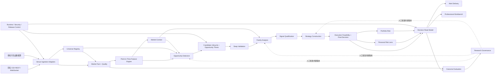

# Market Radar V2 受控替换工程与运行蓝图 v1.13

状态：`ACTIVE_DESIGN_AUTHORITY / M0_ENGINEERING_EXIT_LOCAL_PASS / M1.1-M1.6_LOCAL_PASS / M1.5-B1_EARLY_SHADOW_BUSINESS_GATE_PASS / B1-B1_EXECUTION_INVALID_NOT_COUNTED / B1-B3_PASS / M1.6-P0_EXECUTED_BLOCKED_CAPACITY_AND_RECOVERY / M1.6-P0R_LOCAL_RECOVERY_AND_CLOUD_PREREQUISITE_ENGINEERING_PASS_EXTERNAL_ACTION_PENDING / M2.2-B0.2-C1_FORWARD_ONLY_READY / B0.2_EXTERNAL_RESOLUTION_BLOCKED / M1_NOT_COMPLETE / PRODUCTION_SERVICES_DATA_AND_AUTHORITY_UNCHANGED`

设计日期：2026-07-21

适用对象：产品决策者、工程执行者、外部架构审计员、研究验证人员和生产操作者。

本文回答一个问题：怎样把当前 Market Radar 从“可运行但不完整的研究平台”，建设成能够持续覆盖合格合约市场、尽可能提前发现行情、全面识别其他结构机会、形成严格交易计划并通过真实结果持续进化的专业决策系统。

本文是 V2 当前唯一设计权威。M0 已在干净实施分支通过本地工程出口；M1.1-M1.4 已完成冻结 fixture 的 Identity、Fact、单一价格分散 Feature、保守 Context、append-only Store、双 cutoff durable replay、五维 Runtime Truth、全目录 accounting 和受控 Collector Runtime 本地纵切。这些只证明合同、纯函数、故障矩阵和隔离 PostgreSQL 16 演练，不代表 live 全市场能力、生产变更、盈利能力或自动下单授权。

v1.1 在 v1.0 基础上补齐六个专业缺口：point-in-time 特征权威、Opportunity Thesis 融合、形态质量与证据质量解耦、执行可行性终审、组合风险、Outcome 与 Research 治理分离；同时加入端到端延迟、冷启动、漂移、校准和注意力预算合同。

v1.2 增加干净 Git 基线、生产只读未知状态、爆发行情与提前发现的冻结评价口径、数据许可/成本/回放基线、Legacy Capability Atlas、`src/v2` 物理隔离和可执行施工顺序。M0 工程出口进一步补齐 30 个权威产物的严格运行时 schema、跨 API/进程/存储/回放 decoder 和逐消费者 Legacy 地图；这些仍不提升生产发现、分析或交易能力。

v1.3 冻结 M2.2 target-blind relative-rule-margin diagnostic strength、固定分母 Top20、TRAIN-only 六维事件阈值、matched/background、pre-cutoff 分层、knowledge-time 披露、split 和全部 sensitivity trial identity。该版本只增强离线研究可信度，不形成真实 cohort，也不开放 Detector、Candidate 或生产权限。

v1.4 将 M2.2 来源权利与历史合约身份升级为独立内容寻址证据：外部人工审查、exact operator、历史行情 + instrument reference 双范围、有效期、条款留存、provider binding、identity epoch、状态区间、knowledge time、完整 point-in-time 分母和 unresolved 核算均 fail closed。当前五个来源候选全部为 `RESEARCH_ONLY`，B0.2-A 只证明拒绝门禁，B0.2 外部事实仍未通过。

v1.5 建立三 Venue 第一方前向 instrument capture：原始响应字节 content-addressed 留存在工作区外，完整/部分/失败分母、identity epoch、持续缺席但非 delist 的语义、链式 checkpoint 和 append-only journal 均 fail closed。两轮本机真实请求均被 egress 阻断，因此只达到本地工程出口，运行捕获起点仍未通过，不能回填历史或解锁 Detector。

v1.6 根据首次可达实采修正 Unicode identity、provider-native out-of-scope 与 unresolved 的语义，并把 Raw/Snapshot/Batch/Continuity/Artifact Reference/Journal 全部绑定 exact clean Git release 与冻结 config。release `4139cc631d3d760876c3e39404c494462541a910` 已取得两轮三 Venue COMPLETE、约 368.5 秒跨度和零 gap/unresolved/conflict，C1 前向捕获起点通过；它仍不能回填历史、替代长期 SLO 或解锁 Detector/Candidate。

v1.7 根据 B1-A 真实 Docker Collector 证据修正关键路径：exact image、三 Venue egress、1,444/1,444 collected、checkpoint persistence 与宿主机恢复已技术通过，但 READY 0/2、freshness 和 cadence SLO 明确失败。后续固定为 `B1-B0 证据合同 -> B1-B1 31 周期原始实测 -> 条件性 freshness 语义整改 -> 同门槛复验 -> production storage 分阶段启用 -> 24h Shadow`；禁止用放宽 freshness、压缩分母或技术 PASS 替代业务 PASS。

v1.8 完成 B1-B0 原子 31 周期证据合同：进程输出、domain evidence、Runner evidence 和宿主恢复均内容寻址，新增 100% collection coverage 独立 SLO，技术捕获与业务 Gate 使用不同结论和退出语义。任何中断、短包、跨进程或跨 config 拼接都必须失败并从第 1 周期重跑；当前入口推进到 B1-B1 腾讯隔离原始实测，业务 SLO 仍未证明。

v1.9 根据真实 B1-B1 事故修正 Market Fact 地基：旧窗口虽运行 31 周期，但 Runner/validator 参数漂移导致完整证据未保住，因此明确 `EXECUTION_INVALID_NOT_COUNTED`。三 Venue 价格事实统一切到 `MARK_PRICE / MARK_PRICE_SNAPSHOT`，新增 price usability 独立分母和 SLO，旧 `LAST_PRICE` 证据不能复用；当前入口改为 B1-B3 同门槛 31 周期复验。

v1.10 登记 B1-B3 真实业务 Gate：exact commit `33f08d3fb72912a2617ed3a21f58cb4c347aefcb` 在腾讯隔离 no-authority Runner 完成 31/31 READY，collection、price usability、freshness 与 operational readiness 均为 100%，Runner evidence `sha256:58b5d118503def8287642b78e12eb895a26130ac0ecb12b52bbf06e82ce51860` 已独立复算且宿主精确恢复。M1.5-B1 因此完成，但 M1 仍需 `M1.6-P0..P4 -> M1.7`；当前入口转为 production storage 新鲜只读预检，migration 仍需独立 Gate。

v1.11 登记 M1.6-P0 生产只读事实：exact source `d5dbc804be00c546624ab933bad6282228f983c4` 已证明 PostgreSQL 16、V2 schema `ABSENT_CLEAN`、旧/新 Fact 与 partition 均为 0，且数据库、服务、仓库 mutation 均为 0；但 120 GiB 系统盘按冻结模型预计使用率 90%，当前可用 70.02 GB 小于 87.09 GB 所需 headroom，recovery evidence 也缺失。P0 admission 因而真实 `BLOCKED`；施工顺序插入 P0R 容量、加密离机备份和隔离恢复整改，禁止直接跳 P1。

v1.12 完成 P0R 本地恢复工程：同一只读快照的 `pg_dump -> age X25519` 流、结构/计数 fingerprint、腾讯 COS 私有/versioned/COMPLIANCE 归档与精确取回、隔离 PostgreSQL 16 流式恢复、RPO/RTO 证据、失败清理和可复现脱敏 bundle 均由 strict runner/verifier 覆盖。本地测试通过不等于生产恢复；真实 COS 对象、恢复 parity、容量扩展和 fresh P0 仍未发生，P0/P1 状态不变。

v1.13 完成 P0R-B 云资源前置安全收口：运行级 provisioning plan 绑定 128-bit 高熵 run-id、clean commit、香港单 AZ bucket、生产源 IP `/32`、唯一对象 key 和无 principal 的 7200 秒 STS policy；credential compiler 绑定 plan/policy/request digest 与腾讯 RequestId，raw response 只允许 `/dev/shm`。根据腾讯官方合同纠正旧误判：versioning 启用时 `x-cos-forbid-overwrite` 不生效，现行保护是高熵唯一 key、上传前 HEAD 404 与 exact versionId。当前 COS inventory=0，真实 bucket、age key、STS、备份恢复、扩容和 fresh P0 均未发生。

---

## 1. 架构决策

### 1.1 决定

Market Radar V2 采用：

```text
提取旧系统中经过证据验证的能力
-> 在独立 V2 领域边界内重新建立唯一主链
-> point-in-time 回放和实时 Shadow 双重验证
-> 分阶段切换只读 authority 与写 authority
-> 保留明确回滚期
-> 删除被替代的旧入口、旧推导和旧运行身份
```

这不是继续给旧站叠加功能，也不是一次性推倒重来。它是“受控替换”：保留经过证明的生产地基和安全防线，重建错误的领域职责、运行路径和用户工作流。

### 1.2 为什么必须换路径

当前审计已经证明，旧系统的主要问题不是缺少功能，而是权威关系不清：

- `src/lib/api/frontend-contract.ts` 已达到 5,720 行，并在前端合同构建阶段多次重新调用决策逻辑。
- Analysis Module 同时生成旧策略和 V2 策略，分析与策略职责混合。
- SSR 页面读取可以直接实例化公开市场 provider 并触发扫描，页面访问成为第二条数据路径。
- 轻扫候选仍可进入 signal-shaped read model，候选与信号语义没有彻底隔离。
- health API 无论业务状态如何都返回 `ok: true`，部分容器和发布脚本只验证 HTTP 成功。
- private middleware 未默认保护全部 API；`/api/scan` 等路径存在例外漂移风险。
- 数据库失败可退回内存，journal 写失败可保留本地 optimistic truth，可能让界面显示未持久化事实。
- Web 与多个 worker 共享数据库、Redis、CRON 和数据源 secret；容器镜像职责和权限过宽。
- Legacy、V2、V3、Unified Decision 和多套 Candidate/Outcome 路径并存，修复成本持续上升。

因此，旧 G0-G8 保留为历史风险与验收要求来源，不再约束 V2 的代码组织和实现继承。

### 1.3 当前事实边界

当前生产仍为：

```text
R1 / 可运行但不完整 / 不能支撑实战
```

V2 设计期间：

- 旧生产只承担临时研究平台、迁移数据源、行为对照和回滚基线。
- 除 P0 安全、数据损坏、生产不可用和事实误导外，Legacy 不再接受新功能扩展。
- V2 未通过对应 Gate 前，不接管生产读写权威。
- 设计完成不减少旧系统的任何真实生产观察门槛。

---

## 2. 产品使命与成功定义

### 2.1 唯一使命

```text
持续覆盖目标 CEX 的全部合格合约标的，
尽可能提前发现主升或主跌前兆，
同时全面捕捉突破、回踩、趋势延续、关键位反转、区间边缘、相对强弱和衍生品资金异动等机会，
形成分级证据、明确行动状态、可解释交易计划和可审计的持续进化闭环。
```

核心工作原则：

```text
发现必须宽
验证必须深
交易计划必须严
学习必须慢于证据
```

### 2.2 “全市场”的精确定义

第一生产范围定义为：

```text
Binance Futures
+ OKX Swap
+ Bybit Linear Perpetual
+ 这些 Venue 中 Adapter 明确支持的线性稳定币结算永续合约
```

规则如下：

- `TargetVenuePolicy` 和 `SupportedContractClass` 必须版本化，页面显示准确范围。
- 目标 Venue 返回的所有 instrument 100% 记账，包括 active、suspended、delisting、unresolved 和 unsupported。
- active 合约原则上进入轻扫；流动性不足是明确 Risk/Quality 状态，不允许静默消失。
- 身份无法解析、数据无法定价或合约类别尚未支持时保留在分母中，并给出不可扫描原因。
- 反向币本位合约、交割合约、期权和新增 Venue 只有完成独立 identity、成本、风险、数据和回放验证后才进入 eligible 分母。
- “全市场覆盖”只指当前版本化目标范围，不宣称覆盖全球所有交易所和全部衍生品。

### 2.3 系统必须回答的问题

1. 当前合格合约市场是否被完整、及时地扫描？
2. 哪些标的正在出现值得进一步验证的异常或结构机会？
3. 系统为什么发现它，哪些证据支持，哪些证据反对，哪些数据缺失？
4. 它属于行情爆发前、突破回踩、趋势延续、反转、相对强弱还是衍生品流机会？
5. 当前只能观察、等待条件、被风险阻断，还是已形成完整交易计划？
6. 若计划就绪，触发、入场、结构止损、目标、成本后 RR、失效和有效期是什么？
7. 系统是否真的提前发现，而不是行情走完后补叙事？
8. 系统为什么误报、漏报、抓晚或判断错误，下一版本怎样被严格验证？

### 2.4 不作出的承诺

- 不保证抓住全部行情。
- 不保证任何信号盈利。
- 不用高杠杆扩大系统评分或美化机会。
- 不自动下单，不接交易所下单 API。
- 不用回测高收益替代实时 Shadow 和模拟决策证据。
- 不因 READY 稀少而降低 `RR >= 3:1`、结构止损或数据质量门槛。

### 2.5 用户交易风格的位置

用户的多周期结构、关键支撑压力、斐波那契回撤、确认入场、结构外止损和大周期目标方法，进入系统的方式是：

- 作为 `Breakout / Retest` 与 `Structural Pullback` 策略族的一类可解释实现。
- 作为 Personal Risk Lens 和工作台默认解释方式的重要输入。
- 不成为所有检测器的统一规则。
- 不限制系统研究用户当前无法人工发现的爆发前特征。

### 2.6 用户目标覆盖矩阵

| 用户目标 | 承载 Module | 必须用什么证明 | 不能拿什么冒充 |
| --- | --- | --- | --- |
| 扫描全部合格合约 | Universe + Market Fact | 100% accounting、eligible coverage、freshness | 页面显示很多币 |
| 行情爆发前抓到 | Pre-Move Detector + Review | point-in-time lead time、recall、precision、对照组 | 事后看图觉得“早就有信号” |
| 全面捕捉其他机会 | Pre-Move、Breakout/Retest、Trend Continuation、Reversal/Range、Relative Strength、Derivatives Flow 六类独立机会族 | family/pattern/direction/regime 分层指标 | 一个万能总分或涨跌榜 |
| 信号等级 | Deep + Qualification | Evidence Grade 与 Setup Grade 分开校准 | Candidate Priority、热度或一个万能总分 |
| 多空入场方案 | Analysis + Strategy Construction + Final Decision | trigger、结构 stop、target、cost、RR、invalidation、execution feasibility | 前端画线或模板价格 |
| 高杠杆小仓位适配 | Personal Risk + Portfolio Risk | 最大损失、保证金、强平距离、相关性和总风险 | 用高杠杆放大信号质量 |
| 持续进化 | Outcome Evaluation + Research Governance | 真实 Outcome、Missed Movers、holdout、Champion/Challenger | 漂亮回测、自动调权或系统自批 |
| 稳定、流畅、安全 | Runtime Control + Workbench | SLO、E2E、load、security、restore、rollback | HTTP 200 或一次正常访问 |

---

## 3. 永久宪法

以下规则没有“暂时绕过”：

1. Candidate 不是 Signal，Candidate 不获得 A/B/C 证据等级。
2. Candidate Priority 只决定资源调度，不代表可交易质量。
3. Evidence Grade 只由完成深度验证后的证据包产生。
4. Evidence Grade 与 Setup Grade 必须分开；证据完整不等于形态优质。
5. Action State 只有 `OBSERVE / WAIT / BLOCKED / TRADE_PLAN_READY`。
6. A 级证据仍然可以是 WAIT；高证据、高形态或高优先级都不能自动变 READY。
7. Scan 不生成入场、止损、目标或交易计划。
8. Analysis 不生成入场、止损、目标或交易计划。
9. Strategy Construction 只能生成草案；只有 Execution Feasibility + Final Decision 可以产生 READY。
10. Strategy 不能修改 Scan 排序或 Analysis 结论。
11. Personal Risk 与 Portfolio Risk 只能改变 User Fit，不能升级系统 Action State。
12. Frontend 不生成方向、分数、新鲜度、止损、目标、RR 或计划。
13. Outcome、MFE、MAE 和未来标签不能进入当时生产判断。
14. Research Governance 不能自评自批，任何规则晋级必须经过独立 holdout、Shadow 和人工批准。
15. unknown 不变 0，stale 不变 live，partial 不变 ready，失败不变“市场无机会”。
16. stop 必须来自结构失效，target 必须来自结构来源，净 RR 必须考虑费用、滑点和资金费率。
17. `TRADE_PLAN_READY` 的结构 RR 不低于 3:1，且执行可行性不得为 BLOCKED/UNAVAILABLE。
18. 所有生产写入采用显式身份、最小权限、幂等键、审计记录和可回滚发布。
19. 系统只做人工决策辅助，永久禁止自动下单和交易账户写权限。

任何违反上述规则的 release 直接 FAIL，不使用 error budget 容忍。

---

## 4. 五套互不混淆的状态

| 维度 | 合法值 | 只回答什么 |
| --- | --- | --- |
| Candidate Priority | `P0 / P1 / P2 / P3` | 谁先获得深扫资源 |
| Evidence Grade | `A / B / C / INSUFFICIENT` | 当前证据有多完整、独立、及时和一致 |
| Setup Grade | `PREMIUM / QUALIFIED / MARGINAL / INVALID / UNKNOWN` | 当前结构、位置、空间和反证是否构成优质形态 |
| Action State | `OBSERVE / WAIT / BLOCKED / TRADE_PLAN_READY` | 现在能否形成可执行计划 |
| User Fit | `SUITABLE / CONDITIONAL / UNSUITABLE / UNAVAILABLE` | 该系统计划是否适合当前用户和当前组合风险 |

禁止使用一个 `totalScore` 同时代表以上五件事。前端必须并列显示五者及其生成版本；任何一维都不能覆盖另一维。

---

## 5. 目标架构选择

### 5.1 当前阶段采用的形态

V2 初始采用：

```text
模块化单体核心
+ 独立采集/扫描/深扫/结果 Worker
+ PostgreSQL 业务真值
+ Redis 短生命周期运行状态
+ 对象存储原始事实与备份
+ 单一后端 Decision Snapshot
```

当前不预先引入 Kafka、Kubernetes、复杂微服务或在线机器学习平台。只有吞吐、故障域、团队独立发布或恢复证据证明模块化单体不足时，才通过 ADR 拆分。

### 5.2 逻辑拓扑



### 5.3 单向依赖

```text
Universe -> Fact + Quality -> Point-in-Time Features -> Market Context
-> Detection -> Candidate Episode + Opportunity Thesis -> Deep Validation
-> Analysis -> Evidence Grade + Setup Grade -> Strategy Draft
-> Execution Feasibility + Final Decision -> Personal Risk + Portfolio Risk
-> Decision Snapshot + Alert -> Outcome Evaluation -> Research Governance
```

后一个 Module 可以读取前一个 Module 的权威产物，不得反向调用或绕过。Outcome 只评价冻结对象；Research 只能提出新版本，不得修改当时生产对象或自动晋级。

---

## 6. 十八个权威 Module

### 6.1 Universe Registry

**唯一职责**：维护目标 CEX 全部合格合约标的和每个标的的可扫描状态。

**输入**：交易所合约目录、合约规格、状态、结算资产、上线/停牌/下架事件。

**实现要求**：

- 启动时全量同步，运行时增量更新，每日做全量 reconciliation。
- 规范身份至少包含 `base asset + venue + contract type + settlement + contract size`。
- 分开 `observed / accepted / eligible / suspended / delisting / unresolved / unavailable`。
- 别名无法证明时保持 unresolved，不静默合并。
- 每次扫描绑定不可变 `EligibleInstrumentSnapshot` 版本。

**权威输出**：`EligibleInstrumentSnapshot`。

**失败行为**：目录过期、身份冲突或来源失败时保留最后已知快照但标记 stale；禁止声明全市场完整。

**核心指标**：标的 accounting 100%、eligible coverage、identity conflict、snapshot age、新增/下架发现延迟。

**验收**：任意 observed instrument 都有明确状态和原因；同一合约不会因别名重复扫描或合并到错误资产。

### 6.2 Market Fact + Quality

**唯一职责**：把价格、成交、K 线、盘口、主动成交、OI、资金费率、基差、清算和事件转换成可追溯事实。

**输入**：各 Venue Adapter 和授权数据源。

**每条事实必须包含**：

```text
factId / canonicalInstrumentId / venueInstrumentId
factType / value|null / unit
sourceId / sourceCapability
eventTime / receivedAt / persistedAt
sequence or cursor / schemaVersion
status / ageMs / qualityReasons
```

**实现要求**：

- 区分市场事件时间、系统接收时间和持久化时间。
- 检测乱序、重复、断档、时钟漂移、WebSocket 重连和 REST 快照不一致。
- 关键事实绝不使用默认 0；缺失必须是 null 加质量原因。
- Provider 只在 Adapter 内部，Detection、Analysis 和页面都不得直连交易所。
- `SourceCapabilityRegistry` 必须记录端点、授权用途、速率、保留、再分发和套餐限制；未经许可的抓取或数据再分发不得进入生产。
- 快速滚动窗口放 Redis；可审计聚合和索引放 PostgreSQL；高频原始事实按保留策略进入对象存储。

**权威输出**：`PointInTimeMarketFact` 和 `FactQualitySnapshot`。

**失败行为**：单源失败只降级对应能力；公共发现可以继续，但缺失的深扫事实不能被推断补齐。

**核心指标**：freshness、completeness、gap rate、duplicate rate、late event rate、source error、quality reason 分布。

**验收**：任意页面数值都能追溯到 source、instrument、eventTime、status 和 quality reason。

### 6.3 Point-in-Time Feature Engine

**唯一职责**：把统一市场事实转换成实时和历史回放完全一致、可版本化、可追溯的特征快照。

**输入**：`PointInTimeMarketFact`、`FactQualitySnapshot`、Universe 版本和明确的 event-time cutoff。

**每个特征必须包含**：

```text
featureId / featureDefinitionVersion / featureSetVersion
canonicalInstrumentId / timeframe / window
value|null / unit / qualityStatus / qualityReasons
sourceFactIds / sourceCutoff / computedAt
```

**实现要求**：

- 实时与离线回放必须调用同一计算实现，不维护两套公式。
- rolling window、缺失值、warm-up、乱序修正和时区规则全部写入 `FeatureDefinitionRegistry`。
- 禁止使用 cutoff 之后的数据补齐当时缺失，禁止用未来完整 K 线计算未收盘时点特征。
- Detector、Market Context 和 Analyzer 不得自行重复实现同名特征。
- 每次 release 做 online/offline parity、重放确定性和特征 lineage 检查。

**权威输出**：`FeatureSetSnapshot` 和 `FeatureQualitySnapshot`。

**失败行为**：窗口不足、事实 stale 或 lineage 不完整时输出 null/partial；不得沿用旧值冒充当前特征。

**核心指标**：feature freshness、online/offline parity、replay determinism、null rate、compute latency 和 drift。

**验收**：任一生产特征都能追溯到精确事实、cutoff、窗口和算法版本，同一冻结输入可重现同一字节结果。

### 6.4 Market Context

**唯一职责**：用全市场 point-in-time 特征形成所有 Detector 和 Analyzer 共用的市场环境快照。

**输入**：Universe Snapshot、Feature Set、BTC/ETH 和全市场广度、波动、相关性、流动性、Venue 健康及已验证事件上下文。

**实现要求**：

- 输出趋势、波动、广度、相关性、流动性和风险环境，不输出单币交易方向。
- 所有计算绑定 fact cutoff、feature set、Universe 版本和 context rule version。
- 明确区分 observed facts、derived regime、confidence 和 unknown。
- Detector 与 Analyzer 只能消费同一 `MarketContextSnapshot`，不得各自重新定义“大盘环境”。
- BTC/ETH 风险环境可以形成反证或适用性约束，但不能凭空生成单币计划。

**权威输出**：`MarketContextSnapshot`。

**失败行为**：广度或关键基准特征不完整时输出 uncertain/partial；禁止沿用过期 regime 冒充当前环境。

**核心指标**：snapshot freshness、regime stability、change detection latency、breadth completeness、context conflict 和 calibration。

**验收**：删除任意 Detector 后，Market Context 仍是独立可回放的全市场解释；新增 Detector 不复制 regime 逻辑。

### 6.5 Multi-Opportunity Detection

**唯一职责**：以较宽标准从统一特征和上下文中发现值得继续研究的候选。

**输入**：`FeatureSetSnapshot`、Universe Snapshot 和当时可见的 `MarketContextSnapshot`。

**实现要求**：

- 每个机会族拥有独立 Detector、特征、阈值、方向逻辑、版本和验收集。
- Detector 不直接访问 provider，不读取 Outcome，不生成证据等级或交易计划。
- 多个 Detector 发现同一标的时保留各自假设，由 Candidate Lifecycle 合并资源，不丢失来源。
- 做多和做空使用显式不对称规则，不以简单符号反转实现。
- 每个结果记录 `firstDetectedAt / observedPrice / factCutoff / featureSetVersion / detectorVersion / reasonCodes / counterHints`。

**Detector 生命周期**：

```text
DRAFT -> REPLAY_VALIDATED -> SHADOW -> LIMITED -> ACTIVE
                                  -> SUSPENDED -> RETIRED
```

新 Detector 在 `SHADOW` 前不产生生产候选；`LIMITED` 只能进入有明确上限的观察配额；没有足够样本、校准或漂移通过证据时不得进入 `ACTIVE`。

**权威输出**：`DiscoveryCandidate`。

**失败行为**：关键时间或 lineage 缺失时不生成；非关键事实缺失只能形成带明确原因的低优先观察候选。

**核心指标**：候选量、Top-K precision、事件 recall、lead time、late/noise、Detector 独立贡献、冷启动状态和漂移。

**验收**：使用当时数据重放可复现候选，未来行情不可改变历史候选。

### 6.6 Candidate Lifecycle + Opportunity Thesis

**唯一职责**：负责候选去重、假设融合、排队、配额、晋级、拒绝、过期和重触发。

**状态机**：

```text
DISCOVERED -> QUEUED -> VALIDATING -> EVIDENCE_READY
-> PROMOTED / REJECTED / EXPIRED / DATA_UNAVAILABLE
```

**Opportunity Thesis 必须保留**：机会族、方向假设、所有 Detector 来源、最早发现时间、支持与冲突理由、版本、已知未知和不确定性。它用于组织验证，不是方向结论、证据等级或交易信号。

**实现要求**：

- 同一 `instrument + opportunity family + direction hypothesis + episode window` 只有一个活动 Episode。
- 同一标的的不同机会族或相反方向可以并存，但必须是独立 Thesis，不能被一个通用分数抹平。
- 每次状态变化 append-only，使用版本号和幂等键。
- Priority 只考虑时效、潜在价值、资源成本和过期风险，不代表 Evidence 或 Setup Grade。
- 新一轮有效触发创建新 Episode，不篡改旧 Episode。
- 使用 transactional outbox 发布状态事件，采用 at-least-once + idempotency，不伪称分布式 exactly-once。

**权威输出**：`CandidateEpisode` 和 `OpportunityThesis`。

**失败行为**：PostgreSQL 不可写时停止新 Episode 晋级；不得退回内存权威。

**核心指标**：queue age、dedupe、thesis conflict、promotion/reject/expire、stuck episode、outbox lag 和 priority inversion。

**验收**：Candidate 和 Thesis 永远不会因 UI 需要被转换成 Signal 或 READY。

### 6.7 Deep Validation

**唯一职责**：在有限数据源和计算预算下，为高价值候选形成完整证据包。

**输入**：Candidate Episode、Opportunity Thesis、统一事实/特征、配额状态和数据源 capability。

**验证内容**：

- 多周期 OHLCV、特征和结构上下文。
- 盘口 spread、固定 bps depth、imbalance、gap 和滑点估计。
- 主动买卖代理、成交量扩张和大额成交代理。
- OI、资金费率、基差、清算和跨 Venue 一致性。
- 流动性、可交易性、数据完整度、事件风险和反证。

**资源层级**：Tier A P95 不超过 5 分钟；Tier B P95 不超过 30 分钟；Tier C 只保留公共事实轮转，配额不足显示 waiting。

**权威输出**：`EvidencePackage`，必须分开 supporting、contradicting、missing、source quality 和 uncertainty。

**失败行为**：429、plan limit、auth error、transport error 分开记录；不把缺失写成无异动。

**核心指标**：Tier SLA、endpoint 成功率、completeness、quota wait、stale evidence 和 cross-venue coverage。

**验收**：Evidence Package 不包含方向结论、等级或交易计划。

### 6.8 Family Analysis

**唯一职责**：解释证据，判断结构、方向倾向、阶段、位置和反证。

**输入**：Evidence Package、Opportunity Thesis、机会族和当时 Market Context。

**实现要求**：

- 每个机会族使用专属 Analyzer，不使用一个通用总分覆盖所有形态。
- 输出多周期结构、关键位、方向倾向、行情阶段、位置质量、假突破、晚到、噪音和反证。
- 明确区分事实、推断、未知，以及 data/model/market uncertainty。
- 分析器不包含仓位、杠杆、entry、stop、target 或 RR。
- 任何规则或模型必须记录版本、输入截止时间和解释代码。

**权威输出**：`AnalysisSnapshot`。

**失败行为**：高周期冲突、事实不足或结构不可判定时输出 uncertain，不强制 long/short。

**核心指标**：direction calibration、structure consistency、late/fakeout discrimination、counter-evidence recall 和 family 表现。

**验收**：删除 Strategy Module 后，Analysis 仍然完整且不产生可执行计划。

### 6.9 Signal Qualification

**唯一职责**：分别评估证据可靠性与交易形态质量，不做最终可执行判断。

**输入**：Evidence Package、Analysis Snapshot、时效和 Market Context。

**Evidence Grade 维度**：完整度、独立来源、时效、数据质量、支持/反证一致性和不确定性。

**Setup Grade 维度**：结构清晰度、位置、空间、阶段、假突破/晚到/噪音风险，以及该机会族在当前 regime 的适用性。

**实现要求**：每个机会族和方向独立校准；两种等级不能由 Candidate Priority 继承，也不能直接决定 READY。必须输出概率校准、样本量、置信区间和 abstain 原因。

**权威输出**：`SignalQualification`，其中包含独立的 `EvidenceGrade` 与 `SetupGrade`。

**失败行为**：关键事实缺失时 Evidence Grade 最高只能 INSUFFICIENT/C；形态不可判断时 Setup Grade 为 UNKNOWN，不得由其他高分补偿。

**核心指标**：grade calibration、reliability error、grade migration、family/direction/regime 表现和 action 解耦一致性。

**验收**：A 级证据配 MARGINAL 形态、PREMIUM 形态配 INSUFFICIENT 证据、A 级 WAIT 都是合法结果。

### 6.10 Strategy Construction

**唯一职责**：依据结构和机会族模板生成可验证的交易计划草案，不决定 READY。

**输入**：Analysis Snapshot、Signal Qualification、结构位和版本化成本假设。

**完整草案必须包含**：

```text
direction / whyNow / whyNotNow
entryTrigger / plannedEntryZone
structuralInvalidation / structuralStop
target source + target ladder
gross RR / estimated net RR
fee / slippage / funding assumptions
confirmation window / expiry / no-chase condition
partial take-profit policy / counter-evidence / blockers
```

**实现要求**：

- 每个机会族有独立模板，不把所有机会压成一种 entry/stop/target。
- stop 先由结构失效确定，再应用经过验证的波动、盘口和插针缓冲；不能为了 RR 缩小止损。
- target 来自前高低、结构边界、成交区、流动性区或经过验证的扩展位。
- 字段不完整时输出草案不可用原因，不生成占位价格。
- 本 Module 永远不能写 `TRADE_PLAN_READY`。

**权威输出**：`StrategyDraft`。

**核心指标**：draft completeness、level provenance、structural RR、invalid draft 和生成延迟。

### 6.11 Execution Feasibility + Final Decision

**唯一职责**：用当时真实执行条件终审草案，并产生系统唯一 Action State。

**输入**：Strategy Draft、最新可用盘口/成交事实、费用/资金费率、Market Context、系统业务健康和时效合同。

**必须检查**：

- spread、固定 bps depth、预估滑点、成交概率和可承载名义价值。
- 跳空、插针、stop sweep、价格跨越 entry zone 和追价风险。
- fee、funding、slippage 后的净 RR 和目标可达空间。
- 事实与草案 TTL、Venue 状态、数据完整度和系统业务健康。
- 所有结构字段、反证、触发窗口和失效条件完整。

**输出规则**：

- `TRADE_PLAN_READY` 只在结构 RR `>=3:1`、净 RR 仍达到门槛、Execution Feasibility 为 PASS 且全部硬门禁通过时产生。
- 条件尚未出现为 WAIT；数据、流动性、成本、结构或运行门禁失败为 BLOCKED；仅值得继续看为 OBSERVE。
- 非 READY 不向前端暴露可被误执行的 entry/stop/target 线。

**权威输出**：`ExecutionFeasibilitySnapshot` 和 `StrategyDecision`。

**失败行为**：任何关键执行事实 stale、missing 或 unavailable 时 fail closed，不用历史盘口或默认滑点补齐。

**核心指标**：false READY、feasibility rejection、net RR、price drift、decision latency、TP-first、SL-first、expired 和 not-triggered。

**验收**：全系统只有本 Module 可以产生 `TRADE_PLAN_READY`。

### 6.12 Personal Risk Lens

**唯一职责**：在不改变系统判断的前提下，说明一个系统计划是否适合用户个人风险设置。

**输入**：Strategy Decision 和用户手工配置的账户权益、单笔最大损失、保证金模式和杠杆情景。

**输出内容**：仓位上限、保证金、预计费用、滑点敏感度、强平距离和个人执行阻断。

**实现要求**：用户配置与系统信号隔离；高杠杆只用于风险情景；不读取交易所账户，不持有下单权限；强平距离不足时输出 UNSUITABLE/BLOCKED，但不改系统 Action State。

**权威输出**：`PersonalRiskView`。

**验收**：关闭 Personal Risk Lens 不改变 Candidate、Grade 和 Strategy Decision。

### 6.13 Portfolio Risk

**唯一职责**：防止多个看似独立的山寨币计划在同一市场因子上形成重复押注。

**输入**：Strategy Decision、Personal Risk View、用户手工维护的当前风险敞口和 point-in-time 相关性/市场因子。

**必须检查**：BTC/ETH beta、同板块/叙事聚类、方向拥挤、Venue 集中、总止损损失、总保证金、尾部相关性和共同强平风险。

**实现要求**：相关性未知时保守输出 UNAVAILABLE/CONDITIONAL；不得因“分散到多个币”假定已经分散风险；不得升级系统 Action State。

**权威输出**：`PortfolioRiskView` 和最终 `UserFit`。

**核心指标**：aggregate risk、cluster concentration、beta exposure、correlated loss、conditional/unsuitable ratio。

**验收**：多个单笔 SUITABLE 可以因组合集中变成整体 UNSUITABLE，但任何个人或组合结论都不能把系统 BLOCKED 变 READY。

### 6.14 Decision Read Model

**唯一职责**：生成页面唯一可消费、不可二次推导的决策快照。

**每个快照包含**：

```text
snapshotId / generatedAt / sourceCutoff / latencyBreakdown
releaseId / fact-feature-rule versions
instrument / opportunity family / thesis
candidate priority / evidence grade / setup grade
action state / user fit
facts + quality / evidence / analysis / decision / risk
data-model-market-execution uncertainty
freshness / unavailable reasons / supersedes
```

**实现要求**：所有页面读取同一 snapshotId；页面请求不触发 provider、扫描、分析或策略重算；使用 runtime schema validation、分页、ETag 和 no-store/短缓存；PostgreSQL 不可读时显示 unavailable，不返回正常空数组；Frontend Adapter 只做格式、单位、国际化和可访问性转换。

**权威输出**：`DecisionSnapshot`。

**验收**：Dashboard、Signals、Token、Review 对同一对象的状态、时间、数值和不确定性完全一致。

### 6.15 Alert Delivery

**唯一职责**：把后端状态变化可靠、及时、低噪音地送达用户。

**允许提醒**：早期候选、深扫完成、等级升级、WAIT 接近触发、READY、失效、过期、关键数据或系统退化。

**实现要求**：订阅后端状态事件；去重、cooldown、ack、升级、过期、重试、聚合和突发限流均有状态；READY 不被静默丢弃但必须去重；stale/partial 不发就绪提醒；每条提醒追溯到 Episode、Decision Snapshot、release 和 rule version；第一阶段只做站内提醒。

**权威输出**：`AlertEvent` 和 `DeliveryReceipt`。

**核心指标**：P95 delivery latency、miss、duplicate、stale alert、ack latency、actionable precision 和每小时注意力负担。

### 6.16 Outcome Evaluation

**唯一职责**：只评价冻结的历史候选、判断和计划，识别误报、漏报、抓晚与执行偏差。

**实现要求**：冻结 fact cutoff、价格、证据、版本和 release；记录 1h/4h/24h 及机会族 checkpoint；分开 trigger、TP-first、SL-first、partial、expired、not-triggered 和 data-unavailable；计算 MFE、MAE、净 R、lead time；每日建立 Missed Movers 和相似未爆发对照组；永远不回写原决策或生产排序。

**权威输出**：`OutcomeRecord`、`MissedOpportunityRecord` 和 `EvaluationDatasetSnapshot`。

**核心指标**：outcome completion、false positive、miss recall、lead time、family/regime 表现、数据质量和执行偏差。

### 6.17 Research Governance

**唯一职责**：把评估发现转成可复现研究提案，并独立决定是否允许进入下一验证阶段。

**实现要求**：Outcome Evaluator 不得批准自己的规则；所有提案登记假设、数据集、全部试验、失败结果、成本和预期风险；必须经过 purge/embargo、冻结 holdout、Champion/Challenger、实时 Shadow、非劣安全门禁和人工批准；规则晋级产生新版本，绝不修改旧决策；自动化可停止失败实验，不能自动晋级。

**权威输出**：`ResearchProposal`、`ExperimentRecord` 和 `PromotionDecisionRecord`。

**核心指标**：proposal survival、holdout regression、multiple-testing burden、calibration gain、drift response 和 rollback rate。

### 6.18 Runtime / Security / Release Control

**唯一职责**：保证上述 Module 以正确身份、版本、权限、延迟和健康语义长期运行并可恢复。

**实现要求**：

- 每个容器最小权限、独立 secret、独立数据库角色和明确网络访问范围。
- migration 不通过 HTTP 执行；Web 不持有 migration 或 worker secret。
- 生产镜像非 root、read-only root filesystem、drop capabilities、资源限制和日志轮转。
- Web、ingestion、worker、migration 使用职责匹配的不同镜像或 target。
- liveness、dependency readiness、business readiness、data freshness、release validity 分开。
- HTTP 200 不能代表业务 ready；容器健康必须解析业务状态。
- metrics、logs、traces 和 correlation id 贯穿 event、feature、scan cycle、episode、decision、alert 和 release。
- 持续监控数据质量、特征分布、等级校准、结果表现、延迟、成本和提醒负担漂移；漂移只触发降级/暂停和研究，不自动调权。
- release 绑定 commit、tree、artifact、image、schema、feature/rule version、rollback 和 evidence。
- 备份加密、异地保留、定期真实恢复演练。

**权威输出**：`RuntimeTruthSnapshot`、`ReleaseRecord` 和 `DriftStatusSnapshot`。

---

## 7. 机会体系

系统不使用一套万能评分。第一版正式支持六个独立机会族：

| 机会族 | 首要发现内容 | 深度验证重点 | 常见反证 |
| --- | --- | --- | --- |
| Pre-Move | 波动压缩、量能/OI/订单流先行、相对强弱、流动性变化 | 多源一致、尚未晚到、资金未过热、结构有扩张空间 | 已提前透支、单源噪音、低流动性拉盘、事件异常 |
| Breakout / Retest | 关键位突破、role flip、回踩确认 | 突破质量、回踩深度、成交与 OI 确认、假突破风险 | 回到结构内、无量突破、上方空间不足 |
| Trend Continuation | 趋势中的整理、旗形、回撤后恢复 | 高中低周期同向、动量恢复、位置不过晚 | 趋势衰竭、背离、追涨追空、结构已破坏 |
| Reversal / Range | 极端位置反转、区间边缘、失败延续 | 扫流动性后收回、结构反转、成交吸收、止损空间 | 逆势接刀、无确认、区间即将扩张 |
| Relative Strength | 相对 BTC/ETH/同板块提前走强或走弱 | 多周期 RS、市场中性调整、流动性和持续性 | 大盘单次扰动、低成交造成虚假相对强弱 |
| Derivatives Flow | 价格与 OI/Funding/Basis/Liquidation 不一致 | 跨 Venue、仓位拥挤、资金进入或退出的方向解释 | 数据源缺失、强平后噪音、拥挤已过度 |

### 7.1 Pre-Move 的首要地位

Pre-Move 是最高优先研究方向，但不享有越权：

- 早期异常先成为 Candidate，不直接成为 Signal。
- “提前”必须以冻结时间戳和事后事件起点计算，不能靠图表回看叙述。
- 同时维护爆发样本与没有爆发的相似样本，控制低基准率下的误报。
- 评估必须同时报告 recall、precision、lead time 和 alert burden。
- 没有独立 holdout 的新特征只能进入 research-only。

### 7.2 多空不对称

做多和做空分别建模：

- 做多更关注持续买盘、供给吸收、相对强势、资金不过热和上方空间。
- 做空更关注反抽失败、需求衰竭、相对弱势、拥挤多头解除和下方流动性。
- 资金费率、清算、盘口深度和流动性在两侧的含义不使用简单正负镜像。
- 每个 Detector、Analyzer、Strategy Template 都有 direction-specific 测试和 holdout。

### 7.3 用户熟悉的结构回踩策略族

正式实现流程：

```text
大周期结构和方向
-> 中周期关键支撑/压力/流动性区域
-> 有效波段 0.382 / 0.5 / 0.618 回撤区
-> 小周期突破、回踩、收回或反抽失败确认
-> 成交、盘口、OI 与流动性验证
-> 结构失效止损 + 目标阶梯 + 成本后 RR
-> WAIT / BLOCKED / TRADE_PLAN_READY
```

斐波那契只定义候选区域，不能单独构成入场理由。必须与结构、成交、流动性或其他独立证据共振。

### 7.4 明确延后的机会类型

- 跨 Venue 无风险套利、Funding carry 和 delta-neutral 策略依赖同步执行、对冲和账户状态，不属于当前人工方向决策主链，暂不进入 V2 核心。
- 上币、下架、维护、指数异常和新闻事件先作为 `EventContext / RiskWarning`，在来源许可、延迟和独立验证未证明前不直接生成方向。
- 未来新增机会族必须注册独立 Detector、Analyzer、Strategy Template、反例、holdout 和退化指标，不得塞进现有通用总分。

---

## 8. 数据与存储蓝图

### 8.1 数据分层

| 层 | 存储 | 内容 | 是否权威 |
| --- | --- | --- | --- |
| Hot runtime | Redis | 秒级窗口、锁、配额、heartbeat、短期快照 | 仅运行权威，可重建 |
| Operational truth | PostgreSQL | Universe、Fact index、Episode、Evidence、Decision、Alert、Outcome、Release | 是 |
| Raw/replay | 对象存储 | 脱敏原始市场事件、分区聚合、回放输入 | 是，按保留策略 |
| Export | reports | 报告、审计导出、脱敏证据 | 否，可再生成 |
| Browser | memory only | 当前页面快照 | 否，不作业务持久化 |

### 8.2 PostgreSQL 逻辑 schema

```text
registry      instrument / venue / eligibility / snapshot
market        fact index / candle / quality / gap / source capability
feature       definition / set snapshot / lineage / parity / drift
discovery     detector run / discovery candidate
candidate     episode / opportunity thesis / transition / validation job / outbox
decision      evidence / analysis / qualification / strategy draft / feasibility / final decision / snapshot
risk          private profile / personal view / portfolio view / user fit
alert         event / delivery / acknowledgement
evaluation    checkpoint / outcome / missed mover / control group / user journal link
research      dataset / experiment / holdout / proposal / promotion decision / model version
runtime       worker run / release / drift / evidence / incident / audit
```

每个 schema 有独立 owner role；跨 schema 写入通过明确 procedure 或应用命令完成，不共享超级用户。

### 8.3 一致性原则

- 事件处理采用 at-least-once + 幂等，不宣传无法证明的 exactly-once。
- 唯一约束、版本列、compare-and-swap 和 transactional outbox 保证状态安全。
- 所有决策对象 append-only；修正通过 supersedes 链表达。
- replay 使用 `factCutoff`，禁止读取该时间后的任何数据。
- backfill 只能写历史事实区，不触发生产实时提醒或修改原始 Episode。
- schema migration 必须 expand -> migrate -> contract，并有独立身份、备份、恢复和彩排。

### 8.4 保留策略初始值

| 数据 | 初始保留 |
| --- | --- |
| 高频原始 trades/book deltas | 热存 7 天，对象存储 90 天，之后按研究价值压缩或删除 |
| 1m Kline/聚合事实 | 至少 2 年 |
| Episode/Evidence/Decision/Outcome | 长期保留，按隐私和容量年度评审 |
| Alert delivery | 180 天 |
| Runtime metrics | 高分辨率 30 天，降采样 13 个月 |
| Release/incident/audit | 长期保留 |
| 用户私有 journal | 用户可导出、可删除，单独隐私策略 |

保留值上线前必须经过容量测算和数据源许可复核。

---

## 9. 研究验证与反自欺系统

### 9.1 Point-in-time 冻结

每次 Discovery、Analysis、Qualification、Strategy 和 Final Decision 都冻结：

```text
event time cutoff
received time cutoff
instrument snapshot version
fact ids and quality
feature set ids and lineage
observed price
detector/analyzer/qualification/strategy/feasibility versions
opportunity thesis and uncertainty vector
release id
decision hash
```

重放若不能在同一输入上复现同一输出，判为完整性失败。

### 9.2 三个评价分母

1. **系统发现分母**：系统发出的所有候选后来怎样，用于 precision 和误报。
2. **市场事件分母**：市场真实发生的显著行情中系统抓到多少，用于 recall 和漏报。
3. **相似未爆发分母**：具有相似前兆但没有爆发的样本，用于控制幸存者偏差。

任何只报告命中案例、不报告漏报和对照组的结果无效。

### 9.3 事件标签

事件标签必须版本化，并至少包含：

- 起点算法和起点时间。
- 上涨/下跌方向。
- 波幅、速度、持续时间和流动性门槛。
- 市场 regime 与全市场调整。
- 数据缺失和事件不确定度。

Lead Time 定义：

```text
eventStartTime - firstEligibleCandidateTime
```

正数才是提前；零附近是同步；负数是晚到。

### 9.4 数据集隔离

- 时间走步：train -> validation -> untouched test。
- 同一 Episode 和高度相关时间窗不得跨集合。
- 使用 purge/embargo 防止标签窗口泄漏。
- 至少保留 symbol holdout、time holdout 和 regime holdout。
- 调参后当前 holdout 作废，下一次必须使用新的冻结集合。
- 记录尝试过的全部规则和参数，不只记录胜者，评估多重试验与 backtest overfitting。

### 9.5 Champion / Challenger

```text
Research Proposal
-> reproducible offline experiment
-> untouched holdout
-> realtime shadow challenger
-> non-inferiority safety gates
-> human review
-> release candidate
-> canary/shadow production
-> promote or reject
```

Challenger 不能改生产排序、等级、READY 或提醒。自动化可以生成报告和停止失败实验，不能自动晋级规则。

### 9.6 失败归因

每次失败至少归入：

```text
data_missing / data_late / source_failure
detector_miss / priority_starvation / validation_late
analysis_wrong / qualification_miscalibrated
strategy_bad_level / bad_stop / bad_target / cost_failure
late_entry / regime_mismatch / liquidity_failure
user_execution_deviation / unknown
```

`unknown` 必须保留，不能为了报告完整强行解释。

### 9.7 算法能力阶梯

持续进化不等于一开始就堆复杂 AI。算法按证据逐级晋升：

| 等级 | 允许能力 | 晋升条件 |
| --- | --- | --- |
| L0 | 确定性结构规则、质量门禁、统计阈值 | 可回放、可解释、反例完整 |
| L1 | 滚动基线、z-score、regime calibration、概率校准 | point-in-time 数据稳定，连续 holdout 有增益 |
| L2 | 可解释监督排序或分类 Challenger | 样本和标签足够，多重试验记录、独立 Shadow 通过 |
| L3 | 序列模型、表示学习或组合模型 Challenger | 明显超过 L2 且延迟、漂移、解释和回滚可控 |

任何模型默认 research-only。大语言模型最多用于解释草稿、证据反驳和研究辅助，不成为实时价格事实、方向、READY 或交易计划的生产权威。

### 9.8 不确定性与校准合同

每个关键输出必须分开记录四类不确定性：

| 类别 | 典型来源 | 对 READY 的影响 |
| --- | --- | --- |
| Data | 缺失、stale、gap、跨 Venue 冲突 | 关键事实不确定时 BLOCKED |
| Model | 样本少、冷启动、校准误差、分布外输入 | 超过门槛时只能 OBSERVE/WAIT |
| Market | regime 转换、事件冲击、相关性突变 | 降低 Setup Grade 或缩短有效期 |
| Execution | spread、depth、滑点、跳空、费用 | 不可评估或失败时不得 READY |

不确定性不是一个伪精确的 `confidence=87`。每项必须包含状态、原因、样本量、校准版本和最近验证时间；系统可以 abstain，不能为了给答案而强行判断。

### 9.9 多目标能力记分卡

任何 Detector、Analyzer 或 Strategy 晋级必须同时报告：event recall、candidate precision、lead time、late/noise、evidence/setup calibration、净 R 风险分布、漏报成本、计算/数据成本和用户注意力负担。

不得只优化召回、收益或候选数量。新版本必须在零容忍指标不退化的前提下达到预先登记的主目标，并对其他目标满足非劣门槛；没有单一综合分可以掩盖某一维严重失败。

### 9.10 冷启动合同

- 新 Venue、新合约类别、新机会族和新模型必须有明确 warm-up 和最小样本状态。
- 样本不足时可以参与数据收集和 Shadow，但不得沿用其他资产或其他 regime 的等级校准。
- `LIMITED` 输出必须在前端标注能力边界，并限制候选配额和提醒级别。
- 冷启动完成必须由 point-in-time replay、相似未爆发对照、实时 Shadow 和漂移基线共同证明。

### 9.11 漂移与退化治理

持续监控 source coverage、feature distribution、candidate rate、grade calibration、event prior、outcome、latency、execution cost 和 alert burden。阈值按 opportunity family、direction、liquidity bucket 和 regime 版本化。

漂移只能触发 `WARN -> DEGRADE -> SUSPEND -> RESEARCH`，不能自动调权或自动重新训练后上线。恢复 ACTIVE 必须生成新证据和 Promotion Decision Record。

---

## 10. 验收指标

### 10.1 零容忍指标

| 指标 | 门槛 |
| --- | ---: |
| 假 0 / 假 live / 假 direction / 假 source / 假 timeout | 0 |
| Candidate 冒充 Signal | 0 |
| WAIT/BLOCKED 冒充 READY | 0 |
| Frontend 生成交易事实 | 0 |
| Future leak / Outcome 回写生产 | 0 |
| READY 缺 trigger/entry/stop/target/invalidation | 0 |
| READY 结构 RR < 3 | 0 |
| 未授权生产写入或自动下单 | 0 |
| 未分类 instrument 静默丢失 | 0 |

### 10.2 数据与运行 SLO

| SLI | 初始 R4 门槛 |
| --- | ---: |
| observed instrument accounting | 100% |
| eligible universe 成功轻扫覆盖 | >=95%，目标 99% |
| light scan cycle P95 | <=120s |
| 支持实时流的事件接收 -> 权威 Fact P95 | <=2s |
| Fact cutoff -> Feature Set P95 | <=2s |
| Feature Set -> Discovery Candidate P95 | <=15s |
| Candidate 入队 -> dispatch P95 | <=2s |
| Tier A deep validation P95 | <=5m |
| Tier B deep validation P95 | <=30m |
| Tier A microstructure coverage | >=90%，age P95 <=5s |
| Evidence Ready -> Decision Snapshot P95 | <=10s |
| 核心只读 API 30 天可用性 | >=99.5% |
| 核心合同 API P95 | <=2s |
| 关键首屏数据 P95 | <=3s |
| required worker heartbeat fresh | >=99% |
| Shadow due completion | >=99% |
| Alert delivery P95 | <=5s |
| 恢复目标 | RPO <=24h，RTO <=2h |

所有延迟必须使用同一 trace 从 Venue event time 一直分解到 alert receipt。只报告总延迟而没有 ingest、feature、detector、queue、deep、decision 和 delivery 分段，不能通过验收。

### 10.3 发现能力门槛

以下门槛必须在事件标签和基线冻结后计算，不能靠改变分母达成：

- Pre-Move event recall 初始目标 `>=40%`，并显著高于当前审计基线 23.53%。
- Actionable Top-N capture 初始目标 `>=45%`，并显著高于当前审计基线 26.42%。
- Top20 late/noise `<=30%`。
- Promoted Pre-Move family 的 lead-time 中位数必须大于 0，并报告置信区间和 P25/P75。
- recall 提升不能以不可接受的 precision 或提醒负担换取；必须同时报告每日候选量、Top-K precision 和用户确认负担。
- 每个机会族必须分别报告 long/short、liquidity bucket 和 regime 表现，禁止只用总平均掩盖失败。
- M4 Shadow 必须先建立分 regime 的注意力基线和用户可配置预算；阈值冻结前只允许站内 Inbox，不开放高打扰外部提醒。
- duplicate READY alert 和 stale READY alert 必须为 0；达到注意力预算时合并低级观察提醒，不能丢失 READY 状态事件。

这些是初始能力门槛，不是盈利承诺。若统计设计发现旧阈值不合理，只能通过 ADR 调整定义，不能在验收时临时改分母。

### 10.4 分析与策略门槛

- Evidence Grade、Setup Grade 和 Action State 必须分别校准，连续两个 untouched holdout 不退化；不再使用 Analysis/Strategy 万能总分作为准入。
- 至少 60 个真实触发 WAIT/READY 样本，覆盖至少 3 个 regime。
- 100% READY 具有完整后端计划、质量事实和成本假设。
- 100% READY 具有 PASS Execution Feasibility，且结构 RR 与净 RR 均达到冻结门槛。
- 扣除 fee、slippage、funding 后，mean R 的 95% bootstrap 置信下界大于 0。
- 同时报告 median R、tail loss、MAE、MFE、TP-first、SL-first、expired 和 not-triggered。
- 样本不足时保持 R2/R3，不用降低阈值或制造 READY 补足。

### 10.5 学习与准入门槛

- 实时 Shadow 连续至少 60 天。
- 可评估 Episode 至少 500，触发 WAIT/READY 至少 60，覆盖至少 3 个 regime。
- observation price 缺失 <1%，duplicate=0，未分类错误 <0.5%。
- 模拟决策至少 30 天、30 个完整人工工作流。
- R4 readiness `>=85/100`、各分项过线、一票否决为 0、外部审计和用户批准。
- R4 稳定维持至少 180 天并经历多种 regime，才可评估 R5。

---

## 11. 专业工作台蓝图

前端不是海报，也不是算法试验场。第一屏直接是操作工作台。

### 11.1 全局 Command Bar

固定显示：

- runtime 与 release 状态。
- scan cycle、新鲜度和 eligible coverage。
- 当前 market regime。
- 数据源降级和影响范围。
- 当前 Alert 数量与最高 Action State。

### 11.2 Opportunity Inbox

用于快速比较：

- instrument、opportunity family、direction hypothesis。
- Candidate Priority、Evidence Grade、Setup Grade、Action State、User Fit。
- first seen、lead-time 状态、freshness。
- supporting/counter/missing evidence 摘要。
- 为什么升级、为什么等待、为什么阻断。

榜单、涨跌幅和公共轻扫只能作为 Discovery 视图，不进入 Signal Inbox。

### 11.3 Token Workbench

同一视图包含：

- 多周期结构和关键位。
- 0.382/0.5/0.618 等候选区域及其共振来源。
- 价格、成交、盘口、OI、Funding、Basis 和跨 Venue 证据。
- 冲突、缺失、晚到、假突破和流动性风险。
- Strategy Decision 与 Personal Risk View。
- Episode、Decision、Alert 和 Outcome 时间线。

图表只呈现后端 key levels 和 plan lines，不自行计算交易计划。

### 11.4 Review Center

提供三个严格隔离的模式：

- SYSTEM：只评价系统的发现、分析和计划。
- USER：只评价用户实际 entry/exit/纪律和情绪。
- HYBRID：用 stable correlation id 对照系统与用户，不覆盖任何原记录。

### 11.5 System Center

显示 TLS/session、release、commit、image、schema、rule versions、worker、scan、source、Postgres、Redis、backup、restore、disk、error budget、rollback 和 current evidence。

### 11.6 交互与视觉验收

- Desktop、tablet、mobile 都不得重叠、截断或因动态内容改变固定工具布局。
- 状态不能只靠颜色；键盘和屏幕阅读器可达。
- 页面不显示内部枚举、原始错误堆栈、secret 或无法操作的技术噪音。
- 所有关键状态有 `asOf`、source 和 degraded reason。
- 使用 Playwright E2E、可访问性、视觉回归和浏览器性能证据验收。

---

## 12. 安全设计

### 12.1 威胁模型重点

- 未授权访问私有市场研究和用户 journal。
- API 重放、暴力登录、CSRF、XSS、注入、SSRF 和路径穿越。
- secret 泄露、容器横向移动和过宽数据库权限。
- 数据源响应污染、依赖供应链和构建产物替换。
- 伪造 market fact、release identity、evidence 或 health。
- 管理端点误触发 migration、规则激活或生产写入。

### 12.2 控制基线

- OWASP ASVS 5.0.0 Level 2 建立 requirement-id 证据矩阵。
- NIST SSDF 作为开发、构建、依赖、发布和漏洞修复流程基线。
- API 在 private mode 下 default deny，只有显式 allowlist 可以公开。
- Session 使用 Secure、HttpOnly、SameSite、短期令牌、轮换和 logout 失效。
- 状态修改接口具备 CSRF/Origin、幂等、防重放、速率限制和审计。
- 分布式 rate limiter 使用 Redis，不信任未经边缘清洗的 forwarding header。
- Secret 来自运行环境或 secret manager，不进入镜像、仓库、日志或证据。
- 数据库按 schema 和命令分角色；Web、Worker、Migration、Read-only、Break-glass 分离。
- 生产容器非 root、read-only filesystem、cap_drop、no-new-privileges 和资源限制。
- 构建产生 SBOM、依赖/镜像扫描、签名或 digest 固定、可复现 release record。
- 任何未来截图/CSV 上传必须单独完成类型、大小、内容检查、私有存储和授权下载设计。

### 12.3 永久不保存的凭据

系统不接入交易所下单 key，因此不保存交易权限、提现权限或账户写权限。市场数据 key 也按最小 capability 配置。

---

## 13. 可观测性与运行蓝图

### 13.1 四类健康

| 健康类型 | 回答什么 | 失败影响 |
| --- | --- | --- |
| Liveness | 进程是否活着 | 重启或隔离进程 |
| Dependency readiness | DB/Redis/source 是否可用 | 降级或停止相关写入 |
| Business readiness | scan 是否新鲜、coverage 是否达标 | 禁止 live/READY 声明 |
| Release validity | commit/image/schema/rules/evidence 是否对齐 | 禁止发布 PASS 或回滚 |

### 13.2 Telemetry

采用 OpenTelemetry 语义统一 traces、metrics 和 logs：

- `scanCycleId` 贯穿 Universe 到 Discovery。
- `candidateEpisodeId` 贯穿 Deep、Analysis、Strategy 和 Outcome。
- `decisionSnapshotId` 贯穿 API、页面和 Alert。
- `releaseId` 贯穿所有运行和证据。
- 不把 symbol、用户字段或原始 payload 无限制作为高基数 metric label。

### 13.3 SLO 与 error budget

- SLI 以用户可感知的 good events / total events 定义，不以 HTTP 200 代替业务成功。
- 30 天 99.5% availability 对应 0.5% error budget。
- 单次事故消耗 20% 以上预算，必须 postmortem。
- budget 用尽时冻结非安全、事实和可靠性发布。
- 假事实、future leak、secret 泄露、未授权写入直接 SEV0，不使用预算容忍。

### 13.4 降级原则

- CoinGlass 失败：公共发现继续，Deep completeness 降级。
- 单一 CEX 失败：其余 Venue 继续，但 coverage 明确 partial。
- WebSocket stale：REST 可以维持发现，microstructure 和实时标签关闭。
- PostgreSQL 不可写：停止 Episode/Decision/Outcome 新写入，不使用内存权威。
- Redis 不可用：停止依赖锁、配额和实时窗口的任务，不使用进程内锁替代。
- Decision Snapshot stale：页面可查看历史，但所有实时 Action 明确暂停。
- Release mismatch：运行点样本仍可诊断，但发布和 R4 状态立即 partial/failed。

### 13.5 日常运行节奏

**Daily**：Universe reconciliation、scan/data quality、alert、outcome due、backup 和异常来源。

**Weekly**：机会族 recall/precision/lead time、误报漏报、WAIT/READY、成本、SLO 和 incident action。

**Monthly**：regime 分层、规则漂移、数据源价值、容量、成本、安全、依赖和权限复核。

**Quarterly**：真实 restore drill、威胁模型、readiness 重算、规则退休和灾难恢复演练。

---

## 14. 测试与证据体系

| 层 | 必须证明 |
| --- | --- |
| Unit | 状态机、计算、质量规则和纯函数不变量 |
| Contract | 每个 Module Interface、nullable、版本和错误语义 |
| Property | 幂等、顺序、金额/价格边界、无 NaN/Infinity、状态不可逆 |
| Replay | point-in-time 可复现、无未来读取、Detector/Decision hash 一致 |
| Integration | Postgres/Redis/outbox/角色/迁移/恢复 |
| Provider fixture | 乱序、重复、断流、429、auth、plan limit、schema drift |
| Golden | 典型机会、反例、WAIT、BLOCKED 和 false READY 防线 |
| Holdout | symbol/time/regime 未触碰样本与多次试验记录 |
| E2E | 登录、机会发现、单币钻取、计划、Alert、Review、System |
| Visual/a11y | 多视口、无重叠、键盘、屏幕阅读器和状态非颜色依赖 |
| Load/soak | scan、WS、API、queue、长时间内存和配额行为 |
| Fault injection | CEX/CoinGlass/Redis/Postgres/worker/clock/release 失败降级 |
| Security | ASVS requirement、依赖、镜像、secret、权限和 abuse cases |
| Recovery | backup verify、真实 restore、rollback、RPO/RTO |
| Production | canary/shadow、business readiness、release identity 和持续观察 |

任一测试只能证明自己的层级。本地测试、漂亮页面、单次 HTTP 200、一次命中或 observer running 都不能冒充能力 PASS。

---

## 15. Legacy 处理手术图

### 15.1 保留或提取

| 能力 | 处理 | 条件 |
| --- | --- | --- |
| Provider fail-closed 与 capability 分类 | `EXTRACT` | 进入统一 Fact Adapter 合同并补故障 fixture |
| Candidate schema 的角色、约束和不可变设计 | `EXTRACT` | 重新做 V2 数据合同与迁移评审 |
| Unified Decision 的 RR/stop/target/WAIT 防线 | `EXTRACT` | 从旧多路径中剥离为唯一 Strategy Module |
| Golden、anti-mock、future-leak 测试 | `KEEP_AND_EXPAND` | 改成 V2 Interface 级测试 |
| release identity、备份、恢复、回滚思想 | `KEEP_AND_HARDEN` | 统一 manifest，删除周期硬编码和脚本漂移 |
| 当前 PostgreSQL/Redis/Compose 生产经验 | `REFERENCE` | 不等于原样继承权限和镜像设计 |

### 15.2 必须重建

| 当前问题 | V2 替代 |
| --- | --- |
| `frontend-contract.ts` 聚合、推导、决策混合 | 单一 Decision Read Model + 小型 truth-only adapters |
| Legacy/V2/V3/Unified 多条决策路径 | Family Analysis -> Qualification -> Strategy 唯一链 |
| 页面请求直接扫描 provider | 后台 Fact/Read Model 管道，页面只读 snapshot |
| 轻扫候选 signal-shaped 展示 | Candidate Inbox 与 Signal Inbox 类型级隔离 |
| health 只看 HTTP/`ok:true` | 四类健康与业务状态 HTTP/容器合同 |
| DB/Journal fallback 冒充持久化 | fail-closed unavailable + explicit retry/outbox |
| 进程内 rate limit | Redis 分布式 limiter + trusted edge identity |
| 全服务共享 env/secret/镜像 | per-role identity、secret、image target 和 network policy |
| 脚本中大量当前周期 identity | 单一 Release/Cycle Manifest 与通用 runner |

### 15.3 删除条件

旧 Module 只有同时满足以下条件才删除：

1. V2 replacement Interface 已通过合同与回放。
2. Shadow 差异达到该 Module 的零差异或批准差异标准。
3. V2 authority 已稳定运行完整回滚期。
4. 引用、route、job、Compose 和运行消费者扫描为零。
5. rollback 不再依赖旧 Module。
6. 精确删除清单、absence test 和生产健康证据通过。

未知用途对象只隔离，不自动删除；生产数据、活动事故证据、未轮换 secret 和未证明的文件不自动清理。

---

## 16. V2 建设列车

旧 G0-G8 的安全、SLO、holdout、Shadow、模拟决策和 R4 门槛继续作为验收来源，但 V2 按以下工程列车建设。

### M0 - Constitution, Active Memory and Legacy Freeze

**目标**：冻结产品语言、十八个 Module Interface、五维状态、数据词典、活跃记忆规则、Legacy atlas 和删除政策。

**正确子包顺序**：

```text
M0.0 Clean Git Baseline + Production Read-only Truth
-> M0.1 Product Constitution + Domain/Event Contracts
-> M0.2 V2 Namespace + Import Fences + CI
-> M0.3 Legacy Consumer Map + First M1 Vertical Slice Contract
```

当前事实：

- `M0.0`：`LOCAL_PASS_WITH_PRODUCTION_UNKNOWN`。实施分支从最新 `origin/main` 直接分叉，只移植 V2 权威提交；OrcaTerm 当前无会话/连接配置，生产状态保持 UNKNOWN，生产零命令、零变更。
- `M0.1`：`LOCAL_PASS_CONTRACT_BASELINE`。五维状态、四类不确定性、18 Module、核心对象 TypeScript 合同、唯一 READY 联合类型、RR validator 和 event-label contract 已通过定向测试。
- `M0.2`：`LOCAL_PASS_INITIAL_FENCE`。`src/v2` 与 Legacy 双向 import fence、fixture 隔离和独立 CI 测试入口已建立。
- `M0.3`：`LOCAL_PASS_RUNTIME_BOUNDARY_AND_CONSUMER_MAP`。30 个权威产物各有一个 strict runtime schema；其中 29 个 envelope 产物锁定精确 schema version，`UserFit` 是严格标量枚举。fail-closed decoder 覆盖 API、进程、存储和回放边界；22 个 Legacy capability 已展开为 539 个源文件、273 条直接运行消费者边、118 条测试消费者边和 109 个运行入口。13 个提取候选与 21 个存储对象已审查，删除权限保持关闭。

M0 机器出口为 `PASS_M0_ENGINEERING_EXIT_PRODUCTION_UNCHANGED`：V2/Legacy 双向 import violation 为 0，受保护 Legacy 源码相对审查提交漂移为 0，V2 测试 38/38，完整 `ci:production` PASS。生产仍为 `UNKNOWN_UNTIL_FRESH_READ_ONLY_VERIFICATION`，本出口没有执行任何生产命令。

**出口**：所有核心对象有 schema；旧代码逐项标记 EXTRACT/KEEP_AND_HARDEN/REBUILD/ISOLATE/RETIRE；只有一个活跃蓝图和机器矩阵；V2 namespace、测试夹具、依赖规则和 ADR 建立；生产零变更。

### M1 - Universe, Fact, Feature, Context and Runtime Foundation

**目标**：建立 Universe Registry、Market Fact/Quality、Point-in-Time Feature Engine、Market Context、point-in-time storage、最小权限运行地基和 telemetry。

**首个纵向证据**：三家目标 CEX 的 instrument accounting、事实 freshness/gap、online/offline feature parity、统一 context snapshot 和回放。

**当前进度**：`V2-M1.5-B1-B3 Mark Price Same-Gate 31-Cycle Retest` 已达到 `PASS_EARLY_SHADOW_BUSINESS_GATE / M1.5-B1_COMPLETE`。旧 `LAST_PRICE` 已替换为三 Venue 统一 `MARK_PRICE / MARK_PRICE_SNAPSHOT`；Collector 明确拆分 providerObserved/accounted/eligible/collected/usablePrice/fresh 六计数，任何聚合都必须等于 Venue 求和。Runner 和 validator 共用一个冻结 environment 合同，旧 schema 证据禁止进入新 Gate。

本机 live no-authority probe 已真实运行两轮，但本地网络出口对 Binance、OKX、Bybit 三家公开 HTTPS endpoint 均在建连/请求阶段超时，因此每轮均为 0 providerObserved、0 eligible、`DEGRADED`，明确不是 live PASS。该失败不降低门槛，也不说明 provider 当前全局不可用，只说明本执行环境无法形成 live 证据。

2026-07-21 B1-A evidence `sha256:a44cab89b8a4bf291e7c8f67eb6de2b76f2637f4f8265d91ebb8f1224d2a40c2` 已独立重算通过；baseline/post-cleanup digest 一致，11 个运行容器、4 个 network 和 5 个 volume 精确恢复。它暴露的 stale/duplicate 来自旧 `LAST_PRICE` 语义。随后 B1-B1 exact commit `3908f9f5d0066849311e9d3ac875cc6a76acc69e` 运行完 31 周期，但 sanitized evidence 因 Runner 1 小时与 validator 24 小时 reconciliation 漂移而失败，原始字节未保留，故不能计为业务结论。失败报告 digest 为 `sha256:ba16338bcf0cf7ae9600bd34d6c415f35e228a3e8958fcf70faa854a8ceb0ebc` 和 `sha256:cbf1079a177bb21f64452ecf9a396225daa933826edd527fffa87d894dd717e8`，宿主恢复均通过。

2026-07-21 B1-B3 绑定 exact commit `33f08d3fb72912a2617ed3a21f58cb4c347aefcb` 从第 1 周期取得单进程 31 周期：31/31 READY，minimum collected/usable/fresh 均为 1,444/1,444，四项独立 ratio 均为 1，provider failure 与 missed start 均为 0，观察 1,805,547 ms。Runner evidence `sha256:58b5d118503def8287642b78e12eb895a26130ac0ecb12b52bbf06e82ce51860`、Domain evidence `sha256:2304b66dd2ee0a14b8cdab2079f2bf4d97d49c96e98fc6608c5ca6a0bcb65563` 和两个原始脱敏对象均已独立重算；宿主回到 11 containers / 4 networks / 5 volumes，隔离残留 0。该 PASS 只关闭 M1.5-B1，不替代生产 storage、24 小时 SLO 或 M1 总出口。

`V2-M1.6 Partitioned Fact Storage Local Exit` 已达到 `LOCAL_ENGINEERING_AND_POSTGRES16_REHEARSAL_PASS`：迁移后新 `PointInTimeMarketFact` 只能进入 UTC 日分区，原账本拒绝新 Fact；活动身份注册表有界收缩，分区 CREATED/DROPPED、backup evidence 与 retention run 保持 append-only。真实隔离 PG16 已证明迁移前旧读兼容、两日跨分区、容量水位、最小权限、保留/replay 阻断、`pg_dump -> pg_restore -> replay parity` 和原子 DROP/防重灌。该结论不代表生产 migration、真实容量或 M1 完成。

2026-07-21 P0 read-only fact capture 已通过，report evidence `sha256:344ae4e05ec78e74ca97c92728fc06576f744e795bf4919d6eb3b76ee145769e`；准入结论为 `BLOCKED`。三个 blocker 是 primary headroom、预计磁盘使用率和 recovery evidence。PostgreSQL 16、schema `ABSENT_CLEAN`、旧/新 Fact=0、connection use=2%，生产数据库/服务/仓库/迁移均未改变。该证据不评价应用业务 health。

**当前执行入口**：`V2-M1.6-P0R-B1-COS-KEY-STS-EXTERNAL-PROVISIONING`。P0R 本地恢复与云资源前置安全工程已经通过，下一动作是按 checksum-bound plan 建立香港单 AZ 私有 COS、离机 age 身份和运行级 7200 秒 STS，再取得真实加密离机备份、精确 version retrieval、独立 PostgreSQL 16 restore parity 与清理证据；随后由用户把根文件系统提升到至少 161,643,694,113 bytes，推荐 180 GiB。恢复全部生产健康后重新运行 fresh P0。只有新的 P0 PASS 才能请求 P1。之后仍须依次执行 P1 additive schema、P2 最小权限身份、P3 分区与 dormant Worker、P4 有界 isolated-write Shadow；不得把这些 authority 变化合成一次发布。随后才允许 M1.7 同 release 24h Shadow。B0.2-B 外部权利与历史来源 Gate 继续并行 blocked；M2 runtime、页面和交易计划仍关闭。

**出口**：Fact 零假值、身份无静默冲突、特征 lineage 与重放确定性通过、端到端延迟可分解、coverage/SLO 和故障降级可验证。

### M2 - Detection, Candidate and Deep Validation

**目标**：先完成 Pre-Move 与 Breakout/Retest 两个完整 Detector、Opportunity Thesis 和 Candidate 生命周期，再接其他四个机会族。

**首个纵向证据**：实时 Discovery -> Candidate Episode + Opportunity Thesis -> Tier A Deep -> Evidence Package，全程无 Signal/Plan。

**当前进度**：`V2-M2.0 Discovery Contracts and Golden Fixtures` 已达到 `LOCAL_CONTRACT_PASS`。六个机会族、十四种模式、family-specific direction、Detector event/knowledge 双 cutoff、Candidate/Episode/Thesis strict v2 schema、UTC Episode key、生命周期/去重、三层运行漏斗和 19 个 test-only point-in-time fixture 已冻结。该出口不证明 Detector、Deep Validation、真实 recall/precision/lead time 或生产能力；M1.5-B1/M1.7 前 M2 runtime 仍封闭。

`V2-M2.1 Pre-Move and Breakout/Retest DRAFT Replay Kernels` 已达到 `LOCAL_DRAFT_KERNEL_PASS`：三个 Pre-Move 与两个 Breakout/Retest 内核使用独立长短规则、明确 UNKNOWN/冲突、late/noise/fakeout veto、unavailable 降级和确定性/身份防篡改。阈值明确为 `UNCALIBRATED_DRAFT_THRESHOLDS`，Detector 生命周期仍为 DRAFT，不能发 Candidate；合成样本通过不构成历史 replay 或生命周期晋级证据。

`V2-M2.2-A Historical Replay Contract and Lifecycle Gate Harness` 已达到 `LOCAL_HARNESS_PASS / REAL_EVIDENCE_INSUFFICIENT`：真实来源 license/retention/replay rights、完整 Candidate 背景窗口、固定 Detector 分母、purge/embargo、holdout group isolation、主 Bundle 与 sealed holdout 载荷物理分离、target-blind 首次发现、knowledge-time lead、Wilson CI、lead-time 秩区间和 PASS/FAIL/INSUFFICIENT/INVALID 语义已冻结。定向合成样本只验证合同；当前 accepted real dataset=0，不能执行生命周期晋级。

`V2-M2.2-B0 Historical Source Qualification and Acquisition Safety` 已达到 `LOCAL_SOURCE_GATE_PASS / TECHNICAL_PILOT_PASS`：人工来源权利、历史合约身份、event/knowledge 时间、逐 Detector 能力、host allowlist、精确对象/checksum、磁盘预算、Git 外原始区、受校验续传和验证后删除均已机器化。真实一文件技术验证通过，但来源权利和 point-in-time instrument history 不足，因此 `bulkAcquisitionAllowed=false`、`cohortFreezeAllowed=false`。这不是 M2.2-B 总包完成，也不增加 accepted real dataset。

`V2-M2.2-B0.1 Target-Blind Diagnostic Strength and Construction Policy Freeze` 已达到 `LOCAL_CONTRACT_PASS`：五个 DRAFT Detector 的命中结果增加只读 relative-rule-margin strength，明确不是概率或交易等级；Top20 固定 Detector 分母、稳定 tie-break、TRAIN-only 六维事件阈值、matched/background、pre-cutoff regime/liquidity、observed/modeled knowledge-time、purge/embargo 和五项试验 registry 均由 version/digest 绑定到 dataset/experiment/holdout v2。任意阈值、策略漂移和 trial 漏项会 fail closed。真实 cohort 仍为 0，Candidate 与 lifecycle 权限未改变。

`V2-M2.2-B0.2-A Rights and Historical Instrument Evidence Gate` 已达到 `LOCAL_EVIDENCE_GATE_PASS`：来源权利必须绑定外部人工、exact source/operator、历史行情 + instrument reference 双范围、条款 hash/bytes/留存、账户/司法范围、有效期、attestation 与撤销删除；历史身份必须绑定 provider、identity epoch、onboard/delist、合约/结算/underlying、连续状态区间、knowledge time 和完整 point-in-time 分母。定向测试证明 current snapshot、archive presence、provider drift、状态 gap、late/unknown knowledge、symbol reuse、Agent/合成审批和过期审查均 fail closed，任何 blocker 都不能开放 bulk。真实权利仍 pending，qualified historical source=0，五个候选均 `RESEARCH_ONLY`，所以 B0.2 总包、B1、真实 cohort 和 lifecycle 仍未完成。

`V2-M2.2-B0.2-C/C1 First-Party Forward Instrument Capture` 已达到 `LOCAL_ENGINEERING_PASS / OPERATIONAL_CAPTURE_START_PASS / FORWARD_ONLY_READY`：三 Venue catalog Adapter 可显式保留 exact raw bytes，工作区外 content-addressed store、三类 identity evidence、Snapshot/Batch、identity epoch、coverage gap、不可变 continuity checkpoint、全链 journal 验证和 exact release/config binding 已实现。定向测试覆盖 anti-backfill、部分分母、Unicode identity、out-of-scope accounting、持续缺席非 delist、symbol reuse、跨 release、证据/历史 journal 篡改和并发陈旧写入。冻结 release 两轮实采均 COMPLETE，三家 2/2、跨度约 368.5 秒、gap/unresolved/conflict=0；这证明前向捕获起点，不证明历史覆盖、长期 SLO 或 Detector。

**出口**：point-in-time replay、Detector 冷启动/漂移、队列 SLA、资源配额、误报/漏报三分母和 Candidate 语义通过。

### M3 - Analysis, Qualification, Strategy, Feasibility and Risk

**目标**：建立 family-specific 分析、Evidence/Setup 双评级、Strategy Draft、Execution Feasibility 唯一终审、Personal Risk 和 Portfolio Risk。

**首个纵向证据**：Breakout/Retest long/short 的 OBSERVE/WAIT/BLOCKED/READY 完整链，包含结构与 Fib 共振、真实成本、组合风险和不确定性，但不以 Fib 单独决策。

**出口**：两套 untouched holdout、双评级校准、完整计划、Execution Feasibility、结构与净 RR、false READY=0。

### M4 - Read Model, Alerts and Workbench

**目标**：建立 Decision Snapshot、站内 Alert 和真正服务后台的专业工作台。

**出口**：所有页面同一真值、五维状态和不确定性一致、页面零 provider/decision 调用、E2E/a11y/visual/performance、端到端 trace 和注意力预算通过。

### M5 - Outcome Evaluation and Research Governance

**目标**：建立相互分离的 Outcome Evaluation 与 Research Governance，以及 Missed Movers、对照组、Experiment Registry 和 Champion/Challenger。

**出口**：实时 Shadow 60 天与样本门槛、三分母和多目标记分卡完整、无 future leak、Evaluator 不能自批、proposal 不能自动晋级。

### M6 - Controlled Cutover

**顺序**：

```text
V2 historical replay
-> V2 realtime no-write shadow
-> V2 isolated write / no-read authority
-> dual-read comparison
-> V2 read authority
-> V2 single write authority
-> rollback retention
-> Legacy retirement
```

每次只切换一个 authority；新旧不得同时拥有同一生产写权。

### M7 - Practical Readiness

**目标**：完成 SLO、安全、恢复、60 天 Shadow、30 天模拟决策、外部审计和用户批准。

**出口**：只允许声明“具备受控人工实战决策辅助准入”，不允许声明盈利保证或自动交易能力。

---

## 17. 不降质提速方式

### 17.1 工程线与证据线分开

- Engineering Complete：合同、实现、测试、回放、回滚准备完成。
- Evidence Complete：真实时间、样本、regime、SLO、Shadow 和审计完成。

工程可以并行，生产 authority 永远串行。

### 17.2 可并行内容

- Universe/Fact 与 Runtime/Security 在不共享写入文件时并行。
- 不同 Detector 以同一 Fact Interface 独立开发。
- Workbench 信息架构可用固定 schema fixture 提前开发，但不能接入生产或自造事实。
- 长观察期间继续开发不改变观察 release 的下一 Module。
- 同一不可变 release 的基础门禁形成内容寻址收据，避免重复跑相同工作。

### 17.3 不可并行内容

- schema authority、production writer、read authority 和 migration。
- 同一 Dataset 的调参和 holdout 验收。
- 同一 release 的规则改变与观察窗口。
- Legacy 删除与尚未稳定的 replacement。

### 17.4 速度指标

每个工程包记录 first-pass rate、rework reason、identity drift、full-gate receipt、production mutation time、valid observation ratio、rollback evidence 和 core-value delta。速度不以 commit 数、脚本数、报告数或候选数量计算。

### 17.5 当前双轨施工顺序

生产地基严格串行：

```text
M1.6-P0 fresh read-only preflight
-> P0R capacity + encrypted off-host backup + isolated restore
-> P0 fresh rerun PASS
-> P1 additive schema
-> P2 least-privilege identities
-> P3 partitions + dormant worker
-> P4 bounded isolated-write shadow
-> M1.7 same-release 24h SLO/capacity/recovery
-> M1 exit
```

不触碰生产 authority 的工程并行：M2 historical tooling、M3 strict decision contracts、M4 DecisionSnapshot/workbench contracts、Runtime/Security/Release tests。并行产物只能停留在合同、fixture、测试和 no-authority 工具层，M1 exit 与真实历史 Gate 通过前不得发 Candidate、生成 READY/交易计划或接入生产页面。

### 17.6 现实工期口径

以下是单一主工程流、允许无冲突本地并行时的初始估算，不是日历承诺：

| 里程碑 | 工程估算 | 主要不可压缩证据 |
| --- | ---: | --- |
| M0 | 1-2 周 | 合同与 Legacy atlas 审计 |
| M1 | 4-6 周 | 数据/运行 SLO 初始窗口与恢复演练 |
| M2 | 5-8 周 | point-in-time replay、实时候选与 Detector 基线 |
| M3 | 6-10 周 | 两个 untouched holdout 与至少 60 个真实触发 |
| M4 | 4-6 周 | E2E、a11y、visual、load、alert SLO |
| M5 | 4-6 周工程 | 至少 60 天 Shadow 与样本门槛 |
| M6 | 3-6 周 | 每个 authority 的独立 Shadow、切换和回滚期 |
| M7 | 持续验收 | 30 天模拟决策；R4 后 180 天才可评 R5 |

合理并行可以缩短工程等待，但不能压缩 holdout、Shadow、SLO、恢复和模拟决策证据。若真实缺陷使样本失效，必须重新积累，不能复用失败窗口。

---

## 18. 架构升级触发器

当前默认不引入复杂分布式基础设施。满足下列证据才重新评审：

| 触发器 | 可能升级 |
| --- | --- |
| Postgres 写入/存储持续越过容量且优化无效 | 分区、专用时序存储或独立分析存储 |
| Redis 单实例导致 RTO/SLO 不达标 | Redis HA 或托管方案 |
| 单机故障域反复消耗 error budget | 应用/DB 分离和多实例部署 |
| 任务量无法用 Postgres outbox/queue 满足 SLA | 专用消息系统 |
| 单一 Module 需要独立扩容和发布且证据充分 | 拆分独立服务 |
| 规则数量、实验量和模型治理超过人工 registry 能力 | 专用 experiment/model registry |

升级必须减少已观察到的风险，不能为了“架构看起来高级”增加运维复杂度。

---

## 19. Definition of Done

一个 V2 能力只有同时满足以下条件才算完成：

1. 用户价值和核心链路位置明确。
2. 唯一 Module、Interface、owner、输入、输出和禁止依赖明确。
3. point-in-time、nullable、quality、version 和错误语义明确。
4. 单一生产 authority，无平行事实源。
5. 正常、缺失、stale、429、auth、乱序、重复和恢复路径通过。
6. 定向、合同、集成、回放和风险相匹配的测试通过。
7. 不可变 release、回滚、迁移和生产证据对齐。
8. 能力指标、分母、样本、时间和 regime 达到门槛。
9. 前端展示不强于后端事实。
10. Legacy replacement 已隔离或按条件删除。
11. Context、Changelog、交付报告和机器追踪矩阵更新。
12. 外部审计可以从原始证据复核结论。

“有代码”“有页面”“测试通过”“已部署”“观察运行中”都不是单独完成条件。

---

## 20. 当前执行入口

M0.0-M0.3、M1.1-M1.5-B0、M1.5-B1-A/B0/B2/B3、M1.6、M2.0、M2.1、M2.2-A、M2.2-B0、B0.1、B0.2-A、B0.2-C 和 C1 已通过对应本地、技术、业务或运行起点出口；B1-B1 因证据包装失败永久记为不计数，B1-B3 已用新 schema 重新取得完整业务 PASS。M1.6-P0 已执行并因容量与 recovery evidence 真实 BLOCKED；P0R 本地恢复与云资源前置安全工程已通过，真实 COS/密钥/STS、恢复与容量动作仍待执行。M2.2 真实能力 Gate、外部来源解决、bulk historical acquisition、生产存储和持续 SLO 尚未通过。当前执行入口是：

```text
V2-M1.6-P0R-B1-COS-KEY-STS-EXTERNAL-PROVISIONING
```

P0R 不允许以临时清理冒充容量，也不允许以本地测试或 backup exit 0 冒充生产可恢复；付费扩容、强制关机、长期凭证和对象存储账户配置仍是独立外部动作。P0R 生产动作完成后只允许重新执行 fresh P0，不直接授权 migration、身份创建、分区预建、Worker 启动或生产写入。B0.2-B 继续并行等待账户所有者或合格审查者给出 exact source 权利结论和合格历史身份；它仍是 historical B1 acquisition 的硬前置，C1 不能替代或解锁它。

后续必须按 `B0.2 rights + point-in-time instrument metadata -> B1 immutable raw acquisition -> B2 cohort construction -> B3 split + sealed holdout -> C registered replay` 串行推进。所有本地阶段仍不允许修改生产。全程禁止接入现有页面、读取 Legacy 运行模块或 M1 runtime、写 Candidate Store、自动调权/晋级、生成等级/Signal/Plan、删除 Legacy 代码或宣称 live 全市场能力完成。

---

## 21. 外部专业基线

- [OWASP Application Security Verification Standard 5.0.0](https://owasp.org/www-project-application-security-verification-standard/)：Web 技术安全控制与可验证 requirement id。
- [NIST SP 800-218 SSDF 1.1](https://csrc.nist.gov/pubs/sp/800/218/final)：安全开发、供应链、漏洞防范和发布流程。
- [Google SRE Workbook - Implementing SLOs](https://sre.google/workbook/implementing-slos/) 与 [Error Budget Policy](https://sre.google/workbook/error-budget-policy/)：面向用户的 SLI/SLO、error budget、canary、数据处理管道和事故治理。
- [OpenTelemetry Signals](https://opentelemetry.io/docs/concepts/signals/)：traces、metrics、logs 和跨 Module correlation。
- [NIST AI RMF](https://doi.org/10.6028/NIST.AI.100-1)：若未来引入统计学习或模型，采用 Govern/Map/Measure/Manage 和持续监测原则；实施时必须复核当时最新版本。
- [The Probability of Backtest Overfitting](https://scholarworks.wmich.edu/math_pubs/42/)：研究尝试记录、冻结样本和多重试验风险控制。

---

## 22. 批准边界

用户已批准 V2 本地正向实施，因此 `localV2Implementation=true`。该批准认可 V2 目标、Module 边界、验收体系、受控替换和建设顺序，不改变以下独立权限。

它不自动批准：

- 任何代码提交、部署或生产变更。
- 数据库 migration、写 authority 或 read cutover。
- Legacy 删除。
- 数据源购买。
- 外部通知渠道。
- 自动交易、自动调权或自动发布规则。

每个实施包仍必须有独立范围、失败基线、测试、证据和回滚。
