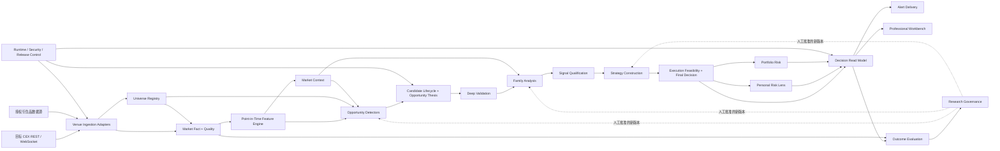

# Market Radar V2 受控替换工程与运行蓝图 v1.81

状态：`ACTIVE_DESIGN_AUTHORITY / M0.4_EXPANDED_SCOPE_DESIGN_PASS / M0.5_MARKET_MECHANICS_MICROSTRUCTURE_AND_PRECURSOR_ATLAS_LOCAL_CONTRACT_PASS / A0_ENGINEERING_SUBGATES_PASS_TOTAL_GATE_INCOMPLETE_P0R_PENDING / M1.1B0_R3_LIVE_15_OF_15_ALL_GATES_PASS / M1.4A_M1.4D_LOCAL_RUNTIME_CONTRACTS_PASS_NO_AUTHORITY / M1.5C_M1.5D_LOCAL_RUNTIME_AND_EXACT_PACKAGE_PASS_LIVE_ZERO_OF_31 / M2.1A_RESEARCH_CONTRACT_PASS_REAL_COHORT_MISSING / M2.3A_R1_UPSTREAM_EVIDENCE_JOIN_LOCAL_AND_REMOTE_QUALITY_PASS_NO_REAL_LIVE_RUNTIME_CANDIDATE_OR_PRODUCTION_AUTHORITY_COHORT_HOLDOUT_PENDING / M3.1A_M3.3D_RESEARCH_SCAFFOLD_PASS_NO_REAL_CALIBRATION / M3.3E_LOCAL_RUNTIME_BUILDERS_CONTENT_ADDRESSED_LINEAGE_AND_DESCRIPTIVE_ATTRIBUTION_PASS_INDEPENDENT_FULL_CI_PASS_TEST_ONLY_UNBOUND_SCOPE_REAL_EVALUATION_UI_SHADOW_PENDING / M3_FEATURE_BRANCH_CANDIDATE_CI_REMOTE_FOUR_GATES_PASS_STRICT_PRODUCTION_M0_UNCHANGED_NO_PRODUCTION_BRANCH_AUTHORITY / M1.6_P0_EXECUTED_BLOCKED_CAPACITY_AND_RECOVERY / P0R_B9_R1_SOURCE_6A70_FOUR_GITHUB_GATES_FRESH_SIGNED_REBIND_V4_TARGET_ACCEPTANCE_PASS_FULL_RECOVERY_NOT_EXECUTED / P0R_ORCATERM_PACKAGE_TRANSPORT_RETIRED / TEMPORARY_8022_LISTENER_RULE_SECRET_AND_RECOVERY_RUNTIME_ABSENT / PRODUCTION_ZERO_DRIFT / PRODUCTION_BUSINESS_SERVICES_DATA_AND_AUTHORITY_UNCHANGED / M1_NOT_COMPLETE / M2_RUNTIME_BLOCKED`

设计日期：2026-07-21

适用对象：产品决策者、工程执行者、外部架构审计员、研究验证人员和生产操作者。

本文回答一个问题：怎样把当前 Market Radar 从“可运行但不完整的研究平台”，建设成能够持续覆盖合格合约市场、尽可能提前发现行情、全面识别其他结构机会、形成严格交易计划并通过真实结果持续进化的专业决策系统。

本文是 V2 当前唯一设计权威。M0 已在干净实施分支通过本地工程出口；M1.1-M1.4 已完成冻结 fixture 的 Identity、Fact、单一价格分散 Feature、保守 Context、append-only Store、双 cutoff durable replay、五维 Runtime Truth、全目录 accounting 和受控 Collector Runtime 本地纵切。这些只证明合同、纯函数、故障矩阵和隔离 PostgreSQL 16 演练，不代表 live 全市场能力、生产变更、盈利能力或自动下单授权。

v1.1 在 v1.0 基础上补齐六个专业缺口：point-in-time 特征权威、Opportunity Thesis 融合、形态质量与证据质量解耦、执行可行性终审、组合风险、Outcome 与 Research 治理分离；同时加入端到端延迟、冷启动、漂移、校准和注意力预算合同。

v1.2 增加干净 Git 基线、生产只读未知状态、爆发行情与提前发现的冻结评价口径、数据许可/成本/回放基线、Legacy Capability Atlas、`src/v2` 物理隔离和可执行施工顺序。M0 工程出口进一步补齐 30 个权威产物的严格运行时 schema、跨 API/进程/存储/回放 decoder 和逐消费者 Legacy 地图；这些仍不提升生产发现、分析或交易能力。

v1.3 冻结 M2.2 target-blind relative-rule-margin diagnostic strength、固定分母 Top20、TRAIN-only 六维事件阈值、matched/background、pre-cutoff 分层、knowledge-time 披露、split 和全部 sensitivity trial identity。该版本只增强离线研究可信度，不形成真实 cohort，也不开放 Detector、Candidate 或生产权限。

v1.4 将 M2.2 来源权利与历史合约身份升级为独立内容寻址证据：外部人工审查、exact operator、历史行情 + instrument reference 双范围、有效期、条款留存、provider binding、identity epoch、状态区间、knowledge time、完整 point-in-time 分母和 unresolved 核算均 fail closed。当前五个来源候选全部为 `RESEARCH_ONLY`，B0.2-A 只证明拒绝门禁，B0.2 外部事实仍未通过。

v1.5 建立三 Venue 第一方前向 instrument capture：原始响应字节 content-addressed 留存在工作区外，完整/部分/失败分母、identity epoch、持续缺席但非 delist 的语义、链式 checkpoint 和 append-only journal 均 fail closed。两轮本机真实请求均被 egress 阻断，因此只达到本地工程出口，运行捕获起点仍未通过，不能回填历史或解锁 Detector。

v1.6 根据首次可达实采修正 Unicode identity、provider-native out-of-scope 与 unresolved 的语义，并把 Raw/Snapshot/Batch/Continuity/Artifact Reference/Journal 全部绑定 exact clean Git release 与冻结 config。release `4139cc631d3d760876c3e39404c494462541a910` 已取得两轮三 Venue COMPLETE、约 368.5 秒跨度和零 gap/unresolved/conflict，C1 前向捕获起点通过；它仍不能回填历史、替代长期 SLO 或解锁 Detector/Candidate。

v1.7 根据 B1-A 真实 Docker Collector 证据修正关键路径：exact image、三 Venue egress、1,444/1,444 collected、checkpoint persistence 与宿主机恢复已技术通过，但 READY 0/2、freshness 和 cadence SLO 明确失败。后续固定为 `B1-B0 证据合同 -> B1-B1 31 周期原始实测 -> 条件性 freshness 语义整改 -> 同门槛复验 -> production storage 分阶段启用 -> 24h Shadow`；禁止用放宽 freshness、压缩分母或技术 PASS 替代业务 PASS。

v1.8 完成 B1-B0 原子 31 周期证据合同：进程输出、domain evidence、Runner evidence 和宿主恢复均内容寻址，新增 100% collection coverage 独立 SLO，技术捕获与业务 Gate 使用不同结论和退出语义。任何中断、短包、跨进程或跨 config 拼接都必须失败并从第 1 周期重跑；当前入口推进到 B1-B1 腾讯隔离原始实测，业务 SLO 仍未证明。

v1.9 根据真实 B1-B1 事故修正 Market Fact 地基：旧窗口虽运行 31 周期，但 Runner/validator 参数漂移导致完整证据未保住，因此明确 `EXECUTION_INVALID_NOT_COUNTED`。三 Venue 价格事实统一切到 `MARK_PRICE / MARK_PRICE_SNAPSHOT`，新增 price usability 独立分母和 SLO，旧 `LAST_PRICE` 证据不能复用；当前入口改为 B1-B3 同门槛 31 周期复验。

v1.10 登记 B1-B3 真实业务 Gate：exact commit `33f08d3fb72912a2617ed3a21f58cb4c347aefcb` 在腾讯隔离 no-authority Runner 完成 31/31 READY，collection、price usability、freshness 与 operational readiness 均为 100%，Runner evidence `sha256:58b5d118503def8287642b78e12eb895a26130ac0ecb12b52bbf06e82ce51860` 已独立复算且宿主精确恢复。M1.5-B1 因此完成，但 M1 仍需 `M1.6-P0..P4 -> M1.7`；当前入口转为 production storage 新鲜只读预检，migration 仍需独立 Gate。

v1.11 登记 M1.6-P0 生产只读事实：exact source `d5dbc804be00c546624ab933bad6282228f983c4` 已证明 PostgreSQL 16、V2 schema `ABSENT_CLEAN`、旧/新 Fact 与 partition 均为 0，且数据库、服务、仓库 mutation 均为 0；但 120 GiB 系统盘按冻结模型预计使用率 90%，当前可用 70.02 GB 小于 87.09 GB 所需 headroom，recovery evidence 也缺失。P0 admission 因而真实 `BLOCKED`；施工顺序插入 P0R 容量、加密离机备份和隔离恢复整改，禁止直接跳 P1。

v1.12 完成 P0R 本地恢复工程：同一只读快照的 `pg_dump -> age X25519` 流、结构/计数 fingerprint、腾讯 COS 私有/versioned/COMPLIANCE 归档与精确取回、隔离 PostgreSQL 16 流式恢复、RPO/RTO 证据、失败清理和可复现脱敏 bundle 均由 strict runner/verifier 覆盖。本地测试通过不等于生产恢复；真实 COS 对象、恢复 parity、容量扩展和 fresh P0 仍未发生，P0/P1 状态不变。

v1.13 完成 P0R-B 云资源前置安全收口：运行级 provisioning plan 绑定 128-bit 高熵 run-id、clean commit、香港单 AZ bucket、生产源 IP `/32`、唯一对象 key 和无 principal 的 7200 秒 STS policy；credential compiler 绑定 plan/policy/request digest 与腾讯 RequestId，raw response 只允许 `/dev/shm`。根据腾讯官方合同纠正旧误判：versioning 启用时 `x-cos-forbid-overwrite` 不生效，现行保护是高熵唯一 key、上传前 HEAD 404 与 exact versionId。当前 COS inventory=0，真实 bucket、age key、STS、备份恢复、扩容和 fresh P0 均未发生。

v1.14 登记 P0R-B1 第一段真实外部动作：腾讯 COS 已创建专用空桶，地域 `ap-hongkong`、单 AZ、私有读写、versioning 与 SSE-COS 已由控制台概览复核；对象 0、存储 0 MB、外网流量 0 B、读请求 0，日志、静态网站、CDN、全球加速和数据万象均未开启。精确名称只保存在 Git 外受限事实文件，Git 登记名称摘要 `sha256:85c3b03bfc42eb22e41bd622bbabb3c8a04778c2397af932fd889aa14440fc63`。Object Lock、离机 age 身份、STS、对象上传、精确版本取回、隔离恢复和 fresh P0 仍未执行。用户拒绝付费扩容后，原容量 blocker 与硬门槛继续有效；付费 P0R-D 不再是活跃路线，必须先通过独立的零付费容量架构重设计与 fresh P0，禁止直接改阈值或放行 P1。

v1.15 登记 P0R-B1B 资格事实与本地保险库工程：Microsoft Edge 控制台已复核专用桶仍为空，安全管理在新旧控制台均没有 Object Lock 入口，按腾讯官方白名单合同判定为 `WHITELIST_REQUIRED`；支持工单已按版本控制模块填写脱敏草稿，但账号手机号未设置，尚未提交。新增 macOS Keychain age X25519 工具，冻结官方 `age v1.3.1` darwin/arm64 archive checksum、独立 recipient 推导、Keychain 读回、失败回滚和无私钥 attestation，P0R 定向 41/41 PASS。真实私钥、STS、Object Lock、对象与恢复均未发生，生产权限不变。

v1.16 登记 P0R-D0 无扩容容量机器证明与六小时分区重设计：旧 v1 日分区 checksum 保持不可变，新增 additive v2 `sha256:17cf407811a3f3518cfd7bf15312dda771e0709d8eb23a62b8bcc56f7c14b68e`，把 partition span 降到 6 小时并把 retention cutoff 升级为 UTC 小时真值。clean commit `15746813245744af4f4ba73f61a976b722ad9a21` 在隔离 PostgreSQL 16 完成 8 周期/11,552 Fact，最大周期 33,660 ms；按 1,805 Facts/分钟、30h retention、1h sweep、1.5 倍成本和固定 reserve，旧根盘快照稳态/峰值为 59%/67%。本地模型 PASS 不替代生产：真实 recovery、fresh topology 和 fresh P0 仍未通过，P1 保持关闭。

v1.17 完成 fresh P0 六小时容量组合准入本地工程：新判定器要求旧 P0 报告可由 raw database/host/recovery evidence 精确重建，继承所有身份、只读、schema、锁、连接、Git/Docker、恢复和零 mutation blocker，只替代三个旧日分区容量计算；并纠正容量合同为稳态 `<=60%`、施工峰值 `<=70%`，隔离 restore target 必须容纳当前数据库、完整稳态数据集和 WAL reserve。定向 10/10、P0R 59/59、ops 113/113 与完整 CI PASS。该工具尚未消费真实 fresh evidence，生产 P0 仍 BLOCKED，P1 不变。

v1.18 登记两条互不越权的推进。生产地基线已在用户动作级确认后启用并回读 COS Object Lock `COMPLIANCE` 31 天，真实 age X25519 身份仅保存在 macOS Keychain，exact commit `6a81e865e61569f7d2d7c3bb3be1d78db72a9eab` 的 checksum-bound transport bundle 已通过；STS、对象、backup/retrieval/restore 和 fresh P0 仍未发生。并行本地线完成 M3.0 Final Decision Authority Contract：同 release/id/time lineage、upstream authority、双评级、Draft、Feasibility、Trigger、Runtime 与 READY plan parity 15/15 PASS；它没有真实 Analysis/Strategy 能力，当前 M1/M2 关闭时只能 planless BLOCKED，M3 主步骤不减数。

v1.19 完成 M3.1 六族 Analysis/Evidence 解释合同：Pre-Move、Breakout/Retest、Trend Continuation、Reversal/Range、Relative Strength 与 Derivatives Flow 均有独立 long、short、失效或 unavailable 路径；每个 EvidenceItem 必须恰好解释一次，结构位必须由 fresh evidence fact 支撑，Fib 不得成为唯一结构。`AnalysisSnapshot v2` 新增 exact evidence ids、Market Context id 和 analysis authority；当前实现固定 `TEST_ONLY_UNCALIBRATED`，M3.0 会拒绝其进入 authorized REPLAY/SHADOW/LIMITED/PRODUCTION。M3 定向 38/38 和完整 CI PASS，但真实 Deep Validation、校准、双评级、Strategy、Feasibility、Risk、runtime 与 READY 均未完成。

v1.20 把重复问题根因门禁从文字升级为机器治理：中央注册表记录 recurrence count、稳定指纹、责任边界、永久修复、红绿回归、运行门禁、真实目标验收、workaround 时间和剩余风险；每个活跃工程包必须声明 operation，V2 质量检查会拒绝命中未关闭故障或已退役 workaround 的操作，只允许登记过的根治动作，并强制核对触发后的紧急绕行次数上限。该版本当时把 OrcaTerm 长命令输入完整性和 stale upload session 作为首批两项，状态均为 `REMEDIATION_IN_PROGRESS`；固定通道 bootstrap 验包已在腾讯目标机通过但 systemd 尚未安装，不能关闭事故或宣称运输自动化。当前事实由后续版本覆盖。

v1.21 登记固定生产派发通道真实安装：exact source `7a59e45b1c277907475f093a25cbb310b7287e12`、archive `sha256:cf05305b3d8e869375e2c9cb37db9a79cedc3b426c71ba4793b405a80b4d8337` 和 source-set `sha256:39387c3a01cae0ce1532e5cd9f065c3629a4bdd0651c8396b5f1a6b392bb998c` 在腾讯目标机通过 verify/install；timer enabled/active，agent `initialized_no_replay -> IDLE_NO_DISPATCH_REF`，固定 runtime/公钥/agent 哈希一致，生产 HEAD、clean worktree、11 个容器、health/scan/Redis 和监听端口均保持基线。OrcaTerm 长命令事故达到 `CLOSED_VERIFIED`；stale upload 仍需首个真实 signed dispatch 验收，故日常运输闭环仍不得提前宣称完成。

v1.22 登记首个真实 signed dispatch 目标验收：dispatch `g0-first-signed-exact-20260722t211117z` 通过专用 ref 自动 pull、Ed25519 验签、独立 systemd runner 启动并返回 `PASS_FIXED_DISPATCH_FIRST_SIGNED_ACCEPTANCE`。生产 HEAD `cec0b657...`、clean worktree、11 个容器身份、health=`ready`、scan=`ready/fresh`、persistence=`ready`、Redis=`PONG` 与 timer enabled/active 前后不变；应用、数据库、Redis 和 Worker mutation 均未尝试，staging 自动清理。前三次失败及其 claim 保留，不被最终 PASS 覆盖；Docker socket 权限改为精确 sudo 只读 allowlist，人工长 ID 抄录改为目标机机器排序文件加 exact diff，禁止通过放宽身份门禁求通过。OrcaTerm 两项复发事故均达到 `CLOSED_VERIFIED`，open incident=0；P0R secret/MFA 例外和每个业务包自身验收仍保持独立。

v1.23 完成 M3.2 Evidence/Setup Qualification 合同并清理错误权威关系：`EvidencePackage v2` 删除 Deep Validation 上游 `tier`，改为 required/supplemental 与独立来源组；`AnalysisSnapshot v3` 增加显式剩余空间质量；`SignalQualification v2` 分别输出 Evidence 与 Setup assessment、grade 和 calibration reference，不使用 Candidate Priority 或总分补偿。当前 builder 永远 `TEST_ONLY_UNCALIBRATED`，不伪造样本、概率或 CI；声称 calibrated 至少需要真实 cohort、untouched holdout、60 样本、三个 regime、segment 覆盖和 reliability error。M3 定向 57/57、全 V2 336/0/6 explicit skip、ops 115/115；Strategy、真实校准、runtime 和 READY authority 仍未完成。生产 P0R clean pre-STS baseline 已通过，但 STS、对象、真实恢复和 fresh P0 尚未执行。

v1.24 完成 M3.3 Strategy Construction 合同：六个机会族分别冻结 long/short entry、结构失效、target、confirmation、expiry、no-chase 和 partial take-profit 语义；`StrategyDraft v2` 绑定 family、Analysis/Qualification policy、point-in-time reference、结构 stop base、成本集和精确 RR 版本。BigInt 定点算法按最不利 entry 计算加权 gross RR 与保守成本后 net RR；低 RR 只阻断，禁止缩 stop。缺入口/目标/fresh reference 时返回 `draft=null`，Fibonacci 未经 validated extension 不得成为 target。Final Decision 重新核对 scope authority、level/price/fact lineage 并重算 RR，手工改漂亮的数字无法进入决策。M3 定向 81/81、全 V2 360/0/6 explicit skip、ops 115/115；当前草案仍固定 test-only 未校准，Execution Feasibility、真实成本、Risk、runtime 和 READY authority 未完成。生产状态不变。

v1.25 完成 M0.4 扩展市场范围修订：新增 `SCOPE_EPOCH_V2_MULTI_ASSET_4V`，把 Bitget、合约上新生命周期、无支持合约的新币 watch、受控数据最大化、单一股票永续和股票指数/ETF 永续正式纳入 V2 目标。原 Binance/OKX/Bybit 三 Venue 加密证据保留为 `SCOPE_EPOCH_V1_CRYPTO_3V`，不能证明新范围。四 Venue capability、资产身份、Listing Event、分层 Collector、Shadow、无付费容量、cohort/holdout、Analysis/Strategy/Feasibility/Risk 和工作台必须按新 epoch 重新验收；股票与加密在 Portfolio Risk 之前不得共用 Context、阈值、评级或校准。本版本只完成设计权威和施工重排，Bitget、股票和上新运行能力仍未实现，生产状态不变。

v1.26 完成 M1.1A 来源能力登记合同：Binance、OKX、Bybit、Bitget 与 CoinGlass Hobbyist 按 33 类能力形成 165 行穷举矩阵，官方能力、套餐、实现和运行证据分层，任何缺行、重复、证据错绑、摘要篡改或套餐越权均 fail closed。最新官方资料纠正了 M0.4 的 Binance 股票域旧结论：四家 Venue 均已有股票/TradFi 永续产品证明，但 Scope V2 Adapter、真实探测、地区可用性、股票身份、session/corporate-action feed 仍未证明。下一本地超级包合并 M1.1B0 exact source conformance 与 M1.1B1 identity/listing implementation；生产不变。

v1.27 完成 M1.1B 本地实现出口：冻结 15 个精确只读探针，fixture 注入强制 `TEST_ONLY`，空目录、adapter row schema 漂移、时钟偏差、分页不完整、缺少 Hobbyist key、计数/Gate/摘要篡改均 fail closed；新增四 Venue 多资产身份、官方 mapping、listing/identity epoch、symbol reuse 与 Bybit/Bitget 公告生命周期合同。Bitget `isRwa` 和股票外观 symbol 均不得直接证明单股/ETF；Bybit 纠正为使用 `symbolType=stock/commodity/forex`，明确禁止把费率组 `G9` 当 instrument 类型。隔离编译和定向 22/22 PASS 只证明本地合同；腾讯隔离 live B0、四 Venue Shadow、容量、校准和生产 authority 仍未证明，生产不变。

v1.28 完成 M1.4A capability-independent 自适应采集合同的本地出口：Bitget 作为第四 Venue，上新与无合约资产 watch 作为 T0 生命周期分母，股票类合约作为独立 asset domain，统一进入 T0 catalog/event、T1 wide market、T2 candidate burst、T3 deep validation 四级调度。合同强制 live B0、外部人工 rights review、entitlement、jurisdiction、quota、checkpoint、baseline reserve、source fairness、bounded backpressure 和 matched-control parity；股票缺 session/corporate-action capability 时失败关闭。subjects、grants、quota、checkpoints 和 policy 五组输入全部内容寻址，400 subject 四 Venue全量分母、28 项定向测试、新文件 ESLint 和独立 Git clone 完整 `ci:production` 已通过；全 V2 424 项、ops 115 项、Next build、Golden 16/16 和 security 均 PASS。本包无网络、Fact、Candidate、Strategy、READY、Worker 或生产 authority。

v1.29 完成 M1.1B0 无密钥固定派发包的本地出口：Bybit 公告精确限定 `type=new_crypto` 全分页，Bitget 公告精确限定 `annType=coin_listings` 官方一个月窗口与完整 cursor；五个来源组跨来源并行、同源严格串行，每页 12 秒和 8 MiB 上限全部进入 `probePlanDigest`。确定性 bundle 包含 125 个文件、15 个编译运行模块和 Zod 4.4.3 最小运行树；CoinGlass Hobbyist key 只允许目标机从受限生产 env 读取并进入一次性子进程。定向 20/20、固定派发 prepare/outbox rehearsal 与独立干净克隆完整 `ci:production` PASS；V2 Foundation 419 pass / 6 explicit skip、V2 Ops 124/124、Next build、Golden 16/16 和 security 均通过。腾讯 `LIVE_READ_ONLY` 15/15 B0 尚未运行，生产不变。

v1.30 登记 M1.1B0 首次腾讯执行的真实阻断并纠正职责：dispatch `m1b0-live-source-20260723t141526z` 被固定通道领取后在业务 artifact 前失败，结果永久记为 `BLOCKED_ATTEMPT_NOT_COUNTED_AS_LIVE_B0_PASS`；现场只读证明 production HEAD、clean worktree、11 个容器、health、timer 与 CoinGlass 文件边界仍符合绑定基线。Bybit `new_crypto` 当前总量需要 81 页，旧 64 页上限和 85 秒 deadline 无法满足自身“完整历史”声明，因此 R1 把 B0 收窄为最新两页 `BOUNDED_COMPLETE` 一致性窗口，并把完整历史移交 M1.4B 的 bootstrap backfill、持久 checkpoint、缺口检测和增量账本；Bitget 继续验证官方一个月完整 cursor。request 通过后的前 artifact 故障现在必须持久化脱敏 phase/reason，不能只留 stderr hash。Bitget 仍是 Venue 注册表职责，上新/预上新仍是 Listing Lifecycle 职责，股票类合约仍是独立 Asset Domain 职责；三者不得合成一个虚假“多资产已接入”状态。R1 定向包、固定派发和 V2 Ops 门禁分别达到 22/22、21/21 和 125/125；独立干净克隆完整 `ci:production` 通过，V2 Foundation 420 pass / 6 explicit skip、Next build、Golden 16/16 和 security 均 PASS。精确提交与腾讯重派发仍待执行，生产服务、数据与 authority 不变。

v1.31 登记 R1 精确提交 `ad38524a7e0c97f714369d6e61c4417f485b6367` 与派发 `m1b0-r1-live-source-20260723t155239z` 的真实结果：业务 artifact/result 已形成，但 15 个探针全部为 `TRANSPORT_FAILURE_UNAVAILABLE`，三个 Gate 均 BLOCKED，生产前后 HEAD、worktree、11 个容器、listener、timer 与 health 完全一致，`productionChanged=false`、`secretMaterialPresent=false`。固定 Node `v24.18.0` 现场复现证明 `--jitless` 下 Web Fetch 因 `WebAssembly is not defined` 失败，而同一 runtime 的 Node core `node:https` 返回 HTTP 200；共同根因属于 hardened runtime transport，不属于五个 provider 同时失败。R2 保留 `--jitless + MemoryDenyWriteExecute`，以 TLS 验证、HTTPS/exact-host、无重定向、12 秒超时和 8 MiB 上限的 `https.request` 作为 live 默认传输，Fetch 只保留为 TEST_ONLY 注入；该差异进入 `probePlanDigest`。R2 当前 package 24/24、fixed dispatch 21/21、V2 Foundation 422/428（6 项明确跳过）、V2 Ops 125/125、M0、Next build、Golden 16/16、安全扫描与完整 CI PASS；精确提交和新腾讯派发待完成。Bitget Venue、Listing Lifecycle 和股票 Asset Domain 继续分别核算，不能借本次传输修复提前晋级。

v1.32 登记 R2 精确提交 `d557c666e2e27b67842354b869a64271c91ceae1` 与派发 `m1b0-r2-live-source-20260723t165411z` 的真实结果：15 个探针有 14 个 PASS，Identity Gate 与 CoinGlass Gate PASS；唯一 `BINANCE_SPOT_CATALOG` 因默认现货目录约 17,407,074 bytes 超过固定 8 MiB 上限而以 `SCHEMA_DRIFT_UNAVAILABLE` 失败，Listing Gate 因而保持 BLOCKED。生产 HEAD、clean worktree、11 个容器、timer 与 health 前后不变，`productionChanged=false`、`secretMaterialPresent=false`。R3 只采用 Binance 官方 `showPermissionSets=false` 查询；现场响应为 6,629,806 bytes，并保留本 Gate 所需身份字段。全局响应上限、schema、探针分母和安全策略均不降低。R3 当前 package 24/24、fixed dispatch 21/21、V2 Ops 125/125 和独立正确分支完整 CI PASS；V2 Foundation 422 pass / 6 explicit skip、M0、Next build、Golden 16/16 与 security 全部通过。精确提交和腾讯重派发待完成。Bitget Venue、Listing Lifecycle 与股票 Asset Domain 的独立验收边界不变，R2 的 14/15 不能整体解锁 M1.4B。

v1.33 登记 M1.1B0 R3 腾讯 exact live conformance 出口：精确提交 `06c1fd1fe0559dfed2097d1d64cb94382973ec62`、source tree `b96690594db1094d3f632a038fffe984804147d7`、签名派发 commit `ab25f0663388b01051542a4bf64ab15eacc40b46` 与 dispatch `m1b0-r3-live-source-20260723t175033z` 已由固定通道完成。15/15 探针、Identity、Listing 与 CoinGlass Gate 全部 PASS；artifact `source-conformance:5a6d0c06c7085db00380f746` 的 content hash 为 `sha256:5a6d0c06c7085db00380f74676d627185f6683567fc2c0882d6fb079a87e68fd`，probe plan digest 为 `sha256:a8e5488fee40a3462d175e44b350dc856476d9d70a5d04290cbaa4e7eb546d36`。生产前后 HEAD、worktree、11 个容器、listener、timer 和 health 完全一致，`productionChanged=false`、`secretMaterialPresent=false`，staging 已删除。M1.1B0 因此对该 exact release/probe plan 完成，但 M1.4B runtime Adapter、Bybit 完整 listing history、四 Venue Shadow、扩展容量、股票 session/corporate-action/FX/basis、校准和生产 authority 仍未完成；Bitget Venue、Listing Lifecycle 与股票 Asset Domain 继续独立验收。

v1.34 完成 M1.4B 本地核心实现并纠正两个容易自欺的口径。第一，15/15 R3 live conformance 与 scheduler route eligibility 分开记账：当前 15 个 endpoint Profile 中只有 14 个可路由，`BINANCE_SPOT_CATALOG` 虽现场探测通过，但 M1.1A registry 仍为 `UNAVAILABLE`，因此固定 `schedulerRouteEligible=false`，必须先修订 registry 并绑定新 digest 重跑 live conformance。第二，snapshot batching 与 listing-history bootstrap 使用两本请求预算，64 页历史回补不与 M1.4A 单次逐标的上界虚假比较。Bybit provider-available history 与 Bitget 官方一个月窗口已形成 bootstrap/resume/gap/incremental 状态机；Bitget Venue、Listing Lifecycle、股票 Asset Domain 与 Data Maximization 分别验收，股票当前只有 catalog accounting、tradable Fact 为 0。M1.1B 26/26、M1.4A 28/28、M1.4B 23/23 和 ESLint 已通过；完整 CI、exact commit、腾讯隔离 no-authority runtime、真实 listing checkpoint、四 Venue Shadow 与扩展容量仍未完成，生产不变。

v1.35 完成 M1.4B 最终本地工程出口：独立正确分支克隆的完整 `ci:production` 通过，V2 Foundation 451 total / 445 pass / 6 explicit skip、V2 Ops 125/125、M0、Next production build、Golden 16/16 与 security 全部 PASS。该出口只证明代码、合同、机器追踪和生产构建一致，不证明腾讯持续 Adapter、真实 listing checkpoint、四 Venue Shadow、扩展容量、校准或任何 Fact/Candidate/Strategy/READY authority；生产服务、数据与 authority 仍未改变。

v1.36 把 M1.4B 现场出口从文字计划升级为无 secret、内容寻址的固定派发包。该包保持 15 个 live-conformant Profile 完整分母，只执行 14 个 route-eligible Profile，`BINANCE_SPOT_CATALOG` 请求数固定为 0；五个 source group 跨来源并行、同源并发 1，Bybit/Bitget listing 各有 64 页有界预算。Bitget Venue、Listing Lifecycle、Equity Asset Domain、Data Maximization 四轴独立核算，任何一轴不能借 PASS。Bundle 绑定 R3 artifact、registry/probe digest、exact source commit/tree/ref 及生产 HEAD、容器、listener、timer、health；CoinGlass key 只进入目标机一次性子进程。blocked segment 不晋级 checkpoint，续跑必须同时绑定原 checkpoint 与精确 `PASS` result SHA-256。定向包 9/9、V2 Foundation 454 total / 448 pass / 6 explicit skip、V2 Ops 131/131、M0、Next production build、Golden 16/16 和 security 全部 PASS；GitHub 同步和腾讯真实执行尚未完成，生产服务、数据与 authority 不变。

v1.37 完成 M3.4-R0 Scope Rebase 治理门禁并纠正“修几处编译错误即可继续 M3.4”的错误路径。只读审计证明旧 V1 草稿当前 typecheck FAIL 3、lint 1 warning、测试 0，且缺 scopeEpoch、Bitget、assetDomain、listing lifecycle、股票 session/公司行动/FX/reference/basis 和分域校准；草稿保持用户原样并继续隔离。新 gate 强制 exact Scope V2/Venue/assetDomain/lifecycle/release、14 项通用、3 项加密、7 项股票和 warm-up 独立证据，PASS 必须绑定不可变 release/evidence/digest；Bitget、Listing、Equity、Data Maximization 四轴不能互借。定向 12/12、ESLint 0/0，正式实施分支身份完整 CI 为 V2 Foundation 460 pass + 6 explicit skip、V2 Ops 131/131、M0 11/11、Next、Golden 16/16 与 security 全部 PASS；该版本当时仍要求 M3.4 实现等待 M1.4B runtime、M1.5C、M1.6-D1、M2.3/M2.4 和 M3.1A-M3.3A，后续 v1.41 只关闭了其中 M1.4B，生产和全部 Feasibility/Signal/Strategy/READY authority 不变。

v1.38 冻结 Scope V2 四轴不混线施工矩阵。Bitget 是第四 Venue 验收轴；上新、预上新和暂无合约的新币是独立 Listing Lifecycle 轴；单股永续与股票指数/ETF 永续是两个分开校准的 Equity 子域；Data Maximization 是横跨来源的开放治理轴，不是“请求越多越好”。后续 M2/M3 拆为四 Venue 成熟加密、listing warm-up、单股永续、指数/ETF 永续四套逐域包，分别拥有 Detector、cohort、untouched holdout、Analysis、Qualification、Strategy、Feasibility、Outcome 和切换证据。加密合约提前发现继续是主线，股票支线不得挤占全量加密 T0/T1 基础保留位；本版本只纠正搭建计划与机器追踪，不增加任何运行、Candidate、Strategy、READY 或生产权限。

v1.39 完成 Scope V2 四轨 M3 Research Contract Scaffold：成熟加密、listing warm-up、单股和指数/ETF 各自锁定 lane/domain/lifecycle/family，Evidence 与 Setup 校准拆开，校准只可在 exact segment 内跨 instrument 复用；股票 session、公司行动、FX、reference、闭市 basis、规格或成本缺失均 fail closed。Cost 与 Reference Price 成为内容寻址 evidence artifact，费用不可得时为 null 而非 0；Strategy policy 绑定双 calibration hash、结构 kind、触发、失效、no-chase、expiry 和 RR floor，Fib target 需要 validated extension digest。四轨定向 28/28 PASS；这只是本地 research contract，不代表 M2.3/M2.4 真实 cohort、M3.1A-M3.3D 真实校准、Strategy authority、READY 或生产能力完成。

v1.40 登记四轨研究合同的正式实施分支完整 CI：V2 Foundation 494 total / 488 pass / 6 explicit skip、V2 Ops 131/131、M0 11/11、Next production build、Golden 16/16 与 security 全部 PASS。该结果只证明新增 Bitget、上新 warm-up、单股和指数/ETF 四条合同与现有工程门禁兼容，不增加真实 Detector、cohort、holdout、校准、Signal Grade、Strategy、READY 或生产 authority。

v1.41 登记 M1.4B 腾讯现场出口：正式实施分支 source `3c21a75009aeb4f4f7d9fd8954245238c38d9636` 先完成 bootstrap `m1-4b-runtime-live-20260723t232457z`，再以两个精确 checkpoint、原 PASS result 路径和 SHA-256 完成 resume `m1-4b-runtime-live-20260723t233213z`。两轮均为 14/14 route PASS、0 failed、1 registry blocked、request budget/attempts=203/80、listing gap=0、committed checkpoint=2；Bitget Venue、Listing Lifecycle、Equity Asset Domain、Data Maximization 四轴全部独立 PASS。成功前两次 pre-launch 拒绝分别保留为 source ref allowlist 不匹配和 5400/1860 秒跨层时限不匹配，均未进入网络业务执行且生产零变更；新增 request/envelope/bundle 强制预检在上传前拒绝同类漂移。生产 HEAD、clean worktree、11 容器集合、listener、timer、health 前后不变，staging 均删除。M1.4B 因此关闭，但 M1.5C、M1.6-D1、股票 tradable Fact、分域 Detector/cohort/calibration 和全部持续 runtime/Fact/Candidate/Strategy/READY authority 仍未完成。

v1.42 完成 Market Mechanics、Microstructure 与双向前兆图谱设计修订：把近期对山寨币上涨/下跌爆发前异常、安静吸筹/派发、主动成交与价格响应、订单墙生命周期、流动性真空、板块传播、外部数据、缓存读路径和专业图表交互的讨论，正式落入现有 18 Module，而不新建第二套权威。新增 `M1.4C Microstructure Fact/Feature Contract`、`M1.5D Adaptive Microstructure Forward Shadow` 和 `M2.1A Bidirectional Precursor Atlas and Market Mechanics Research` 三个受控包；Market Mechanics Cube 固定为价格结构、参与杠杆、流动性响应三轴，Venue/timeframe/regime/liquidity/lifecycle/sector 作为强制分层。静态订单墙、固定美元大单阈值、单 Venue 现象、未经校准的“主力/控盘/89分”和 AI 自由解读均禁止成为事实、Grade 或 READY。CoinGecko 免费 API、DefiLlama/链上和新闻社交只作为待资格审查的补充来源；任何 key 不进入 Git。该版本只完成设计融合，真实微观结构采集、cohort、holdout、校准、页面和生产 authority 均未开始，P0R 与 M1.5C 当前入口不变。详细合同为 `docs/architecture/v2/M0_5_MARKET_MECHANICS_MICROSTRUCTURE_AND_PRECURSOR_ATLAS_AMENDMENT_V1.md`。

v1.43 完成 M1.4C 与 M2.1A 的本地无权限出口。M1.4C 冻结六类微观结构事实、LiquidityWallEpisode 生命周期、十三项 Market Mechanics Feature、四层缓存真值边界、精确 lineage/cutoff/freshness、ONLINE 与两个独立 REPLAY 的语义一致性，并以 22/22 定向测试通过；M2.1A 冻结八个前兆族各自独立的 LONG/SHORT/UNKNOWN 共 24 个研究假设、三类 Outcome、point-in-time 板块传播、逐 family-direction 的 Venue/regime/liquidity 分层、matched control、消融、sealed holdout、Shadow 和独立审计门禁，并以 13/13 定向测试通过。正式实施工作树完整 `ci:production` PASS：V2 Foundation 529 total / 523 pass / 6 explicit skip、V2 Ops 131/131、M0、Next production build、Golden 16/16 与 security 全部通过。M3.4-R1 先前的 schema/import/fixture 编译阻断已按当前 strict schema 根治，但该草稿仍没有独立工作包出口或任何 Feasibility authority。M1.5D、真实微观结构数据、cohort、holdout、校准、Candidate、Signal、READY 和生产运行仍未完成，生产服务、数据与 authority 零变更。交付报告为 `docs/blueprints/V2_M1_4C_MICROSTRUCTURE_AND_M2_1A_BIDIRECTIONAL_PRECURSOR_LOCAL_CONTRACT_DELIVERY_REPORT.md`。

v1.44 插入 A0 Engineering Foundation 硬门禁，纠正“合同数量增长即可直接进入大规模 Shadow”的顺序风险。第一批材料资格和 exact-runtime 修复已绑定实现提交 `2ae438b394d289a05f02dbfa0c2846cd2194ea37`：Node/npm/直接依赖精确锁定，Next/PostCSS/Sharp 升到已验证安全补丁，删除未使用的 `shadcn` CLI/MCP 依赖和死 CSS 导入；GitHub Actions、runner、Node 与 V2 Docker 基础镜像全部固定，新增双重 lint、许可证门禁、CycloneDX SBOM、零高危审计和 Sharp/PostCSS 运行烟测。Provider Adapter 端点/角色/REST 边界与 Live Transport 并发、停止、丢弃分母、超时和重连也补齐测试；Node 22 完整 CI 发现并根治了 timeout `unref` 导致 Promise 可悬空的问题。exact Node `22.23.1` / npm `10.9.8` 本地完整 `ci:production` 已 PASS：Market 969 total / 965 pass / 4 explicit skip、Workers 23/23、Historical 4/4、V2 Foundation 588 total / 582 pass / 6 explicit skip、V2 Ops 136/136、M0、Next build、Golden 16/16 与 security 全通过。机器路线进一步把当前本地 A0、独立生产 P0R、A0 后 Scope V2 Shadow 与外部历史权利 Gate 分开，并由 M0 拒绝身份、阻断关系或权限漂移。该批次只达到 `A0_ENGINEERING_MATERIALS_AND_SUPPLY_CHAIN_LOCAL_PASS`；GitHub 远端 exact-runtime 证据、独立 secret/SAST/镜像扫描、性能与资源基线、构建制品 provenance/回滚演练及 P0R 真实恢复仍待完成，因此 A0 总门禁保持未完成，M1.5C/M1.5D 不得启动。

v1.45 登记 A0 首次独立 Linux 门禁的真实失败与根因治理。commit `61ef7e995e8df0e5f4240a14553feeb9adc482c9` 的 GitHub Full Quality run `30198990064` 和 Signed Dispatch run `30198990079` 均在同一归档回归失败：本机 BSD tar 接受的 `--uid=0` 在 Ubuntu 24.04 runner 被拒绝，证明原可复现制品检查依赖宿主 tar 方言。修复提交 `29ab47dec0b9fbbbe66e1cfe7ce90aa2e1e4c25d` 使用纯 Node USTAR writer 替换四个活跃 V2 Bundle 的外部 tar 创建，固定排序、uid/gid、mtime、mode、checksum、padding 与 trailer，并拒绝 traversal、重复、symlink 和 special file；Legacy 历史 Bundle 保持冻结、不重签。exact Node/npm 本地完整 CI 再次 PASS，V2 Ops 增至 138/138；远端 Linux 复验尚未取得，因此该事项只能标记 `LOCAL_ROOT_CAUSE_REMEDIATION_PASS / REMOTE_LINUX_REVERIFY_PENDING`，A0 仍未完成，生产仍未改变。

v1.46 登记跨平台归档修复的首次远端复验及第二层 CI 根因。exact HEAD `cc9e902740d70cc560602fe5efdff6c1acfc375f` 的 Signed Dispatch run `30199692352` 已在 Ubuntu 24.04 PASS，证明 host-tar 故障已关闭；Full Quality run `30199692349` 则在 V2 Foundation M0 检查失败，因为 checkout 默认 `fetch-depth: 1`，无法读取 HEAD 三个提交前且被 M0 强制验证的 Legacy 审查基线 `2ae438b394d289a05f02dbfa0c2846cd2194ea37`。修复提交 `1d5638d0fb538bacec09086ec7b719d9e7a85ce9` 将 Full Quality 改为完整 Git 历史，并由 A0 材料门禁永久拒绝浅历史回归，同时让 M0 测试输出具体失败检查。exact Node/npm 本地完整 CI PASS，V2 Ops 增至 139/139；Full Quality 远端复验仍待取得，所以 A0 总门禁继续未完成。

v1.47 完成 A0 exact-runtime remote CI 控制项。Full Quality run `30200077285`、job `89788386319` 已在 exact HEAD `dc5e1823d08ac5a2d1630f3989257e735f829695` 的 Ubuntu 24.04 环境通过完整 Git checkout、Node `22.23.1` / npm `10.9.8`、锁文件安装、材料门禁、CycloneDX SBOM、零 high/critical 依赖审计、完整 `ci:production` 与 M0 祖先验证。SBOM artifact `8631398374` digest=`sha256:ba6de688e0b2163ccc7f17c06e39c9ef35406eb98235d744a137d849cb57e241`。结合 Signed Dispatch `30199692352`，`EXACT_NODE_22_23_1_NPM_10_9_8_REMOTE_CI_EVIDENCE` 正式完成；A0 仍缺独立 secret/SAST、容器镜像扫描、完整 provenance/回滚、性能资源基线和 P0R 真实恢复，故总门禁仍未完成、生产仍未改变。

v1.48 完成 A0 独立安全质量控制项。exact source `4f501b0fb8b917ce87e0687eab8480b5c9595f27` 的 Security run `30209898205` 三个 Ubuntu 24.04 job 全部 PASS：Gitleaks `8.30.1` 扫描完整 reachable history，finding=`0`；CodeQL action `4.37.3`、linked bundle `2.26.1`、JavaScript query pack `2.4.1` 执行 `security-extended + AlertSuppression.ql`，8 个 exact-location reviewed suppression 全部对齐、untriaged/blocking=`0`；exact collector image 经 Trivy `0.72.0` 扫描 OS/library，HIGH=`0`、CRITICAL=`0`。同一 HEAD 的 Full Quality run `30209898207`、job `89814245105` PASS。历史 secret 误报只允许 exact fingerprint，未来 commit identity 改为两段 20-hex 表示；CodeQL suppression 必须绑定 rule/file/alert line/review/invariant 且源码紧邻，禁止宽泛排除。三个脱敏 artifact 分别为 `8634143821`、`8634167593`、`8634153873`，生产 mutation 均为 false。后续 Security `30211083028` 又因交付报告两处连续 commit identity 出现精确 Gitleaks false positive；该红灯保留，v4 审查只登记两个历史 fingerprint，报告/矩阵、材料门禁和 M0 均已切换为两段 20-hex 防复发。修复 source parts `9f6d4731e6afbf0a68d3 + 2a98df64da179f20d84a` 已由 Security `30212437973` 和 Full Quality `30212437974` 重新验收：Gitleaks finding=`0`、CodeQL `8/8` reviewed 且 blocking=`0`、Trivy HIGH/CRITICAL=`0`，生产 mutation=false。该控制项完成不等于 A0 总 PASS；剩余仍是完整制品 provenance/rollback、性能资源基线和 P0R 真实恢复。

v1.49 完成 A0 可重复制品/回滚和冻结性能资源基线两个控制项。source parts `9ef63b85d1a76f3ad7ac + 815e081506c5dbc074a5` 的 A0 run `30217335595` 两个 Ubuntu 24.04 job 全部 PASS：两次独立 no-cache RootFS 的 canonical digest 一致，应用胶囊两次序列化字节一致，镜像配置、非 root 身份、read-only/no-network fail-closed smoke 和三个隔离回滚场景均精确绑定；1,440 eligible instrument 冻结工作负载在不降低 `200 ms` event-loop p99 门槛、不减少 12 cold + 60 incremental 样本的条件下，实测 p99=`64.750 ms`、cold/incremental latency p95=`183.731/44.944 ms`、RSS/heap 最大值=`232.801/140.406 MiB`，全部预算 PASS。此前 RootFS ownership、合法 POSIX 路径、两处文件 TOCTOU 和 event-loop p99 超限红灯均保留并完成根因治理；证据读取改为单一 `O_NOFOLLOW` 句柄前后 `fstat`，Collector 仅在四个既有重阶段间 cooperative yield，工作量和阈值不变。相同 source 的 Full Quality `30217335543` 与 Security `30217335622` 全部 PASS，Gitleaks finding=`0`、CodeQL untriaged=`0`、Trivy HIGH/CRITICAL=`0`。该工程基线不是 live capacity；A0 现在只剩 P0R 真实加密备份、精确取回和独立恢复，因此总门禁仍为 `INCOMPLETE_P0R_PENDING`，M1.5C/M1.5D 和全部业务 authority 继续关闭。详细证据见 `docs/blueprints/V2_A0_REPRODUCIBLE_RELEASE_AND_RESOURCE_BASELINE_DELIVERY_REPORT.md`。

v1.50 根据当前源码与服务器历史 staging 的真实差异调整 P0R 关键路径。历史 `bed938...` 包虽保持成员、plan、bindings 和摘要完整，但三个目标机运行文件早于当前单句柄 `O_NOFOLLOW`、独占输出和有界读取安全修复；本地 bundle builder 也早于确定性 Node USTAR。该包因此从“当前执行入口”降为 `REJECTED_SUPERSEDED_SECURITY_SOURCE`，不得执行、复用或绑定新 STS。source parts `408803e0bdc21051124a + 79e307db8e9eb39c793c` 新增无 secret、只读、single-use、signed-dispatch P0R 重绑定包：它精确核对生产 Git/容器/timer/listener/health、`/dev/shm`、P0R runtime residue、腾讯 metadata `/32` 摘要和历史 staging 全成员，前后生产身份必须零漂移，证据不可覆盖。package `9/9`、P0R `70/70`、V2 Ops `179/179` 与完整本地 CI PASS；GitHub exact-source Full Quality `30219999104`、A0 Release Qualification `30219999094` 和 Independent Security `30219999063` 也全部 PASS，Security 的 Gitleaks finding、CodeQL untriaged 和 Trivy HIGH/CRITICAL 均为 0。v1.50 冻结时生产现场重绑定尚未执行；后续 signed dispatch 已发布但目标 receipt 未读，当前领取、启动和结果必须按 v1.51 记为 `UNKNOWN`。固定顺序保持 `read target receipt -> read-only live rebind acceptance or fresh redispatch -> current-source plan/bundle -> /dev/shm fresh STS + age identity -> backup/retrieval/isolated restore/cleanup -> fresh topology/P0`，不缩短任何恢复门槛。详细证据见 `docs/blueprints/V2_M1_6_P0R_READ_ONLY_REBIND_PREFLIGHT_DELIVERY_REPORT.md`。

v1.51 根据真实前向目录刷新修正 C1 的资产域语义，并把临时人工复核升级为正式机器验证。历史两轮捕获起点保持不变；evidence release parts `a02aecbbf8b289e409fd + e33b150fb55cb62ef3f0` 现有四轮三 Venue COMPLETE，由 clean verifier release parts `be5c0c9682cd8f503679 + 7d52d426783eb0f6615f` 逐条验证 4 条 journal、28 个 artifact reference、12 个 raw reference、8 个去重 raw object、37 个精确保留文件及三条 continuity chain，全部完整且约 998.5 秒无 gap。最新 raw 重新进入 Scope V2 域归一化后，Binance 明确出现 125 单股、3 指数/ETF、8 其他 RWA 和 11 unresolved，OKX 出现 131 单股与 8 其他 RWA，Bybit 出现 137 广义 RWA，其中 133 个不能仅凭 `stock` 类别区分单股/ETF。三家 normalization 均诚实保持 `PARTIAL`，官方 mapping 完整性、Bitget、Fact、Candidate、Strategy 与 READY authority 全部未证明。verifier exact source 的 A0 `30223737098`、Full Quality `30223737124`、Independent Security `30223737105` 与 Signed Dispatch Quality `30223737131` 全部 PASS，但远端资格不能替代生产或业务验收。由此永久明确：旧 C1 `CANONICAL_TARGET` 只代表线性合约形状与身份字段，不代表 crypto asset domain 或交易资格。P0R signed read-only rebind 已发布但目标 receipt 尚未读取，不能宣称执行 PASS，也不能宣称确定未执行；A0、生产和业务 authority 状态不因本 C1 并行证据包改变。详细证据见 `docs/blueprints/V2_M2_2_C1_FORWARD_EVIDENCE_REFRESH_AND_DOMAIN_ISOLATION_DELIVERY_REPORT.md`。

v1.52 完成 Scope V2 M1.4D、M1.5C 与 M1.5D 的本地运行地基和 exact-source 无密钥生产包。M1.4D 将四 Venue 全量目录、listing watch、确定性多资产身份、T0 生命周期与 T1 wide-market 事实统一成 point-in-time Base Fact Snapshot；Provider URL 和公网 transport 只允许存在于 Adapter，Core 合同只保留哈希与有界请求约束。M1.5C 已实现单进程 31 周期、60 秒 cadence、四责任轴独立分母和完整 evidence verifier；M1.5D 已实现同样 31 周期的 trades/book/mark-index 前向采集、基于 cutoff 的确定性 research/control 选择、未来数据拒绝、隔离 PostgreSQL 16 持久化及独立 verifier。两包共用同一 exact release/upstream binding，但独立验收；目标 Runner 禁止 source sync、目标构建、依赖安装、生产数据库/Redis/应用/env/Feature Flag/migration 写入，失败时只有宿主拓扑精确恢复才可声称 `productionChanged=false`。Binance JSON subscribe 端点已按官方 routed stream 语义修正为 `/public/stream` 与 `/market/stream`，架构门禁禁止 Provider transport 重新进入 Core。Base Fact 23/23、Expanded Shadow 70/70、生产包 12/12、V2 Ops 192/192、typecheck、ESLint、Biome、forbidden-files 和 secret-pattern 均通过；完整 `ci:production` PASS，V2 Foundation 637 total / 631 pass / 6 explicit skip，M0、Next production build、Golden 16/16 与 security 全部通过。真实 M1.5C/M1.5D live cycle 仍为 0，生产与全部 Fact/Candidate/Strategy/READY authority 未改变；生产 Bundle 必须等待 A0/P0R 关闭，并取得与当前 source 同提交的新鲜 M1.4B/conformance 上游证据后才能生成。详细证据见 `docs/blueprints/V2_M1_4D_M1_5C_M1_5D_LOCAL_RUNTIME_AND_PACKAGE_DELIVERY_REPORT.md`。

v1.53 根据生产只读 receipt 核对，关闭固定派发通道的超时遗留锁根因。旧代理一次 Git fetch 超过 systemd 180 秒时限后被 `SIGTERM`，仅目录锁因没有 owner identity 和 stale recovery 而永久遗留，随后 103,524 秒内产生 4,526 次 `dispatch_agent_already_running`。source parts `2b4fccc9f3affe613d4f + 0da0f97295d97b0c6452` 将 Git child 固定为不可绕过的 90 秒上限，SSH 连接和 keepalive 有界，并以 boot ID、PID、Linux process-start token、时间和随机 token 建立 owner lock；live owner 保持 fail closed，dead owner 可隔离恢复，空旧锁仅在四分钟后恢复。24/24 回归、腾讯 Linux 隔离 smoke 和生产三文件可回滚升级均 PASS。旧 P0R dispatch commit parts `34b1f137e92be1649d64 + c6507c3e36204ce0b31e` 已被明确记录为 `FAIL_DISPATCH_NOT_REUSABLE / dispatch_not_current`，无 claim、解包或业务 Runner，原 `UNKNOWN_TARGET_RECEIPT_UNREAD` 结论失效，当前事实是 `CONFIRMED_NOT_EXECUTED_EXPIRED_NOT_CLAIMED`。生产应用 HEAD、clean worktree、11 容器、数据库、Redis、六个 Worker 与 health 零漂移；只改变固定派发控制面三文件。下一动作是生成新时效 signed read-only rebind，不得复用旧包。详细证据见 `docs/blueprints/V2_FIXED_DISPATCH_TIMEOUT_LOCK_RECOVERY_DELIVERY_REPORT.md`。

v1.54 根据 2026-07-27 真实 P0R 现场推进纠正 STS 请求合同。exact source `94118d3b8270b6ac58c449380911ea77b8abeace` 已通过完整本地 CI 与 GitHub Full Quality `30263341562`、A0 Release Qualification `30263341569`、Independent Security `30263341571`、Signed Production Dispatch Quality `30263341645`；fresh read-only rebind `p0r-rebind-preflight-20260727t115642z-bd715b46` 在腾讯返回 `PASS_P0R_READ_ONLY_REBIND_PREFLIGHT`，生产 HEAD `cec0b657...`、clean worktree、11 容器和业务健康零漂移。随后 exact plan/bundle 已构建、上传并校验，但腾讯 API Explorer 在身份验证后以 `MissingParameter.Region` 拒绝请求；没有生成 STS credential、没有读取数据库、没有生成备份或 COS 对象，失效 run staging 已精确清理。根因不是腾讯瞬时故障，而是 provisioning contract 已把 `ap-hongkong` 写入 grant/policy 却遗漏 `stsRequest.region`。现将 plan schema 升级为 `v2-m1-production-storage-cos-provisioning-plan.v3`，Region 必须同时进入 STS request、plan digest、credential request digest 和 Go helper 验证；缺失或不匹配一律 fail closed。定向 P0R `72/72`、Go helper、V2 Ops `194/194` 与完整本地 `ci:production` 已通过；在新修复提交完成四条 exact-source 远端门禁、fresh 生产只读重绑定和全新 v3 plan/bundle 前，旧 v2 计划不得手工补参数或执行。

v1.55 根治 exact-source 第四门未触发的工作流范围缺口。Region 修复 source `b33661d6d503df89ab8f1aa1a3e2a3e962e0c7ae` 的 A0 `30271875733`、Full Quality `30271875892` 和 Independent Security `30271879243` 均 PASS，但 Signed Production Dispatch Quality 因工作流仅监听 `scripts/v2/production/fixed-channel/**` 而没有监听 P0R 生产脚本，未产生同 SHA run；该事实不能冒充四门通过。触发合同现覆盖 `scripts/v2/production/**` 的 push 与 pull request，并由回归测试锁定，任何 V2 生产 runner、bundle、plan、helper 或 fixed-channel 变化都必须自动进入第四门。新 exact source 仍须四门全部 PASS 后才能 fresh rebind；生产和 STS 均未因本修复改变。

v1.56 将“每笔策略必须说明属于哪一种交易逻辑”正式纳入后端权威链。新增 `StrategyArchetypeLabel`、有界 `StrategyContextTags` 与由 Action State 派生的 `StrategyStateLabel`：每份完整 StrategyDraft 必须恰好一个版本化主标签，例如 `BREAKOUT_RETEST_LONG`（突破回踩确认做多）、`BREAKDOWN_RETEST_SHORT`（跌破反抽确认做空）或 `RESISTANCE_REJECTION_SHORT`（压力位反弹受阻做空）。主标签只能由 Strategy Construction 根据同一 Analysis、结构位和证据生成，前端只负责本地化、展示和筛选；Candidate/Analysis 阶段最多展示 `setupHypothesis`，不得冒充最终策略标签。缺失、冲突、未知版本或事后改写标签均 fail closed，完整草案不得进入 READY。标签本身不得提高 Evidence Grade、Setup Grade、Action State 或 READY；Decision Snapshot 与 Outcome 必须冻结原标签并按标签、方向、regime、Venue、流动性、资产域和生命周期分别评估。新增标签必须通过 Research Proposal、真实 cohort、matched control、sealed holdout、前向 Shadow 和独立审计，禁止为单一币种、单日或少量成功案例定制。该版本只建立设计权威和施工顺序，尚未实现 schema、builder、测试、运行或生产 authority；完整合同见 `docs/architecture/v2/M3_3E_STRATEGY_ARCHETYPE_LABELING_CONTRACT_V1.md`。

v1.57 用腾讯生产目标 receipt 收口 P0R 的 current-source 重绑定真值。Region 和第四门根因修复后的 exact source `bd20bd5b73ef0beb41c331aa43c58051ef01d37a` 已通过 Full Quality `30273183761`、Signed Dispatch `30273183650`、Independent Security `30273183504` 与 A0 Qualification `30273183454`。fresh dispatch `p0r-rebind-preflight-20260728t110438z-b2815255` 的 launch 与 package receipt 分别返回 `PASS_SESSION_INDEPENDENT_RUNNER_LAUNCHED` 和 `PASS_P0R_READ_ONLY_REBIND_PREFLIGHT`：生产 HEAD `cec0b6572bb09ae91ff9e013f8bb160f73c045e2`、clean worktree、11 个容器、health、PostgreSQL、Redis、扫描 freshness、timer、listener、P0R container/volume 和 `/dev/shm` secret baseline 前后一致，production mutation=`false`。同一 source 的 v3 deterministic plan/bundle 已在生产受限 staging 通过外层 bundle、13 个合同成员、mode/owner、run-id、plan digest 和 runner plan-mode 复核。用户已确认 7200 秒 exact-plan STS，但腾讯本人微信验证尚未完成，因此 credential、数据库 capture、COS object、backup、exact retrieval、isolated PostgreSQL 16 restore、cleanup、fresh topology 和 fresh P0 均未发生；不得将已填 API 参数或等待 MFA 写成恢复完成。

v1.58 登记 P0R 首次签发后的 credential transport 安全事故并永久升级接收门禁。用户完成本人 MFA 后，API Explorer 成功返回 exact 7200 秒 STS；但 OrcaTerm 预期 `tee` 接收器实际未运行，原始响应误入交互式 shell 并回显。该凭证立即定级 `COMPROMISED_FORBIDDEN_UNTIL_EXPIRED`，过期时间 `2026-07-28T18:55:30Z`，不得编译或用于 COS/P0R。独立 fresh 会话核验确认生产 `/dev/shm` P0R raw/credential 文件数 0、P0R `tee` 进程 0、持久 shell history 敏感字段计数 0；错误输入只产生解析错误，数据库、COS、backup、retrieval、restore 和 Runner 均未执行。根因是把“编辑器中存在接收命令/按钮已操作”误当成“目标机 exact receiver 已证明存活”，并叠加 OrcaTerm direct terminal input 会丢失 shell 标点。后续必须先等待暴露凭证过期并取得新动作时确认，再使用 receiver/verifier 两个独立 fresh 会话；verifier 在任何复制前必须证明唯一 exact `tee` PID、完整路径和连接状态，传输后证明 mode、owner、size、raw 删除与 `tee` 退出。凭证可见期间禁止截图、AX 全树、OCR 和日志输出。该事故不改变 current source、plan、bundle 或生产业务状态，但在新 STS 安全编译前 P0R 保持 BLOCKED。

v1.59 用真实目标机无 secret canary 验证并收紧双会话接收门禁。receiver 的 exact `tee` 先由独立 verifier 证明唯一 PID、完整路径、owner=`ubuntu`、mode=`600` 和 size=`0`；传输 32 字节固定 canary 并发送 EOF 后，又证明 `tee` 已退出、文件仍为 `ubuntu:600`、size=`32`、内容逐字匹配，最后精确清理。演练同时直接证明 OrcaTerm 快捷命令编辑器会对约 300 字节复合命令静默丢失前缀，而 154 字节 receiver 和 198 字节清理命令保持完整。因此 P0R secret 例外永久采用单一职责、`<=200` UTF-8 字节、执行前后均复核的分段短命令，超长复合命令列入退役操作。该 canary 不含 credential，不关闭事故，也不证明 STS、backup、retrieval 或 restore；当前仍须等待暴露 STS 精确过期和新的动作时确认。

v1.60 根据第二次真实 STS 尝试升级 P0R 路线，而不是继续修补双会话 `tee`。第二枚 exact STS 的 expiry 为 `2026-07-28T20:57:29Z`；响应到达目标后，真实时钟编译器因多条手工命令已超过签发后 5 分钟而正确 BLOCKED，没有使用 `--now` 伪造时间，也没有调用 COS、读取数据库或启动 Runner。raw path 被删除后仍发现 PID `1175383` 持有 unlink 文件并等待输入；该 PID 经精确身份核对后终止，随后生产 P0R 文件与进程均为 0，本机 clipboard 和 secret-bearing Node 会话也已清空。Edge 已把 OrcaTerm 固定为保持活动，但 AX response reconstruction、裸 `tee`、raw response 落盘、manual compile 和 Compose env 重插值全部退役。替代实现是 checksum-bound `m1-production-storage-p0r-session.sh`：TTY 无回显、STS stdin 有界内存接收、签发窗口内即时编译、raw 不落盘、exclusive mode-600 `/dev/shm` credential/age、12 键绑定白名单解析和 exact Compose label 容器定位；第二会话以 PID、Linux process-start token 和 source commit 三重绑定第一会话，任一第二会话失败也立即清理整组 secret，第一会话随后快速终止等待。两项 secret 到齐后自动 Runner；credential ingress CLI 也已删除 caller-supplied clock override。P0R 定向 80/80、Go helper、recurrence 10/10、dispatch 24/24 和完整 `ci:production` 本地 PASS；它尚无 clean commit、远端四门、fresh rebind、新 plan/bundle 或真实恢复证据，因此 `bd20...` 只保留历史资格，不再拥有执行权。

v1.60 把 OrcaTerm 门禁从“只限制命令长度”继续升级为“清空、稳定、逐字预览、执行”的完整输入合同。后续只读 staging 核验捕获到一条仅 94 字节的 `find` 命令在连续快速写入时也丢失了开头 token；预执行 exact visible preview 在运行前将其拒绝。清空 editor、等待至少 1,000 毫秒、重新写入、再次等待至少 1,000 毫秒并逐字核对后，同一命令才完整执行并证明 current staging 存在、`/dev/shm` 无 P0R 文件且无 P0R `tee`。因此 `<=200` 字节只保留为必要条件，未稳定的连续快速 editor 写入正式退役；每一条 P0R 命令均必须独立通过 clear/settle/exact-preview。该强化不改变 source、plan、policy 或生产业务状态。

v1.61 收口第二枚 STS 的过期真值并移除已经完成的等待动作。本机 UTC `2026-07-28T20:57:48Z` 与腾讯 STS HTTPS Date `2026-07-28T20:57:56Z` 均晚于 exact expiry `2026-07-28T20:57:29Z`，因此该凭证现为 `EXPIRED_FORBIDDEN_REUSE`，永久没有复用权。过期证明不等于 P0R 恢复或新凭证资格；新 STS 仍须等待 replacement clean exact source、GitHub 四门、fresh production read-only rebind 和新 run-id/transport-v2 plan/bundle 全部通过。生产数据库、COS、backup、retrieval、restore、业务服务和 authority 仍未改变。

v1.62 在 replacement 提交前审计中拆开两类不能混用的源码证据。冻结 transport v1 历史 staging 仍只比较当时已经存在的 backup、credential compiler 与 recovery evidence 三个安全文件，以证明旧来源确实被替代；新 read-only rebind request schema v2 则另外绑定当前 transport v2 的完整七文件运行集，包括 database fingerprint、runner、atomic session helper 和 read-only preflight。两组摘要缺失、混写或漂移均 fail closed，fresh rebind evidence 必须保存当前七文件集摘要，而历史 verifier 仍严格保持 13-member transport v1 边界。该合同由 P0R `81/81`、Go helper、recurrence `10/10` 和 dispatch `24/24` 本地通过；完整 CI、clean commit、GitHub 四门、fresh production rebind、新 plan/bundle 和真实恢复仍待本版本最终门禁，因此生产事实不变。

v1.63 继续收紧 Runner 自身的内部 secret 边界，避免在替换掉外层裸 `tee` 后仍由内部可预测 `/dev/shm` 路径留下同类风险。session 输出的 credential 与 age identity 必须精确为 root-owned mode 600，session-ready 则必须属于当前 operator。每次执行必须由 `mktemp -d` 创建一个 owner-bound、mode 700、带高熵后缀的 run-bound 私有目录；数据库连接描述、canary plaintext 和恢复 canary 只能在该目录内以 no-clobber、mode 600、regular non-symlink 形式创建。Runner 内部禁止 `tee`，age 加密与解密输出也必须通过独占重定向和权限/owner/size 验证；evidence output 目录必须由原子 mode-700 `mkdir` 建立；成功前必须删除并证明整个私有目录不存在，失败 trap 只允许清理精确 run-bound 目录。静态回归、固定派发治理、复发根因门禁与完整 `ci:production` 共同通过该本地边界。它仍不改变生产、凭证或 P0R 完成状态。

v1.64 根据第三枚真实 STS 的 post-response disclosure 继续上移 secret 边界。source `e3626387ee8d57ef8e4f9c11c2e098b781ac6fbe` 的 GitHub 四门、fresh read-only rebind 和 staging 验证是真实历史 PASS，但绑定 run 的响应在浏览器状态恢复时进入工具输出，因此该 run、plan、object key、bundle 和 staging 永久失去执行权。该 STS 从未进入服务器、从未编译或访问 COS；生产四项只读计数证明 P0R 文件、进程、container 和 volume 均为 0。新路线在签发前由 fixed local Expect TTY bridge 建立 exact SSH session，只有远端 echo 已关闭后的 READY marker 才开放 API Explorer 原生 Copy；bridge 先清 clipboard 再 handoff，并从固定 Keychain 项内部注入 age identity，全程禁止 response-after screenshot、OCR、AX、browser state、computer-use 和 OrcaTerm secret entry。桥接器又固定并验证本机 Node `v22.23.1`，拒绝 PATH 漂移；伪 TTY 10/10、P0R 87/87、Go helper、recurrence 10/10、dispatch 24/24 和完整 `ci:production` 均已通过。新 clean commit、GitHub 四门、fresh rebind、新 run/plan/bundle 和真实 P0R 仍待完成。

v1.65 完成 B4 本地全资格和第三枚 STS 过期真值收口。fixed local TTY bridge 除固定 SSH/Keychain/remote command 外，继续固定并验证本机 Node `v22.23.1`，不再信任当前 shell `PATH`；伪 TTY 10/10、P0R 87/87、Go helper、recurrence 10/10、dispatch 24/24、精确 Node `22.23.1` / npm `10.9.8` 完整 `ci:production`、Next production build、Golden 16/16 和 security 全部 PASS。本机 UTC `2026-07-29T10:32:53Z` 与腾讯 STS HTTPS Date `2026-07-29T10:35:42Z` 又独立证明第三枚 STS 已越过 exact expiry `2026-07-29T06:09:17Z`；它现为 `EXPIRED_FORBIDDEN_REUSE`，旧 run 永久没有执行权。该结论仍只是本地全资格与时间前置完成，下一步是新 clean exact commit、GitHub 四门、fresh read-only rebind、新 execution identity 和真实 P0R。

v1.66 登记 B4 replacement source `38b49f43e0dc15514d1da9c1169d2fed233d8f5a` 的远端门禁真实结果：A0 `30448235005`、Signed Dispatch `30448234840` 与 Independent Security `30448234534` PASS，但 Full Quality `30448234790` FAIL，因此该 source 只有 3/4 门通过，不具备 rebind、STS 或生产执行资格。失败并非桥接逻辑断言，而是 Ubuntu 24.04 job 未安装 `/usr/bin/expect`，导致 5 个动态桥测试统一 `ENOENT`；此前 macOS 本地 PASS 不能替代 Linux 门禁。根治方案在 Full Quality 中精确安装 Ubuntu Noble `expect=5.45.4-3` 与 `tcl-expect=5.45.4-3`，并由 A0 材料门禁和防回退测试锁定版本、`dpkg-query` 身份及可执行路径，不允许用 skip 消除失败。根治工作树的 18 项定向测试、材料门禁和完整本地 `ci:production` 已 PASS；仍须形成新的 clean exact source 并重新取得四门，才能 fresh read-only rebind。生产、凭证、数据库、COS、backup、restore 和 authority 均未因本次 CI 根治改变。

v1.67 登记 replacement source `0e035784988261926eb9656d25050180c87b0d1e` 的四条远端门禁全部 PASS：Full Quality `30457497061`、A0 `30457497065`、Signed Dispatch `30457497032`、Independent Security `30457497311`。其 fresh read-only rebind `p0r-rebind-preflight-20260729t150004z-c85ec1a4` 在生产任何动作前被包内 `PACKAGE_BINDING` 正确阻断：外层固定通道运行上限误为 5400 秒，而只读包只允许 90 秒。dispatch staging 已自动清理；随后 fresh read-only 复核确认生产 HEAD `cec0b6572bb09ae91ff9e013f8bb160f73c045e2`、clean worktree、11 个容器、P0R files/containers/volumes 全部零漂移。根因不是生产故障，而是 approval request 没有把包级运行上限纳入跨层权威合同，导致通用通道可在本地签出一个最终会被 package runner 拒绝的包。request schema 现升级为 v3，明确绑定 `dispatchRuntimeMaxSeconds=90`；固定通道在签名前、outbox 验证和生产代理阶段比对 request/envelope，包内 runner 再独立比对，5400 秒红例必须在 outbox 产生前失败。定向 `28/28` 已 PASS；完整本地 CI、新 clean exact source、四条远端门禁和新 fresh rebind 仍待完成，不得复用已消费的 c85ec1a4 dispatch。

v1.68 完成 request v3 跨层 90 秒运行上限根因治理。唯一高层 release 入口从 canonical request 派生全部重复绑定并拒绝 operator-supplied binding；定向 29/29、P0R 88/88、dispatch 24/24 和完整生产 CI 均 PASS。clean source `44e51823f11ad81cbabc632256f0402ef2d00c29` 随后取得 Signed Dispatch `30474274621`、A0 `30474274716`、Full Quality `30474274718`、Independent Security `30474274719` 四门、fresh rebind `p0r-rebind-preflight-20260729t172500z-a32c3e9b` 与 exact package acceptance。该资格成为后续网络 A/B 的可信历史基线，但不授予 bridge 源码变化后的执行权。

v1.69 根治 fixed local TTY bridge 对默认 SSH port 22 的未验证假设。`44e518...` 下的 run `p0r-20260729t174950z-83b68bfeebff953f49873bccf12cdacf`、plan digest `sha256:6c9909788fd0e19abffe5b206f7383412cfdc3e546f97d65f90a23d4d2406fdb`、bundle `8d8f80f8583b2608031f0883627e01ad6f5a411b4dd7843d42abb8dceb6954d5` 和独立 package acceptance 全部 PASS，但签发 STS 前的真实网络 A/B 证明本机直连及 BoostNet SOCKS 到生产 port 22 都在 SSH banner 前失败；相同 SOCKS 到 `ssh.github.com:443` 能返回 SSH banner，且控制矩阵允许 8022、拒绝 2222，根因因此锁定为未资格化的默认端口路径，而不是 SSH 协议、密钥或生产 sshd。当前只启动一个 `RuntimeMaxSec=7200`、ubuntu public-key-only、root/password/keyboard-interactive/forwarding 全禁用的独立 sshd，并只添加 `157.254.154.223/32 -> TCP 8022` 腾讯规则；strict known_hosts、ed25519、`HostKeyAlias=43.161.202.227` 的本机握手真实返回 `ubuntu / VM-0-9-ubuntu / active`，没有签发 STS、读取数据库或访问 COS。bridge schema v2 固定 port 8022 与 HostKeyAlias，把完整 SSH 参数纳入两条伪 TTY 会话测试并拒绝 `-p 22` fallback；bridge 6/6、P0R 88/88、recurrence 11/11、dispatch 24/24、V2 Foundation 631 PASS / 6 explicit skips、V2 Ops 210/210、Next build、Golden 16/16 和 security 的完整本地生产 CI 均 PASS。`44e518...` package 因源码变化失去执行权；新 clean exact commit、四门、fresh rebind、新 run/plan/bundle 和真实 recovery 仍待完成。无论 P0R 成功、失败或超时，必须显式停止 listener、删除唯一云规则并证明 listener、unit、rule 均不存在；systemd 自动超时不能代替云防火墙清理。

v1.70 根据 source `e83c1f238b19a3495d17f791d0ca5b65a9447734` 的真实生产 P0R 尝试继续修正运行材料。run `p0r-20260729t193336z-0ec1106cf1a2ee7402b0309cddfa34b0` 已完成 STS 与 age identity 原子交接，但 Runner 在第一份 backup evidence 产生前 BLOCKED；现场 A/B 证明 Web 容器内部可以解析 `/app/node_modules/pg/package.json` 和 `pg@8.16.3`，宿主 `/proc/<web-pid>/root/app/node_modules` 却不可见，因此旧 Runner 把 mount namespace 边界误判为依赖缺失。该 run 没有生产业务行读取、backup、COS object、retrieval、restore、临时恢复 container/volume 或业务 mutation；staging/evidence、`/dev/shm`、P0R process/container/volume、8022 listener 和腾讯 `/32` 规则均已删除并复核为 0。新 transport v3 增加自包含、checksum-bound `p0r-node-runtime.tar` 与独立 verifier/extractor，精确锁定 Node `22.23.1`、npm `10.9.8`、`pg 8.16.3`，拒绝额外包、嵌套依赖、symlink、native module、`.bin`、非规范 USTAR、路径逃逸、摘要、版本和权限漂移，且 `productionNodeModulesRequired=false`。Runner plan v6、session v4 和 transport v3 分别绑定该边界；bridge v3 只传播有界 session/runner 源码位置，不再传播远端自由文本。P0R `100/100` 与真实隔离 npm 构建已 PASS。当前仅为本地根因修复，完整 CI、clean commit、GitHub 四门、fresh rebind、新 run/plan/object key/16-member bundle、真实恢复和 fresh P0 仍待完成；当前不得请求 STS或重新开放 8022。

v1.71 完成 B7 本地总门禁：两次相互独立的真实隔离 `npm ci` 均构建出 143 文件、457099 unpacked bytes、摘要 `cc0ce88091cc0b32850197c98c222df8b3b1406d2afb36fa6aed69021e76a7b9` 的同一胶囊；异步清理竞态、嵌套依赖、额外包、symlink、native module、`.bin`、路径逃逸、非规范 USTAR 和权限/摘要/版本漂移均有防复发验证。精确 Node `22.23.1`、npm `10.9.8`、Go `1.26.3` 下的 P0R `100/100`、recurrence `11/11`、dispatch `24/24` 和完整 `ci:production` 已 PASS；完整门禁包含 V2 Foundation `631 PASS / 6 explicit skips`、V2 Ops `222/222`、Next build、Golden `16/16` 与 security。当前仍只有本地资格，必须形成 clean exact commit 并重新取得 GitHub 四门、fresh read-only rebind 和新 execution identity，不能复用 `e83c1f...` 的旧 run、plan、object key 或 package。

v1.72 登记 B7 远端资格完成并根据真实运输复发切换到 B8。clean source `be87cf040472559979f4b6a602350970d9bf2c32` 已取得 Signed Dispatch `30494580534`、A0 `30494580517`、Independent Security `30494580551`、Full Quality `30494580577` 四门和 fresh read-only rebind `p0r-rebind-preflight-20260729t220958z-0bc442e3`；新 run `p0r-20260729t221859z-48eee3208ed0c519e49c2519f05e665e` 的 16-member transport v3 为 9,176,819 bytes，SHA-256=`44f5e34fdd2bbdbf94dbc642a3a45b39b6271f9d14e6dc5cb7173d7bddf2aa9b`。OrcaTerm 文件管理器随后三次受控运输失败：首次会话断开、重试停在 `0B/8.8MB`、同字节同摘要的短可见路径 A/B 仍失败；服务器 stat 与 run staging 检查均为 absent，生产零变更。旧 upload 事故因此重新打开，OrcaTerm 文件管理器永久退出生产包运输。B8 只允许用现有 Ed25519 fixed dispatch 把 exact 无 secret 内层包原子落到 run-bound staging；五成员外包同时锁定 source/run/plan/destination/expiry/mode/owner/hash，不请求凭证、不读数据库、不启动 session/Runner。运输定向 `10/10`、recurrence+transport `21/21`、真实主机权限下 P0R `110/110`、Go helper 和完整 `ci:production` 已 PASS；clean B8 commit、四门、签名目标派发和真实目标验收仍待完成，P0R recovery 仍未开始。

v1.73 登记 B8 real-target closure 并把当前入口推进到 B9。outer source `15d7cb3899b5f8c4763390fa0baba8e51aa29d56` 已取得 Signed Dispatch `30632789118`、Independent Security `30632789106`、A0 `30632788902` 和 Full Quality `30632788867`。首次 signed dispatch `p0r-transport-stage-20260731t131227z-81fcaa2f` 在预存 `p0r` 祖先 mode=`0755` 上正确返回 `p0r_transport_stage_directory_unsafe`，未静默 chmod、未创建 target、生产零业务变更。用户精确批准把该祖先收紧为 `0700` 后，fresh dispatch `p0r-transport-stage-20260731t143942z-63b1e6f9` / commit `d5ea6e44797cd88239a474961bfa91cf4bf6ca6d` 已通过 exact 16 个普通文件、零 symlink、逐文件 size/hash/mode/owner、outer staging cleanup 与生产零漂移验收。新增回归要求不安全 ancestor 在 child 创建前被拒绝且不被 chmod；runbook 同时固定 release CLI 只能传短 branch 名 `production-dispatch`。OrcaTerm package transport 事故现为 `CLOSED_VERIFIED`，但 B8 只关闭无 secret staging，不能证明 STS、backup、retrieval、restore 或 P0R；当前入口是 B9 exact staged recovery execution。

v1.74 登记 B9 首次真正进入 checksum-bound Runner 后的安全阻断与根因整改。旧 `be87cf040472559979f4b6a602350970d9bf2c32` run 完成 API Explorer 原生 Copy、STS 即时编译和 Keychain age identity 原子交接，随后在读取生产数据库前的 COS control-plane preflight 返回 BLOCKED；evidence 目录为空，没有 backup、COS 对象、exact retrieval、isolated restore、临时恢复 container/volume 或业务 mutation。现场阶段定位、remote exact-plan verify 和腾讯官方合同共同证明根因：REST 操作名是 `GET Bucket ObjectLockConfiguration`，但 CAM 授权动作是 `cos:GetBucketObjectLock`；旧计划错误申请了不存在的 `cos:GetBucketObjectLockConfiguration`，而 helper 又输出自由文本，bridge 只能归类为 `blocked_unclassified`。修复将 plan schema 升为 `v2-m1-production-storage-cos-provisioning-plan.v4`、credential schema 升为 `v2-m1-production-storage-cos-temporary-credentials.v3`，统一使用官方 CAM 动作，并将 bridge 升为 v4，只允许固定脱敏的 `p0r_cos_*` 阶段码；旧 v3 plan、旧 v2 credential、旧 run/object key/staging 均自动拒绝执行。定向 P0R `113/113` 与 Go helper 已 PASS，完整 CI、clean commit、GitHub 四门、fresh read-only rebind、新 run/v4 plan/transport/fixed-dispatch staging 和 corrected real-target recovery 仍待完成。失败后临时 8022 sshd、listener、腾讯 `/32` 规则、`/dev/shm`、P0R process/container/volume 均已清零；生产保持 HEAD `cec0b6572bb09ae91ff9e013f8bb160f73c045e2`、clean worktree、11 个容器及 Web/PostgreSQL/Redis 健康，数据库、env、migration、Feature Flag、Worker、流量和 authority 未改变。

v1.76 登记两条互不冒充完成的最新事实。P0R B9-R1 已在冻结 source `6a70b8d3a964dd109d5051ba731813c4bccda62d` 上通过四个 GitHub 门、fresh signed read-only rebind、全新 v4 run/plan/transport、无凭证 fixed-dispatch staging 和独立目标验收；资格包 SHA-256=`185ebe4f0c0c47f7916ca647c1d10a6219b1e39a10d53382f06a551851258243`。该窗口没有建立 8022、签发 STS、读取数据库、访问 COS 或执行 backup/restore，生产业务与 P0R runtime 保持零漂移；真实恢复仍需新的动作时授权。并行隔离工作树完成 M3.3E 本地核心合同：`StrategyDraft v3` 必须恰好一个内容寻址 canonical 主标签和有界 context tags，无法由同一 Thesis/Analysis/结构位证明时 no-draft abstain；标签沿 `StrategyDecision v2`、`DecisionSnapshot v2`、`AlertEvent v2` 和 `OutcomeRecord v2` 原样冻结，跨对象合同拒绝事后重标。当前 scope 明示为 `M3_TEST_ONLY_UNBOUND_SCOPE_EPOCH`，真实 runtime、Scope V2、分层评估、UI、cohort/holdout、Shadow、独立审计和生产 authority 均未完成。

v1.77 将 M3.3E 从“schema/夹具传播”推进到本地 test-only 运行构建链，但不冒充生产 runtime。`DecisionSnapshot v3` 只接受完整 Final Decision assessment，并在 READY 时强制同 release、fresh、SUITABLE 的 Personal/Portfolio Risk，同时冻结原始 firstDetectedAt、内容寻址身份和单调 supersession。Alert 只从已验证快照派生 READY、WAIT_NEAR_TRIGGER 或 DEGRADED，不能由调用方传入标签，也不能借 Decision Snapshot 猜测 pre-strategy、invalidated 或 expired 生命周期。`OutcomeRecord v3` 强制 policy、唯一 measurement facts、完整 checkpoint、客观 event identity/version/start 与 firstDetectedAt，lead time 只能按事件起点减首次可复核发现计算；不可用和未触发记录禁止伪造测量。描述性归因按 taxonomy/policy、标签、方向、Action State、checkpoint、event version、regime、Venue、流动性、资产域和 lifecycle 分层，拒绝重复 record/checkpoint，且明确 probability authority absent。M3 核心 93/93 与 runtime/schema 48/48 通过；真实 Scope V2 接线/存储、canonical Risk builder、cohort/holdout 评估、UI、Shadow、独立审计和生产 authority 仍未完成。

v1.78 将 M3.3E 两个隔离提交 `c9192a678ce1a948ab7e45bef528451e4ccbb8f1` 与 `31d73df7474b9b9692f3567fd46f5a5ce09589ee` 快进到一次性干净克隆中的正式分支名 `codex/market-radar-v2-implementation`，并以精确 Node `22.23.1`、npm `10.9.8`、Go `1.26.3`、独立 `npm ci` 从头执行 `ci:production`。结果为退出码 0：V2 Foundation `643 PASS / 6 explicit skips / 0 fail`、V2 Ops `235/235`、M0 exit、Next production build、Golden `16/16` 与 security 全部 PASS。该证据关闭本包“完整本地质量门未验证”，但不等于外部独立审计、真实 Scope V2 数据/存储接线、canonical Risk builder、真实 cohort/holdout、前向 Shadow、生产部署或 READY authority；冻结的 P0R source、远端资格包和生产零漂移事实均未改变。

v1.79 根治功能分支质量门与正式生产分支身份的职责混用。M3.3E source `f40f7866fe5b2f84c992c555adae8a21e4cb3f8b` 的 A0 `30693742320` 与 Independent Security `30693742338` PASS，但 Full Quality `30693742333` 因 strict M0 唯一失败 `clean_v2_branch_identity` 返回 FAIL；这不是 M3 业务失败，而是功能分支本就不具备正式实施分支 identity。source `e2b3e01681af6af07fdd27d9a519ba102726bf42` 保留 strict `ci:production` 和 M0 不变，新增与其仅在 M0 verifier 上不同的 `ci:candidate`。candidate 只有在 branch identity 为唯一 strict failure 时通过，任意第二项失败、非法分支、checkout identity 漂移或正式分支冒充 candidate 均 fail closed；A0 材料门禁锁定该精确派生关系。最终本地 V2 Foundation `649 PASS / 6 explicit skips`、V2 Ops `236/236`、Next build、Golden `16/16` 与 security PASS，同源 Signed Dispatch `30696570437`、A0 `30696570446`、Independent Security `30696570465` 和 Full Quality `30696570449` 四门全部 PASS。该门只证明 candidate source quality，永远不授予 production branch、部署、数据写入或 READY authority。

v1.80 登记 `V2-M2.3A-R0-LISTING-VENUE-EVENT-RESEARCH-VERTICAL`。source `1d0a4a79f3673d0439f305d4171c738f6252c998` 新增四 Venue、十四类 Listing/Venue 事件的 point-in-time、内容寻址研究 Bundle，并将 M1 lifecycle ledger 升至 v2，原样保留 announcement publication time，防止把发布时间、provider effective time 和系统 knowledge time 混为一个时间。每条 M1 lifecycle event 必须无损映射为一条研究事件；未关联公告禁止从标题猜 symbol，首次 active catalog observation 只算 baseline，目录消失不能推断 delist，无合约新币只可 WATCH_ONLY，股票事件交给 M2.3B，partial identity 必须显式 BLOCKED。定向 `14/14`、相邻合同 `65/65` 和锁定 Node `22.23.1` / npm `10.9.8` 的完整 candidate CI 通过：V2 Foundation `663 PASS / 6 explicit skips / 0 fail`、V2 Ops `236/236`、Next build、Golden `16/16` 与 security PASS；Signed Dispatch `30699019243`、A0 `30699019238`、Independent Security `30699019242`、Full Quality `30699019235` 四门全部 PASS。该 R0 只关闭事件研究真值和 lineage，不是 Detector 完成；Candidate、方向、概率、Grade、Strategy、READY、生产 runtime 和生产变更均为 false。真实四 Venue source coverage、M1.5C/M1.5D、M1.6-D1、M2.4A cohort/matched control/untouched holdout/calibration、前向 Shadow 与独立审计仍待完成。

v1.81 登记 `V2-M2.3A-R1-UPSTREAM-EVIDENCE-JOIN-AND-COVERAGE-DERIVATION`。source `777af03d18bb8c677854bdd3579c19d003f71864` 禁止调用方手写 Listing/Venue source coverage，改为只从 exact M1 upstream binding、摘要重验通过的 capability registry、四 Venue catalog capture binding、当前/前一 identity snapshot，以及 Bybit/Bitget listing refresh result、history page、advance、checkpoint 和 evidence binding 推导。Binance/OKX 的 announcement absence 只有在 registry 对应行保持 `NO_OFFICIAL_CAPABILITY_FOUND / UNAVAILABLE` 且全表 digest assessment PASS 时才可计入资格化分母；任一 source blocked、部分页、gap、跨 source checkpoint/binding 替换、release/cutoff 漂移、分母重写或 authority 重哈希升级均 fail closed 并保留在内容寻址证据中。R1 定向 `14/14`、R0 与相邻 M1 合同 `70/70`，锁定 Node `22.23.1` / npm `10.9.8` / Go `1.26.3` 的完整 candidate CI PASS：V2 Foundation `677 PASS / 6 explicit skips / 0 fail`、V2 Ops `236/236`、Next build、Golden `16/16` 与 security PASS；Signed Dispatch `30700942398`、A0 `30700942328`、Independent Security `30700942353`、Full Quality `30700942338` 四门全部 PASS。该包未执行真实 live runtime，所有 Candidate、方向、概率、Grade、Strategy、READY、production runtime 和 production mutation 权限仍固定为 false；真实 same-release 四 Venue catalog 与两条 provider listing refresh 证据、M1.5C/M1.5D、M1.6-D1、M2.4A real cohort/holdout/calibration、前向 Shadow 与独立审计仍待完成。

---

## 1. 架构决策

### 1.1 决定

Market Radar V2 采用：

```text
提取旧系统中经过证据验证的能力
-> 在独立 V2 领域边界内重新建立唯一主链
-> point-in-time 回放和实时 Shadow 双重验证
-> 分阶段切换只读 authority 与写 authority
-> 保留明确回滚期
-> 删除被替代的旧入口、旧推导和旧运行身份
```

这不是继续给旧站叠加功能，也不是一次性推倒重来。它是“受控替换”：保留经过证明的生产地基和安全防线，重建错误的领域职责、运行路径和用户工作流。

### 1.2 为什么必须换路径

当前审计已经证明，旧系统的主要问题不是缺少功能，而是权威关系不清：

- `src/lib/api/frontend-contract.ts` 已达到 5,720 行，并在前端合同构建阶段多次重新调用决策逻辑。
- Analysis Module 同时生成旧策略和 V2 策略，分析与策略职责混合。
- SSR 页面读取可以直接实例化公开市场 provider 并触发扫描，页面访问成为第二条数据路径。
- 轻扫候选仍可进入 signal-shaped read model，候选与信号语义没有彻底隔离。
- health API 无论业务状态如何都返回 `ok: true`，部分容器和发布脚本只验证 HTTP 成功。
- private middleware 未默认保护全部 API；`/api/scan` 等路径存在例外漂移风险。
- 数据库失败可退回内存，journal 写失败可保留本地 optimistic truth，可能让界面显示未持久化事实。
- Web 与多个 worker 共享数据库、Redis、CRON 和数据源 secret；容器镜像职责和权限过宽。
- Legacy、V2、V3、Unified Decision 和多套 Candidate/Outcome 路径并存，修复成本持续上升。

因此，旧 G0-G8 保留为历史风险与验收要求来源，不再约束 V2 的代码组织和实现继承。

### 1.3 当前事实边界

当前生产仍为：

```text
R1 / 可运行但不完整 / 不能支撑实战
```

V2 设计期间：

- 旧生产只承担临时研究平台、迁移数据源、行为对照和回滚基线。
- 除 P0 安全、数据损坏、生产不可用和事实误导外，Legacy 不再接受新功能扩展。
- V2 未通过对应 Gate 前，不接管生产读写权威。
- 设计完成不减少旧系统的任何真实生产观察门槛。

---

## 2. 产品使命与成功定义

### 2.1 唯一使命

```text
持续覆盖目标 CEX 的全部合格合约标的，
尽可能提前发现主升或主跌前兆，
同时全面捕捉突破、回踩、趋势延续、关键位反转、区间边缘、相对强弱和衍生品资金异动等机会，
形成分级证据、明确行动状态、可解释交易计划和可审计的持续进化闭环。
```

核心工作原则：

```text
发现必须宽
验证必须深
交易计划必须严
学习必须慢于证据
```

### 2.2 “全市场”的精确定义

全市场必须由 `scopeEpoch` 精确限定：

```text
SCOPE_EPOCH_V1_CRYPTO_3V
= Binance Futures + OKX Swap + Bybit Linear
+ Adapter 支持的稳定币结算加密永续

SCOPE_EPOCH_V2_MULTI_ASSET_4V
= Binance + OKX + Bybit + Bitget
+ CRYPTO_LINEAR_PERPETUAL
+ EQUITY_SINGLE_NAME_PERPETUAL
+ EQUITY_INDEX_ETF_PERPETUAL
+ 全部 observed instrument 的上市生命周期
+ 新币只有现货/资产公告而暂无支持合约时的 WATCH_ONLY registry
```

V2 扩展范围以加密永续为 primary domain、股票永续为 secondary domain。`EQUITY_CFD` 和其他 RWA 先完整记账，独立交易机制、身份、数据、成本和风险未通过前保持 observed/unsupported。2026-07-23 官方资料已确认 Binance、OKX、Bybit、Bitget 均有股票/TradFi 永续产品；但产品存在不能替代 asset identity、Adapter、地区可用性、session/corporate-action feed 和 live probe，仍不得按 symbol 猜测支持。

为避免新增范围互相污染，计划使用三个正交登记面，而不是把它们混成“多抓几个接口”：

1. `Venue Registry` 固定 Binance、OKX、Bybit、Bitget 四个交易场所及逐 Venue 权利、地区、套餐和限额。
2. `Instrument/Asset Registry` 记账全部可观察 instrument，并把加密永续、单股永续、指数/ETF 永续、CFD 和其他 RWA 显式分域。
3. `Listing Intelligence Registry` 独立追踪现货、资产和合约的 announced、pre-launch、active、maintenance、restricted、suspended、delisting 与 offline 生命周期。

所有“可获取数据最大化”先进入 `Source Capability Registry`，再按官方语义、套餐、许可、live probe、质量、成本和容量逐项开放；没有通过的能力保持 `UNAVAILABLE/BLOCKED`，不能用相似接口、缓存或旧三 Venue 证据补位。

规则如下：

- `TargetVenuePolicy`、`SupportedContractClass`、`assetDomain` 和 `scopeEpoch` 必须版本化，页面显示准确范围。
- 目标 Venue 返回的所有 instrument 100% 记账，包括 announced、pre-launch/preopen、active、warm-up、maintenance、restricted、suspended、delisting、offline、unresolved 和 unsupported。
- 只有现货/资产上新而没有支持合约的币进入 `ASSET_LISTING_WATCH / WATCH_ONLY_NO_SUPPORTED_CONTRACT`；持续观察后续合约，不进入合约 eligible 分母或交易计划。
- active 合约原则上进入广域采集；流动性不足是明确 Risk/Quality 状态，不允许静默消失。
- 身份无法解析、数据无法定价或合约类别尚未支持时保留在分母中，并给出不可扫描原因。
- 上新事件可形成独立 Candidate，但不能自动获得方向、等级或 READY；没有支持合约时最多保留 Watch/Event Context，冷启动、历史不足、盘口、mark/index 和价格限制必须显式。
- 反向币本位、交割合约、期权、CFD 和其他 RWA 只有完成独立 identity、成本、风险、数据和回放验证后才进入 eligible 分母。
- V1 的 Shadow、容量和校准证据只属于 V1；任何 V2 全市场声明必须有四 Venue、逐资产域和逐上市状态的新证据。
- “全市场覆盖”只指当前版本化目标范围，不宣称覆盖全球所有交易所和全部衍生品。

### 2.3 系统必须回答的问题

1. 当前合格合约市场是否被完整、及时地扫描？
2. 哪些标的正在出现值得进一步验证的异常或结构机会？
3. 系统为什么发现它，哪些证据支持，哪些证据反对，哪些数据缺失？
4. 它属于行情爆发前、突破回踩、趋势延续、反转、相对强弱还是衍生品流机会？
5. 当前只能观察、等待条件、被风险阻断，还是已形成完整交易计划？
6. 若计划就绪，触发、入场、结构止损、目标、成本后 RR、失效和有效期是什么？
7. 系统是否真的提前发现，而不是行情走完后补叙事？
8. 系统为什么误报、漏报、抓晚或判断错误，下一版本怎样被严格验证？

### 2.4 不作出的承诺

- 不保证抓住全部行情。
- 不保证任何信号盈利。
- 不用高杠杆扩大系统评分或美化机会。
- 不自动下单，不接交易所下单 API。
- 不用回测高收益替代实时 Shadow 和模拟决策证据。
- 不因 READY 稀少而降低 `RR >= 3:1`、结构止损或数据质量门槛。

### 2.5 用户交易风格的位置

用户的多周期结构、关键支撑压力、斐波那契回撤、确认入场、结构外止损和大周期目标方法，进入系统的方式是：

- 作为 `Breakout / Retest` 与 `Structural Pullback` 策略族的一类可解释实现。
- 作为 Personal Risk Lens 和工作台默认解释方式的重要输入。
- 不成为所有检测器的统一规则。
- 不限制系统研究用户当前无法人工发现的爆发前特征。

### 2.6 用户目标覆盖矩阵

| 用户目标 | 承载 Module | 必须用什么证明 | 不能拿什么冒充 |
| --- | --- | --- | --- |
| 扫描全部合格合约 | Universe + Market Fact | 100% accounting、eligible coverage、freshness | 页面显示很多币 |
| 行情爆发前抓到 | Pre-Move Detector + Review | point-in-time lead time、recall、precision、对照组 | 事后看图觉得“早就有信号” |
| 全面捕捉其他机会 | Pre-Move、Breakout/Retest、Trend Continuation、Reversal/Range、Relative Strength、Derivatives Flow 六类独立机会族 | family/pattern/direction/regime 分层指标 | 一个万能总分或涨跌榜 |
| 信号等级 | Deep + Qualification | Evidence Grade 与 Setup Grade 分开校准 | Candidate Priority、热度或一个万能总分 |
| 多空入场方案 | Analysis + Strategy Construction + Final Decision | trigger、结构 stop、target、cost、RR、invalidation、execution feasibility | 前端画线或模板价格 |
| 高杠杆小仓位适配 | Personal Risk + Portfolio Risk | 最大损失、保证金、强平距离、相关性和总风险 | 用高杠杆放大信号质量 |
| 持续进化 | Outcome Evaluation + Research Governance | 真实 Outcome、Missed Movers、holdout、Champion/Challenger | 漂亮回测、自动调权或系统自批 |
| 稳定、流畅、安全 | Runtime Control + Workbench | SLO、E2E、load、security、restore、rollback | HTTP 200 或一次正常访问 |

---

## 3. 永久宪法

以下规则没有“暂时绕过”：

1. Candidate 不是 Signal，Candidate 不获得 A/B/C 证据等级。
2. Candidate Priority 只决定资源调度，不代表可交易质量。
3. Evidence Grade 只由完成深度验证后的证据包产生。
4. Evidence Grade 与 Setup Grade 必须分开；证据完整不等于形态优质。
5. Action State 只有 `OBSERVE / WAIT / BLOCKED / TRADE_PLAN_READY`。
6. A 级证据仍然可以是 WAIT；高证据、高形态或高优先级都不能自动变 READY。
7. Scan 不生成入场、止损、目标或交易计划。
8. Analysis 不生成入场、止损、目标或交易计划。
9. Strategy Construction 只能生成草案；只有 Execution Feasibility + Final Decision 可以产生 READY。
10. Strategy 不能修改 Scan 排序或 Analysis 结论。
11. Personal Risk 与 Portfolio Risk 只能改变 User Fit，不能升级系统 Action State。
12. Frontend 不生成方向、分数、新鲜度、止损、目标、RR 或计划。
13. Outcome、MFE、MAE 和未来标签不能进入当时生产判断。
14. Research Governance 不能自评自批，任何规则晋级必须经过独立 holdout、Shadow 和人工批准。
15. unknown 不变 0，stale 不变 live，partial 不变 ready，失败不变“市场无机会”。
16. stop 必须来自结构失效，target 必须来自结构来源，净 RR 必须考虑费用、滑点和资金费率。
17. `TRADE_PLAN_READY` 的结构 RR 不低于 3:1，且执行可行性不得为 BLOCKED/UNAVAILABLE。
18. 所有生产写入采用显式身份、最小权限、幂等键、审计记录和可回滚发布。
19. 系统只做人工决策辅助，永久禁止自动下单和交易账户写权限。
20. 所有事实、Detector、cohort、校准、决策、Shadow 和发布必须绑定 `scopeEpoch`；不同 epoch 或 assetDomain 的阈值和证据禁止混用。
21. 股票与加密在 Portfolio Risk 之前保持独立 Context、Detector、cohort、holdout、Analysis 和 Strategy；不能用一个总分掩盖跨域差异。
22. Provider 能返回不等于系统必须无差别永久保存；采集必须在完整分母、来源权利、免费资源、容量和核心价值共同约束下分层调度。

任何违反上述规则的 release 直接 FAIL，不使用 error budget 容忍。

---

## 4. 五套互不混淆的状态

| 维度 | 合法值 | 只回答什么 |
| --- | --- | --- |
| Candidate Priority | `P0 / P1 / P2 / P3` | 谁先获得深扫资源 |
| Evidence Grade | `A / B / C / INSUFFICIENT` | 当前证据有多完整、独立、及时和一致 |
| Setup Grade | `PREMIUM / QUALIFIED / MARGINAL / INVALID / UNKNOWN` | 当前结构、位置、空间和反证是否构成优质形态 |
| Action State | `OBSERVE / WAIT / BLOCKED / TRADE_PLAN_READY` | 现在能否形成可执行计划 |
| User Fit | `SUITABLE / CONDITIONAL / UNSUITABLE / UNAVAILABLE` | 该系统计划是否适合当前用户和当前组合风险 |

禁止使用一个 `totalScore` 同时代表以上五件事。前端必须并列显示五者及其生成版本；任何一维都不能覆盖另一维。

---

## 5. 目标架构选择

### 5.1 当前阶段采用的形态

V2 初始采用：

```text
模块化单体核心
+ 独立采集/扫描/深扫/结果 Worker
+ PostgreSQL 业务真值
+ Redis 短生命周期运行状态
+ 对象存储原始事实与备份
+ 单一后端 Decision Snapshot
```

当前不预先引入 Kafka、Kubernetes、复杂微服务或在线机器学习平台。只有吞吐、故障域、团队独立发布或恢复证据证明模块化单体不足时，才通过 ADR 拆分。

### 5.2 逻辑拓扑


```mermaid
flowchart LR
    cex["目标 CEX REST / WebSocket"] --> ingest["Venue Ingestion Adapters"]
    protected["授权衍生品数据源"] --> ingest
    ingest --> universe["Universe Registry"]
    ingest --> fact["Market Fact + Quality"]
    universe --> fact
    fact --> features["Point-in-Time Feature Engine"]
    features --> context["Market Context"]
    features --> detectors["Opportunity Detectors"]
    universe --> detectors
    context --> detectors
    detectors --> lifecycle["Candidate Lifecycle + Opportunity Thesis"]
    lifecycle --> deep["Deep Validation"]
    deep --> analysis["Family Analysis"]
    context --> analysis
    analysis --> qualification["Signal Qualification"]
    qualification --> strategy["Strategy Construction"]
    strategy --> feasibility["Execution Feasibility + Final Decision"]
    feasibility --> personal["Personal Risk Lens"]
    feasibility --> portfolio["Portfolio Risk"]
    feasibility --> snapshot["Decision Read Model"]
    personal --> snapshot
    portfolio --> snapshot
    snapshot --> alerts["Alert Delivery"]
    snapshot --> workbench["Professional Workbench"]
    snapshot --> outcome["Outcome Evaluation"]
    fact --> outcome
    outcome --> research["Research Governance"]
    research -. "人工批准的新版本" .-> detectors
    research -. "人工批准的新版本" .-> analysis
    research -. "人工批准的新版本" .-> strategy
    runtime["Runtime / Security / Release Control"] --> ingest
    runtime --> lifecycle
    runtime --> snapshot
```

### 5.3 单向依赖

```text
Universe -> Fact + Quality -> Point-in-Time Features -> Market Context
-> Detection -> Candidate Episode + Opportunity Thesis -> Deep Validation
-> Analysis -> Evidence Grade + Setup Grade -> Strategy Draft
-> Execution Feasibility + Final Decision -> Personal Risk + Portfolio Risk
-> Decision Snapshot + Alert -> Outcome Evaluation -> Research Governance
```

后一个 Module 可以读取前一个 Module 的权威产物，不得反向调用或绕过。Outcome 只评价冻结对象；Research 只能提出新版本，不得修改当时生产对象或自动晋级。

---

## 6. 十八个权威 Module

### 6.1 Universe Registry

**唯一职责**：维护目标 CEX 全部合格合约标的和每个标的的可扫描状态。

**输入**：交易所合约目录、合约规格、状态、结算资产、上线/停牌/下架事件。

**实现要求**：

- 启动时全量同步，运行时增量更新，每日做全量 reconciliation。
- 规范身份至少包含 `scope epoch + asset domain + underlying reference + venue + contract mechanism + settlement + contract size + listing epoch`。
- 分开 `announced / pre-launch / warm-up / observed / accepted / eligible / maintenance / restricted / suspended / delisting / offline / unresolved / unavailable`。
- 别名无法证明时保持 unresolved，不静默合并。
- 每次扫描绑定不可变 `EligibleInstrumentSnapshot` 版本。
- 公告、REST catalog 和 WebSocket instrument update 三路分别留存 knowledge time 与 raw digest；单源缺失形成 gap，不编造上线时间。
- 新币只有现货/资产公告而暂无合约时建立独立 watch identity；后续出现合约必须新建 contract identity 并用 provenance 关联，禁止原地改类型。
- RWA 标记不能单独证明股票身份，股票、ETF、指数、CFD 和其他 RWA 必须显式分类。

**权威输出**：`EligibleInstrumentSnapshot`。

**失败行为**：目录过期、身份冲突或来源失败时保留最后已知快照但标记 stale；禁止声明全市场完整。

**核心指标**：标的 accounting 100%、eligible coverage、identity conflict、snapshot age、新增/下架发现延迟。

**验收**：任意 observed instrument 都有明确状态和原因；同一合约不会因别名重复扫描或合并到错误资产。

### 6.2 Market Fact + Quality

**唯一职责**：把价格、成交、K 线、盘口、主动成交、OI、资金费率、基差、清算和事件转换成可追溯事实。

**输入**：各 Venue Adapter 和授权数据源。

**每条事实必须包含**：

```text
factId / canonicalInstrumentId / venueInstrumentId
scopeEpoch / assetDomain / listingEpoch
factType / value|null / unit
sourceId / sourceCapability
eventTime / receivedAt / persistedAt
sequence or cursor / schemaVersion
status / ageMs / qualityReasons
```

**实现要求**：

- 区分市场事件时间、系统接收时间和持久化时间。
- 检测乱序、重复、断档、时钟漂移、WebSocket 重连和 REST 快照不一致。
- 关键事实绝不使用默认 0；缺失必须是 null 加质量原因。
- Provider 只在 Adapter 内部，Detection、Analysis 和页面都不得直连交易所。
- `SourceCapabilityRegistry` 必须记录端点、授权用途、速率、保留、再分发和套餐限制；未经许可的抓取或数据再分发不得进入生产。
- 数据按 T0 catalog/event、T1 wide market、T2 candidate burst 和 T3 deep validation 分层；所有 eligible 保留 T0/T1 分母，Candidate 只能提高深度，不能让非候选静默消失。
- 微观结构原始事实必须区分 `TradeFact / TopOfBookFact / OrderBookSnapshotFact / OrderBookDeltaFact / LiquidationFact`；交易所原生事实、授权聚合事实和派生代理不得共用同一 quality 语义。
- 静态盘口快照不能直接写成“支撑”“压制”或“主力意图”；订单墙只有在后续 Feature Engine 形成带创建、持续、补单、撤单、成交和迁移 lineage 的 `LiquidityWallEpisode` 后，才能作为研究证据。
- 股票事实必须区分交易所合约价格、mark、index、underlying reference、FX、传统市场 session、公司行动和休市 basis；缺失不能由加密字段替代。
- 快速滚动窗口放 Redis；可审计聚合和索引放 PostgreSQL；高频原始事实按保留策略进入对象存储。

**权威输出**：`PointInTimeMarketFact` 和 `FactQualitySnapshot`。

**失败行为**：单源失败只降级对应能力；公共发现可以继续，但缺失的深扫事实不能被推断补齐。

**核心指标**：freshness、completeness、gap rate、duplicate rate、late event rate、source error、quality reason 分布。

**验收**：任意页面数值都能追溯到 source、instrument、eventTime、status 和 quality reason。

### 6.3 Point-in-Time Feature Engine

**唯一职责**：把统一市场事实转换成实时和历史回放完全一致、可版本化、可追溯的特征快照。

**输入**：`PointInTimeMarketFact`、`FactQualitySnapshot`、Universe 版本和明确的 event-time cutoff。

**每个特征必须包含**：

```text
featureId / featureDefinitionVersion / featureSetVersion
canonicalInstrumentId / timeframe / window
value|null / unit / qualityStatus / qualityReasons
sourceFactIds / sourceCutoff / computedAt
```

**实现要求**：

- 实时与离线回放必须调用同一计算实现，不维护两套公式。
- rolling window、缺失值、warm-up、乱序修正和时区规则全部写入 `FeatureDefinitionRegistry`。
- 禁止使用 cutoff 之后的数据补齐当时缺失，禁止用未来完整 K 线计算未收盘时点特征。
- Detector、Market Context 和 Analyzer 不得自行重复实现同名特征。
- Market Mechanics Feature Set 必须分别保留价格/结构、参与/杠杆、流动性/响应三轴，不生成综合总分；至少登记 `aggressiveFlowImbalance / priceResponseEfficiency / buyAbsorptionStrength / sellAbsorptionStrength / wallPersistence / wallCancelVelocity / wallRefillRatio / wallMigrationBps / executedWallRatio / liquidityVacuumRisk / crossVenueAgreement / spoofRisk`。
- 大额成交阈值必须按 instrument、Venue、regime 和 liquidity segment 归一化。固定 `10万/50万/100万` 只允许作为页面过滤器，禁止成为跨标的 Detector 权威。
- 每次 release 做 online/offline parity、重放确定性和特征 lineage 检查。

**权威输出**：`FeatureSetSnapshot` 和 `FeatureQualitySnapshot`。

**失败行为**：窗口不足、事实 stale 或 lineage 不完整时输出 null/partial；不得沿用旧值冒充当前特征。

**核心指标**：feature freshness、online/offline parity、replay determinism、null rate、compute latency 和 drift。

**验收**：任一生产特征都能追溯到精确事实、cutoff、窗口和算法版本，同一冻结输入可重现同一字节结果。

### 6.4 Market Context

**唯一职责**：用全市场 point-in-time 特征形成所有 Detector 和 Analyzer 共用的市场环境快照。

**输入**：Universe Snapshot、Feature Set、BTC/ETH 和全市场广度、波动、相关性、流动性、Venue 健康及已验证事件上下文。

**实现要求**：

- 输出趋势、波动、广度、相关性、流动性和风险环境，不输出单币交易方向。
- 所有计算绑定 fact cutoff、feature set、Universe 版本和 context rule version。
- 加密、单一股票和股票指数/ETF 使用独立 Context；传统市场 session、休市、财报/公司行动、FX 和合约 basis 不得被加密 regime 抹平。
- 加密 Context 可以消费带 knowledge time 的 `AssetRelationshipSnapshot`，用于表达 BTC/ETH beta、板块 taxonomy、leader/peer/laggard 和 point-in-time 传播状态；禁止按事后涨跌重新编组或把共同市场 beta 包装成板块传播。
- 明确区分 observed facts、derived regime、confidence 和 unknown。
- Detector 与 Analyzer 只能消费同一 `MarketContextSnapshot`，不得各自重新定义“大盘环境”。
- BTC/ETH 风险环境可以形成反证或适用性约束，但不能凭空生成单币计划。

**权威输出**：`MarketContextSnapshot`。

**失败行为**：广度或关键基准特征不完整时输出 uncertain/partial；禁止沿用过期 regime 冒充当前环境。

**核心指标**：snapshot freshness、regime stability、change detection latency、breadth completeness、context conflict 和 calibration。

**验收**：删除任意 Detector 后，Market Context 仍是独立可回放的全市场解释；新增 Detector 不复制 regime 逻辑。

### 6.5 Multi-Opportunity Detection

**唯一职责**：以较宽标准从统一特征和上下文中发现值得继续研究的候选。

**输入**：`FeatureSetSnapshot`、Universe Snapshot 和当时可见的 `MarketContextSnapshot`。

**实现要求**：

- 每个机会族拥有独立 Detector、特征、阈值、方向逻辑、版本和验收集。
- 每个 Detector 还必须绑定 `scopeEpoch + assetDomain + venue/venueSet + calibrationVersion`；跨域复用必须有独立 cohort 和 untouched holdout 证明。
- Detector 不直接访问 provider，不读取 Outcome，不生成证据等级或交易计划。
- 多个 Detector 发现同一标的时保留各自假设，由 Candidate Lifecycle 合并资源，不丢失来源。
- 做多和做空使用显式不对称规则，不以简单符号反转实现。
- 主动买入、主动卖出、订单墙和大额成交只能与价格响应、结构位置、流动性和跨 Venue 证据共同形成研究假设；单一颜色、单笔成交或单次盘口不能直接决定方向。
- Pre-Move Detector 必须覆盖安静吸筹/派发、flow-price divergence、position build/unwind、liquidity shift、relative/sector propagation 和 failed auction/trap 等可证伪假设；成交量放大不得成为所有前兆的硬前置。
- 每个结果记录 `firstDetectedAt / observedPrice / factCutoff / featureSetVersion / detectorVersion / reasonCodes / counterHints`。

**Detector 生命周期**：

```text
DRAFT -> REPLAY_VALIDATED -> SHADOW -> LIMITED -> ACTIVE
                                  -> SUSPENDED -> RETIRED
```

新 Detector 在 `SHADOW` 前不产生生产候选；`LIMITED` 只能进入有明确上限的观察配额；没有足够样本、校准或漂移通过证据时不得进入 `ACTIVE`。

**权威输出**：`DiscoveryCandidate`。

**失败行为**：关键时间或 lineage 缺失时不生成；非关键事实缺失只能形成带明确原因的低优先观察候选。

**核心指标**：候选量、Top-K precision、事件 recall、lead time、late/noise、Detector 独立贡献、冷启动状态和漂移。

**验收**：使用当时数据重放可复现候选，未来行情不可改变历史候选。

### 6.6 Candidate Lifecycle + Opportunity Thesis

**唯一职责**：负责候选去重、假设融合、排队、配额、晋级、拒绝、过期和重触发。

**状态机**：

```text
DISCOVERED -> QUEUED -> VALIDATING -> EVIDENCE_READY
-> PROMOTED / REJECTED / EXPIRED / DATA_UNAVAILABLE
```

**Opportunity Thesis 必须保留**：机会族、方向假设、所有 Detector 来源、最早发现时间、支持与冲突理由、版本、已知未知和不确定性。它用于组织验证，不是方向结论、证据等级或交易信号。

**实现要求**：

- 同一 `instrument + opportunity family + direction hypothesis + episode window` 只有一个活动 Episode。
- 同一标的的不同机会族或相反方向可以并存，但必须是独立 Thesis，不能被一个通用分数抹平。
- 每次状态变化 append-only，使用版本号和幂等键。
- Priority 只考虑时效、潜在价值、资源成本和过期风险，不代表 Evidence 或 Setup Grade。
- 新一轮有效触发创建新 Episode，不篡改旧 Episode。
- 使用 transactional outbox 发布状态事件，采用 at-least-once + idempotency，不伪称分布式 exactly-once。

**权威输出**：`CandidateEpisode` 和 `OpportunityThesis`。

**失败行为**：PostgreSQL 不可写时停止新 Episode 晋级；不得退回内存权威。

**核心指标**：queue age、dedupe、thesis conflict、promotion/reject/expire、stuck episode、outbox lag 和 priority inversion。

**验收**：Candidate 和 Thesis 永远不会因 UI 需要被转换成 Signal 或 READY。

### 6.7 Deep Validation

**唯一职责**：在有限数据源和计算预算下，为高价值候选形成完整证据包。

**输入**：Candidate Episode、Opportunity Thesis、统一事实/特征、配额状态和数据源 capability。

**验证内容**：

- 多周期 OHLCV、特征和结构上下文。
- 盘口 spread、固定 bps depth、imbalance、gap 和滑点估计。
- 主动买卖代理、成交量扩张和大额成交代理。
- OI、资金费率、基差、清算和跨 Venue 一致性。
- 流动性、可交易性、数据完整度、事件风险和反证。

**资源层级**：计算队列可使用 Fast/Standard/Background 三档资源预算；它只表示等待时间和成本，不得命名为 Evidence Grade 或写入证据评级。

**权威输出**：`EvidencePackage v2`，必须分开 supporting、contradicting、missing、required/supplemental、独立来源组、source quality 和 uncertainty；不得包含 Evidence Grade。

**失败行为**：429、plan limit、auth error、transport error 分开记录；不把缺失写成无异动。

**核心指标**：queue SLA、endpoint 成功率、completeness、independence、quota wait、stale evidence 和 cross-venue coverage。

**验收**：Evidence Package 不包含方向结论、等级或交易计划。

### 6.8 Family Analysis

**唯一职责**：解释证据，判断结构、方向倾向、阶段、位置和反证。

**输入**：Evidence Package、Opportunity Thesis、机会族和当时 Market Context。

**实现要求**：

- 每个机会族使用专属 Analyzer，不使用一个通用总分覆盖所有形态。
- 输出多周期结构、关键位、方向倾向、行情阶段、位置质量、假突破、晚到、噪音和反证。
- 明确区分事实、推断、未知，以及 data/model/market uncertainty。
- 分析器不包含仓位、杠杆、entry、stop、target 或 RR。
- 任何规则或模型必须记录版本、输入截止时间和解释代码。

**权威输出**：`AnalysisSnapshot`。

**失败行为**：高周期冲突、事实不足或结构不可判定时输出 uncertain，不强制 long/short。

**核心指标**：direction calibration、structure consistency、late/fakeout discrimination、counter-evidence recall 和 family 表现。

**验收**：删除 Strategy Module 后，Analysis 仍然完整且不产生可执行计划。

### 6.9 Signal Qualification

**唯一职责**：分别评估证据可靠性与交易形态质量，不做最终可执行判断。

**输入**：Evidence Package、Analysis Snapshot、时效和 Market Context。

**Evidence Grade 维度**：完整度、独立来源、时效、数据质量、谱系和不确定性。可靠的反证不应被降为“低质量证据”，其方向含义由 Analysis/Setup 单独保留。

**Setup Grade 维度**：结构清晰度、位置、空间、阶段、假突破/晚到/噪音风险，以及该机会族在当前 regime 的适用性。

**实现要求**：每个机会族、方向和 regime 独立校准；两种等级不能由 Candidate Priority 继承，也不能直接决定 READY。校准必须绑定目标定义、真实 cohort、untouched holdout、样本量、概率、置信区间、reliability error、覆盖 regime 和 abstain 原因；无真实校准时相关数值必须为 null/0。

**权威输出**：`SignalQualification`，其中包含独立的 `EvidenceGrade` 与 `SetupGrade`。

**失败行为**：required fact 缺失、不 fresh、无独立来源或关键不确定性未知时 Evidence Grade 必须为 INSUFFICIENT；形态不可判断时 Setup Grade 为 UNKNOWN，结构失效或空间受限时为 INVALID，不得由其他高分补偿。

**核心指标**：grade calibration、reliability error、grade migration、family/direction/regime 表现和 action 解耦一致性。

**验收**：A 级证据配 MARGINAL 形态、PREMIUM 形态配 INSUFFICIENT 证据、A 级 WAIT 都是合法结果。

### 6.10 Strategy Construction

**唯一职责**：依据结构和机会族模板生成可验证的交易计划草案，不决定 READY。

**输入**：Analysis Snapshot、Signal Qualification、结构位和版本化成本假设。

**完整草案必须包含**：

```text
strategyArchetypeLabel / strategyTaxonomyVersion / reasonCodes
bounded strategyContextTags
direction / whyNow / whyNotNow
entryTrigger / plannedEntryZone
structuralInvalidation / structuralStop
target source + target ladder
gross RR / estimated net RR
fee / slippage / funding assumptions
confirmation window / expiry / no-chase condition
partial take-profit policy / counter-evidence / blockers
```

**实现要求**：

- 每个机会族有独立模板，不把所有机会压成一种 entry/stop/target。
- 每份完整草案必须恰好一个由后端生成的 canonical 主策略标签；标签由机会族、方向、结构互动和触发形态共同决定，不能由 symbol、前端文案、近期盈亏或 Outcome 反推。
- 主标签必须携带 taxonomy version、规则/模型版本、Analysis/Qualification/level/evidence lineage 和生成时间；辅助标签只能来自冻结的有界词表，不能用自由文本制造新类别。
- Candidate 与 Analysis 阶段只允许记录非最终 `setupHypothesis`；只有 Strategy Construction 可以生成主标签，Final Decision 只校验和冻结，Read Model 只本地化与展示。
- 标签缺失、超过一个、与方向/结构/机会族冲突、版本未知或 lineage 不完整时，StrategyDraft 不完整并 fail closed；不得进入 READY。
- 标签不得修改 Evidence Grade、Setup Grade、结构止损、净 RR、Action State 或权限。任何新标签必须先完成研究提案、真实 cohort、matched control、sealed holdout、前向 Shadow 和独立审计。
- stop 先由结构失效确定，再应用经过验证的波动、盘口和插针缓冲；不能为了 RR 缩小止损。
- target 来自前高低、结构边界、成交区、流动性区或经过验证的扩展位。
- 字段不完整时输出草案不可用原因，不生成占位价格。
- 本 Module 永远不能写 `TRADE_PLAN_READY`。

**权威输出**：`StrategyDraft`。

**核心指标**：draft completeness、level provenance、structural RR、invalid draft 和生成延迟。

### 6.11 Execution Feasibility + Final Decision

**唯一职责**：用当时真实执行条件终审草案，并产生系统唯一 Action State。

**输入**：Strategy Draft、最新可用盘口/成交事实、费用/资金费率、Market Context、系统业务健康和时效合同。

**必须检查**：

- spread、固定 bps depth、预估滑点、成交概率和可承载名义价值。
- 跳空、插针、stop sweep、价格跨越 entry zone 和追价风险。
- fee、funding、slippage 后的净 RR 和目标可达空间。
- 事实与草案 TTL、Venue 状态、数据完整度和系统业务健康。
- 所有结构字段、反证、触发窗口和失效条件完整。

**输出规则**：

- `TRADE_PLAN_READY` 只在结构 RR `>=3:1`、净 RR 仍达到门槛、Execution Feasibility 为 PASS 且全部硬门禁通过时产生。
- 条件尚未出现为 WAIT；数据、流动性、成本、结构或运行门禁失败为 BLOCKED；仅值得继续看为 OBSERVE。
- 非 READY 不向前端暴露可被误执行的 entry/stop/target 线。

**权威输出**：`ExecutionFeasibilitySnapshot` 和 `StrategyDecision`。

**失败行为**：任何关键执行事实 stale、missing 或 unavailable 时 fail closed，不用历史盘口或默认滑点补齐。

**核心指标**：false READY、feasibility rejection、net RR、price drift、decision latency、TP-first、SL-first、expired 和 not-triggered。

**验收**：全系统只有本 Module 可以产生 `TRADE_PLAN_READY`。

### 6.12 Personal Risk Lens

**唯一职责**：在不改变系统判断的前提下，说明一个系统计划是否适合用户个人风险设置。

**输入**：Strategy Decision 和用户手工配置的账户权益、单笔最大损失、保证金模式和杠杆情景。

**输出内容**：仓位上限、保证金、预计费用、滑点敏感度、强平距离和个人执行阻断。

**实现要求**：用户配置与系统信号隔离；高杠杆只用于风险情景；不读取交易所账户，不持有下单权限；强平距离不足时输出 UNSUITABLE/BLOCKED，但不改系统 Action State。

**权威输出**：`PersonalRiskView`。

**验收**：关闭 Personal Risk Lens 不改变 Candidate、Grade 和 Strategy Decision。

### 6.13 Portfolio Risk

**唯一职责**：防止多个看似独立的山寨币计划在同一市场因子上形成重复押注。

**输入**：Strategy Decision、Personal Risk View、用户手工维护的当前风险敞口和 point-in-time 相关性/市场因子。

**必须检查**：BTC/ETH beta、同板块/叙事聚类、方向拥挤、Venue 集中、总止损损失、总保证金、尾部相关性和共同强平风险。

**实现要求**：相关性未知时保守输出 UNAVAILABLE/CONDITIONAL；不得因“分散到多个币”假定已经分散风险；不得升级系统 Action State。

**权威输出**：`PortfolioRiskView` 和最终 `UserFit`。

**核心指标**：aggregate risk、cluster concentration、beta exposure、correlated loss、conditional/unsuitable ratio。

**验收**：多个单笔 SUITABLE 可以因组合集中变成整体 UNSUITABLE，但任何个人或组合结论都不能把系统 BLOCKED 变 READY。

### 6.14 Decision Read Model

**唯一职责**：生成页面唯一可消费、不可二次推导的决策快照。

**每个快照包含**：

```text
snapshotId / generatedAt / sourceCutoff / latencyBreakdown
releaseId / fact-feature-rule versions
instrument / opportunity family / thesis
candidate priority / evidence grade / setup grade
action state / user fit
facts + quality / evidence / analysis / decision / risk
data-model-market-execution uncertainty
freshness / unavailable reasons / supersedes
```

**实现要求**：所有页面读取同一 snapshotId；页面请求不触发 provider、扫描、分析或策略重算；使用 runtime schema validation、分页、ETag 和 no-store/短缓存；PostgreSQL 不可读时显示 unavailable，不返回正常空数组；Frontend Adapter 只做格式、单位、国际化和可访问性转换。

**权威输出**：`DecisionSnapshot`。

**验收**：Dashboard、Signals、Token、Review 对同一对象的状态、时间、数值和不确定性完全一致。

### 6.15 Alert Delivery

**唯一职责**：把后端状态变化可靠、及时、低噪音地送达用户。

**允许提醒**：早期候选、深扫完成、等级升级、WAIT 接近触发、READY、失效、过期、关键数据或系统退化。

**实现要求**：订阅后端状态事件；去重、cooldown、ack、升级、过期、重试、聚合和突发限流均有状态；READY 不被静默丢弃但必须去重；stale/partial 不发就绪提醒；每条提醒追溯到 Episode、Decision Snapshot、release 和 rule version；第一阶段只做站内提醒。

**权威输出**：`AlertEvent` 和 `DeliveryReceipt`。

**核心指标**：P95 delivery latency、miss、duplicate、stale alert、ack latency、actionable precision 和每小时注意力负担。

### 6.16 Outcome Evaluation

**唯一职责**：只评价冻结的历史候选、判断和计划，识别误报、漏报、抓晚与执行偏差。

**实现要求**：冻结 fact cutoff、价格、证据、版本和 release；记录 1h/4h/24h 及机会族 checkpoint；分开 trigger、TP-first、SL-first、partial、expired、not-triggered 和 data-unavailable；计算 MFE、MAE、净 R、lead time；每日建立 Missed Movers 和相似未爆发对照组；永远不回写原决策或生产排序。

**权威输出**：`OutcomeRecord`、`MissedOpportunityRecord` 和 `EvaluationDatasetSnapshot`。

**核心指标**：outcome completion、false positive、miss recall、lead time、family/regime 表现、数据质量和执行偏差。

### 6.17 Research Governance

**唯一职责**：把评估发现转成可复现研究提案，并独立决定是否允许进入下一验证阶段。

**实现要求**：Outcome Evaluator 不得批准自己的规则；所有提案登记假设、数据集、全部试验、失败结果、成本和预期风险；必须经过 purge/embargo、冻结 holdout、Champion/Challenger、实时 Shadow、非劣安全门禁和人工批准；规则晋级产生新版本，绝不修改旧决策；自动化可停止失败实验，不能自动晋级。

**权威输出**：`ResearchProposal`、`ExperimentRecord` 和 `PromotionDecisionRecord`。

**核心指标**：proposal survival、holdout regression、multiple-testing burden、calibration gain、drift response 和 rollback rate。

### 6.18 Runtime / Security / Release Control

**唯一职责**：保证上述 Module 以正确身份、版本、权限、延迟和健康语义长期运行并可恢复。

**实现要求**：

- 每个容器最小权限、独立 secret、独立数据库角色和明确网络访问范围。
- migration 不通过 HTTP 执行；Web 不持有 migration 或 worker secret。
- 生产镜像非 root、read-only root filesystem、drop capabilities、资源限制和日志轮转。
- Web、ingestion、worker、migration 使用职责匹配的不同镜像或 target。
- liveness、dependency readiness、business readiness、data freshness、release validity 分开。
- HTTP 200 不能代表业务 ready；容器健康必须解析业务状态。
- metrics、logs、traces 和 correlation id 贯穿 event、feature、scan cycle、episode、decision、alert 和 release。
- 持续监控数据质量、特征分布、等级校准、结果表现、延迟、成本和提醒负担漂移；漂移只触发降级/暂停和研究，不自动调权。
- release 绑定 commit、tree、artifact、image、schema、feature/rule version、rollback 和 evidence。
- 备份加密、异地保留、定期真实恢复演练。

**权威输出**：`RuntimeTruthSnapshot`、`ReleaseRecord` 和 `DriftStatusSnapshot`。

---

## 7. 机会体系

系统不使用一套万能评分。`SCOPE_EPOCH_V1_CRYPTO_3V` 已冻结六个加密机会族；`SCOPE_EPOCH_V2_MULTI_ASSET_4V` 另外登记两个设计期事件族：

| 机会族 | 首要发现内容 | 深度验证重点 | 常见反证 |
| --- | --- | --- | --- |
| Pre-Move | 波动压缩、量能/OI/订单流先行、相对强弱、流动性变化 | 多源一致、尚未晚到、资金未过热、结构有扩张空间 | 已提前透支、单源噪音、低流动性拉盘、事件异常 |
| Breakout / Retest | 关键位突破、role flip、回踩确认 | 突破质量、回踩深度、成交与 OI 确认、假突破风险 | 回到结构内、无量突破、上方空间不足 |
| Trend Continuation | 趋势中的整理、旗形、回撤后恢复 | 高中低周期同向、动量恢复、位置不过晚 | 趋势衰竭、背离、追涨追空、结构已破坏 |
| Reversal / Range | 极端位置反转、区间边缘、失败延续 | 扫流动性后收回、结构反转、成交吸收、止损空间 | 逆势接刀、无确认、区间即将扩张 |
| Relative Strength | 相对 BTC/ETH/同板块提前走强或走弱 | 多周期 RS、市场中性调整、流动性和持续性 | 大盘单次扰动、低成交造成虚假相对强弱 |
| Derivatives Flow | 价格与 OI/Funding/Basis/Liquidation 不一致 | 跨 Venue、仓位拥挤、资金进入或退出的方向解释 | 数据源缺失、强平后噪音、拥挤已过度 |
| Listing and Venue Event | 新币/现货上市 watch、合约上新、预上线、下架、维护、规则变更和恢复交易 | 公告/catalog/WS 三路、是否已有支持合约、冷启动、首个可交易时点、流动性和价格限制 | 只有公告、无支持合约、历史不足、薄盘口、API 限制、事件已透支 |
| Equity Event and Basis | 财报、公司行动、传统市场开闭市、休市 basis 和股票合约流动性切换 | underlying reference、session、FX、mark/index、公司行动、价差和成本 | 休市失真、参考价 stale、分红/拆股未处理、合约价格偏离 |

后两个事件族当前固定为 `DESIGN_ONLY / NO_CANDIDATE_EMISSION`。原 M2.0-M3.3 的六族合同不覆盖它们。

### 7.1 Pre-Move 的首要地位

Pre-Move 是最高优先研究方向，但不享有越权：

- 早期异常先成为 Candidate，不直接成为 Signal。
- “提前”必须以冻结时间戳和事后事件起点计算，不能靠图表回看叙述。
- 同时维护爆发样本与没有爆发的相似样本，控制低基准率下的误报。
- 评估必须同时报告 recall、precision、lead time 和 alert burden。
- 没有独立 holdout 的新特征只能进入 research-only。

### 7.2 多空不对称

做多和做空分别建模：

- 做多更关注持续买盘、供给吸收、相对强势、资金不过热和上方空间。
- 做空更关注反抽失败、需求衰竭、相对弱势、拥挤多头解除和下方流动性。
- 资金费率、清算、盘口深度和流动性在两侧的含义不使用简单正负镜像。
- 每个 Detector、Analyzer、Strategy Template 都有 direction-specific 测试和 holdout。

### 7.3 用户熟悉的结构回踩策略族

正式实现流程：

```text
大周期结构和方向
-> 中周期关键支撑/压力/流动性区域
-> 有效波段 0.382 / 0.5 / 0.618 回撤区
-> 小周期突破、回踩、收回或反抽失败确认
-> 成交、盘口、OI 与流动性验证
-> 结构失效止损 + 目标阶梯 + 成本后 RR
-> WAIT / BLOCKED / TRADE_PLAN_READY
```

斐波那契只定义候选区域，不能单独构成入场理由。必须与结构、成交、流动性或其他独立证据共振。

### 7.4 事件机会与明确延后的类型

- 跨 Venue 无风险套利、Funding carry 和 delta-neutral 策略依赖同步执行、对冲和账户状态，不属于当前人工方向决策主链，暂不进入 V2 核心。
- 上币、下架、维护、指数异常和股票公司行动先进入 `EventContext / RiskWarning`。只有新的 Listing/Equity Event Detector 通过独立 point-in-time cohort、对照组和 holdout 后才能产生 Candidate；事件本身永远不直接生成方向。
- 股票 CFD、商品、外汇、债券和其他 RWA 先进入完整 accounting；独立交易机制、成本和风险未证明前不进入 eligible 或机会检测。
- 未来新增机会族必须注册独立 Detector、Analyzer、Strategy Template、反例、holdout 和退化指标，不得塞进现有通用总分。

### 7.5 Market Mechanics Cube 与双向前兆图谱

Market Mechanics Cube 只组织证据，不产生总分：

| 轴 | 观察内容 | 禁止的捷径 |
| --- | --- | --- |
| 价格与结构 | 多周期结构、位置、压缩、扩张、关键位、相对强弱和剩余空间 | 单根 K 线或单一指标直接给方向 |
| 参与与杠杆 | 现货/永续成交、主动流、OI、Funding、Basis、Liquidation 和拥挤 | 主动买=涨、主动卖=跌、OI 增加=趋势确认 |
| 流动性与响应 | spread、depth、订单墙生命周期、吸收、价格响应和流动性真空 | 静态挂单=真实支撑/压制，固定美元阈值跨币复用 |

`timeframe / venue / assetDomain / listingLifecycle / regime / liquiditySegment / sectorSnapshot` 是强制分层，不得被综合分吞掉。

首批双向前兆研究族固定为：

- Compression / Energy。
- Quiet Accumulation / Distribution。
- Flow-Price Divergence / Absorption。
- Position Build / Unwind。
- Liquidity Shift / Wall Migration / Liquidity Vacuum。
- Relative Strength/Weakness and Sector Propagation。
- Failed Auction / Trap。
- Event and Listing Transition。

每一族必须分别登记 long、short、unknown、反证和 unavailable。个案和截图只能提出 `RESEARCH_HYPOTHESIS`；真实 cohort、matched control、untouched holdout、消融和 Shadow 通过前不得升级现有 Detector 生命周期。

### 7.6 板块传播与跨标的机会

- 使用带 source、version、knowledge time 的 `AssetRelationshipSnapshot`；同名、包装资产、跨链映射、1000 倍面值和不同合约不能静默合并。
- 分别研究先涨扩散、先跌扩散、龙头延续、龙头失败、滞后补涨/补跌和未跟随 control。
- 传播关系必须先调整 BTC/ETH beta、全市场共同因子、regime 和 liquidity；事后按涨跌重新定义板块属于 future leak。
- 板块信息可以形成 Context、Candidate Priority 或独立 Thesis，不能直接生成 Grade、Strategy 或 READY。
- M5 必须报告传播特征的独立增量、误报、漏报、稳定 lead-lag 和数据成本；无增量时退役，不因界面好看保留。

---

## 8. 数据与存储蓝图

### 8.1 数据分层

| 层 | 存储 | 内容 | 是否权威 |
| --- | --- | --- | --- |
| Hot runtime | Redis | 秒级窗口、锁、配额、heartbeat、短期快照 | 仅运行权威，可重建 |
| Operational truth | PostgreSQL | Universe、Fact index、Episode、Evidence、Decision、Alert、Outcome、Release | 是 |
| Raw/replay | 对象存储 | 脱敏原始市场事件、分区聚合、回放输入 | 是，按保留策略 |
| Export | reports | 报告、审计导出、脱敏证据 | 否，可再生成 |
| Browser | memory only | 当前页面快照 | 否，不作业务持久化 |

### 8.2 PostgreSQL 逻辑 schema

```text
registry      instrument / venue / eligibility / snapshot
market        fact index / candle / quality / gap / source capability
feature       definition / set snapshot / lineage / parity / drift
discovery     detector run / discovery candidate
candidate     episode / opportunity thesis / transition / validation job / outbox
decision      evidence / analysis / qualification / strategy draft / feasibility / final decision / snapshot
risk          private profile / personal view / portfolio view / user fit
alert         event / delivery / acknowledgement
evaluation    checkpoint / outcome / missed mover / control group / user journal link
research      dataset / experiment / holdout / proposal / promotion decision / model version
runtime       worker run / release / drift / evidence / incident / audit
```

每个 schema 有独立 owner role；跨 schema 写入通过明确 procedure 或应用命令完成，不共享超级用户。

### 8.3 一致性原则

- 事件处理采用 at-least-once + 幂等，不宣传无法证明的 exactly-once。
- 唯一约束、版本列、compare-and-swap 和 transactional outbox 保证状态安全。
- 所有决策对象 append-only；修正通过 supersedes 链表达。
- replay 使用 `factCutoff`，禁止读取该时间后的任何数据。
- backfill 只能写历史事实区，不触发生产实时提醒或修改原始 Episode。
- schema migration 必须 expand -> migrate -> contract，并有独立身份、备份、恢复和彩排。

### 8.4 保留策略初始值

| 数据 | 初始保留 |
| --- | --- |
| 高频原始 trades/book deltas | 只保留有界 Candidate/research trigger + matched control；热存目标不超过 7 天，对象存储目标不超过 90 天，实际值由权利与 M1.6-D1 无付费容量 Gate 决定 |
| 1m Kline/聚合事实 | 至少 2 年 |
| Episode/Evidence/Decision/Outcome | 长期保留，按隐私和容量年度评审 |
| Alert delivery | 180 天 |
| Runtime metrics | 高分辨率 30 天，降采样 13 个月 |
| Release/incident/audit | 长期保留 |
| 用户私有 journal | 用户可导出、可删除，单独隐私策略 |

保留值上线前必须经过容量测算和数据源许可复核。

### 8.5 扩展范围的自适应采集

“最大获取”采用四层调度，而不是全标的全字段同频率永久保存：

| 层 | 强制范围 | 内容 |
| --- | --- | --- |
| T0 Catalog/Event | 100% observed + listing watch | 合约/现货上市公告、目录、规格、状态、上架/下架和规则变化 |
| T1 Wide Market | 100% eligible | ticker、mark/index、Kline、量、funding、OI、top of book 和质量 |
| T2 Candidate Burst | P0/P1 Candidate + matched control | trades、order book、liquidation、basis 和密集多周期窗口 |
| T3 Deep Validation | Deep Episode | CoinGlass Hobbyist 许可能力、跨 Venue 衍生品和真实执行成本 |

每个可用字段必须在 Capability Registry 中登记为 adopted、derived、unsupported、unlicensed、low-value-high-cost 或 unavailable。T2/T3 可以按机会价值提高采样深度，但不能删除 T0/T1 的全分母。四 Venue与多资产真实事实率形成前，旧容量模型只能证明 V1；扩展生产必须重新通过 `M1.6-D1` 无付费容量 Gate。

### 8.6 补充数据源优先级

| 层 | 来源 | 允许用途 | 权威边界 |
| --- | --- | --- | --- |
| A | Binance、OKX、Bybit、Bitget 第一方接口 | 身份、价格、成交、盘口、mark/index、funding、OI 和公告 | 市场事实主来源，仍需逐 capability live/SLO 通过 |
| B | CoinGlass Hobbyist | 套餐允许的衍生品补充验证 | 不越过套餐、限速、历史和再分发边界 |
| B | CoinGecko 免费 API | token metadata、市值、类别、全局市场和上新辅助 watch | 不作为执行价格、盘口或 READY 单一依据 |
| C | DefiLlama、合规链上浏览器和其他公开来源候选 | TVL、协议、链和生态上下文 | 先通过权利、身份、时效和增量价值审查 |
| D | 新闻、公告聚合、社交热度和 KOL 内容 | EventContext、催化和风险提醒 | 低权威研究证据，不能独立决定方向 |

新来源必须依次通过 `SourceCapabilityRegistry -> official semantics/rights/plan/jurisdiction -> exact live conformance -> quota/checkpoint/freshness -> capacity -> cohort incremental value`。API key 只进入受限 env 或 secret file，不得写入 Git、蓝图、报告、缓存 key 或日志。现阶段不要求新增付费服务。

### 8.7 缓存与权威读路径

```text
L1 process memory: 极短窗口、可丢失、非权威
L2 Redis: 热窗口、锁、配额、heartbeat、短期快照、可重建
L3 PostgreSQL: Fact index、Feature、Episode、Evidence、Decision 和状态权威
L4 COS: 获授权原始事件、分区聚合、回放和恢复对象
```

- 前端只访问 Market Radar 后端，不直连 Provider。
- cache key 必须包含 source、Venue、instrument、fact type、schema/feature version、window 和 cutoff。
- TTL 由事实类型、新鲜度合同和 Provider cadence 决定，不使用一套通用 TTL。
- 使用 singleflight、jitter、bounded retry、quota-aware scheduling 和 circuit breaker 防止缓存击穿与 Provider 风暴。
- stale cache 只能以 `STALE/DEGRADED` 返回；关键执行事实 stale 时阻断 READY，不能以后台刷新冒充当前。
- negative cache 必须短时并保留原因；missing 不能改写为 0 或“无异动”。
- warm-up 只覆盖版本化 Universe 的 T0/T1 和活跃 Candidate/control，不做无边界全量预热。
- 每层记录 hit/miss、age、source request、quota wait、fallback reason 和 payload size。

---

## 9. 研究验证与反自欺系统

### 9.1 Point-in-time 冻结

每次 Discovery、Analysis、Qualification、Strategy 和 Final Decision 都冻结：

```text
event time cutoff
received time cutoff
instrument snapshot version
fact ids and quality
feature set ids and lineage
observed price
detector/analyzer/qualification/strategy/feasibility versions
opportunity thesis and uncertainty vector
release id
decision hash
```

重放若不能在同一输入上复现同一输出，判为完整性失败。

### 9.2 三个评价分母

1. **系统发现分母**：系统发出的所有候选后来怎样，用于 precision 和误报。
2. **市场事件分母**：市场真实发生的显著行情中系统抓到多少，用于 recall 和漏报。
3. **相似未爆发分母**：具有相似前兆但没有爆发的样本，用于控制幸存者偏差。

任何只报告命中案例、不报告漏报和对照组的结果无效。

### 9.3 事件标签

事件标签必须版本化，并至少包含：

- 起点算法和起点时间。
- 上涨/下跌方向。
- 波幅、速度、持续时间和流动性门槛。
- 市场 regime 与全市场调整。
- 数据缺失和事件不确定度。

Lead Time 定义：

```text
eventStartTime - firstEligibleCandidateTime
```

正数才是提前；零附近是同步；负数是晚到。

### 9.4 数据集隔离

- 时间走步：train -> validation -> untouched test。
- 同一 Episode 和高度相关时间窗不得跨集合。
- 使用 purge/embargo 防止标签窗口泄漏。
- 至少保留 symbol holdout、time holdout 和 regime holdout。
- 调参后当前 holdout 作废，下一次必须使用新的冻结集合。
- 记录尝试过的全部规则和参数，不只记录胜者，评估多重试验与 backtest overfitting。

### 9.5 Champion / Challenger

```text
Research Proposal
-> reproducible offline experiment
-> untouched holdout
-> realtime shadow challenger
-> non-inferiority safety gates
-> human review
-> release candidate
-> canary/shadow production
-> promote or reject
```

Challenger 不能改生产排序、等级、READY 或提醒。自动化可以生成报告和停止失败实验，不能自动晋级规则。

### 9.6 失败归因

每次失败至少归入：

```text
data_missing / data_late / source_failure
detector_miss / priority_starvation / validation_late
analysis_wrong / qualification_miscalibrated
strategy_bad_level / bad_stop / bad_target / cost_failure
late_entry / regime_mismatch / liquidity_failure
user_execution_deviation / unknown
```

`unknown` 必须保留，不能为了报告完整强行解释。

### 9.7 算法能力阶梯

持续进化不等于一开始就堆复杂 AI。算法按证据逐级晋升：

| 等级 | 允许能力 | 晋升条件 |
| --- | --- | --- |
| L0 | 确定性结构规则、质量门禁、统计阈值 | 可回放、可解释、反例完整 |
| L1 | 滚动基线、z-score、regime calibration、概率校准 | point-in-time 数据稳定，连续 holdout 有增益 |
| L2 | 可解释监督排序或分类 Challenger | 样本和标签足够，多重试验记录、独立 Shadow 通过 |
| L3 | 序列模型、表示学习或组合模型 Challenger | 明显超过 L2 且延迟、漂移、解释和回滚可控 |

任何模型默认 research-only。大语言模型最多用于解释草稿、证据反驳和研究辅助，不成为实时价格事实、方向、READY 或交易计划的生产权威。

### 9.8 不确定性与校准合同

每个关键输出必须分开记录四类不确定性：

| 类别 | 典型来源 | 对 READY 的影响 |
| --- | --- | --- |
| Data | 缺失、stale、gap、跨 Venue 冲突 | 关键事实不确定时 BLOCKED |
| Model | 样本少、冷启动、校准误差、分布外输入 | 超过门槛时只能 OBSERVE/WAIT |
| Market | regime 转换、事件冲击、相关性突变 | 降低 Setup Grade 或缩短有效期 |
| Execution | spread、depth、滑点、跳空、费用 | 不可评估或失败时不得 READY |

不确定性不是一个伪精确的 `confidence=87`。每项必须包含状态、原因、样本量、校准版本和最近验证时间；系统可以 abstain，不能为了给答案而强行判断。

### 9.9 多目标能力记分卡

任何 Detector、Analyzer 或 Strategy 晋级必须同时报告：event recall、candidate precision、lead time、late/noise、evidence/setup calibration、净 R 风险分布、漏报成本、计算/数据成本和用户注意力负担。

不得只优化召回、收益或候选数量。新版本必须在零容忍指标不退化的前提下达到预先登记的主目标，并对其他目标满足非劣门槛；没有单一综合分可以掩盖某一维严重失败。

### 9.10 冷启动合同

- 新 Venue、新合约类别、新机会族和新模型必须有明确 warm-up 和最小样本状态。
- 样本不足时可以参与数据收集和 Shadow，但不得沿用其他资产或其他 regime 的等级校准。
- `LIMITED` 输出必须在前端标注能力边界，并限制候选配额和提醒级别。
- 冷启动完成必须由 point-in-time replay、相似未爆发对照、实时 Shadow 和漂移基线共同证明。

### 9.11 漂移与退化治理

持续监控 source coverage、feature distribution、candidate rate、grade calibration、event prior、outcome、latency、execution cost 和 alert burden。阈值按 opportunity family、direction、liquidity bucket 和 regime 版本化。

漂移只能触发 `WARN -> DEGRADE -> SUSPEND -> RESEARCH`，不能自动调权或自动重新训练后上线。恢复 ACTIVE 必须生成新证据和 Promotion Decision Record。

### 9.12 Market Mechanics 与前兆图谱研究门禁

每个前兆族、LiquidityWall 特征和板块传播特征必须额外满足：

1. 上涨、下跌、无显著行情三个结果类别同时存在。
2. Candidate、真实 Event、相似未爆发三个分母同时存在。
3. 按 Venue、direction、regime、liquidity、listing lifecycle 和 asset domain 分层。
4. 主动流、订单墙、OI、板块传播和补充数据分别做消融，证明独立增量。
5. 报告 spoof、单 Venue 假象、数据延迟、低流动性和事后分类等失败案例。
6. 固定金额阈值与 instrument-normalized 阈值作为预登记 Challenger 比较，不能挑胜者后改试验身份。
7. 历史 L2 不可得时保持 `HISTORICAL_UNAVAILABLE / FORWARD_ONLY_RESEARCH`，不得用 Kline 代理冒充 order-book lifecycle。
8. validation、untouched holdout、独立审计和 realtime no-authority Shadow 均通过前，所有结果保持 research-only。

未经校准的“强支撑 89 分”“主力控盘”或类似评分没有合法状态位。允许展示的只能是带 factor、样本量、版本、cutoff、quality 和 uncertainty 的相对诊断强度。

---

## 10. 验收指标

### 10.1 零容忍指标

| 指标 | 门槛 |
| --- | ---: |
| 假 0 / 假 live / 假 direction / 假 source / 假 timeout | 0 |
| Candidate 冒充 Signal | 0 |
| WAIT/BLOCKED 冒充 READY | 0 |
| Frontend 生成交易事实 | 0 |
| Future leak / Outcome 回写生产 | 0 |
| READY 缺 trigger/entry/stop/target/invalidation | 0 |
| READY 结构 RR < 3 | 0 |
| 未授权生产写入或自动下单 | 0 |
| 未分类 instrument 静默丢失 | 0 |

### 10.2 数据与运行 SLO

| SLI | 初始 R4 门槛 |
| --- | ---: |
| observed instrument accounting | 100% |
| eligible universe 成功轻扫覆盖 | >=95%，目标 99% |
| light scan cycle P95 | <=120s |
| 支持实时流的事件接收 -> 权威 Fact P95 | <=2s |
| Fact cutoff -> Feature Set P95 | <=2s |
| Feature Set -> Discovery Candidate P95 | <=15s |
| Candidate 入队 -> dispatch P95 | <=2s |
| Tier A deep validation P95 | <=5m |
| Tier B deep validation P95 | <=30m |
| Tier A microstructure coverage | >=90%，age P95 <=5s |
| Evidence Ready -> Decision Snapshot P95 | <=10s |
| 核心只读 API 30 天可用性 | >=99.5% |
| 核心合同 API P95 | <=2s |
| 关键首屏数据 P95 | <=3s |
| required worker heartbeat fresh | >=99% |
| Shadow due completion | >=99% |
| Alert delivery P95 | <=5s |
| 恢复目标 | RPO <=24h，RTO <=2h |

所有延迟必须使用同一 trace 从 Venue event time 一直分解到 alert receipt。只报告总延迟而没有 ingest、feature、detector、queue、deep、decision 和 delivery 分段，不能通过验收。

### 10.3 发现能力门槛

以下门槛必须在事件标签和基线冻结后计算，不能靠改变分母达成：

- Pre-Move event recall 初始目标 `>=40%`，并显著高于当前审计基线 23.53%。
- Actionable Top-N capture 初始目标 `>=45%`，并显著高于当前审计基线 26.42%。
- Top20 late/noise `<=30%`。
- Promoted Pre-Move family 的 lead-time 中位数必须大于 0，并报告置信区间和 P25/P75。
- recall 提升不能以不可接受的 precision 或提醒负担换取；必须同时报告每日候选量、Top-K precision 和用户确认负担。
- 每个机会族必须分别报告 long/short、liquidity bucket 和 regime 表现，禁止只用总平均掩盖失败。
- M4 Shadow 必须先建立分 regime 的注意力基线和用户可配置预算；阈值冻结前只允许站内 Inbox，不开放高打扰外部提醒。
- duplicate READY alert 和 stale READY alert 必须为 0；达到注意力预算时合并低级观察提醒，不能丢失 READY 状态事件。

这些是初始能力门槛，不是盈利承诺。若统计设计发现旧阈值不合理，只能通过 ADR 调整定义，不能在验收时临时改分母。

### 10.4 分析与策略门槛

- Evidence Grade、Setup Grade 和 Action State 必须分别校准，连续两个 untouched holdout 不退化；不再使用 Analysis/Strategy 万能总分作为准入。
- 至少 60 个真实触发 WAIT/READY 样本，覆盖至少 3 个 regime。
- 100% READY 具有完整后端计划、质量事实和成本假设。
- 100% 完整 StrategyDraft 与 StrategyDecision 恰好冻结一个 canonical 主策略标签、taxonomy version 和完整 lineage；前端生成标签、自由文本主标签、事后改写历史标签、单币种专属 archetype 均为 0。
- Outcome 必须按主标签、方向、regime、Venue、liquidity bucket、asset domain 和 listing lifecycle 分层报告样本量、precision、recall、误报、漏报、提前率、净 R、费用、滑点和 abstention；样本不足明确 `INSUFFICIENT`，不得用总平均掩盖失败。
- 100% READY 具有 PASS Execution Feasibility，且结构 RR 与净 RR 均达到冻结门槛。
- 扣除 fee、slippage、funding 后，mean R 的 95% bootstrap 置信下界大于 0。
- 同时报告 median R、tail loss、MAE、MFE、TP-first、SL-first、expired 和 not-triggered。
- 样本不足时保持 R2/R3，不用降低阈值或制造 READY 补足。

### 10.5 学习与准入门槛

- 实时 Shadow 连续至少 60 天。
- 可评估 Episode 至少 500，触发 WAIT/READY 至少 60，覆盖至少 3 个 regime。
- observation price 缺失 <1%，duplicate=0，未分类错误 <0.5%。
- 模拟决策至少 30 天、30 个完整人工工作流。
- R4 readiness `>=85/100`、各分项过线、一票否决为 0、外部审计和用户批准。
- R4 稳定维持至少 180 天并经历多种 regime，才可评估 R5。

---

## 11. 专业工作台蓝图

前端不是海报，也不是算法试验场。第一屏直接是操作工作台。

### 11.1 全局 Command Bar

固定显示：

- runtime 与 release 状态。
- scan cycle、新鲜度和 eligible coverage。
- 当前 market regime。
- 数据源降级和影响范围。
- 当前 Alert 数量与最高 Action State。

### 11.2 Opportunity Inbox

用于快速比较：

- instrument、opportunity family、direction hypothesis。
- Candidate Priority、Evidence Grade、Setup Grade、Action State、User Fit；只有形成 StrategyDraft 后才显示后端主策略标签，未形成时明确显示“策略类型待确认”，不得从 Candidate 推断。
- first seen、lead-time 状态、freshness。
- supporting/counter/missing evidence 摘要。
- 为什么升级、为什么等待、为什么阻断。

榜单、涨跌幅和公共轻扫只能作为 Discovery 视图，不进入 Signal Inbox。

### 11.3 Token Workbench

同一视图包含：

- 多周期结构和关键位。
- 0.382/0.5/0.618 等候选区域及其共振来源。
- 价格、成交、盘口、OI、Funding、Basis 和跨 Venue 证据。
- 按 event time 锚定的主动成交、LiquidityWall 生命周期、Liquidation、新闻/公告和 Market Mechanics Evidence Overlay。
- 冲突、缺失、晚到、假突破和流动性风险。
- Strategy Decision、canonical 主策略标签、辅助上下文标签、Action State 与 Personal Risk View；标签可筛选和本地化，但不得在浏览器重算。
- Episode、Decision、Alert 和 Outcome 时间线。

图表只呈现后端 key levels、plan lines 和 Evidence Overlay，不自行计算交易计划。盘口、主动成交、OI、Funding、Liquidation、新闻、结构和计划分层开关；默认保持稀疏，细节通过 hover、zoom 和 Evidence Timeline 展开，不得以大量气泡遮挡价格结构。

### 11.4 Review Center

提供三个严格隔离的模式：

- SYSTEM：只评价系统的发现、分析和计划。
- USER：只评价用户实际 entry/exit/纪律和情绪。
- HYBRID：用 stable correlation id 对照系统与用户，不覆盖任何原记录。

### 11.5 System Center

显示 TLS/session、release、commit、image、schema、rule versions、worker、scan、source、Postgres、Redis、backup、restore、disk、error budget、rollback 和 current evidence。

### 11.6 交互与视觉验收

- Desktop、tablet、mobile 都不得重叠、截断或因动态内容改变固定工具布局。
- 状态不能只靠颜色；键盘和屏幕阅读器可达。
- 页面不显示内部枚举、原始错误堆栈、secret 或无法操作的技术噪音。
- 所有关键状态有 `asOf`、source 和 degraded reason。
- 多周期状态必须显示结构理由、冲突和失效，不能只有红绿多空；“主力”“控盘”“巨鲸”只在身份和算法可证时使用，否则改为可观察的主动成交、订单墙或链上事实。
- 高灵敏/标准/低噪声只改变 Alert/read-model 聚合和展示密度，不改变 Fact、Analysis、Grade、Decision、Risk 或 READY。
- AI 只总结既有 Decision Snapshot、缺失和反证，不能创建事实、关键位、方向、分数或计划；自定义指标编辑器延后为无生产 authority 的 Research Sandbox。
- 使用 Playwright E2E、可访问性、视觉回归和浏览器性能证据验收。

---

## 12. 安全设计

### 12.1 威胁模型重点

- 未授权访问私有市场研究和用户 journal。
- API 重放、暴力登录、CSRF、XSS、注入、SSRF 和路径穿越。
- secret 泄露、容器横向移动和过宽数据库权限。
- 数据源响应污染、依赖供应链和构建产物替换。
- 伪造 market fact、release identity、evidence 或 health。
- 管理端点误触发 migration、规则激活或生产写入。

### 12.2 控制基线

- OWASP ASVS 5.0.0 Level 2 建立 requirement-id 证据矩阵。
- NIST SSDF 作为开发、构建、依赖、发布和漏洞修复流程基线。
- API 在 private mode 下 default deny，只有显式 allowlist 可以公开。
- Session 使用 Secure、HttpOnly、SameSite、短期令牌、轮换和 logout 失效。
- 状态修改接口具备 CSRF/Origin、幂等、防重放、速率限制和审计。
- 分布式 rate limiter 使用 Redis，不信任未经边缘清洗的 forwarding header。
- Secret 来自运行环境或 secret manager，不进入镜像、仓库、日志或证据。
- 数据库按 schema 和命令分角色；Web、Worker、Migration、Read-only、Break-glass 分离。
- 生产容器非 root、read-only filesystem、cap_drop、no-new-privileges 和资源限制。
- 构建产生 SBOM、依赖/镜像扫描、签名或 digest 固定、可复现 release record。
- 任何未来截图/CSV 上传必须单独完成类型、大小、内容检查、私有存储和授权下载设计。

### 12.3 永久不保存的凭据

系统不接入交易所下单 key，因此不保存交易权限、提现权限或账户写权限。市场数据 key 也按最小 capability 配置。

---

## 13. 可观测性与运行蓝图

### 13.1 四类健康

| 健康类型 | 回答什么 | 失败影响 |
| --- | --- | --- |
| Liveness | 进程是否活着 | 重启或隔离进程 |
| Dependency readiness | DB/Redis/source 是否可用 | 降级或停止相关写入 |
| Business readiness | scan 是否新鲜、coverage 是否达标 | 禁止 live/READY 声明 |
| Release validity | commit/image/schema/rules/evidence 是否对齐 | 禁止发布 PASS 或回滚 |

### 13.2 Telemetry

采用 OpenTelemetry 语义统一 traces、metrics 和 logs：

- `scanCycleId` 贯穿 Universe 到 Discovery。
- `candidateEpisodeId` 贯穿 Deep、Analysis、Strategy 和 Outcome。
- `decisionSnapshotId` 贯穿 API、页面和 Alert。
- `releaseId` 贯穿所有运行和证据。
- 不把 symbol、用户字段或原始 payload 无限制作为高基数 metric label。

### 13.3 SLO 与 error budget

- SLI 以用户可感知的 good events / total events 定义，不以 HTTP 200 代替业务成功。
- 30 天 99.5% availability 对应 0.5% error budget。
- 单次事故消耗 20% 以上预算，必须 postmortem。
- budget 用尽时冻结非安全、事实和可靠性发布。
- 假事实、future leak、secret 泄露、未授权写入直接 SEV0，不使用预算容忍。

### 13.4 降级原则

- CoinGlass 失败：公共发现继续，Deep completeness 降级。
- 单一 CEX 失败：其余 Venue 继续，但 coverage 明确 partial。
- WebSocket stale：REST 可以维持发现，microstructure 和实时标签关闭。
- PostgreSQL 不可写：停止 Episode/Decision/Outcome 新写入，不使用内存权威。
- Redis 不可用：停止依赖锁、配额和实时窗口的任务，不使用进程内锁替代。
- Decision Snapshot stale：页面可查看历史，但所有实时 Action 明确暂停。
- Release mismatch：运行点样本仍可诊断，但发布和 R4 状态立即 partial/failed。

### 13.5 日常运行节奏

**Daily**：Universe reconciliation、scan/data quality、alert、outcome due、backup 和异常来源。

**Weekly**：机会族 recall/precision/lead time、误报漏报、WAIT/READY、成本、SLO 和 incident action。

**Monthly**：regime 分层、规则漂移、数据源价值、容量、成本、安全、依赖和权限复核。

**Quarterly**：真实 restore drill、威胁模型、readiness 重算、规则退休和灾难恢复演练。

---

## 14. 测试与证据体系

| 层 | 必须证明 |
| --- | --- |
| Unit | 状态机、计算、质量规则和纯函数不变量 |
| Contract | 每个 Module Interface、nullable、版本和错误语义 |
| Property | 幂等、顺序、金额/价格边界、无 NaN/Infinity、状态不可逆 |
| Replay | point-in-time 可复现、无未来读取、Detector/Decision hash 一致 |
| Integration | Postgres/Redis/outbox/角色/迁移/恢复 |
| Provider fixture | 乱序、重复、断流、429、auth、plan limit、schema drift |
| Golden | 典型机会、反例、WAIT、BLOCKED 和 false READY 防线 |
| Holdout | symbol/time/regime 未触碰样本与多次试验记录 |
| E2E | 登录、机会发现、单币钻取、计划、Alert、Review、System |
| Visual/a11y | 多视口、无重叠、键盘、屏幕阅读器和状态非颜色依赖 |
| Load/soak | scan、WS、API、queue、长时间内存和配额行为 |
| Fault injection | CEX/CoinGlass/Redis/Postgres/worker/clock/release 失败降级 |
| Security | ASVS requirement、依赖、镜像、secret、权限和 abuse cases |
| Recovery | backup verify、真实 restore、rollback、RPO/RTO |
| Production | canary/shadow、business readiness、release identity 和持续观察 |

任一测试只能证明自己的层级。本地测试、漂亮页面、单次 HTTP 200、一次命中或 observer running 都不能冒充能力 PASS。

---

## 15. Legacy 处理手术图

### 15.1 保留或提取

| 能力 | 处理 | 条件 |
| --- | --- | --- |
| Provider fail-closed 与 capability 分类 | `EXTRACT` | 进入统一 Fact Adapter 合同并补故障 fixture |
| Candidate schema 的角色、约束和不可变设计 | `EXTRACT` | 重新做 V2 数据合同与迁移评审 |
| Unified Decision 的 RR/stop/target/WAIT 防线 | `EXTRACT` | 从旧多路径中剥离为唯一 Strategy Module |
| Golden、anti-mock、future-leak 测试 | `KEEP_AND_EXPAND` | 改成 V2 Interface 级测试 |
| release identity、备份、恢复、回滚思想 | `KEEP_AND_HARDEN` | 统一 manifest，删除周期硬编码和脚本漂移 |
| 当前 PostgreSQL/Redis/Compose 生产经验 | `REFERENCE` | 不等于原样继承权限和镜像设计 |

### 15.2 必须重建

| 当前问题 | V2 替代 |
| --- | --- |
| `frontend-contract.ts` 聚合、推导、决策混合 | 单一 Decision Read Model + 小型 truth-only adapters |
| Legacy/V2/V3/Unified 多条决策路径 | Family Analysis -> Qualification -> Strategy 唯一链 |
| 页面请求直接扫描 provider | 后台 Fact/Read Model 管道，页面只读 snapshot |
| 轻扫候选 signal-shaped 展示 | Candidate Inbox 与 Signal Inbox 类型级隔离 |
| health 只看 HTTP/`ok:true` | 四类健康与业务状态 HTTP/容器合同 |
| DB/Journal fallback 冒充持久化 | fail-closed unavailable + explicit retry/outbox |
| 进程内 rate limit | Redis 分布式 limiter + trusted edge identity |
| 全服务共享 env/secret/镜像 | per-role identity、secret、image target 和 network policy |
| 脚本中大量当前周期 identity | 单一 Release/Cycle Manifest 与通用 runner |

### 15.3 删除条件

旧 Module 只有同时满足以下条件才删除：

1. V2 replacement Interface 已通过合同与回放。
2. Shadow 差异达到该 Module 的零差异或批准差异标准。
3. V2 authority 已稳定运行完整回滚期。
4. 引用、route、job、Compose 和运行消费者扫描为零。
5. rollback 不再依赖旧 Module。
6. 精确删除清单、absence test 和生产健康证据通过。

未知用途对象只隔离，不自动删除；生产数据、活动事故证据、未轮换 secret 和未证明的文件不自动清理。

---

## 16. V2 建设列车

旧 G0-G8 的安全、SLO、holdout、Shadow、模拟决策和 R4 门槛继续作为验收来源，但 V2 按以下工程列车建设。

### Scope V2 四轴施工矩阵

四条新增责任轴必须沿同一主链推进，但状态、证据和完成判定永久分开：

| 责任轴 | 首期精确范围 | M1 数据地基 | M2 发现与验证 | M3 决策 | M4-M7 出口 | 禁止借用 |
| --- | --- | --- | --- | --- | --- | --- |
| `BITGET_VENUE` | Bitget Futures，作为第四正式 Venue | exact capability、identity、runtime Adapter、真实 checkpoint、Shadow、配额和容量 | 使用同一机会定义，但按 Bitget 独立核算覆盖、缺失、漂移和 matched control | `M3.1A-M3.3A` 对四 Venue成熟加密重新验证，输入必须带 Bitget lineage | Venue 独立健康、Outcome、切换和回滚 | Binance、OKX、Bybit 的 PASS |
| `LISTING_LIFECYCLE` | 合约公告、预上线、warm-up、成熟、维护、限制、暂停、下架；无合约新币仅 watch | 公告、目录和增量变更形成 point-in-time lifecycle/identity epoch | `M2.3A` Listing/Venue Event；`M2.4A` warm-up/mature cohort 与 untouched holdout | `M3.1B-M3.3B` 只对具备合格可交易事实的 warm-up/established 合约输出研究草案 | 生命周期工作台、提前率、漏报/误报、分状态切换 | “刚上线”、成熟币阈值或 Bitget Venue PASS |
| `EQUITY_ASSET_DOMAIN` | 单股永续与股票指数/ETF 永续；CFD/RWA 仅记账 | 官方 underlying、session、公司行动、FX、reference、basis、规格、成本和地区事实 | `M2.3B` Equity Event/Basis；`M2.4B` 单股与指数/ETF 分开的 cohort/holdout | `M3.1C-M3.3C` 单股；`M3.1D-M3.3D` 指数/ETF；各自 Feasibility | 分域 Workbench、Outcome、风险和逐域切换 | 加密 Context、阈值、评级、校准或总 precision |
| `DATA_MAXIMIZATION` | 四 Venue、CoinGlass Hobbyist 及其他已获授权且无需新增付费的正价值能力 | capability registry -> rights/entitlement -> live -> Adapter -> Shadow -> quality/capacity | 只有 point-in-time、可回放且有增量价值的数据进入 Detector 研究 | 只消费带 lineage、freshness 和可用性状态的 Fact/Evidence | 逐 capability 健康、成本、保留、降级和退役 | endpoint 可请求、下载量、字段数量或旧缓存 |

Venue、asset domain、instrument class 和 listing lifecycle 是四个正交身份。交易场所不能决定资产域：即使股票永续出现在 Binance、Bybit 或 Bitget，它仍属于 Equity 责任链，不能进入 Crypto cohort、阈值、评级或校准；仅现货/资产上新且没有合格合约的对象只能进入 `WATCH_ONLY`。

首期正式交易 Venue 分母固定为 Binance、OKX、Bybit、Bitget，不把“最大获取”偷换成未经验证的全球全部交易所覆盖。后续新增 Venue 必须创建新的 additive scope epoch，并完整重走 capability、identity、Shadow、容量、校准和切换。

加密线性永续继续是产品主线和资源调度第一优先级。股票合约是独立第二资产线；发生容量竞争时，必须先守住四 Venue 加密 T0/T1 全量目录与宽扫基础保留位，具体资源比例只由 M1.5C 的真实事实率和 M1.6-D1 的无付费容量证据决定，不在设计期拍脑袋写死。

正确依赖顺序：

```text
P0R production recovery + fresh P0                         [独立生产第一关键路径]

M1.4B Tencent no-authority runtime + real checkpoints
-> A0 Engineering Foundation total Gate
-> M1.5C four-Venue multi-asset Shadow
 + M1.5D adaptive microstructure forward Shadow [same exact release, independent acceptance]
-> M1.6-D1 expanded-scope no-cost capacity
-> M2.3A listing/venue event detector
-> M2.3B equity event/basis detector
-> M2.4A four-Venue crypto + listing lifecycle cohorts/holdouts
-> M2.4B single-name + index/ETF cohorts/holdouts
-> M3.1A-M3.3A four-Venue established crypto revalidation
-> M3.1B-M3.3B listing warm-up decision extension
-> M3.1C-M3.3C single-name equity decision extension
-> M3.1D-M3.3D index/ETF equity decision extension
-> M3.4-R1 domain-separated Execution Feasibility
-> M3.5-M3.6 Risk + Trigger + Runtime + Final Decision
-> M4-M7 domain-separated read model, outcome, cutover and readiness
```

合同骨架可以在前置证据等待期间并行开发，但对应步骤只有在真实上游证据、定向测试、完整 CI 和自身验收全部通过后才能减数。任何提前编写的 M3 多资产代码都只能保持 `LOCAL_RESEARCH_SCAFFOLD / NO_AUTHORITY`，不能绕过 M2.3/M2.4 获得完成状态。

### M0 - Constitution, Active Memory and Legacy Freeze

**目标**：冻结产品语言、十八个 Module Interface、五维状态、数据词典、活跃记忆规则、Legacy atlas 和删除政策。

**正确子包顺序**：

```text
M0.0 Clean Git Baseline + Production Read-only Truth
-> M0.1 Product Constitution + Domain/Event Contracts
-> M0.2 V2 Namespace + Import Fences + CI
-> M0.3 Legacy Consumer Map + First M1 Vertical Slice Contract
-> M0.4 Expanded Market Scope + Scope Epoch Contract
-> M0.5 Market Mechanics + Microstructure + Bidirectional Precursor Atlas Design Amendment
```

当前事实：

- `M0.0`：`LOCAL_PASS_WITH_PRODUCTION_UNKNOWN`。实施分支从最新 `origin/main` 直接分叉，只移植 V2 权威提交；OrcaTerm 当前无会话/连接配置，生产状态保持 UNKNOWN，生产零命令、零变更。
- `M0.1`：`LOCAL_PASS_CONTRACT_BASELINE`。五维状态、四类不确定性、18 Module、核心对象 TypeScript 合同、唯一 READY 联合类型、RR validator 和 event-label contract 已通过定向测试。
- `M0.2`：`LOCAL_PASS_INITIAL_FENCE`。`src/v2` 与 Legacy 双向 import fence、fixture 隔离和独立 CI 测试入口已建立。
- `M0.3`：`LOCAL_PASS_RUNTIME_BOUNDARY_AND_CONSUMER_MAP`。30 个权威产物各有一个 strict runtime schema；其中 29 个 envelope 产物锁定精确 schema version，`UserFit` 是严格标量枚举。fail-closed decoder 覆盖 API、进程、存储和回放边界；22 个 Legacy capability 已展开为 539 个源文件、273 条直接运行消费者边、118 条测试消费者边和 109 个运行入口。13 个提取候选与 21 个存储对象已审查，删除权限保持关闭。
- `M0.4`：`DESIGN_SCOPE_AMENDMENT_PASS / M1.1A_LOCAL_CONTRACT_PASS / M1.1B_LOCAL_IMPLEMENTATION_PASS_TEST_ONLY / SCOPE_V2_LIVE_UNPROVEN`。Bitget、上新生命周期、受控数据最大化和股票合约已进入 `SCOPE_EPOCH_V2_MULTI_ASSET_4V`；V1 三 Venue 加密证据保持原效力但不能跨 epoch。M1.1A 已完成四 Venue + CoinGlass 的 165 行来源能力登记，M1.1B 已建立 15 个精确探针、四 Venue 身份和上新生命周期本地合同；详细权威为 `docs/architecture/v2/M0_4_EXPANDED_MARKET_SCOPE_AND_SCOPE_EPOCH_CONTRACT_V1.md`、`docs/architecture/v2/M1_1A_FOUR_VENUE_SOURCE_CAPABILITY_REGISTRY_V1.md` 与 `docs/architecture/v2/M1_1B_EXACT_SOURCE_CONFORMANCE_MULTI_ASSET_IDENTITY_AND_LISTING_INTELLIGENCE_V1.md`。
- `M0.5`：`DESIGN_AND_LOCAL_CONTRACT_PASS / M1.5D_LOCAL_RUNTIME_AND_EXACT_PACKAGE_PASS / M1.5D_FORWARD_LIVE_EVIDENCE_NOT_STARTED / REAL_COHORT_NOT_AVAILABLE / NO_AUTHORITY / PRODUCTION_UNCHANGED`。Market Mechanics 三轴、LiquidityWallEpisode、压力-价格响应、双向前兆图谱、板块传播、补充来源、缓存和 Evidence Overlay 已落入现有 18 Module；M1.4C、M1.5D 本地运行地基与 M2.1A 本地合同已通过，但 M1.5D 真实前向证据仍为 0。详细权威为 `docs/architecture/v2/M0_5_MARKET_MECHANICS_MICROSTRUCTURE_AND_PRECURSOR_ATLAS_AMENDMENT_V1.md`。
- `A0`：`ENGINEERING_MATERIALS_SUPPLY_CHAIN_INDEPENDENT_SECURITY_REPRODUCIBLE_RELEASE_AND_RESOURCE_BASELINE_PASS / TOTAL_GATE_INCOMPLETE_P0R_PENDING / PRODUCTION_UNCHANGED`。精确版本、零高危依赖、许可证、SBOM、Actions/runner/Docker pin、双重 lint、Next 构建、原生材料烟测、exact-runtime Ubuntu 完整 CI、完整历史 Gitleaks、CodeQL SAST、collector 镜像 Trivy、可重复制品 provenance、隔离回滚演练和冻结性能/资源基线均已通过；host tar 方言、浅 Git 历史、Gitleaks 重复误报、CodeQL suppression 缺失、RootFS ownership/路径、证据 TOCTOU 和 event-loop 阻塞均完成根因治理和防复发门禁。剩余唯一 A0 控制是 P0R 真实加密备份、精确取回和独立恢复。

M0 机器出口为 `PASS_M0_ENGINEERING_EXIT_PRODUCTION_UNCHANGED`：V2/Legacy 双向 import violation 为 0，受保护 Legacy 源码相对审查提交漂移为 0，V2 测试 38/38，完整 `ci:production` PASS。生产仍为 `UNKNOWN_UNTIL_FRESH_READ_ONLY_VERIFICATION`，本出口没有执行任何生产命令。

**出口**：所有核心对象有 schema；旧代码逐项标记 EXTRACT/KEEP_AND_HARDEN/REBUILD/ISOLATE/RETIRE；只有一个活跃蓝图和机器矩阵；V2 namespace、测试夹具、依赖规则和 ADR 建立；生产零变更。

### A0 - Engineering Foundation and Material Qualification

A0 是 M1.5C/M1.5D 真实 Shadow 之前的总门禁，不是一个可用“本地能构建”替代的装饰步骤。它必须同时证明：精确运行时与依赖锁、零 critical/high 依赖漏洞、许可证和 SBOM、固定 CI/Action/runner/base-image 身份、secret/SAST/容器镜像扫描、可复现构建与制品 provenance、最小权限和无 secret 日志、性能/资源基线、备份恢复与发布回滚。任何一轴缺证据都保持 `INCOMPLETE`，不得把某个子门禁 PASS 扩写成 A0 总 PASS。

材料、供应链、独立安全、可重复制品/回滚和冻结性能资源子门禁已本地与远程通过，并固化为 `v2:a0:materials:verify`、`test:v2-a0-materials`、运行烟测、`v2-full-quality.yml`、`v2-security-quality.yml` 和 `v2-a0-release-qualification.yml`。host tar 修复提交 `29ab47dec0b9fbbbe66e1cfe7ce90aa2e1e4c25d` 已取得 Signed Dispatch Ubuntu PASS；浅 Git 历史修复提交 `1d5638d0fb538bacec09086ec7b719d9e7a85ce9` 已由 Full Quality `30200077285` 复验 PASS；安全源提交 `4f501b0fb8b917ce87e0687eab8480b5c9595f27` 已由 Security `30209898205` 和 Full Quality `30209898207` 复验 PASS。最新 source parts `9ef63b85d1a76f3ad7ac + 815e081506c5dbc074a5` 已由 A0 `30217335595`、Full Quality `30217335543` 和 Security `30217335622` 同源验收；详细证据见 `docs/blueprints/V2_A0_INDEPENDENT_SECURITY_QUALITY_DELIVERY_REPORT.md` 与 `docs/blueprints/V2_A0_REPRODUCIBLE_RELEASE_AND_RESOURCE_BASELINE_DELIVERY_REPORT.md`。P0R 的真实离机备份与独立 PostgreSQL 16 恢复仍是唯一未关闭的 A0 控制和独立生产第一关键路径。A0 总 PASS 前只允许继续无 authority 的本地工程，不允许启动 M1.5C/M1.5D 真实 live 执行或宣称工程地基完整。

### M1 - Universe, Fact, Feature, Context and Runtime Foundation

**目标**：建立 Universe Registry、Market Fact/Quality、Point-in-Time Feature Engine、Market Context、point-in-time storage、最小权限运行地基和 telemetry。

**首个纵向证据**：V1 已完成三家目标 CEX 的 instrument accounting、事实 freshness/gap、online/offline feature parity、统一 context snapshot 和回放；V2 必须新增四 Venue、逐资产域、逐上市状态的同等级证据。

`V2-M1.1A Four-Venue Capability Registry` 已达到 `LOCAL_CONTRACT_PASS / OFFICIAL_DOCUMENTS_REVIEWED`：4 个第一方 Venue + CoinGlass Hobbyist、33 类目标能力、165 个 source-capability 组合完整记账，官方文档行 110，unavailable/unlicensed 57。M1.4B 已对 14 个 route-eligible Profile 取得两次 no-authority 有界运行；Scope V2 持续 Shadow、容量和生产 capability authority PASS 仍为 0。旧 V1 的 Binance/OKX/Bybit catalog 与 mark-price 六行只保留 V1 证据。

`V2-M1.1B Exact Source Conformance + Multi-Asset Identity + Listing Intelligence` 已达到 `LOCAL_IMPLEMENTATION_PASS / TEST_ONLY_CONFORMANCE_PASS / LIVE_B0_R3_15_OF_15_ALL_GATES_PASS / NO_RUNTIME_AUTHORITY`：15 个探针、四 Venue catalog normalizer、Bitget、官方资产映射、listing/identity epoch、Bybit/Bitget announcement normalizer 和生命周期账本已进入独立 Scope V2 层。它不修改旧 V1 eligibility，也没有 Shadow、容量、校准、Candidate 或 Strategy authority。首次腾讯尝试未形成业务 artifact/result；R1 形成 0/15 共同运行时传输失败，R2 形成 14/15、Listing BLOCKED；R3 exact release 已形成 15/15、Identity/Listing/CoinGlass 全部 PASS 的真实证据。M1.4B 后续只接入 R3 实际 PASS 且 registry route-eligible 的 capability，并已完成有界 bootstrap/resume；当前必须先关闭 A0 总门禁，之后才允许进入 M1.5C/M1.5D。

`V2-M1.1B0 Tencent Live Source Conformance No-Secret Dispatch Package` 当前为 `ATTEMPT_1_BLOCKED_NOT_COUNTED / R1_LIVE_0_OF_15_COMMON_TRANSPORT_FAILURE / R2_LIVE_14_OF_15_LISTING_GATE_BLOCKED / R3_LIVE_15_OF_15_ALL_GATES_PASS / PRODUCTION_UNCHANGED`：正式包绑定 exact commit/tree/ref、15 项固定分母、announcement filters、并发策略、最小 Zod 运行树和生产前后身份；CoinGlass key 不进入运输层或 evidence。R1 明确 Bybit 最新两页 `BOUNDED_COMPLETE` 与 M1.4B 完整历史回填的职责分离；R2 以 Node core HTTPS 修复共同传输后取得 14/15，唯一 Binance 现货目录因默认 17.4 MB 响应超过 8 MiB 而失败。R3 采用官方 `showPermissionSets=false` 有界查询，在不提高上限、不删探针、不放宽 schema 的条件下取得 15/15。这个 PASS 只关闭 exact source conformance，不授权持续采集或下游业务能力。

`V2-M1.4A Adaptive Multi-Asset Collector Contracts` 已达到 `LOCAL_CONTRACT_AND_FULL_CI_PASS / NO_RUNTIME_EXECUTION_AUTHORITY`：四 Venue、listing watch、股票独立资产域和 CoinGlass Hobbyist 已进入同一有界调度合同，但 capability 未通过 live B0、权利、套餐、地区、配额或 checkpoint 时只保留显式失败/延期状态。T0/T1 完整分母不因 Candidate 优先级丢失，T2/T3 必须有同能力 matched control；股票缺 session/corporate-action capability 时保持 blocked。`READY_FOR_RUNTIME_ADAPTER` 仍固定 runtime execution=false，不是 Fact 或业务 READY。

`V2-M1.4B Endpoint Batching + Runtime Adapter Profiles + Listing History Runtime` 当前为 `LOCAL_ENGINEERING_AND_FULL_CI_PASS / TENCENT_BOOTSTRAP_AND_CHECKPOINT_BOUND_RESUME_PASS / NO_RUNTIME_AUTHORITY`：本地已把 exact conformance、registry/probe digest、HTTPS endpoint、分页、credential、恢复和四条独立验收轴冻结成内容寻址 Profile，并把 M1.4A ready intent 精确一次合并为 source-capability batch。正式实施分支 source `3c21a75009aeb4f4f7d9fd8954245238c38d9636` 的 bootstrap 与绑定原 PASS result 的 resume 两轮均真实取得 14/14 route PASS、0 failed、1 registry blocked、request budget/attempts=203/80、listing gap=0 和两个持久 checkpoint；`BINANCE_SPOT_CATALOG` 继续零请求。生产 HEAD、clean worktree、11 容器集合、listener、timer 和 health 前后不变，staging 均删除。Bitget Venue、Listing Lifecycle、Equity Asset Domain 与 Data Maximization 四轴分别 PASS，但股票仍只做 catalog accounting、tradable Fact batch 为 0。M1.4B 已关闭；四 Venue Shadow、扩展容量、股票事实、分域 Detector/cohort/calibration 和下游 authority 未证明。

`V2-M1.4C Microstructure Fact, Market Mechanics Feature and Cache Contract` 已达到 `LOCAL_CONTRACT_PASS_22_OF_22 / FULL_CI_PASS / NO_RUNTIME_FACT_CANDIDATE_OR_DECISION_AUTHORITY / PRODUCTION_UNCHANGED`。六类原始事实、LiquidityWallEpisode 生命周期、十三项压力-价格响应/吸收/撤单/补单/迁移/真空/跨 Venue/spoof uncertainty Feature 已绑定 exact source capability、Venue、instrument、cutoff、freshness 和内容哈希；ONLINE 与两个独立 REPLAY 要求语义一致。L1 进程内、L2 Redis、L3 PostgreSQL、L4 COS 的 12 行 artifact policy 明确区分缓存、结构化审计真值和不可变回放真值，missing 不得变 0、stale 不得冒充 fresh。该出口不更改 M1.4B 来源身份，也不把 fixture、旧轻扫 proxy 或固定美元大单阈值升格为真实 Fact/Detector。

`V2-M1.4D Multi-Asset Identity, Catalog and Base Fact Runtime` 已达到 `LOCAL_RUNTIME_AND_DETERMINISTIC_POINT_IN_TIME_CONTRACT_PASS / NO_LIVE_FACT_AUTHORITY / PRODUCTION_UNCHANGED`。四 Venue catalog、listing watch、identity snapshot、T0 listing lifecycle 与 T1 wide-market 数据形成同 cutoff Base Fact Snapshot；所有 Fact 携带 source、event/knowledge/observed/ingested time、freshness、quality 和 route disposition。Provider URL、TLS transport 与 WebSocket 只位于 Adapter，Core 仅持有初始 URL hash、页数、超时和字节上限；Adapter 必须按合同复算 URL hash。未来目录、未来 Fact、cutoff 后 listing state 与不完整分页均 fail closed，不能以名称猜资产域或把 unavailable 变成 0。

`V2-M1.5C Four-Venue Multi-Asset Shadow` 当前为 `LOCAL_RUNTIME_EVIDENCE_AND_EXACT_PACKAGE_PASS / LIVE_EXECUTION_ZERO_CYCLES / INDEPENDENT_ACCEPTANCE_PENDING / NO_AUTHORITY`。单进程必须连续完成 31 周期、60 秒 cadence 和至少 1,800 秒观察；四 Venue、asset domain、listing lifecycle 与 data maximization 四轴逐周期独立记账，中断、短包、跨 release/config/upstream 拼接和同名 evidence 覆盖均拒绝。当前本地 fixture 和 verifier 只证明工程合同，不能证明四 Venue 实际覆盖率、新鲜度、股票可交易 Fact 或容量。

`V2-M1.5D Adaptive Microstructure Forward Capture and Quality Shadow` 当前为 `M1.4C_LOCAL_EXIT_PASS / LOCAL_RUNTIME_EVIDENCE_AND_EXACT_PACKAGE_PASS / FORWARD_LIVE_EXECUTION_ZERO_CYCLES / NO_CANDIDATE_AUTHORITY`。M1.5D 与 M1.5C 绑定同一 exact release 和同一 fresh upstream，但必须独立报告 trades/book/mark-index coverage、gap、event latency、point-in-time research/control selection、隔离 PostgreSQL 成本和宿主恢复。目标 Runner 使用固定 PostgreSQL 16 digest、内部网络与 loopback 映射，禁止生产 PostgreSQL/Redis/COS 写入；M2 runtime 未开放前只允许冻结 research trigger、确定性轮转样本和 matched control，不能伪装成生产 Candidate。

**当前进度**：`V2-M1.5-B1-B3 Mark Price Same-Gate 31-Cycle Retest` 已达到 `PASS_EARLY_SHADOW_BUSINESS_GATE / M1.5-B1_COMPLETE`。旧 `LAST_PRICE` 已替换为三 Venue 统一 `MARK_PRICE / MARK_PRICE_SNAPSHOT`；Collector 明确拆分 providerObserved/accounted/eligible/collected/usablePrice/fresh 六计数，任何聚合都必须等于 Venue 求和。Runner 和 validator 共用一个冻结 environment 合同，旧 schema 证据禁止进入新 Gate。

本机 live no-authority probe 已真实运行两轮，但本地网络出口对 Binance、OKX、Bybit 三家公开 HTTPS endpoint 均在建连/请求阶段超时，因此每轮均为 0 providerObserved、0 eligible、`DEGRADED`，明确不是 live PASS。该失败不降低门槛，也不说明 provider 当前全局不可用，只说明本执行环境无法形成 live 证据。

2026-07-21 B1-A evidence `sha256:a44cab89b8a4bf291e7c8f67eb6de2b76f2637f4f8265d91ebb8f1224d2a40c2` 已独立重算通过；baseline/post-cleanup digest 一致，11 个运行容器、4 个 network 和 5 个 volume 精确恢复。它暴露的 stale/duplicate 来自旧 `LAST_PRICE` 语义。随后 B1-B1 exact commit `3908f9f5d0066849311e9d3ac875cc6a76acc69e` 运行完 31 周期，但 sanitized evidence 因 Runner 1 小时与 validator 24 小时 reconciliation 漂移而失败，原始字节未保留，故不能计为业务结论。失败报告 digest 为 `sha256:ba16338bcf0cf7ae9600bd34d6c415f35e228a3e8958fcf70faa854a8ceb0ebc` 和 `sha256:cbf1079a177bb21f64452ecf9a396225daa933826edd527fffa87d894dd717e8`，宿主恢复均通过。

2026-07-21 B1-B3 绑定 exact commit `33f08d3fb72912a2617ed3a21f58cb4c347aefcb` 从第 1 周期取得单进程 31 周期：31/31 READY，minimum collected/usable/fresh 均为 1,444/1,444，四项独立 ratio 均为 1，provider failure 与 missed start 均为 0，观察 1,805,547 ms。Runner evidence `sha256:58b5d118503def8287642b78e12eb895a26130ac0ecb12b52bbf06e82ce51860`、Domain evidence `sha256:2304b66dd2ee0a14b8cdab2079f2bf4d97d49c96e98fc6608c5ca6a0bcb65563` 和两个原始脱敏对象均已独立重算；宿主回到 11 containers / 4 networks / 5 volumes，隔离残留 0。该 PASS 只关闭 M1.5-B1，不替代生产 storage、24 小时 SLO 或 M1 总出口。

`V2-M1.6 Partitioned Fact Storage Local Exit` 已升级到 `SIX_HOUR_LOCAL_ENGINEERING_AND_POSTGRES16_CAPACITY_PASS`：v1 日分区迁移 checksum 不变，additive v2 后新 `PointInTimeMarketFact` 只能进入 UTC 六小时分区，原账本拒绝新 Fact；活动身份注册表有界收缩，分区 CREATED/DROPPED、backup evidence 与 retention run 保持 append-only。真实隔离 PG16 已证明非空 v1 拒绝升级、8 个连续分区、迁移前旧读兼容、跨分区写读、最小权限、保留/replay 阻断、`pg_dump -> pg_restore -> replay parity` 和原子 DROP/防重灌。8 周期容量机器证明在旧生产根盘快照上得到 59% 稳态/67% 峰值本地模型 PASS；该结论不代表 production migration、fresh capacity admission 或 M1 完成。

2026-07-21 P0 read-only fact capture 已通过，report evidence `sha256:344ae4e05ec78e74ca97c92728fc06576f744e795bf4919d6eb3b76ee145769e`；准入结论为 `BLOCKED`。三个 blocker 是 primary headroom、预计磁盘使用率和 recovery evidence。PostgreSQL 16、schema `ABSENT_CLEAN`、旧/新 Fact=0、connection use=2%，生产数据库/服务/仓库/迁移均未改变。该证据不评价应用业务 health。

**当前执行入口**：`V2-M1.6-P0R-B9-R1-COS-OBJECT-LOCK-CAM-ACTION-AND-DIAGNOSTIC-REMEDIATION`。P0R-D0 六小时无扩容本地机器证明和 fresh P0 组合准入工具均已本地 PASS，但原 P0 在真实 fresh recovery evidence 通过前不变。香港单 AZ 私有 COS 的 `COMPLIANCE` 31 天和 macOS Keychain age X25519 身份保持有效。B9-R1 已在冻结 source `6a70b8d3a964dd109d5051ba731813c4bccda62d` 上完成四个 GitHub PASS 门、fresh signed read-only rebind、全新 v4 run/plan/transport、无凭证 fixed-dispatch staging 和独立目标验收；资格包 SHA-256=`185ebe4f0c0c47f7916ca647c1d10a6219b1e39a10d53382f06a551851258243`。该窗口没有 8022、STS、数据库、COS、backup、restore、服务、env、migration、Feature Flag、流量或生产仓库变更，生产零漂移。下一动作入口是 `V2-M1.6-P0R-B9-EXACT-STAGED-RECOVERY-EXECUTION`，且必须取得新的动作时授权；真实恢复仍须执行临时 8022、bridge v4、fresh STS、只读加密备份、精确版本取回、独立 PostgreSQL 16 恢复与全清理。只有 P0R 与 fresh P0 均 PASS 才能请求 P1，M2 runtime、页面和交易计划仍关闭。

**V2 扩展子包**：`M1.1A Four-Venue Capability Registry [LOCAL_PASS] -> M1.1B local implementation [LOCAL_PASS_TEST_ONLY] -> M1.4A capability-independent scheduler contract [LOCAL_CONTRACT_AND_FULL_CI_PASS] + M1.1B0 Tencent isolated live source conformance [R1_0_OF_15_RUNTIME_TRANSPORT_BLOCKED / R2_14_OF_15_LISTING_BLOCKED / R3_15_OF_15_ALL_GATES_PASS] -> M1.4B endpoint/profile/history core + Tencent bootstrap/resume [PASS_NO_AUTHORITY] -> M1.4D identity/catalog/base-fact runtime [LOCAL_PASS_NO_AUTHORITY] -> M1.5C Four-Venue Multi-Asset Shadow + M1.5D Microstructure Forward Shadow [LOCAL_RUNTIME_AND_EXACT_PACKAGE_PASS / LIVE_NOT_STARTED / INDEPENDENT_ACCEPTANCE] -> M1.6-D1 Expanded-Scope No-Cost Capacity Proof`。Bitget Venue、Listing Lifecycle、Equity Asset Domain 与 Data Maximization 分别核算。R3 的 15/15 endpoint conformance 不能掩盖当前 14/15 route eligibility；Binance spot 必须完成 registry 修订和新 digest live conformance。M1.4B 已用真实 checkpoint/gap/resume 证据验收 Bybit provider-available history 与 Bitget 官方一个月窗口；生产 Bundle 还要求 fresh same-commit M1.4B 与 conformance artifact，当前旧证据不能跨提交复用。原 B1-B3 和 D0 只属于 V1，V2 未完成真实 Shadow 和容量证明前不得进入扩展生产范围。

**出口**：Fact 零假值、身份无静默冲突、特征 lineage 与重放确定性通过、端到端延迟可分解、coverage/SLO 和故障降级可验证。

### M2 - Detection, Candidate and Deep Validation

**目标**：先完成 Pre-Move 与 Breakout/Retest 两个完整 Detector、Opportunity Thesis 和 Candidate 生命周期，再接其他四个加密机会族；M2.1A 以 research-only 方式扩展双向前兆图谱、Market Mechanics 和板块传播；V2 扩展另以 M2.3/M2.4 建立 Listing/Venue Event、Equity Event/Basis 和逐资产域 cohort/holdout。

**首个纵向证据**：实时 Discovery -> Candidate Episode + Opportunity Thesis -> Tier A Deep -> Evidence Package，全程无 Signal/Plan。

**当前进度**：`V2-M2.0 Discovery Contracts and Golden Fixtures` 已达到 `LOCAL_CONTRACT_PASS`。六个机会族、十四种模式、family-specific direction、Detector event/knowledge 双 cutoff、Candidate/Episode/Thesis strict v2 schema、UTC Episode key、生命周期/去重、三层运行漏斗和 19 个 test-only point-in-time fixture 已冻结。该出口不证明 Detector、Deep Validation、真实 recall/precision/lead time 或生产能力；M1.5-B1/M1.7 前 M2 runtime 仍封闭。

`V2-M2.1 Pre-Move and Breakout/Retest DRAFT Replay Kernels` 已达到 `LOCAL_DRAFT_KERNEL_PASS`：三个 Pre-Move 与两个 Breakout/Retest 内核使用独立长短规则、明确 UNKNOWN/冲突、late/noise/fakeout veto、unavailable 降级和确定性/身份防篡改。阈值明确为 `UNCALIBRATED_DRAFT_THRESHOLDS`，Detector 生命周期仍为 DRAFT，不能发 Candidate；合成样本通过不构成历史 replay 或生命周期晋级证据。

`V2-M2.1A Bidirectional Precursor Atlas, Market Mechanics and Sector Propagation Research` 已达到 `LOCAL_RESEARCH_CONTRACT_PASS_13_OF_13 / FULL_CI_PASS / REAL_COHORT_MISSING / NO_CANDIDATE_EMISSION / PRODUCTION_UNCHANGED`。Compression、Quiet Accumulation/Distribution、Flow-Price Divergence/Absorption、Position Build/Unwind、Liquidity Shift、Relative/Sector Propagation、Failed Auction/Trap 和 Event/Listing Transition 八族各自登记 LONG/SHORT/UNKNOWN，合计 24 个 DRAFT/UNCALIBRATED 假设；long/short 不能用相同 Feature 的机械符号翻转冒充独立机制。任何晋级前必须让每个 family-direction 独立覆盖四 Venue、至少三个 regime 和三个 liquidity segment，并具备三 Outcome、matched control、消融、sealed untouched holdout、forward Shadow、来源权利和独立审计。历史 L2 缺失时保持 forward-only，不得用 Kline 或截图补造订单墙生命周期；理论 Gate 即使通过也只能进入 replay validation，不能发 Candidate。

`V2-M2.2-A Historical Replay Contract and Lifecycle Gate Harness` 已达到 `LOCAL_HARNESS_PASS / REAL_EVIDENCE_INSUFFICIENT`：真实来源 license/retention/replay rights、完整 Candidate 背景窗口、固定 Detector 分母、purge/embargo、holdout group isolation、主 Bundle 与 sealed holdout 载荷物理分离、target-blind 首次发现、knowledge-time lead、Wilson CI、lead-time 秩区间和 PASS/FAIL/INSUFFICIENT/INVALID 语义已冻结。定向合成样本只验证合同；当前 accepted real dataset=0，不能执行生命周期晋级。

`V2-M2.2-B0 Historical Source Qualification and Acquisition Safety` 已达到 `LOCAL_SOURCE_GATE_PASS / TECHNICAL_PILOT_PASS`：人工来源权利、历史合约身份、event/knowledge 时间、逐 Detector 能力、host allowlist、精确对象/checksum、磁盘预算、Git 外原始区、受校验续传和验证后删除均已机器化。真实一文件技术验证通过，但来源权利和 point-in-time instrument history 不足，因此 `bulkAcquisitionAllowed=false`、`cohortFreezeAllowed=false`。这不是 M2.2-B 总包完成，也不增加 accepted real dataset。

`V2-M2.2-B0.1 Target-Blind Diagnostic Strength and Construction Policy Freeze` 已达到 `LOCAL_CONTRACT_PASS`：五个 DRAFT Detector 的命中结果增加只读 relative-rule-margin strength，明确不是概率或交易等级；Top20 固定 Detector 分母、稳定 tie-break、TRAIN-only 六维事件阈值、matched/background、pre-cutoff regime/liquidity、observed/modeled knowledge-time、purge/embargo 和五项试验 registry 均由 version/digest 绑定到 dataset/experiment/holdout v2。任意阈值、策略漂移和 trial 漏项会 fail closed。真实 cohort 仍为 0，Candidate 与 lifecycle 权限未改变。

`V2-M2.2-B0.2-A Rights and Historical Instrument Evidence Gate` 已达到 `LOCAL_EVIDENCE_GATE_PASS`：来源权利必须绑定外部人工、exact source/operator、历史行情 + instrument reference 双范围、条款 hash/bytes/留存、账户/司法范围、有效期、attestation 与撤销删除；历史身份必须绑定 provider、identity epoch、onboard/delist、合约/结算/underlying、连续状态区间、knowledge time 和完整 point-in-time 分母。定向测试证明 current snapshot、archive presence、provider drift、状态 gap、late/unknown knowledge、symbol reuse、Agent/合成审批和过期审查均 fail closed，任何 blocker 都不能开放 bulk。真实权利仍 pending，qualified historical source=0，五个候选均 `RESEARCH_ONLY`，所以 B0.2 总包、B1、真实 cohort 和 lifecycle 仍未完成。

`V2-M2.2-B0.2-C/C1 First-Party Forward Instrument Capture` 已达到 `LOCAL_ENGINEERING_PASS / OPERATIONAL_CAPTURE_START_PASS / FORWARD_ONLY_READY`：三 Venue catalog Adapter 可显式保留 exact raw bytes，工作区外 content-addressed store、三类 identity evidence、Snapshot/Batch、identity epoch、coverage gap、不可变 continuity checkpoint、全链 journal 验证和 exact release/config binding 已实现。定向测试覆盖 anti-backfill、部分分母、Unicode identity、out-of-scope accounting、持续缺席非 delist、symbol reuse、跨 release、证据/历史 journal 篡改和并发陈旧写入。冻结 release 两轮实采均 COMPLETE，三家 2/2、跨度约 368.5 秒、gap/unresolved/conflict=0；这证明前向捕获起点，不证明历史覆盖、长期 SLO 或 Detector。

`V2-M2.3A-R0 Listing/Venue Event Research Vertical` 已达到 `LOCAL_EVENT_TRUTH_VERTICAL_PASS / DIRECTED_14_OF_14_PASS / FULL_CANDIDATE_CI_PASS / REMOTE_FOUR_GATES_PASS / NO_CANDIDATE_OR_PRODUCTION_AUTHORITY`。十四类事件使用 M1 lifecycle ledger v2 的 publication/effective/knowledge 三时间、exact release/scope/identity epoch、四 Venue source coverage 分母和内容 hash；一条 M1 event 恰好映射一条研究事件。未关联公告、目录首次观察、目录消失、WATCH_ONLY、股票 handoff 和 partial identity 均保持诚实边界，不能由标题、symbol 或当前目录倒推历史事实。当前 R0 只有 test-only 事件真值，不生成方向、概率、Grade、Strategy 或 READY。

`V2-M2.3A-R1 Upstream Evidence Join and Coverage Derivation` 已达到 `LOCAL_UPSTREAM_EVIDENCE_JOIN_PASS / DIRECTED_14_OF_14_PASS / ADJACENT_70_OF_70_PASS / FULL_CANDIDATE_CI_PASS / REMOTE_FOUR_GATES_PASS / NO_REAL_LIVE_RUNTIME_OR_CANDIDATE_AUTHORITY`。R1 不再接受调用方直接提供 coverage 结论，而是把 M1 upstream、registry assessment、四 Venue catalog、identity、Bybit/Bitget refresh/page/checkpoint/binding 精确连接后再构建 lifecycle ledger 与 R0 research Bundle；阻断或部分来源继续留在分母，不能静默丢弃，摘要、时间、release、source 和 authority 漂移均 fail closed。该包的成功证据全部来自 test-only fixture、本地完整 CI 和 GitHub 质量门，不等于真实市场采集或 Detector 运行。

`M2.3B Equity Event and Basis Detection` 仍为 `DESIGN_ONLY / NOT_STARTED / NO_CANDIDATE_EMISSION`；`M2.4 Multi-Asset Cohort and Domain-Sealed Holdout` 仍为 `NOT_STARTED`。M2.3A 也仍缺真实 same-release 四 Venue catalog 与 Bybit/Bitget listing refresh evidence、M1.5C/M1.5D forward facts、M1.6-D1 容量证据、M2.4A real cohort/matched control/untouched holdout/calibration、前向 Shadow 和独立审计，因此主步骤不勾选、不能宣称 Detector 或 M2 完成。后续必须按 assetDomain、listing warm-up/mature、Venue、direction、regime 和 liquidity 分层，禁止复用 V1 holdout 结论。

**出口**：point-in-time replay、Detector 冷启动/漂移、队列 SLA、资源配额、误报/漏报三分母和 Candidate 语义通过。

### M3 - Analysis, Qualification, Strategy, Feasibility and Risk

**目标**：建立 family-specific 分析、Evidence/Setup 双评级、Strategy Draft、Execution Feasibility 唯一终审、Personal Risk 和 Portfolio Risk。

**首个纵向证据**：Breakout/Retest long/short 的 OBSERVE/WAIT/BLOCKED/READY 完整链，包含结构与 Fib 共振、真实成本、组合风险和不确定性，但不以 Fib 单独决策。

**当前进度**：`V2-M3.0 Final Decision Authority Contract` 已达到 `LOCAL_CONTRACT_PASS / TEST_ONLY_NO_PRODUCTION_AUTHORITY`。strict Bundle 要求 authorization、Episode、Thesis、Evidence、Analysis、Qualification、Draft、Feasibility、Trigger、Runtime 与 Decision 保持同 release、同 identity lineage 和合法时间顺序；只有 upstream authority、fresh/complete Evidence、独立双评级、结构与净 RR 均 `>=3`、Feasibility/Runtime/Trigger 全部通过时才允许 READY，并要求计划逐项复制上游结构、原因完整可审计。

`V2-M3.1 Family Analysis and Evidence Interpretation` 已达到 `LOCAL_CONTRACT_PASS / TEST_ONLY_UNCALIBRATED / NO_STRATEGY_AUTHORITY`。六族各自覆盖 long、short 和失效/unavailable，EvidenceItem 必须一对一解释，反证不得丢失，Market Context 与结构位必须有 exact identity/fact lineage；缺失、stale、冲突、跨 release、未来读、标签漂白和 Fib-only 结构均 fail closed 或降为 UNKNOWN。当前 `AnalysisSnapshot v3` 显式绑定 evidence ids、Market Context id、space quality 和 authority；当前 authority 永远是 test-only，不能进入有权决策。M3.1 保持 21/21；当前 M1 未退出、M2 Gate=INSUFFICIENT、Detector=DRAFT、Candidate 禁发，因此真实系统仍只能 planless BLOCKED。

`V2-M3.2 Evidence and Setup Qualification` 已达到 `LOCAL_CONTRACT_PASS / TEST_ONLY_UNCALIBRATED / NO_DECISION_AUTHORITY`。EvidencePackage v2 删除上游等级并冻结 required/supplemental、完整度和独立来源；AnalysisSnapshot v3 增加 `spaceQuality`；SignalQualification v2 分别输出 Evidence/Setup assessment、grade 与 calibration reference。Candidate Priority、总分、Outcome/future label、策略字段、跨 release/context 拼接和伪造 calibration 均 fail closed。M3.2 保持 18/18；当前没有真实 cohort、概率或 scope-matched authority。

`V2-M3.3 Strategy Construction` 已达到 `LOCAL_CONTRACT_PASS / TEST_ONLY_UNCALIBRATED / NO_READY_AUTHORITY`。六族 long/short 使用独立模板；entry/stop/target 必须引用 Analysis exact level，stop 只能在结构失效基准外扩，缺字段时必须 no-draft abstain。M3.3E 升版后的 `StrategyDraft v3` 保留 reference/cost/buffer/RR lineage，并新增不可缺失的 archetype/context lineage；Final Decision 重新核对 level price、exact RR 和标签血缘。原 M3.3 核心 20 项边界不变，M3.3E 测试另计；M3.4-R0 Scope Rebase Gate 已本地通过 12/12，但只有治理权限。当前仍只有带 blocker 的 V1 测试草案，没有 Scope V2 Analysis/Strategy、真实成本、Execution Feasibility、Risk、runtime 或 READY authority。

`V2-M3.3E Strategy Archetype Labeling and Outcome Attribution` 已达到 `LOCAL_RUNTIME_BUILDERS_CONTENT_ADDRESSED_LINEAGE_AND_DESCRIPTIVE_ATTRIBUTION_PASS / INDEPENDENT_FULL_CI_PASS / TEST_ONLY_UNBOUND_SCOPE / NO_PRODUCTION_AUTHORITY`。`StrategyDraft v3` 必须恰好一个内容寻址 canonical 主标签和有界 context tags；Strategy Construction input v2 显式消费 Thesis，并按 pattern、Analysis structure、方向和结构位确定性分类，无法证明时 no-draft abstain。初始词表严格保留 14 个结构主标签；相对强弱和衍生品资金流属于 evidence driver，不能越权成为缺少本地结构的主标签。`StrategyDecision v2`、`DecisionSnapshot v3`、`AlertEvent v2` 和 `OutcomeRecord v3` 原样传播标签；Read Model 强制 READY risk/freshness/release，Alert 只派生 READY/WAIT/DEGRADED，Outcome 绑定 policy、measurement facts、objective event、checkpoint 和 firstDetectedAt，并由事件起点客观计算 lead time。描述性归因按标签与关键上下文分层、拒绝重复记录且无概率 authority。当前 scope 仍明示为 `M3_TEST_ONLY_UNBOUND_SCOPE_EPOCH`，Venue、asset domain、listing lifecycle 和 liquidity bucket 未绑定；真实 Scope V2 接线/存储、canonical Risk builder、真实 cohort/holdout 评估、UI、前向 Shadow 和外部独立审计仍未完成，因此不计完整 M3 完成。

`V2-M3.1A-D Four-Lane Multi-Asset Decision Research Contract Scaffold` 已达到 `LOCAL_RESEARCH_CONTRACT_SCAFFOLD_PASS / DIRECTED_28_OF_28_PASS / NO_REAL_CALIBRATION_OR_AUTHORITY`。四 Venue成熟加密、listing warm-up、单股和指数/ETF 四轨分别绑定 exact Venue/domain/lifecycle/family；跨 Venue、跨轨、跨 domain 和跨 lifecycle 借证均拒绝。Evidence 与 Setup 使用两份独立 calibration hash；股票 session、公司行动、FX、underlying/reference、休市 basis、规格和成本缺失时必须 abstain。Cost/Reference/Policy/Draft 可验证 hash、future cutoff、Fib extension 和 stop 外扩规则已机器化，公共 builder 对 malformed 或极端输入不抛异常。该包只建立 Scope V2 研究合同，M2.3A/B、M2.4A/B 真实 cohort/holdout 和 M3.1A-M3.3D 真实分域校准仍未完成。

V2 多资产下一步不是继续扩写 fixture，而是用真实 Scope V2 Fact、Detector、cohort 和 untouched holdout 填充上述合同，再由 `M3.4-R1-M3.6` 完成执行可行性、Personal/Portfolio Risk 与 runtime Gate。M3.4-R0 已完成 scope rebase review并机器化阻断条件；当前未提交旧草稿继续作为 `QUARANTINED_NOT_COMMIT_ELIGIBLE`，不得进入主线。

**出口**：两套 untouched holdout、双评级校准、完整计划、Execution Feasibility、结构与净 RR、false READY=0。

### M4 - Read Model, Alerts and Workbench

**目标**：建立 Decision Snapshot、Evidence Overlay Snapshot、站内 Alert 和真正服务后台的专业工作台；加密、股票、指数/ETF 和上市 warm-up 先分域呈现，不能混成一个总榜或总分。图层、Evidence Timeline、多周期冲突和灵敏度模式只展示后端真值，不生成新判断。

**出口**：所有页面同一真值、五维状态和不确定性一致、页面零 provider/decision 调用、AI/自定义指标零 authority、E2E/a11y/visual/performance、端到端 trace 和注意力预算通过。

### M5 - Outcome Evaluation and Research Governance

**目标**：建立相互分离的 Outcome Evaluation 与 Research Governance，以及 Missed Movers、对照组、Experiment Registry 和 Champion/Challenger。

**出口**：实时 Shadow 60 天与样本门槛、三分母和多目标记分卡完整、无 future leak、Evaluator 不能自批、proposal 不能自动晋级。

### M6 - Controlled Cutover

**顺序**：

```text
V2 historical replay
-> V2 realtime no-write shadow
-> V2 isolated write / no-read authority
-> dual-read comparison
-> V2 read authority
-> V2 single write authority
-> rollback retention
-> Legacy retirement
```

每次只切换一个 authority；新旧不得同时拥有同一生产写权。

### M7 - Practical Readiness

**目标**：完成 SLO、安全、恢复、60 天 Shadow、30 天模拟决策、外部审计和用户批准。

**出口**：只允许声明“具备受控人工实战决策辅助准入”，不允许声明盈利保证或自动交易能力。

---

## 17. 不降质提速方式

### 17.1 工程线与证据线分开

- Engineering Complete：合同、实现、测试、回放、回滚准备完成。
- Evidence Complete：真实时间、样本、regime、SLO、Shadow 和审计完成。

工程可以并行，生产 authority 永远串行。

### 17.2 可并行内容

- Universe/Fact 与 Runtime/Security 在不共享写入文件时并行。
- 不同 Detector 以同一 Fact Interface 独立开发。
- Workbench 信息架构、Evidence Overlay 和图层交互可用固定 schema fixture 提前开发，但不能接入生产、自造事实或把 AI/自定义指标升级为 authority。
- M1.4C Microstructure 合同与 M2.1A 前兆图谱研究合同可在生产恢复和 Scope V2 Shadow 期间并行；真实 forward capture、cohort、holdout 和校准仍服从上游 Gate。
- 长观察期间继续开发不改变观察 release 的下一 Module。
- 同一不可变 release 的基础门禁形成内容寻址收据，避免重复跑相同工作。

### 17.3 不可并行内容

- schema authority、production writer、read authority 和 migration。
- 同一 Dataset 的调参和 holdout 验收。
- 同一 release 的规则改变与观察窗口。
- Legacy 删除与尚未稳定的 replacement。

### 17.4 速度指标

每个工程包记录 first-pass rate、rework reason、identity drift、full-gate receipt、production mutation time、valid observation ratio、rollback evidence 和 core-value delta。速度不以 commit 数、脚本数、报告数或候选数量计算。

### 17.5 当前双轨施工顺序

生产地基严格串行：

```text
M1.6-P0 fresh read-only preflight
-> P0R-D0 six-hour no-cost capacity local machine proof PASS
-> fresh P0 composition admission local engineering PASS
-> P0R encrypted off-host backup + exact retrieval + isolated restore
-> fresh production health/topology capture
-> exact-release capacity recalibration
-> P0 fresh read-only + six-hour capacity admission PASS
-> P1 additive v1+v2 schema
-> P2 least-privilege identities
-> P3 partitions + dormant worker
-> P4 bounded isolated-write shadow
-> M1.7 same-release 24h SLO/capacity/recovery
-> M1 exit
```

不触碰生产 authority 的工程并行：M1.1A 四 Venue Capability Registry、M1.1B 多资产身份/上新合同、M1.4C Microstructure Fact/Feature/Cache 合同、M2.1A 双向前兆图谱、M2 historical tooling、M3 strict decision contracts、M4 DecisionSnapshot/Evidence Overlay/workbench contracts、Runtime/Security/Release tests。并行产物只能停留在合同、fixture、测试和 no-authority 工具层，M1 exit、V2 扩展 Shadow/容量与真实历史 Gate 通过前不得发 Candidate、生成 READY/交易计划或接入生产页面。

### 17.6 重复问题根因门禁

同一故障类别在同一能力或执行通道内第二次出现，即触发 `RECURRENCE_ROOT_CAUSE_GATE`。从第二次开始，不允许继续把重连、重试、重新粘贴、重新上传、清缓存、重启或增加人工步骤当成完成；依赖该故障点的后续生产工作暂停，直到以下五项同时成立：

1. 稳定复现条件和故障指纹已记录，能区分同因复发与新问题。
2. 根因定位到代码、合同、数据、身份、环境、容量或操作流程中的具体责任边界。
3. 永久修复已进入权威路径，旧 workaround 已删除、隔离或降级为明确的 emergency-only 手段。
4. 至少有一条先失败后通过的回归测试，以及对应的运行监控或 fail-closed 门禁。
5. 修复在真实目标环境验收，报告同时记录 recurrence count、workaround time、root-cause evidence 和剩余风险。

紧急恢复可以先用一次可回滚 workaround 降低事故影响，但不能把它写成根治；相同 workaround 第二次仍被需要时，必须按上述门禁升级为独立根因包。当前 OrcaTerm 会话、输入和重复上传问题已按此规则升级为固定签名 pull-only 通道，不再通过增加人工重试维持。

机器执行权威是 `docs/governance/recurrence-root-cause-registry.v1.json` 与 V2 控制面 `scripts/v2/production/fixed-channel/recurrence-root-cause-gate.mjs`。所有活跃包必须在自治状态中声明 `recurrenceRootCauseGate.operations`；注册表结构不完整、operation 未声明、命中未关闭 affected operation，或再次调用已退役 workaround，均使 V2 质量检查 fail closed。根治包可以显式登记 remediation operation，但只有真实目标验收 PASS 后才能把事故改为 `CLOSED_VERIFIED`；关闭事故也不会重新开放已退役 workaround。实现与 Legacy 自治控制器物理隔离，禁止为了门禁改写冻结审计基线。

### 17.7 固定生产执行通道

普通无 secret 的生产包采用签名 pull-only 运输：本机完成完整门禁、生成脱敏 Bundle 和 exact approval request，以仓库外 Ed25519 私钥签名后推送专用 `production-dispatch` ref；腾讯服务器固定 timer 每 20 秒拉取到独立 bare mirror。agent 只允许一个 pending commit，并在启动前验证 canonical envelope、90 分钟窗口、source-ref reachability、Bundle/request/entrypoint SHA-256、路径与 tar 安全、production WIP=1 和 session-independent/rollback 强制位；租约不确定时只等待，claim 先持久化再启动，无效单任务隔离后推进 cursor，安装器自身和短入口均纳入 source-set 且首次半安装可精确回收。生产 Node 不是外部前置条件：安装器只从 Node.js 官方 HTTPS 固定下载 Linux x64 runtime，archive/binary/license SHA、架构和版本必须在任何 mutation 前一致，且不得安装 npm 或修改全局 PATH。OrcaTerm 首装不得再手输长环境变量命令；短入口从严格事实包读取全部绑定值，先 verify 后 install，包内任一字节漂移都在 mutation 前拒绝。

这个通道不接受 shell command/arguments，不把 GitHub 变成生产 shell，不开放新端口，不运输 `.env`、Token、数据库 URL、COS STS、私钥或业务数据，也不修改应用生产 worktree。它只替代“OrcaTerm 上传并启动”这一段；真实变更、lease/fencing、mutation checkpoint、health/contract、rollback 和 evidence 仍由 exact package runner 负责。

截至 2026-07-23，固定 timer 已在生产安装，首个真实 signed dispatch 已完成 publish、pull、verify、独立 launch 和 package acceptance，状态为 `PRODUCTION_OPERATIONAL_FIRST_SIGNED_DISPATCH_ACCEPTED`。这只关闭普通无 secret Bundle 的运输与启动瓶颈，不代表任何业务包、G0 或 V2 实战能力完成。V2 M1.6 P0R 的腾讯 STS/MFA 必须继续通过 `/dev/shm` 短期凭证边界处理，不得进入 signed Git Bundle；旧 `approved_orcaterm_bundle_upload` 包必须显式升级为 `signed_git_bundle` 后才能使用固定通道。

### 17.8 现实工期口径

以下是单一主工程流、允许无冲突本地并行时的初始估算，不是日历承诺：

| 里程碑 | 工程估算 | 主要不可压缩证据 |
| --- | ---: | --- |
| M0 | 1-2 周 | 合同与 Legacy atlas 审计 |
| M1 | 5-8 周 | 四 Venue、多资产数据/运行 SLO、扩展容量与恢复演练 |
| M2 | 7-11 周 | 加密/上新/股票分域 point-in-time replay、实时候选与 Detector 基线 |
| M3 | 8-14 周 | 分域 untouched holdout、至少 60 个真实触发和独立执行成本 |
| M4 | 4-6 周 | E2E、a11y、visual、load、alert SLO |
| M5 | 4-6 周工程 | 至少 60 天 Shadow 与样本门槛 |
| M6 | 3-6 周 | 每个 authority 的独立 Shadow、切换和回滚期 |
| M7 | 持续验收 | 30 天模拟决策；R4 后 180 天才可评 R5 |

合理并行可以缩短工程等待，但不能压缩 holdout、Shadow、SLO、恢复和模拟决策证据。若真实缺陷使样本失效，必须重新积累，不能复用失败窗口。

### 17.9 动态蓝图正向调整门禁

长期目标、核心链路、数据真实性、安全底线、反过拟合和最终验收标准固定不变；架构职责边界相对稳定；施工顺序、并行方式和实现技术必须依据当前事实受控演进。蓝图不是死命令，也不是允许随意改道的借口。

每个工作包开始前和结束后都必须执行 `DYNAMIC_BLUEPRINT_POSITIVE_ADJUSTMENT_GATE`：

1. 重新核对当前仓库、测试、运行、数据、生产、资源和外部约束，不能从旧文档或记忆直接继承结论。
2. 证明该包直接加强核心决策链，并核对全部真实上游依赖。
3. 检查最高价值瓶颈是否变化，比较继续、合并、并行、延后、替换和删除的收益与风险。
4. 对任何路线调整给出事实依据、上下游影响、验证方法、失败条件和回滚方案；不得降低测试、样本、观察、安全、恢复或验收标准。
5. 沿 `需求 -> 数据 -> Module -> Interface -> Gate -> Test -> Runtime Evidence -> Acceptance -> Rollback` 做双向追踪，防止局部通过而整体断链。
6. 同步更新蓝图、机器矩阵、Build Sequence、Context、Changelog 和交付报告；旧结论明确失效，不能继续污染施工。

没有上述证据的临时改道、为了进度跳过依赖、局部优化破坏整体合同、数据层变化而下游沿用旧假设，均为 `REJECTED_NON_POSITIVE_ROUTE_DRIFT`。调整完成后若核心价值、稳定性、安全性、维护性或恢复能力没有可验证提升，应回滚或恢复原路线。

### 17.10 全域反过拟合门禁

反过拟合不限于模型，还覆盖规则、阈值、特征、币种、Venue、时间窗口、市场 regime、流动性层、机会方向、资产域和事后解释。SHIB 或任何少量成功案例只能提出假设，不能证明生产规律。

任何 Detector、评分、概率、Signal Grade 或 Strategy 晋级前必须满足 `GENERALIZATION_AND_ANTI_OVERFIT_GATE`：

1. 事前冻结 hypothesis、feature、Outcome、事件窗口、样本范围、主要指标、试验 registry 和停止规则。
2. 同时保留上涨、下跌、未爆发与 matched control 分母，并覆盖跨币种、跨 Venue、跨时间、跨 regime、跨 liquidity 和独立 asset domain。
3. 采用 point-in-time、target-blind、purge/embargo、walk-forward、消融、简单/随机/现有基线比较、阈值邻域扰动和多重检验控制。
4. train、validation、Shadow 和 untouched holdout 物理与权限隔离；holdout 一旦用于调参、选特征或改阈值，立即失去 untouched 身份。
5. 报告样本量、置信区间、类别不平衡、误报、漏报、提前率、延迟、费用、滑点、深度、容量和净经济价值，失败与负结果不得删除。
6. 结果依赖单一币种、单一天、单一 Venue、单一阈值或少量极端收益时，必须判定不稳健；复杂方案不能稳定优于简单基线时保留简单方案。
7. 未通过样本外验证、sealed untouched holdout、前向 no-authority Shadow 和独立审计时，只能保持 `RESEARCH_HYPOTHESIS / DRAFT / UNCALIBRATED`，不得输出正式概率、等级、Candidate 或 READY。

生产发布后继续监测 feature/distribution/calibration drift、覆盖率和退化；任何再训练或规则改变都必须生成新版本并重新经过完整 Gate，禁止生产系统自我批准。

---

## 18. 架构升级触发器

当前默认不引入复杂分布式基础设施。满足下列证据才重新评审：

| 触发器 | 可能升级 |
| --- | --- |
| Postgres 写入/存储持续越过容量且优化无效 | 分区、专用时序存储或独立分析存储 |
| Redis 单实例导致 RTO/SLO 不达标 | Redis HA 或托管方案 |
| 单机故障域反复消耗 error budget | 应用/DB 分离和多实例部署 |
| 任务量无法用 Postgres outbox/queue 满足 SLA | 专用消息系统 |
| 单一 Module 需要独立扩容和发布且证据充分 | 拆分独立服务 |
| 规则数量、实验量和模型治理超过人工 registry 能力 | 专用 experiment/model registry |

升级必须减少已观察到的风险，不能为了“架构看起来高级”增加运维复杂度。

---

## 19. Definition of Done

一个 V2 能力只有同时满足以下条件才算完成：

1. 用户价值和核心链路位置明确。
2. 唯一 Module、Interface、owner、输入、输出和禁止依赖明确。
3. point-in-time、nullable、quality、version 和错误语义明确。
4. 单一生产 authority，无平行事实源。
5. 正常、缺失、stale、429、auth、乱序、重复和恢复路径通过。
6. 定向、合同、集成、回放和风险相匹配的测试通过。
7. 不可变 release、回滚、迁移和生产证据对齐。
8. 能力指标、分母、样本、时间和 regime 达到门槛。
9. 前端展示不强于后端事实。
10. Legacy replacement 已隔离或按条件删除。
11. Context、Changelog、交付报告和机器追踪矩阵更新。
12. 外部审计可以从原始证据复核结论。
13. `scopeEpoch`、Venue、assetDomain 和 listing state 分母完整；任何旧 epoch 证据都没有被扩写成新范围 PASS。

“有代码”“有页面”“测试通过”“已部署”“观察运行中”都不是单独完成条件。

---

## 20. 当前执行入口

M0.0-M0.5、M1.1A、M1.1B 本地实现、M1.1B0 R3 live conformance、M1.1-M1.5-B0、M1.5-B1-A/B0/B2/B3、M1.6、M2.0、M2.1、M2.2-A、M2.2-B0、B0.1、B0.2-A、B0.2-C/C1 和 M3.0-M3.3 已通过各自设计、本地、技术、业务、运行起点或合同出口。C1 最新四轮 release-bound 证据已由独立 clean verifier 完成全链 integrity 和 Scope V2 raw 域重放；该结果只增强前向目录真值，三家域 normalization 均为 `PARTIAL`，没有 Bitget、Fact、Candidate、Strategy 或 READY authority。M1.4C 已取得本地合同 22/22 与完整 CI 出口，M2.1A 已取得本地 research-only 13/13 与完整 CI 出口；M1.4D 以及 M1.5C/M1.5D 的本地 runtime、独立 evidence verifier 和 exact no-secret package 已通过，真实 M1.5C/M1.5D live cycle 仍为 0，不能产生 runtime/Fact/Candidate/Signal/READY authority。M1.4B 已完成本地核心、定向回归、完整 CI、腾讯 bootstrap 和 checkpoint-bound resume：两轮均为 14/14 route PASS、0 failed、1 registry blocked、listing gap=0，并分别提交两个 Bitget/Bybit checkpoint；第二轮严格绑定第一轮 checkpoint、原 `PASS` result 路径和 SHA-256。B1-B1 因证据包装失败永久记为不计数，B1-B3 已用新 schema 重新取得完整业务 PASS。M1.1B0 首次腾讯派发已真实阻断且不计 live B0；R1 形成 0/15 共同传输失败，R2 以 Node core HTTPS 取得 14/15，R3 已在官方有界查询下取得 15/15 且三个 Gate 全部 PASS，生产身份和 secret 边界未变。R3 15/15 中当前只有 14/15 scheduler route eligible；Binance spot 的 registry disposition 仍为 `UNAVAILABLE`。M1.4B 两次有界 no-authority 运行只证明当时 exact release、route、请求预算和 checkpoint 恢复链；它不证明当前提交可复用旧 evidence，也不证明四 Venue 持续 Shadow、扩展容量、股票 tradable Fact、分域校准或任何生产 authority。M1.6-P0 已执行并因容量与 recovery evidence 真实 BLOCKED；P0R-D0 和 fresh P0 组合准入工具本地 PASS，Object Lock 31 天和 age Keychain 身份保持有效。历史 `bed938...` staging 因安全源码被替代已拒绝执行；source `94118d3b...` 的 fresh 只读重绑定已在生产 PASS 且零漂移。其后 v2 plan/bundle 的 STS 请求因合同漏传必填 Region 被腾讯拒绝，未生成 credential、对象或恢复证据，失效 staging 已清理。Region 根因修复、v3 plan 合同和完整本地 CI 已通过，仍须以新 clean commit 完成四条 exact-source 门禁和 fresh 只读重绑定后才能重建计划并重新请求 STS。M2.2 真实能力 Gate、外部来源解决、bulk historical acquisition、生产存储和持续 SLO 尚未通过；M3.0-M3.3 不构成 M3 runtime、真实校准、真实可执行 Strategy 或 READY authority。生产当前执行入口是：

**v1.62 当前覆盖事实**：上段 Region 修复结论与 v1.59 的 `bd20... + 双会话 tee` 重签路线均已失效。`bd20...` 的四门、fresh rebind、零漂移和 13-member v3 plan/bundle staging 保留为历史 PASS，但第二枚 STS 的真实延迟编译和 unlink 后残留 `tee` 证明该 secret 路线仍会丢失五分钟即时编译窗口并留下进程残留。第二枚 STS 的 exact expiry `2026-07-28T20:57:29Z` 已由本机 UTC `2026-07-28T20:57:48Z` 与腾讯 STS HTTPS Date `2026-07-28T20:57:56Z` 双重证明超过，现永久禁止复用；生产 P0R 文件与进程已分别复核为 0，没有 COS、数据库、backup、retrieval、restore 或业务 mutation。替代 no-echo atomic session 已本地通过 P0R 81/81、Go helper、recurrence 10/10、dispatch 24/24 和完整 `ci:production`，并拒绝 caller-supplied clock override。fresh rebind schema v2 另行绑定 transport v2 当前七文件运行集，同时保持历史 transport v1 三文件替代比较边界；尚无 clean commit、GitHub 四门、fresh rebind、新 plan/bundle 或真实 recovery。当前必须先形成 replacement exact source 和资格证据，再执行一次原子化生产恢复。

**v1.64 当前覆盖事实**：v1.62 的“形成 replacement exact source”前置后来由 `e3626387ee8d57ef8e4f9c11c2e098b781ac6fbe`、GitHub 四门、fresh rebind `p0r-rebind-preflight-20260728t222400z-e994dde2` 和全新 staged transport-v2 真实完成；但该 run 的第三枚 STS 在 response 后恢复浏览器状态时进入工具输出。该 credential 立即作废，exact expiry=`2026-07-29T06:09:17Z`；它从未进入服务器、从未编译、从未访问 COS。事故后生产 P0R files/processes/containers/volumes 四项均为 0，应用、数据库、Redis、仓库、env、migration、authority 和 11 个既有容器未改变。`e362...` 的 source/gate/rebind 仍是历史证据，但其 run、plan、object key、bundle 和 staging 全部失去执行权。当前本地新增 pre-armed fixed TTY bridge，session 改为 echo-disabled 后才输出 READY，并用伪 TTY 10/10 证明 secret-free output、exact command、native-copy validation、Keychain internal handoff、malformed input/marker/SSH fail closed 和 clipboard cleanup；完整 P0R 87/87、Go helper、recurrence 10/10、dispatch 24/24 与精确 Node/npm 的 `ci:production` 也已通过。当前只缺新 clean exact commit 之后的远端/真实目标资格与恢复证据。

**v1.67 当前覆盖事实**：B4 bridge 与 exact Expect 运行材料已由 source `0e035784988261926eb9656d25050180c87b0d1e` 取得 GitHub 四门全 PASS。随后 dispatch `p0r-rebind-preflight-20260729t150004z-c85ec1a4` 因外层 `runtimeMaxSeconds=5400` 与包级 `90` 秒上限不一致，在 `PACKAGE_BINDING` 阶段 fail closed；没有生产 mutation attempt，staging 自动清理。事后 fresh 只读复核再次确认生产 HEAD、clean worktree、11 容器和 P0R files/containers/volumes 零漂移。该失败不能被当作 rebind PASS，也不能简单改参数重发：其根因是 request/envelope 跨层合同缺口。当前 request schema v3 将 90 秒写入权威请求，固定通道签名前、outbox、生产代理和包内 runner 四层比对；定向 28/28 PASS，完整本地 CI、新 exact source、四门和新 rebind 待完成。

**v1.68 当前覆盖事实**：跨层根因治理已新增唯一高层 P0R rebind release 入口，所有 source/ref/window/runtime/runner/staging/success-marker 绑定只从 canonical request v3 派生；手工 5400 秒红例和任何 operator-supplied binding CLI 选项均在 outbox 创建前被拒绝。当前跨层定向 29/29、完整 P0R 88/88；macOS 安装器测试的 `xz` 偶然宿主依赖也由禁止执行的测试 shim 隔离，最小 PATH 定向回归 PASS。显式 Node `22.23.1`、npm `10.9.8`、本机真实 Go `1.26.3` 且 `GOTOOLCHAIN=local` 的完整 `ci:production` 已通过：dispatch 24/24、V2 Foundation 631 PASS / 6 explicit skips、V2 Ops 209/209、Go helper、Next production build、Golden 16/16 和 security 均 PASS。当前只关闭本地完整资格；新 clean exact source、GitHub 四门、fresh rebind、新 run/plan/bundle/staging 和真实 recovery 仍未完成，生产保持零变更。

**v1.69 当前覆盖事实**：v1.68 根治 source `44e51823f11ad81cbabc632256f0402ef2d00c29` 随后已真实取得 GitHub 四门、fresh rebind `p0r-rebind-preflight-20260729t172500z-a32c3e9b` 和全新 run `p0r-20260729t174950z-83b68bfeebff953f49873bccf12cdacf` 的 exact package acceptance。签发前通道验证发现当前本机直连和 BoostNet SOCKS 到生产 port 22 均在 SSH banner 前失败，而同一代理允许 SSH 协议和 port 8022；因此默认 port 22 路径被永久退役，`44e518...` package 未接收 STS并失去执行权。当前 7200 秒、ubuntu public-key-only、root/password/keyboard-interactive/forwarding 全禁用的独立 8022 sshd，配合唯一 `157.254.154.223/32` 腾讯规则和 `HostKeyAlias=43.161.202.227`，已完成 strict host-key/public-key 预秘密握手。bridge 6/6、P0R 88/88、recurrence 11/11、dispatch 24/24、V2 Foundation 631 PASS / 6 explicit skips、V2 Ops 210/210、Next build、Golden 16/16 和 security 的完整本地生产 CI 均 PASS；新 exact source、四门、fresh rebind、新 package 和真实 recovery 仍待完成。当前网络控制面只增加该 transient listener 与 `/32` 规则，业务 runtime、数据库、Redis、仓库、env、migration 和 authority 未改变；无论结果如何必须显式删除 listener 与规则并证明不存在。

**v1.71 当前覆盖事实**：source `e83c1f...` 的 exact run 已真实完成 STS/age handoff，随后在 backup 前因宿主机看不到容器 mount namespace 内的 `/app/node_modules` 而 BLOCKED。容器内 `pg@8.16.3` 和生产 Node 均正常；生产数据库、服务、仓库和 authority 零变更，临时 staging/evidence/secret/8022 listener/云规则/P0R process/container/volume 全部清理为 0。旧 run、plan、object key 和 bundle 禁止复用。transport v3 现携带精确 Node/npm/pg runtime capsule，并用两项新 checksum binding、八文件 current-source rebind 集、runner plan v6 和 session v4 关闭该命名空间假设；P0R 100/100、两次独立真实 npm 构建的字节级一致性和完整本地生产 CI 均 PASS，clean exact source、远端四门和生产复验仍待完成。

**v1.72 当前覆盖事实**：B7 replacement source `be87cf040472559979f4b6a602350970d9bf2c32` 已取得四门、fresh rebind 和全新 16-member transport v3，关闭 v1.71 所列 clean source/远端资格/新 execution package 前置。OrcaTerm 文件管理器随后再次以 disconnect 和 `0B` 失败；同一 SHA 的短路径 A/B 仍失败，服务器 target 与 run staging 均 absent，生产未变。该复发不能再靠 reload 或 retry；`p0r_orcaterm_recovery_bundle_transport` 已永久退役。B8 固定派发运输包只允许 atomic no-clobber staging，外包五成员、内包十六成员、90 秒运行上限、owner/mode/hash/cleanup 和 no-secret/no-database/no-recovery 权限全部绑定。本地定向、P0R 门禁与完整 CI 已 PASS；生产 signed target acceptance 尚未发生，故 upload 事故保持 `REMEDIATION_IN_PROGRESS`，P0R 仍是 `NOT_EXECUTED`。

**v1.73 当前覆盖事实**：B8 outer source `15d7cb3899b5f8c4763390fa0baba8e51aa29d56` 已取得 GitHub 四门。首次 signed dispatch `9fac599e...` 在生产 `/home/ubuntu/.cache/market-radar-v2/p0r` mode=`0755` 上返回 `p0r_transport_stage_directory_unsafe`，未静默 chmod、未创建 target、无业务 mutation。用户只授权将该祖先收紧为 `0700`，修复前后 owner、realpath、staging、production HEAD、clean worktree、11-container identity、Web/PostgreSQL/Redis、timer 与 P0R runtime 均通过零漂移复核。fresh signed dispatch `d5ea6e44797cd88239a474961bfa91cf4bf6ca6d` 随后原子形成 exact run target：16 个普通文件、零 symlink、manifest SHA-256=`c9e85a91bf09a5fbeafb119517be93805a1f25ad09466c6c9a9a15a58295a318`，逐文件 size/hash/mode/owner 一致，外层 staging 与 `.incoming-*` 为零。OrcaTerm upload recurrence 因 replacement real-target acceptance 关闭为 `CLOSED_VERIFIED`；但 STS、COS 对象、backup、retrieval、restore 与 fresh P0 均未执行，因此当前入口只推进到 B9，P0 继续 BLOCKED。

**v1.74 当前覆盖事实**：2026-08-01 B9 首次 pre-secret 现场已复核 B8 target 仍为 `ubuntu:ubuntu 0700`、16 个普通文件、零 symlink 和聚合 SHA-256=`7a91cd89199269363cc642834000f3de33b1ddc9cbd8fcba8751763f77d894ca`。两个独立公网端点同时测得 fresh SOCKS 出口 `156.248.15.38`；生产只启动 `RuntimeMaxSec=2h` 的 ubuntu public-key-only 8022 sshd，并只添加 `156.248.15.38/32 -> TCP 8022` 腾讯规则。固定 ed25519/known_hosts/HostKeyAlias/SOCKS 的 strict SSH 返回 `ubuntu / VM-0-9-ubuntu / active`，bridge v3 取得 echo-disabled `READY_P0R_API_NATIVE_COPY_TO_LOCAL_TTY_BRIDGE`。READY 后 540 秒未收到有效 API Explorer 原生 Copy，bridge 以 `clipboard_response_timeout` 安全停止；没有 credential 被接收或编译，没有 secret 进入 `/dev/shm`，Runner、数据库读取、COS、backup、retrieval、restore 和 recovery evidence 均未发生。腾讯侧是否曾在浏览器签发无法证明，因此该窗口任何可能 response 永久禁止复用。自动清理已证明 unit inactive、listener 0、腾讯 source/8022/remark 规则 absent、P0R secret/process/container/volume 全部 0；B8 target 聚合摘要仍一致，生产 HEAD `cec0b657...`、clean worktree、11-container identity 与 Web/PostgreSQL/Redis health 零漂移。B9 仍为 `RECOVERY_NOT_EXECUTED`，下一次必须先把 exact API Explorer 请求页准备到只差用户 MFA/调用/原生 Copy，再测 fresh 出口并重建临时路线；不得提前消耗 secret window或复用本轮浏览器 response。

**v1.75 当前覆盖事实**：后续 B9 动作窗口已真实完成 API Explorer 原生 Copy、STS 即时编译、Keychain age identity handoff 和 Runner 启动，但 Runner 在生产数据库读取前的 COS Object Lock preflight 阻断。独立复核证明 production egress 与 plan 绑定一致，根因不是来源 IP 或 plan digest，而是旧 policy 把 REST 操作 `GET Bucket ObjectLockConfiguration` 错写为 CAM action `cos:GetBucketObjectLockConfiguration`；腾讯官方 CAM action 是 `cos:GetBucketObjectLock`。旧 helper 同时把 provider 自由文本压成未分类失败。没有 backup、COS object、retrieval、restore 或业务 mutation，失败 evidence 目录为空。plan/credential/bridge 已升级为 v4/v3/v4，统一使用官方 action，旧 v3/v2 authority 自动拒绝，bridge 只传播 allowlisted 脱敏 `p0r_cos_*` 阶段码。P0R `113/113`、Go helper 与完整 `ci:production` PASS：recurrence `11/11`、dispatch `25/25`、V2 Foundation `631 PASS / 6 explicit skips`、V2 Ops `235/235`、Next build、Golden `16/16` 和 security 均通过。第一次 CI 启动因人工冻结 PATH 漏掉本机 `/sbin/sha256sum` 而失败，不计入通过；补全固定 PATH 后已从头完整重跑。8022 unit/listener、腾讯 `/32` 规则、`/dev/shm` secret、process、container 和 volume 均已清零；生产 HEAD、clean worktree、11-container identity 与 Web/PostgreSQL/Redis health 零漂移。B8 target 只保留为历史验收证据，不拥有下一次执行权。

**v1.76 当前覆盖事实**：B9-R1 远端重新合格化已在冻结 source `6a70b8d3a964dd109d5051ba731813c4bccda62d` 上完成四个 GitHub PASS 门、fresh signed read-only rebind、全新 v4 run/plan/transport、无凭证 fixed-dispatch staging 和独立目标验收；资格包 SHA-256=`185ebe4f0c0c47f7916ca647c1d10a6219b1e39a10d53382f06a551851258243`。该窗口严格没有建立 8022、签发 STS、读取或写入数据库、访问 COS、执行 backup/restore，且未改变服务、env、migration、Feature Flag、流量或生产仓库；生产保持零漂移。它只恢复了下一次 P0R 的执行资格，不等于恢复已执行。并行本地 M3.3E 已通过 schema、确定性 builder、fail-closed label lineage 和 Draft/Decision/Snapshot/Alert/Outcome 不可变传播合同；当前仍是 test-only unbound scope，没有 runtime、真实评估、UI、Shadow 或生产 authority。

**v1.77 当前覆盖事实**：M3.3E 隔离分支现已新增内容寻址的 Decision Read Model、Decision-derived Alert、objective Outcome 与描述性分层归因构建器；M3 核心 93/93、runtime/schema 48/48 通过。READY 缺同 release fresh SUITABLE Personal/Portfolio Risk 时拒绝；Alert 调用方不能传入标签或类型；Outcome lead time 只能由版本化客观事件起点与原始 firstDetectedAt 计算，重复记录/checkpoint 不能进入归因。该事实仍只属于 `M3_TEST_ONLY_UNBOUND_SCOPE_EPOCH`，尚无真实 Scope V2 接线、持久化、canonical Risk builder、真实 cohort/holdout 评估、UI、Shadow、独立审计或生产 authority。P0R 冻结 source、远端资格包和生产零漂移事实未被本地工作改变。

**v1.78 当前覆盖事实**：M3.3E 两个隔离提交已经在一次性干净克隆中以正式分支名、独立 `npm ci` 和精确 Node `22.23.1` / npm `10.9.8` / Go `1.26.3` 从头通过完整 `ci:production`。结果为 V2 Foundation `643 PASS / 6 explicit skips / 0 fail`、V2 Ops `235/235`、M0、Next production build、Golden `16/16` 和 security 全部 PASS。这个结果只证明提交 `31d73df7474b9b9692f3567fd46f5a5ce09589ee` 的完整本地工程质量门，不等于外部独立审计、真实 Scope V2 数据与存储接线、canonical Risk builder、真实 cohort/holdout、前向 Shadow、生产部署或 READY authority；P0R 仍是远端资格通过但完整恢复未执行。

**v1.79 当前覆盖事实**：M3.3E 功能分支的远端 Full Quality 已不再错误要求正式实施分支 identity。source `e2b3e01681af6af07fdd27d9a519ba102726bf42` 在本地完整 `ci:candidate` 和 GitHub Signed Dispatch `30696570437`、A0 `30696570446`、Independent Security `30696570465`、Full Quality `30696570449` 全部 PASS；Full Quality 执行 candidate source step，strict production step 按分支权限正确 skipped。正式 `ci:production` 和 strict M0 未被放宽，candidate 明确输出 `NO_PRODUCTION_BRANCH_AUTHORITY`。这关闭 CI 路由根因，不完成真实 Scope V2 接线、canonical Risk、cohort/holdout、UI、Shadow、最终独立审计、生产部署或 P0R recovery。

**v1.80 当前覆盖事实**：M2.3A R0 source `1d0a4a79f3673d0439f305d4171c738f6252c998` 已通过定向 `14/14`、相邻 `65/65`、完整 `ci:candidate` 和 GitHub 四门。M1 lifecycle ledger v2 现保留 provider publication time；M2 research Bundle 对四 Venue、十四类事件、exact event denominator、identity epoch、三时间与 source coverage 做 strict validation，并把所有业务权限冻结为 false。生产仓库、数据库、Redis、Worker、服务、env、Feature Flag、流量、P0R 和 Legacy 均未改变。真实 Detector、Candidate、cohort/holdout、校准、Shadow 与生产 authority 仍不存在。

**v1.81 当前覆盖事实**：M2.3A R1 source `777af03d18bb8c677854bdd3579c19d003f71864` 已通过定向 `14/14`、相邻 `70/70`、完整 `ci:candidate` 和 GitHub 四门。Coverage 现在只能由 exact upstream binding、摘要重验通过的 registry、四 Venue catalog/identity 以及 Bybit/Bitget listing refresh/checkpoint/binding 推导，调用方不能直接写结论；阻断来源、gap、partial、时间与 identity 漂移保持显式。该事实仍没有真实 live runtime、Candidate、方向、概率、Grade、Strategy、READY 或 production authority；生产仓库、数据库、Redis、Worker、服务、env、Feature Flag、流量、P0R 和 Legacy 未改变。

```text
V2-M1.6-P0R-B9-R1-COS-OBJECT-LOCK-CAM-ACTION-AND-DIAGNOSTIC-REMEDIATION
```

P0R 不允许以 Object Lock、Keychain 身份、transport bundle、target staging、canary、临时清理、阈值下调或 backup exit 0 冒充生产可恢复；临时凭证、对象上传、exact version retrieval、隔离 restore 和 cleanup 均是独立、可审计动作。远端重新合格化前置已经完成，下一动作顺序收敛为 `新的动作时授权 -> API Explorer 预备 -> 临时 8022 bootstrap -> bridge v4 READY -> fresh STS + Keychain age handoff -> COS preflight -> read-only encrypted backup / exact retrieval / isolated PG16 restore -> secret/container/volume/runtime cleanup -> 删除 8022 listener 与云规则并证明不存在 -> production zero drift -> fresh health/topology -> calibration -> fresh P0`。当前不开放 8022且不请求 STS。OrcaTerm 文件管理器、response-after screenshot/AX/OCR/browser state/computer-use 和 OrcaTerm secret entry 均禁止；native Copy 无法完成时停止。raw STS response 不得落盘；超时、断线、无 EOF、编译超窗或失败必须自动清理。不得复用任何旧 token、失败 run/package、旧 dispatch、旧计划、生产 node_modules host-path 假设、port 22 fallback、裸 `tee`、断线 receiver、超长复合命令或空 `/dev/shm` 占位。付费扩容已退出活跃路线，六小时零付费本地机器模型与组合准入实现已通过，但这不取消原 P0 blocker：fresh 证据必须同时满足所有旧非容量门禁、稳态 60% / 峰值 70%、完整恢复和健康门禁，否则 P1 继续 BLOCKED。P0R 生产动作完成后只允许重新执行 fresh P0，不直接授权 migration、身份创建、分区预建、Worker 启动或生产写入。B0.2-B 继续并行等待账户所有者或合格审查者给出 exact source 权利结论和合格历史身份；它仍是 historical B1 acquisition 的硬前置，C1 不能替代或解锁它。

Scope V2 的 M1.4B 已以 exact source `3c21a75009aeb4f4f7d9fd8954245238c38d9636` 完成腾讯隔离 bootstrap `m1-4b-runtime-live-20260723t232457z` 和 checkpoint-bound resume `m1-4b-runtime-live-20260723t233213z`；生产应用、数据库、Redis、Worker、env、Feature Flag 和 authority 均未改变。M1.4D 与合并的 M1.5C/M1.5D 本地 runtime/evidence/package 已通过：两包分别固定 31 周期、60 秒 cadence，使用同一 release/upstream，独立判定，失败时执行精确宿主恢复；目标机不允许 build、source sync、dependency install 或生产存储写入。它们仍没有 live cycle，且旧 M1.4B/conformance evidence 与当前未提交源码不是 same-commit upstream，因此当前不得生成可执行生产 Bundle。下一 Scope V2 真实证据路径必须先关闭 A0/P0R，再在 exact clean release 上刷新 M1.4B 与 conformance evidence，随后构建并派发同一 release 的 `M1.5C Four-Venue Multi-Asset Shadow + M1.5D Adaptive Microstructure Forward Shadow`，两包分别验收；M1.6-D1 才能消费其真实基础与微观结构事实率。只允许 live conformance PASS 且 registry route eligible 的 capability 进入 batch；当前 Binance spot 请求数固定为 0，必须先修订 registry 并用新 digest 重跑 conformance。Bybit provider-available history 与 Bitget 官方一个月窗口不得扩写为更长历史；股票 session、公司行动、FX、reference、basis、规格和成本仍是后续硬前置。研究线保持 `M1.5D forward evidence + B0.2 rights/point-in-time metadata -> B1 immutable raw acquisition -> B2 cohort construction -> B3 split + sealed holdout -> C registered replay -> M2.4A` 的真实顺序。M2.1A 当前只证明 research-only 合同，真实结论仍等待 forward evidence 和 cohort/holdout。M3.4-R1 没有独立测试出口，且不得在 Scope V2 上游证据齐备前接页面或产生 READY。全程禁止读取 Legacy 运行模块作为 V2 authority、写 Candidate Store、自动调权/晋级、生成真实 Signal/Plan、删除 Legacy 代码或宣称四 Venue/股票/上新/微观结构持续实战能力完成。

---

## 21. 外部专业基线

- [OWASP Application Security Verification Standard 5.0.0](https://owasp.org/www-project-application-security-verification-standard/)：Web 技术安全控制与可验证 requirement id。
- [NIST SP 800-218 SSDF 1.1](https://csrc.nist.gov/pubs/sp/800/218/final)：安全开发、供应链、漏洞防范和发布流程。
- [Google SRE Workbook - Implementing SLOs](https://sre.google/workbook/implementing-slos/) 与 [Error Budget Policy](https://sre.google/workbook/error-budget-policy/)：面向用户的 SLI/SLO、error budget、canary、数据处理管道和事故治理。
- [OpenTelemetry Signals](https://opentelemetry.io/docs/concepts/signals/)：traces、metrics、logs 和跨 Module correlation。
- [NIST AI RMF](https://doi.org/10.6028/NIST.AI.100-1)：若未来引入统计学习或模型，采用 Govern/Map/Measure/Manage 和持续监测原则；实施时必须复核当时最新版本。
- [The Probability of Backtest Overfitting](https://scholarworks.wmich.edu/math_pubs/42/)：研究尝试记录、冻结样本和多重试验风险控制。

---

## 22. 批准边界

用户已批准 V2 本地正向实施，因此 `localV2Implementation=true`。该批准认可 V2 目标、Module 边界、验收体系、受控替换和建设顺序，不改变以下独立权限。

它不自动批准：

- 任何代码提交、部署或生产变更。
- 数据库 migration、写 authority 或 read cutover。
- Legacy 删除。
- 数据源购买。
- 外部通知渠道。
- 自动交易、自动调权或自动发布规则。

每个实施包仍必须有独立范围、失败基线、测试、证据和回滚。
