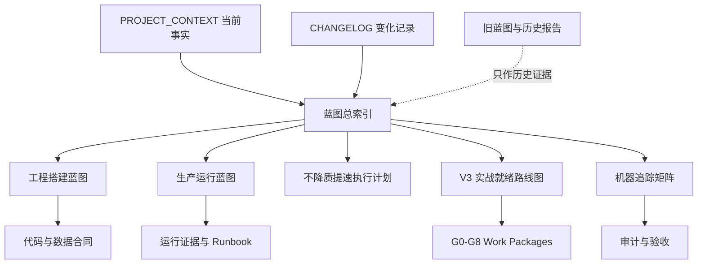

# Market Radar 权威蓝图目录

_2026-07-10；Market Radar 架构、工程建设、生产运行和实战准入的统一文档入口。_

---

## 1. 当前结论

```text
当前等级：R1 - 生产研究平台
工程状态：可运行但不完整
实战状态：不能支撑实战
自动交易：永久禁止
```

当前 runtime health 的一次 ready 点样本不能证明 HTTPS、release evidence、扫描提前性、策略有效性、Shadow outcome、恢复能力或 R4 readiness 已经通过。

## 2. 三层蓝图体系



## 3. 文档职责

| 文档 | 回答的问题 | 不回答的问题 |
| --- | --- | --- |
| [工程搭建蓝图](./MARKET_RADAR_ENGINEERING_BUILD_BLUEPRINT_V1.md) | 系统应该怎样搭建、合同和模块怎样分层、怎样测试发布 | 当前生产是否健康 |
| [生产运行蓝图](./MARKET_RADAR_PRODUCTION_RUNTIME_BLUEPRINT_V1.md) | 系统怎样启动、稳态运行、降级、告警、恢复和暂停能力 | 新功能具体代码怎样实现 |
| [不降质提速执行计划](./MARKET_RADAR_ACCELERATED_DELIVERY_PLAN_V1.md) | 怎样用双车道、WIP 和证据窗口重叠缩短关键路径 | 不改变 Gate、审批或验收阈值 |
| [V3 路线图](../superpowers/plans/2026-07-10-market-radar-practical-readiness-master-plan-v3.md) | 当前差距按什么顺序修、每个 Gate 如何验收 | 单次事故具体 runbook |
| [机器追踪矩阵](./market-radar-blueprint-traceability.v1.json) | 核心链路如何映射到 Gate、代码和运行检查 | 人类解释和设计理由 |
| [本轮交付报告](./MARKET_RADAR_BLUEPRINT_V1_DELIVERY_REPORT.md) | 本轮范围、验证、失败项和部署边界 | 长期架构规则 |
| [蓝图兼容入口](../chuan-market-radar-blueprint.md) | 快速索引和历史详细事实 | 新版目标架构的最终权威解释 |
| [项目上下文](../../PROJECT_CONTEXT_FOR_CHATGPT.md) | 当前状态、风险、最近事件和下一任务 | 长期目标合同 |
| [变更日志](../../CHANGELOG_FOR_CHATGPT.md) | 每轮改变了什么、如何验证、是否部署 | 未来目标设计 |

## 4. 权威顺序

同一问题出现冲突时：

1. 当前生产只读事实和 release 对齐的 current evidence。
2. 工程搭建蓝图或生产运行蓝图中对应的权威合同。
3. V3 路线图和机器追踪矩阵。
4. 当前项目上下文和最近变更日志。
5. 旧蓝图、专项报告和 Git history。

使用这一顺序不表示生产点样本可以改变工程红线。自动下单、future leak、前端造事实和 RR 放宽仍永久禁止。

## 5. 阅读路径

### 5.1 新工程任务

1. 读 `PROJECT_CONTEXT_FOR_CHATGPT.md` 当前事实。
2. 在工程搭建蓝图定位目标领域合同和模块所有权。
3. 在提速执行计划确认 Lane、WIP、并行边界和不可压缩证据。
4. 在 V3 找到对应 G0-G8 Work Package。
5. 在运行蓝图确认部署、降级、SLO 和回滚影响。
6. 查询机器追踪矩阵确定代码路径和证据。
7. 创建独立任务书后才能实施。

### 5.2 生产故障

1. 读取当前 `/api/health`、release identity 和服务状态。
2. 在运行蓝图的降级矩阵中确定允许继续和必须暂停的能力。
3. 执行对应 RB-01 至 RB-12。
4. 验证 runtime、freshness、capability、business gate 和 evidence。
5. 更新 incident、known issues、context 和 changelog。

### 5.3 架构审计

1. 从机器追踪矩阵选择 core-chain stage 或 Gate。
2. 比较 blueprint target、当前代码路径和生产行为。
3. 检查是否存在越层、平行事实源、future leak 或 stale-as-live。
4. 只以当前证据给出 PASS/PARTIAL/FAIL。

### 5.4 R4 准入

1. G0-G7 顺序通过。
2. 一票否决全部 false。
3. readiness 总分 `>=85/100` 且各项最低分达标。
4. 60 天 Shadow、30 天 paper workflow、两个 frozen holdout 和 restore/security/SLO 证据有效。
5. 外部审计和用户批准。

## 6. 状态词典

| 状态 | 用途 |
| --- | --- |
| `ready` | 当前合同所需条件全部满足 |
| `partial` | 部分可用，缺失与影响已明确 |
| `stale` | 有值但超过时效，不能声称 live |
| `unavailable` | 当前无可用事实 |
| `rate_limited` | 数据源限速，等待 cooldown |
| `plan_limited` | 套餐或端点不支持 |
| `auth_error` | 鉴权失败，与市场机会无关 |
| `transport_error` | 网络或上游传输失败 |
| `waiting` | 条件尚未出现，保持观察 |
| `blocked` | 风险、结构或数据门禁阻断 |
| `trade_plan_ready` | 后端完整策略与 Risk Gate 通过 |

状态不得在不同页面重新发明；中文标签必须保留原状态的业务含义。

## 7. 当前 P0

截至 2026-07-10 当前点样本和代码审计：

- 公网入口仍为明文 HTTP，浏览器标记不安全。
- 前端存在合成 direction/freshness/age/source/score 等事实的代码路径。
- unknown/null 存在被映射为 0/long/timeout 的风险。
- 页面存在重复且互相冲突的 scan proof。
- production release/evidence 与 commit/image/content 尚无单一正本闭环。

这些问题全部属于 G0。G0 未通过时，不得把策略增强、视觉升级或新数据源当成实战进度。

## 8. 变更控制

### 8.1 修改蓝图

蓝图变化必须包含：

- 变化原因和用户影响。
- 当前证据和目标证据。
- 影响的 core-chain stage、Gate、代码路径和运行检查。
- 是否改变安全、状态语义、RR、readiness 或数据保留。
- ADR/RFC 和批准记录。
- 机器追踪矩阵同步更新。

### 8.2 版本策略

- 文字澄清和路径更新：同一 major 版本内更新。
- 合同字段、层级职责或运行状态机变化：minor 版本。
- 核心使命、自动化边界或 R4 定义变化：major 版本，必须用户批准。
- 历史版本保留 Git history，不在当前文档堆叠施工流水账。

### 8.3 禁止的文档行为

- 用 TARGET 覆盖 CURRENT。
- 用历史 PASS 覆盖当前 FAIL/PARTIAL。
- 同一事实在多个文档维护不同值。
- 创建没有代码消费者、测试或 owner 的“标准库”。
- 把临时事故编号继续作为长期架构阶段。
- 在文档中保存真实 secret、cookie、token、连接串或业务原始行。

## 9. 每轮交付入口

每个后续 Work Package 必须更新：

1. `PROJECT_CONTEXT_FOR_CHATGPT.md`，如果项目事实改变。
2. `CHANGELOG_FOR_CHATGPT.md`，记录本轮目标、范围、验证和部署。
3. `market-radar-blueprint-traceability.v1.json`，如果合同、路径、Gate 或运行检查改变。
4. 对应工程/运行蓝图，如果权威设计发生变化。
5. 最近一轮中文交付报告。

只修改实现但不更新权威事实，会使任务最多标记为 `可运行但不完整`。
