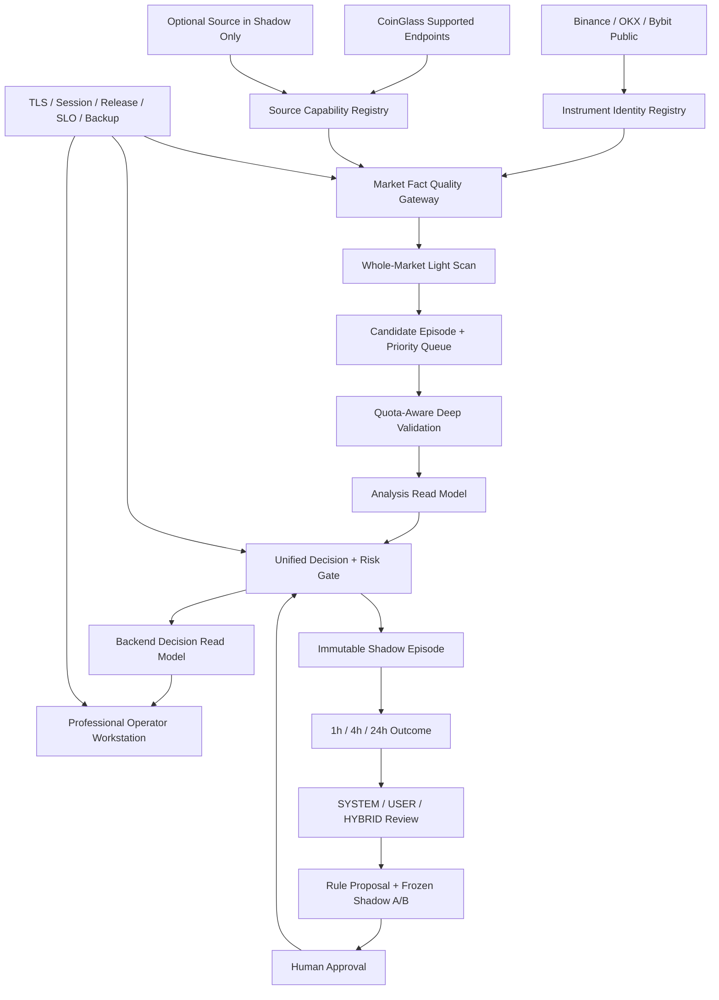

# Market Radar Practical Readiness Master Plan v3

> **For agentic workers:** REQUIRED SUB-SKILL: Use superpowers:subagent-driven-development (recommended) or superpowers:executing-plans to implement this plan task-by-task. Every gate must be split into an independently reviewed execution plan before code changes begin.

**Goal:** 基于 2026-07-10 当前代码、当前生产页面、当前 `/api/health`、两份历史建设方案和全系统审计，将 Market Radar 从“可运行的生产研究平台”建设成“经证据验证的受控人工 CEX 合约实战决策辅助工作台”。

**Architecture:** 以 `MarketFact -> Discovery -> CandidateEpisode -> DeepValidation -> Analysis -> Strategy -> ShadowOutcome -> Review -> HumanApproval` 为唯一主链。先修复事实、安全、发布和生命周期，再改数据、扫描和策略；任何新源、新模式和新权重必须先进 research-only / Shadow，不得直接污染 production。

**Tech Stack:** Next.js 16、TypeScript、Node.js、Postgres、Redis、Docker Compose、Caddy、Binance/OKX/Bybit public futures data、CoinGlass Hobbyist、GitHub Actions、Playwright、腾讯云 4C/8G/120GB。

**Status:** `PROPOSED / 待用户与外部审计批准`。这是建设方案，不是代码、数据库、策略或生产变更授权。

**Supersedes:** `2026-07-10-market-radar-practical-readiness-master-plan.md` 与两份用户提供的历史 Master Plan，但保留它们作为审计来源。

---

## 1. 全局硬规则

1. 不自动下单，不接交易所下单 API。
2. 不自动修改 production ranking、READY、RR 或策略权重。
3. 不让 Shadow / Review / Daily Movers / MFE / MAE / hit / outcome 进入实时排序或当时决策。
4. SCAN 只发现，ANALYSIS 只判断结构与反证，STRATEGY 才能评估交易计划。
5. 结构 RR 最低 `3:1`，不得为了增加信号数量降低。
6. 止损、目标、触发、失效条件都必须有后端结构来源。
7. 前端只格式化 backend read model，不生成方向、分数、新鲜度、证据、RR 或计划。
8. null 不得变成 0，stale 不得变成 live，partial 不得变成 pass。
9. CoinGlass 失败不等于“市场无机会”；套餐受限、429、auth_error、transport_error 必须分开。
10. 不提交 `.env`、secret、cookie、token、密码、数据库连接串或私钥。
11. migration、restore、rollback、清 Redis/Postgres/volume 需要单独用户授权。
12. `backtest:formal` 只在明确的能力验收轮使用，不得当普通测试乱跑。
13. 任何生产变更必须有 allowlist、备份、回滚点、生产 smoke 和 current evidence。
14. 新能力只有 `research-only` 或 `production-grade complete slice` 两种进入方式，不将半成品接入主链。
15. 系统可以空榜、WAIT、BLOCKED 或显示无可交易计划，不为好看补位。

## 2. 证据层级与时间边界

本计划对“当前”的定义按下列优先级：

1. **生产当前点样本**：2026-07-10 通过 Microsoft Edge 只读访问生产页面与 `/api/health`。
2. **当前工作树**：包含未提交修改，只证明本地存在，不证明已进 GitHub 或生产。
3. **最新正式审计**：2026-07-10 `53/100` 全系统审计。
4. **历史计划与报告**：用于理解意图和事故，不得覆盖当前事实。

机器可读的 46 项状态清洗矩阵：

`docs/superpowers/plans/2026-07-10-market-radar-v3-current-state-matrix.json`

### 2.1 当前生产点样本

| 范围 | 当前证据 | 结论 |
| --- | --- | --- |
| Health | `/api/health.generatedAt=2026-07-09T21:56:21.405Z`，`level=ready` | 运行当下可用，不等于发布 evidence pass |
| 传输安全 | `http://43.161.202.227`，浏览器标记“不安全” | P0；不满足专业生产网站基线 |
| Workers | scanner / websocket-light / coinglass / signal / dynamic / macro 六个正常 | 历史 worker all-down 已不是当前故障 |
| 公开市场 | accepted=1316 / observed=3113，WebSocket universe=1273 | 广覆盖真实存在 |
| 身份一致性 | `TAG/1000TAG`、`SKYAI/SKYAI1` 并存 | instrument identity 尚未收口 |
| 轻扫 | eligible=593，页面同时出现 593 已扫和 24/593 本轮覆盖 | 分母和本轮/当日语义冲突 |
| 深扫 | coverage=7.4%，rotation=1410m，CoinGlass clean/raw=44/695 | 可运行，但高优候选时效和质量语义不达标 |
| CoinGlass | 2188/3000 当日调用，30/min，当前 ready | 旧 auth_error 已解决；配额仍是架构约束 |
| 候选 | 59 条，READY=0，证据观察=1，深度确认=8，轻扫=28，阻断=22 | 只能研究/观察 |
| 候选事实 | 多条显示“实时”但 OFI/OI/Funding/Price 为 n/a，列表出现 `$0.000` | P0 假 0 / 假完整度 |
| 扫描证明 | 两个同名卡片，一个有真实数据，一个全 0 | P0 跨组件冲突 |
| Review | total=120，closed=36，evidence=81，pending=84，MFE/MAE 有效样本=0 | 记录量不等于可用 outcome |
| 生命周期 | 大量项目统一显示“多 / 超时未达” | P0 状态机与 nullable metric 映射错误 |
| Daily Movers | 7 个快照，pre-move=0 | 管道部分落地，提前发现价值未证明 |
| Shadow | 生产页显示 approved=0 / evaluated=0；本地基线 recorded=0 | 不能启动 Shadow v2 |
| 进化准备度 | 7/100，activation_disabled | 自学习只能生成 proposal |
| 系统中心 | 展示 6 workers/Redis/Postgres/CoinGlass，不显示 Shadow/Caddy/HTTPS/release/evidence/backup/disk | 运维可见性不完整 |

### 2.2 当前工作树边界

- branch: `codex/phase5-1-h-1-r-checkpoint-outcome-production-validation`
- HEAD: `8518a14dcf03cd70e5470c3c9fd81e6e23a5dcb2`
- 存在 29 个已修改文件与多个未跟踪文件。
- `runner-runtime.ts`、Shadow storage、CoinGlass 分类增强等本地存在，但未提交状态不等于生产已落地。
- 本地 production evidence 文件时间和 status 混杂，不可作为当前正式 PASS。

## 3. 对两份历史方案的最终调整建议

### 3.1 已完成或过时，不再作为当前主阶段

- CoinGlass 旧 key / auth regression：归档为已解决事故，只保留回归。
- scanner/worker all-down：不是当前故障。
- 全系统 Module/Skill 大盘点：已由 53/100 审计覆盖，不再生成一批重复盘点文档。
- Codex / ChatGPT 交付格式：AGENTS、context、changelog 已建立，只维护。
- 前端页面“从零建设”：六个核心页已存在，当前任务是事实收口和工作流改造。

### 3.2 必须前移

- HTTPS / 域名 / private session 生产启用证据：前移到 G0 P0。
- “实战雷达”命名：R4 之前改为“研究雷达 / 决策研究”。
- frontend truth / lifecycle / outcome nullable state：前移到 G0 P0。
- GitHub main / server / container / release evidence：前移到 G0。
- backup / restore / SLO / E2E / load / security：在数据和策略增强前完成 G1。

### 3.3 必须合并

- Shadow v1 + Daily Movers + missed opportunity：合成一套命中/漏判双分母证据系统。
- 逻辑标准库 + 反过拟合 + 专业回测：改成 executable contract + holdout gate，不以文档数量验收。
- Shadow v2 + 规则生命周期：只在 v1 真实 outcome 通过后启动。
- 真实复盘 + 用户漏判 + 执行纪律：统一为 SYSTEM / USER / HYBRID 工作流。

### 3.4 必须延期或删除

- Coinalyze 不作为默认 fallback；只能在当前数据瓶颈遥测和 30 天 Shadow A/B 证明边际价值后提议购买。
- 外部 AI 判断不重新接回主链；当前规则反证只做漏洞与不确定性检查。
- 小资金真实交易不是软件开发验收条件；只能在 R4 通过后由用户自主选择。
- screenshot / CSV import 不是核心雷达准入条件；放到安全上传和隐私治理之后。
- 不创建大量没有代码消费者的“标准库文档”。

## 4. 实战等级与硬否决项

| 等级 | 名称 | 允许用途 |
| --- | --- | --- |
| R0 | 不可信 | 只能修复 |
| R1 | 生产研究平台 | 看市场、查问题；当前级别 |
| R2 | Shadow 可验证 | 连续记录当时判断和后续 outcome |
| R3 | 模拟决策辅助 | 纸上交易和决策日志 |
| R4 | 受控人工实战辅助 | 用户可把系统当作一项决策输入，系统仍不下单 |
| R5 | 专业长期工作台 | R4 稳定维持至少 180 天并经历多市场 regime |

### 4.1 R4 一票否决

任一项存在，不得进 R4：

1. 公开网站仍使用明文 HTTP，或 private session 生产启用状态不明。
2. 系统在 R4 前自称“实战雷达”。
3. 存在假 0、假 live、假 direction、假 timeout、假 source 或相互冲突的同名指标。
4. 最新 production evidence 不是 pass，或应用 commit/image digest/content hash 无法对齐。
5. 任何 future MFE/MAE/outcome 进入生产扫描、分析或策略。
6. READY 可绕过结构止损、目标、RR>=3、invalidation 或 Risk Gate。
7. 关键市场数据无法追溯 source / instrument / observedAt / status / quality reason。
8. 没有足够的独立 holdout 和真实 Shadow 样本。
9. 最近 90 天内没有真实 restore drill。
10. 存在未解决的高危鉴权、session、上传、注入、secret、依赖或容器问题。
11. 自动下单、自动调权、自动修改 READY 或未经人工批准自动发布规则。

### 4.2 R4 评分卡

`53/100` 是架构审计分，不是 readiness 分。G0 通过后重新计分：

| 维度 | 权重 | R4 最低 | 必要证据 |
| --- | ---: | ---: | --- |
| 事实与生命周期 | 12 | 12 | 无合成事实、nullable 正确、跨页一致 |
| 生产稳定与安全 | 15 | 13 | HTTPS/session/SLO/release/restore/security |
| 数据质量与时效 | 13 | 11 | fact envelope、identity、freshness、Tier SLA |
| 扫描提前性 | 15 | 12 | holdout、pre-move、TopN、late/noise、miss denominator |
| 分析与策略 | 20 | 16 | analysis/strategy gate、结构计划、net R、no leak |
| 风险控制 | 10 | 9 | RR>=3、stop/target、成本、滑点、个人仓位隔离 |
| Shadow 与复盘 | 10 | 8 | 60 天、样本、outcome、Daily Movers、三模式 |
| UX 与操作性 | 5 | 4 | E2E、性能、可访问性、提醒、运维事实 |
| **总分** | **100** | **85** | 必须同时满足一票否决和每项最低分 |

评分必须由机器可读 evidence evaluator 生成，人工只能复核和批准，不得验收时凑分。

## 5. 目标架构



### 5.1 权威数据对象

```ts
interface MarketFactEnvelope<T> {
  value: T | null;
  sourceId: string;
  canonicalInstrumentId: string;
  venueInstrumentId: string;
  observedAt: string | null;
  receivedAt: string;
  ageMs: number | null;
  status: 'ready' | 'partial' | 'stale' | 'unavailable' | 'rate_limited' | 'plan_limited' | 'auth_error';
  qualityReasons: string[];
}
```

该 Interface 是目标合同，必须在 G2 中与现有 `src/lib/market/types.ts` 和 persistence schema 独立评审。不得根据计划直接 migration。

## 6. G0 - 事实、安全、生命周期与发布收敛

**Priority:** P0
**工程时间:** 2-4 周
**目标:** 先让用户看到的每个状态真实，让访问链路加密，让发布和 evidence 可复现。

### WP-G0.1 Frontend Truth Contract

**Modify:**

- `src/lib/frontend-display-adapters.ts`
- `src/lib/api/frontend-contract.ts`
- `src/components/scan-proof.tsx`
- `src/components/dashboard/radar-control.tsx`
- `src/app/market/market-page-client.tsx`
- `src/components/token/token-dossier.tsx`
- `src/components/ui-information-layers.tsx`
- `src/components/signals/signal-maturity-pool.tsx`

**Test:**

- `src/lib/api/frontend-display-adapters.test.ts`
- `src/lib/api/frontend-contract.test.ts`
- `src/lib/frontend-contract-server.test.ts`

**Acceptance:**

- 删除 leaderboard -> direction / freshness / age / source / score / sentiment / volMult 合成。
- 删除 `$0.000` 表示 unknown price/entry 的路径。
- 只保留一个权威 scan proof，分开 observed/accepted/eligible/current-cycle/deep-scanned 分母。
- 数据 n/a 时不得标记“证据完整”或固定 source。
- R4 之前全站“实战雷达”改为“研究雷达”或明确的当前等级。

### WP-G0.2 Candidate Lifecycle and Outcome Truth

**Modify:**

- `src/lib/journal/journal-entry.ts`
- `src/lib/journal/outcome-tracker.ts`
- `src/lib/journal/outcome-sample-admission.ts`
- `src/lib/journal/review-statistics.ts`
- `src/lib/api/frontend-contract.ts`
- `src/components/review/review-evolution.tsx`

**Test:**

- `src/lib/journal/outcome-tracker.test.ts`
- `src/lib/journal/outcome-sample-admission.test.ts`
- `src/lib/journal/review-statistics.test.ts`
- `src/lib/api/frontend-contract.test.ts`

**State model:**

```text
TRACKING -> TRIGGERED -> TP_FIRST / SL_FIRST / PARTIAL / EXPIRED
         -> NOT_TRIGGERED_EXPIRED
         -> DATA_UNAVAILABLE
         -> PENDING_WITH_ERROR
```

- neutral/unknown 不得变成 long。
- null MFE/MAE 不得变成 0。
- 只有真实 expired 才显示超时；tracking/error/data unavailable 分开。
- closed、evidence-grade、pending 必须是可解释且不重叠的分母。

### WP-G0.3 HTTPS and Private Session Production Gate

**Modify:**

- `deploy/caddy/Caddyfile`
- `docker-compose.yml`
- `middleware.ts`
- `src/lib/auth/private-session.ts`
- `src/app/api/auth/session/route.ts`
- `scripts/production/observability.mjs`

**Test:**

- `src/lib/auth/private-session.test.ts`
- `scripts/production/observability.test.mjs`

**External condition:**

- 如用户尚无域名，需要购买一个低成本域名并将 DNS A/AAAA 指向腾讯云。Caddy 可使用免费公共证书和自动续期。
- 如不愿公开域名，则必须改为只有受信私网才能访问；明文公网 HTTP 不能进 R2-R4。

**Acceptance:**

- 有效公共 TLS certificate，HTTP -> HTTPS 永久重定向，无 mixed content。
- private mode 生产启用时，未认证页/API 正确拒绝。
- session cookie 使用 Secure / HttpOnly / SameSite，logout 失效，session response `no-store`。
- login 有节流、安全日志和 secret rotation 流程，不记录密码/token。
- HTTPS 连续 7 天稳定后再启用 HSTS，避免配置未验证时锁死。

### WP-G0.4 Release and Evidence Single Source

**Modify:**

- `.github/workflows/production.yml`
- `scripts/deploy/auto-deploy.sh`
- `scripts/deploy/rollback.sh`
- `deploy/scripts/verify-git-sync.sh`
- `scripts/production/observability.mjs`
- `src/lib/api/system-health.ts`

**Add:**

- `docs/deployment/RELEASE_STANDARD.md`
- `docs/deployment/RELEASE_RECORD_SCHEMA.json`

**Acceptance:**

- GitHub main 是长期正本；生产服务器不现场改代码。
- 每次发布记录 releaseId / commit / image digest / content hash / migration status / evidence / rollback target。
- runtime health 与 release validation 分开，不互相覆盖。
- evidence 带 generatedAt / expiresAt / commit / source，旧文件不得证明当前 PASS。
- dirty server worktree 或 content mismatch 必须阻断发布通过。

### WP-G0.5 Known Incident Registry

**Add:**

- `docs/operations/KNOWN_ISSUES_REGISTRY.md`
- `docs/operations/known-issues-registry.json`
- `scripts/verify/known-issues-check.mjs`

把已发生的 key propagation、auth/rate-limit 误分类、worker stale、scan zero、false running、old evidence、dirty deploy、fake zero、duplicate scan proof、outcome timeout mapping 全部变成机器可执行回归。

### G0 出口门禁

- [ ] 所有已知 P0 事实错误有失败基线和红-绿回归。
- [ ] 生产仅 HTTPS 或仅受信私网访问，private session 证据通过。
- [ ] 当前 runtime ready + current release evidence pass + Git/image/content 对齐。
- [ ] 页面不再自称 R4/实战级。
- [ ] 无假 0、假 live、假 timeout、假 direction、重复扫描证明。

**未通过:** 系统保持 R1，不做策略增强或真实样本声明。

## 7. G1 - 生产可靠性、恢复、安全与测试门禁

**Priority:** P0/P1
**工程时间:** 3-5 周
**目标:** 证明系统可持续运行、可监控、可恢复、可安全发布。

### WP-G1.1 SLO and Runtime Evidence

**Add/Modify:**

- Add `src/lib/runtime/service-level-objectives.ts`
- Add `src/lib/runtime/runtime-evidence.ts`
- Modify `src/lib/api/system-health.ts`
- Modify `src/lib/runtime/api-observability.ts`
- Modify `src/lib/runtime/worker-heartbeat.ts`
- Modify `src/components/system/system-status.tsx`

**Initial SLO:**

- 30 天核心公开 API availability >= 99.5%；G1 先用 7 天初始门禁。
- light scan successful cycles >= 99%，cache hit 不得当 scan success。
- required worker heartbeat fresh ratio >= 99%。
- `/api/health` P95 <= 1s，核心 contract API P95 <= 2s，关键首屏数据 P95 <= 3s。
- false ready / false fresh / false evidence pass = 0。
- CPU 15m P95 < 70%，memory P95 < 80%，disk < 70%。

### WP-G1.2 Backup, Offsite Retention and Restore Drill

**Modify/Add:**

- Modify `deploy/scripts/backup-postgres.sh`
- Modify `deploy/scripts/restore-postgres.sh`
- Modify `deploy/scripts/production-drill.sh`
- Add `scripts/production/backup-verify.mjs`
- Add `docs/operations/BACKUP_STANDARD.md`
- Add `docs/operations/RESTORE_PLAYBOOK.md`
- Add `docs/operations/DISASTER_RECOVERY_PLAYBOOK.md`

**Acceptance:**

- Postgres 每日加密备份，30 天保留，至少一份不在主服务器。
- Shadow outcome / release record / evidence / user journal 有对应保留和隐私策略。
- 每 90 天隔离环境真实 restore drill。
- 初始 RPO <= 24h，RTO <= 2h。
- backup 失败不能静默，/system 显示 last success / age / verify status。

### WP-G1.3 ASVS Security Baseline

**Review/Modify:**

- `middleware.ts`
- `src/lib/auth/private-session.ts`
- `src/app/api/auth/session/route.ts`
- `src/app/api/admin/persistence/migrate/route.ts`
- `src/app/api/admin/shadow-live/run/route.ts`
- `src/app/api/admin/strategy-weights/executions/record/route.ts`
- `src/app/api/journal/route.ts`
- `scripts/verify/security-check.sh`

**Target:** OWASP ASVS 5.0 Level 2 作为安全验证基线，并将 requirement id 记入安全证据矩阵。

- 管理 API default deny，防重放，记录安全审计但不记录 secret。
- session fixation / expiry / logout / rate limit / CSRF / cache-control 有定向测试。
- 依赖、容器镜像、security headers、数据库权限和 Docker socket 风险进门禁。
- 上传功能实施前必须 allowlist 类型/大小、重命名、非 webroot 存储、授权下载和恶意文件检查。

### WP-G1.4 Browser E2E, Accessibility, Visual and Load Gates

**Add:**

- `playwright.config.ts`
- `tests/e2e/auth.spec.ts`
- `tests/e2e/dashboard-truth.spec.ts`
- `tests/e2e/signal-token-review.spec.ts`
- `tests/e2e/system-status.spec.ts`
- `tests/e2e/accessibility.spec.ts`
- `tests/load/core-api-smoke.mjs`

**Modify:**

- `package.json`
- `.github/workflows/production.yml`

**Acceptance:**

- Chromium + Microsoft Edge desktop，mobile/tablet emulation 覆盖关键工作流。
- screenshot regression 检查重叠、截断、重复卡片、假空态。
- axe 自动检查 + 键盘/屏幕阅读器人工检查。
- 5 并发 30 分钟 + 15 并发短峰，无连续 5xx、无 worker starvation。
- Redis/CoinGlass/Postgres/worker 故障注入在隔离环境证明降级语义正确。

### G1 出口门禁

- [ ] 7 天初始 SLO 达标，无假健康。
- [ ] 异地备份、保留、restore drill、RPO/RTO 有证据。
- [ ] ASVS 高风险项无未关闭 P0/P1。
- [ ] E2E / accessibility / visual / load 已进 CI/release gate。

## 8. G2 - 数据质量、身份、时效与微观结构

**Priority:** P1
**工程时间:** 4-6 周
**目标:** 让每个数值都可追溯，在 Hobbyist 配额下先服务高价值候选，不盲目增加付费源。

### WP-G2.1 Market Fact Quality Gateway

**Modify/Add:**

- Modify `src/lib/market/types.ts`
- Modify `src/lib/market/data-source-capabilities.ts`
- Modify `src/lib/market/provider-registry.ts`
- Add `src/lib/market/quality/market-fact.ts`
- Add `src/lib/market/quality/quality-gateway.ts`
- Add `src/lib/market/quality/quality-policy.ts`

价格、成交量、OI、Funding、清算、多空比、taker、orderbook 的 value/null、source、time、status、quality reasons 必须一致。

### WP-G2.2 Instrument Identity Registry

**Modify/Add:**

- Modify `src/lib/market/universe-registry.ts`
- Modify `src/lib/market/instrument-pool.ts`
- Modify `src/lib/market/providers/public-futures-universe-discovery.ts`
- Add `src/lib/market/instrument-identity.ts`
- Add `src/lib/market/instrument-aliases.ts`

使用 `canonical asset + venue + contract type + settlement + contract size` 识别 instrument，别名无法证明时显示 unresolved，不静默合并。

### WP-G2.3 Quota-Aware Deep Validation

**Modify:**

- `src/lib/market/scan-batch-queue.ts`
- `src/lib/market/scan-quota.ts`
- `src/lib/market/universe-priority-hints.ts`
- `src/lib/market/scan-coordinator.ts`
- `src/lib/market/scan-runtime.ts`
- `src/lib/market/providers/coinglass-client.ts`
- `src/lib/market/providers/coinglass-provider.ts`

**Tiers:**

- Tier A: 结构临界/前排异动，deep validation P95 <= 5m。
- Tier B: 次高优先，P95 <= 30m。
- Tier C: 低优轮转，配额不足显示 waiting，不用旧深扫补位。

不用 rawRows/cleanRows 单一比率判断所有 endpoint；按 asset + endpoint 预期分母计算完整度。

### WP-G2.4 Candidate-Only Microstructure

**Modify/Add:**

- Modify `src/lib/market/ws-light-scan.ts`
- Modify `src/lib/market/live-events.ts`
- Modify `src/lib/market/providers/public-light-scan.ts`
- Add `src/lib/market/microstructure/microstructure-snapshot.ts`
- Add `src/lib/market/microstructure/microstructure-quality.ts`
- Add `src/lib/risk/execution-cost-model.ts`

**Scope:**

- 仅对 Tier A/B 使用 public WS 计算 spread、固定 bps depth、imbalance、taker delta、large trade proxy、slippage estimate。
- proxy 永远标记 proxy，不写成官方 CVD、吸筹或主力意图。
- WebSocket gap/reconnect/stale 降低 quality，不使用最后一帧冒充实时。
- microstructure 只进 analysis/execution risk，不直接 READY。

### WP-G2.5 Source Compliance and Event Context

**Add:**

- `docs/data/EXTERNAL_SOURCE_COMPLIANCE.md`
- `docs/data/source-capability-registry.json`

只允许官方/public API、WebSocket、RSS、公告和授权使用的低频资源。新上/下架、杠杆/保证金规则、维护、指数异常只输出 eventContext/riskWarning，不生成方向。

### G2 出口门禁

- [ ] 关键 fact envelope 覆盖 100%，fake zero/stale-as-live = 0。
- [ ] observed/accepted/eligible/current cycle/deep validated 分母统一。
- [ ] public eligible universe 轻扫 coverage >=95%，P95 cycle <=120s。
- [ ] Tier A/B deep SLA 达标；CoinGlass 异常不导致 public scan 归零。
- [ ] Tier A microstructure coverage >=90%、P95 age <=5s，断线语义正确。
- [ ] instrument fixture 无静默别名冲突。

## 9. G3 - 候选生命周期、强弱排序与提前发现

**Priority:** P1
**工程时间:** 5-8 周
**目标:** 让真正有价值的启动前/初期机会进入前排，而不是只展示已经大涨大跌的榜单。

### WP-G3.1 Canonical Candidate Episode

**Modify/Add:**

- Modify `src/lib/market/scan-events.ts`
- Modify `src/lib/market/signal-maturity.ts`
- Modify `src/lib/journal/shadow-live-signal-tracker.ts`
- Add `src/lib/market/candidate-episode.ts`

每个 episode 有 firstSeen / lastSeen / observation price / direction state / trigger history / expiry / invalidation / retrigger relation。同一币过期后重新触发建新 episode，不篡改旧记录。

### WP-G3.2 Production Score Purity and Relative Strength

**Modify:**

- `src/lib/market/radar-snapshot.ts`
- `src/lib/market/altcoin-opportunities.ts`
- `src/lib/market/universe-priority-hints.ts`
- `src/lib/analysis/anomaly-engine.ts`
- `src/lib/market-regime/market-regime.ts`

- RS 15m/1h/4h/24h、相对 BTC/ETH、压缩、量能、breakout/retest、late/noise 只排候选。
- 做多选强、做空选弱使用对称合同，neutral 不得变 long。
- outcome/MFE/MAE/hit/qualityHit 的生产读路径为 0。

### WP-G3.3 Research-Only Pre-Move Hypotheses

保留历史方案中的压缩后放量、OI 温和增加、Funding 未过热、相对抗跌、主动买入增强、卖压吸收、假跌破收回、反抽失败等假设，但每个假设必须：

- 有时间点可观测输入。
- 有反例和不适用 regime。
- 先进 Shadow A/B，不直接进 production score。
- 只有独立 holdout 显示稳定边际价值时才进候选排序。

### WP-G3.4 Daily Movers Counterfactual Set

**Modify:**

- `src/lib/market/daily-movers.ts`
- `src/lib/market/daily-mover-ingest.ts`
- `src/lib/market/daily-mover-correlations.ts`
- `src/lib/review/missed-opportunity/review.ts`

同时统计系统命中、漏判、误报和“类似特征但没有涨跌”对照组，防止幸存者偏差。

### WP-G3.5 Frozen Holdout Governance

**Modify/Add:**

- Modify `src/lib/backtest/professional-replay.ts`
- Modify `src/lib/backtest/professional-audit.ts`
- Modify `src/lib/backtest/professional-audit-round.ts`
- Add `docs/backtest-v2/HOLDOUT_GOVERNANCE.md`

至少 300 个可评估事件、三类 market regime、连续两个冻结 holdout。更改阈值后不得继续用同一 holdout 调参。

### G3 出口门禁

- [ ] professional scan score >=70，连续两个 holdout 不退化。
- [ ] pre-move capture >=40%（审计基线 23.53%）。
- [ ] actionable TopN capture >=45%（审计基线 26.42%）。
- [ ] Top20 late/noise <=30%。
- [ ] Daily Movers 因管道失败漏记 <=5%。
- [ ] 不设最低候选数量，不强制满榜。

## 10. G4 - 分析、策略、关键位与风险有效性

**Priority:** P1
**工程时间:** 6-10 周
**目标:** 收敛唯一决策路径，让 WAIT 可验证，让 READY 稀缺但真实。

### WP-G4.1 Authoritative Decision Path

**Review/Modify:**

- `src/lib/analysis/strategy-planner.ts`
- `src/lib/analysis/v2/strategy/decision-engine.ts`
- `src/lib/analysis/v2/strategy/market-state-machine.ts`
- `src/lib/analysis/v3/market-reading-engine.ts`
- `src/lib/analysis/v3/readiness.ts`
- `src/lib/analysis/v3/trade-plan.ts`
- `src/lib/decision/unified-decision-engine.ts`
- `src/lib/market/signal-backend-dossier.ts`

**Target:** v3 analysis + unified decision 是唯一决定路径；v2 仅能在显式 compatibility Adapter 后存续；旧 planner 不得绕过 unified decision 供前端使用。

### WP-G4.2 Structural Levels and WAIT State Machine

**Modify:**

- `src/lib/analysis/v3/key-level-engine.ts`
- `src/lib/analysis/v3/forward-level-map.ts`
- `src/lib/analysis/v3/location-rr.ts`
- `src/lib/analysis/v3/trade-plan.ts`
- `src/lib/analysis/v2/strategy/market-state-machine.ts`

- stop 来自结构失效，target 来自有效支撑/压力/流动性位置。
- WAIT 有 trigger / confirmation window / expiry / invalidation / whyNotNow。
- not-triggered / TP-first / SL-first / expired / data-unavailable 分开。
- 非 READY 不绘制可执行交易线。

### WP-G4.3 Costs, Slippage and Personal Risk Lens

**Modify/Add:**

- Modify `src/lib/risk/account-risk-simulator.ts`
- Modify `src/lib/risk/personal-position-lens.ts`
- Modify `src/lib/analysis/v2/strategy/risk-gate.ts`
- Add `src/lib/risk/execution-cost-model.ts`

- fee/slippage/funding 按可追溯实际配置计算，不永久硬编。
- structural RR 和 net R 分开展示。
- BTC/ETH 150x、山寨币交易所最大杠杆、cross-margin、0.3% 保证金只是计划之后的个人风险视图。
- 展示 liquidation distance、成本敏感度和整户风险，不改 READY。

### WP-G4.4 Executable Standards and Strategy Holdout

不新建一批孤立文档来验收“标准库”。每个标准必须由类型、fixture、golden case、反例和 professional audit 共同表达。

**Modify:**

- `src/lib/backtest/golden-case-fixtures.ts`
- `src/lib/backtest/golden-case-runner.ts`
- `src/lib/backtest/professional-audit.ts`
- `src/lib/backtest/professional-audit-round.ts`
- `src/lib/backtest/professional-audit-symbol-plan.ts`

### G4 出口门禁

- [ ] analysis score >=70，strategy score >=65，连续两个 holdout。
- [ ] 至少 60 个真实触发 WAIT/READY 样本，覆盖至少三类 regime；不足则继续等待，不强造 READY。
- [ ] 100% READY 有 backend trigger/entry/stop/target/RR>=3/invalidation/cost。
- [ ] 扣除 fee/slippage/funding 后 mean R 的 95% bootstrap 置信下界 >0。
- [ ] false READY / future leak / frontend plan = 0。

## 11. G5 - Shadow 真实 Outcome、Daily Movers 与反过拟合

**Priority:** P1/P2
**工程时间:** 4-6 周
**真实证据窗口:** 至少 60 天，且取样本和时间门槛中更晚者。

### WP-G5.1 Canonical Shadow Store and Run Registry

**Modify:**

- `src/lib/shadow/storage.ts`
- `src/lib/shadow/runner-runtime.ts`
- `src/lib/shadow/enrichment.ts`
- `src/scripts/shadow/shadow-tracking.ts`
- `src/lib/persistence/persistence-contract.ts`
- `src/lib/persistence/persistence-store.ts`
- `src/lib/persistence/app-repository.ts`

Postgres 是 live run / episode / checkpoint / outcome 权威源，reports 只是导出。当前本地基线和生产运行不得继续分裂为两个“latest”。

### WP-G5.2 Observation and Outcome Integrity

- observation 包含 price/source/source timestamp/release/decision hash。
- 1h/4h/24h checkpoint 使用明确时间窗口和真实历史价格。
- idempotent write，duplicate=0。
- missing price 进 pending_with_error/data_unavailable，不伪造 MFE/MAE。
- runner running 必须同时满足 process/heartbeat/lock/run registry。

### WP-G5.3 Rule Proposal and Frozen Shadow A/B

**Modify/Add:**

- Modify `src/lib/review/research-only-boundary.ts`
- Modify `src/lib/journal/strategy-weight-shadow.ts`
- Modify `src/lib/journal/strategy-weight-shadow-evaluation.ts`
- Add `docs/governance/RULE_PROPOSAL_STANDARD.md`
- Add `docs/governance/SHADOW_AB_STANDARD.md`
- Add `docs/governance/RULE_LIFECYCLE.md`

```text
Proposal -> Research -> Frozen Shadow A/B -> Review -> User Approval
-> Production Candidate -> Release Gate -> Monitoring -> Retirement
```

Shadow A/B 不改 production score/READY/Risk Gate。

### G5 出口门禁

- [ ] 连续运行 >=60 天。
- [ ] evaluable episodes >=500，triggered WAIT/READY >=60，覆盖 >=3 regimes。
- [ ] due checkpoint completion >=99%，missing observation price <1%，duplicate=0，unclassified error <0.5%。
- [ ] Daily Movers scheduled coverage >=95%，命中/漏判/对照组有统一分母。
- [ ] no future leak / no production mutation。
- [ ] 不达样本门槛停在 R2，不降标准。

## 12. G6 - 专业工作台、复盘、提醒与操作性

**Priority:** P2
**工程时间:** 4-6 周
**目标:** 在后端事实稳定后，把现有页面收敛成快速扫描、比较、钻取、复盘和运维的工作台。

### WP-G6.1 Page Responsibility Convergence

**Modify:**

- `src/app/dashboard/page.tsx`
- `src/app/signals/page.tsx`
- `src/app/token/[id]/page.tsx`
- `src/app/market/market-page-client.tsx`
- `src/app/review/page.tsx`
- `src/app/system/page.tsx`
- `src/components/dashboard/radar-control.tsx`
- `src/components/signals/signal-maturity-pool.tsx`
- `src/components/token/token-dossier.tsx`
- `src/components/review/review-evolution.tsx`
- `src/components/system/system-status.tsx`

- Dashboard: 市场环境、扫描覆盖、重要候选、当前风险。
- Signals: 按 maturity/direction/freshness/blocker 比较，不混排行榜。
- Token: 结构、证据、冲突、缺失、决策、风险、episode。
- Market: BTC/ETH/regime/广度/数据质量。
- Review: SYSTEM/USER/HYBRID、R、归因、proposal。
- System: HTTPS/session/release/commit/image/evidence/Caddy/Shadow/backup/restore/disk/memory/rollback。

### WP-G6.2 SYSTEM / USER / HYBRID Review

**Modify:**

- `src/lib/journal/manual-trade-journal.ts`
- `src/lib/journal/journal-entry.ts`
- `src/lib/journal/review-statistics.ts`
- `src/app/api/journal/route.ts`
- `src/lib/api/frontend-contract.ts`
- `src/components/review/review-evolution.tsx`

- SYSTEM 只评估系统判断。
- USER 只评估用户 entry/stop/target/exit/纪律/情绪。
- HYBRID 用 stable correlation id 组合，不覆盖原始记录。
- R 只按真实 entry/stop/exit 计算，缺少则 unavailable。

### WP-G6.3 In-App State Transition Alerts

**Current fact:** `src/lib/alerts/alert-policy.ts` 和大量测试已存在，但 production consumer / persistence / alert center 尚未落地。

**Add/Modify:**

- Modify `src/lib/alerts/alert-policy.ts`
- Modify `src/lib/market/live-events.ts`
- Add `src/lib/alerts/alert-store.ts`
- Add `src/app/api/frontend/alerts/route.ts`
- Add `src/components/alerts/alert-center.tsx`

只提醒 backend 状态转换：deep validation complete、WAIT triggered、READY、invalidation、data/system degraded。quick scan/leaderboard 不得包装成交易提醒。

### WP-G6.4 Secure Screenshots and CSV as Optional Extensions

只在 private review 工作流稳定且通过 OWASP 上传门禁后，才实施 screenshot 和 CSV；它们不是 R4 核心前置。

### G6 出口门禁

- [ ] 关键 desktop/tablet/mobile 工作流 E2E 通过，无重叠/截断/冲突。
- [ ] 状态不仅靠颜色，键盘/可访问性通过。
- [ ] 站内提醒 P95 <=5s，duplicate=0，全部可追溯 backend event/release。
- [ ] 私人 journal 不出现在公开 contract/log/evidence。
- [ ] System 页可足够支持故障判断、发布确认和恢复决策。

## 13. G7 - R3 模拟决策与 R4 最终实战准入

**Priority:** P2
**证据时间:** 至少 30 天模拟决策
**目标:** 用完整人工工作流证明系统可以成为决策输入，而不是直接用真实资金补证据。

### WP-G7.1 Paper Decision Workflow

- 用户可冻结当时 decision snapshot / data quality / levels / release / reason。
- 记录 would-take / would-skip / reason / plan adherence，不下单。
- 至少 30 天、30 个完整模拟工作流。
- “无交易”是合法结果，不为样本量强制操作。

### WP-G7.2 Machine-Readable Readiness Evaluator

**Add:**

- `src/lib/readiness/practical-readiness.ts`
- `src/lib/readiness/practical-readiness.test.ts`
- `scripts/audit/practical-readiness.mjs`
- `docs/readiness/PRACTICAL_READINESS_STANDARD.md`

只从当前 evidence、SLO、holdout、Shadow、restore、security 和 E2E 读分，证据过期则失分/阻断。

### WP-G7.3 R4 Final Review

**Required:**

- readiness >=85，各分项达标。
- 一票否决全部 false。
- 最近 30 天 SLO 达标，current evidence pass，90 天内 restore drill pass。
- G3/G4 两个 holdout 通过，G5 60 天/样本门槛通过，G6 工作台通过。
- 外部审计 + 用户批准。

通过后只能标记：

```text
具备受控人工实战决策辅助准入
```

不是盈利承诺，不代替用户判断和仓位风控。

### WP-G7.4 Optional User-Controlled Manual Pilot

R4 之后用户可自主决定是否做小范围人工验证。该步骤：

- 不是软件完成门槛。
- 不由 Codex 设定仓位、交易频次或真实风险承受。
- 不接交易 API，只手动记录 SYSTEM/USER/HYBRID。
- 任何 P0、SLO 退化、数据 stale 或策略退化立即暂停辅助状态。

## 14. G8 - R5 持续治理、退化监控与成本决策

**Priority:** 长期
**目标:** 防止 R4 之后因数据源、市场 regime、代码或用户工作流变化而静默退化。

- Daily: runtime/scan/data quality/Shadow due summary。
- Weekly: hit/miss/false positive/WAIT/READY/net R/data failure/user execution。
- Monthly: SLO/capacity/cost/rule drift/source value/security/backup。
- Quarterly: restore drill/readiness re-score/rule retirement/threat model review。
- R4 维持 >=180 天、覆盖多 regime、无未解释退化后才可评 R5。
- 指标越线可自动降级为“暂停实战辅助”，但不自动调规则。

## 15. 付费投入和容量建议

### 15.1 当前建议购买的项目

1. **域名**：如尚未拥有，这是建立公共可信 HTTPS 的必要条件，收益很大，优先级高。
2. **低成本异地对象存储**：用于加密备份，优先腾讯 COS 或等价服务。
3. **外部 uptime 探测**：先用免费/低价服务，避免服务器自己证明自己健康。

### 15.2 当前不建议立即购买

- CoinGlass 高套餐：先连续 14 天记录 Tier A SLA 是否因配额失败 >20%。
- Coinalyze：先用 public WS proxy；新源只进 30 天 Shadow A/B。
- 更大服务器：当前 4C/8G/120GB 继续使用，只有 CPU P95>=70%、memory P95>=80%、disk>=70% 或 latency 长期超标且已排除代码问题时升级。

任何付费项执行前必须报告：现状证据、预期收益、月/年成本、免费替代、不购买的影响。

## 16. 现实时间线

| Gate | 工程时间 | 证据时间 | 最高可到 |
| --- | --- | --- | --- |
| G0 | 2-4 周 | HTTPS 7 天 burn-in + 30-60m release observation | R1 |
| G1 | 3-5 周 | 7 天初始 SLO + restore drill | R1 |
| G2 | 4-6 周 | 14 天 data/Tier SLA | R1 |
| G3 | 5-8 周 | 2 个独立 holdout | R1/R2 candidate |
| G4 | 6-10 周 | 2 个 holdout + 60 triggers | R2 candidate |
| G5 | 4-6 周 | >=60 天/样本门槛 | R2 |
| G6 | 4-6 周 | E2E/accessibility/performance | R2/R3 candidate |
| G7 | - | >=30 天模拟决策 | R3 -> R4 审核 |
| G8 | 持续 | R4 维持 >=180 天 | R5 审核 |

按小范围交付和真实证据积累计算：

- 修复为可信研究平台：约 2-3 个月。
- 进入 R2 Shadow 可验证：约 5-7 个月。
- 进入 R3 模拟决策：约 7-9 个月。
- 首次具备 R4 审核资格：约 9-12 个月。

这是专业验证周期，不是拖延。缩短 Shadow/样本窗口、降低 RR 或用真实资金提前验证都会降低专业性。

## 17. 每轮执行协议

每个 Work Package 必须：

1. 独立任务书，只有一个问题。
2. 明确文件 allowlist 与禁止范围。
3. 记录当前失败基线。
4. 先写会失败的定向测试。
5. 最小实现。
6. 定向测试。
7. `typecheck / lint / test:market / build / backtest:golden` 基础门禁。
8. forbidden / secret / security 检查。
9. 仅提交 allowlist，建立 release/rollback point。
10. 部署后验证 health/API/page/worker/Redis/Postgres/evidence/commit alignment。
11. 更新 context/changelog/known-issues/current-state matrix。
12. 明确 PASS/PARTIAL/FAIL 和是否可进下一轮。

任一门禁失败：停止发布和下一阶段，不临时改低标准。

## 18. 当前唯一下一任务

v3 批准后，先拆成独立执行计划：

```text
WP-G0.1 Frontend Truth Contract
```

第二个任务才是 `WP-G0.2 Candidate Lifecycle and Outcome Truth`。HTTPS/private session 涉及域名外部条件，在 G0.1 进行时同时准备，但不和前端事实修复混成同一个代码包。

本轮不同时开始扫描排序、新模式、策略权重、Shadow v2、视觉重构或付费数据接入。

## 19. 外部专业基线

- [OWASP ASVS 5.0](https://owasp.org/www-project-application-security-verification-standard/)：Web 安全控制和验证矩阵。
- [OWASP Session Management](https://cheatsheetseries.owasp.org/cheatsheets/Session_Management_Cheat_Sheet.html)：Secure/HttpOnly/SameSite、session cache 与 logout。
- [OWASP File Upload](https://cheatsheetseries.owasp.org/cheatsheets/File_Upload_Cheat_Sheet.html)：截图/CSV 上传的 allowlist、大小、存储和权限。
- [Caddy Automatic HTTPS](https://caddyserver.com/docs/automatic-https)：公共域名证书、自动续期和 HTTP->HTTPS。
- [Playwright Projects](https://playwright.dev/docs/test-projects) 与 [Accessibility Testing](https://playwright.dev/docs/accessibility-testing)：多浏览器/设备与可访问性门禁。
- [PostgreSQL pg_dump](https://www.postgresql.org/docs/17/backup-dump.html)：逻辑备份与恢复基线。

## 20. 本轮交付报告

### 1. 本轮目标

把第二份更全的历史方案、第一份 Master Plan、v2 建议和当前实时/代码事实合并为唯一 v3 建议。

### 2. 范围边界

只做只读生产核验、当前代码盘点和文档计划；不改业务、策略、数据库、Redis 或生产。

### 3. 修改文件

- 新增本 v3 计划。
- 新增 46 项当前状态 JSON 矩阵。
- 更新 `PROJECT_CONTEXT_FOR_CHATGPT.md`。
- 更新 `CHANGELOG_FOR_CHATGPT.md`。
- 将 v2 标记为 superseded，保留审计历史。

### 4. 核心链路影响

本轮不改运行链；重排后续优先级，并删除已过时阻断。

### 5. 风险说明

当前仍是 R1 / 不能支撑实战。生产当下 ready 不等于 HTTPS、release evidence、策略或 Shadow 已达标。

### 6. 本轮验证

只运行生产只读页面/API 核验、当前文件存在性、JSON/Markdown 结构、路径、敏感信息和 diff 检查。本轮没有代码变更，不重复跑代码门禁，不运行 formal。

### 7. 是否可进下一轮

v3 经用户/外部审计批准后，可以只进入 `WP-G0.1`；不可跳到 G2-G8。
