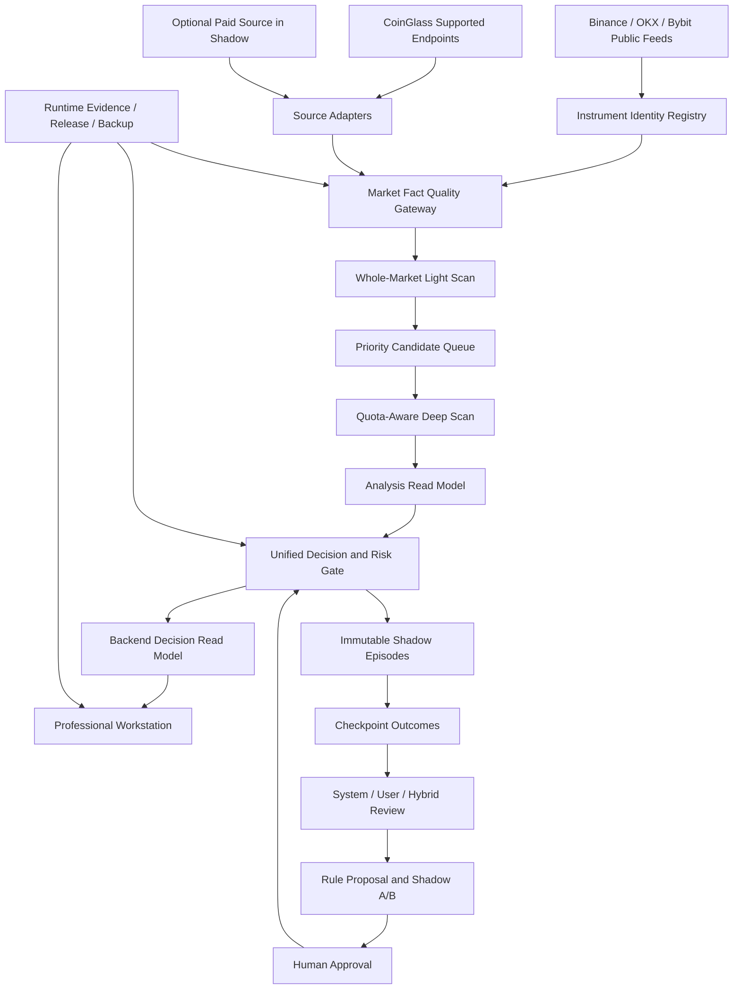

# Market Radar Practical Readiness Master Plan v2

> **For agentic workers:** REQUIRED SUB-SKILL: Use superpowers:subagent-driven-development (recommended) or superpowers:executing-plans to implement this plan task-by-task. Steps use checkbox (`- [ ]`) syntax for tracking.

**Goal:** 把当前 `53/100` 的生产研究平台，建设成一个事实可信、运行稳定、数据可追溯、能提前发现 CEX 合约异动、能给出结构化人工交易决策辅助并经过 Shadow 和复盘验证的专业网站。

**Architecture:** 以 `MarketFactEnvelope -> Scan -> Analysis -> Strategy -> Shadow -> Review` 为唯一主链，先收口事实层和生产证据，再建立统一数据质量网关、候选排序和权威决策路径。任何新规则和新数据都必须先进 research-only / Shadow，经独立样本验证和人工批准后才能进入 production。

**Tech Stack:** Next.js 16、TypeScript、Node.js、Postgres、Redis、Docker Compose、Binance/OKX/Bybit public futures data、CoinGlass Hobbyist、GitHub Actions、Playwright、腾讯云单机 4C/8G/120GB。

**Status:** `SUPERSEDED / 已由 v3 取代`。本文仅保留为审计历史；当前唯一建议版为 `2026-07-10-market-radar-practical-readiness-master-plan-v3.md`。本文不授权任何代码、数据库、生产或策略变更。

## Global Constraints

- 项目定位是 CEX 二级合约市场人工决策辅助，不是自动交易系统。
- 不接交易所下单 API，不自动下单，不自动修改 production ranking / READY / 策略权重。
- SCAN / ANALYSIS / STRATEGY / SHADOW / REVIEW 分层不得互相越权。
- 结构 RR 最低门槛固定为 `3:1`，不得为增加信号数而降低。
- BTC/ETH `150x`、山寨币交易所最大杠杆、cross-margin、`0.3%` 初始保证金只是结构计划之后的个人仓位视角，不得生成方向或绕过 Risk Gate。
- 缺失、限速、失效、过期、未验证数据必须显示 `partial / waiting / unavailable / stale`，不能变成 `0 / live / ready`。
- 回测与 Shadow 可以使用 MFE / MAE / outcome，生产扫描、分析、策略不得读取未来结果。
- 数据库 migration、生产回滚、清 Redis/Postgres/volume 都需要单独用户授权。
- 实施任务必须使用小范围、独立验收、先测试后实现的交付方式，不得按本文一次性大改。
- 每个 Work Package 开始前必须生成独立执行计划，明确文件 allowlist、测试、部署、回滚和停止条件。

---

## 1. Executive Decision

### 1.1 当前真实定位

2026-07-10 全系统审计结论为：

```text
综合审计分：53/100
状态：可运行但不完整 / 不能支撑实战
系统层级：生产型研究平台
不属于：已验证的专业 CEX 合约实战雷达
```

最大问题不是缺少页面或指标，而是：

1. 前端仍可以合成方向、新鲜度、分数、时间和衍生品数值。
2. 数据质量没有统一语义，覆盖率、完整度、深扫率、新鲜度和可信度被混用。
3. 深扫完整轮转约 23 小时，无法对高优候选做快速验证。
4. 最近专业审计扫描 50.74、分析 46.57、策略 22.48，`TRADE_PLAN_READY=0`。
5. Shadow 尚未证明真实 recorded outcome 的连续闭环。
6. 生产实时 health 已 ready，但最新正式 evidence 仍是 partial，Git / server / container 内容对齐未收口。
7. 备份脚本存在，但异地备份、RPO/RTO 和恢复演练没有形成证据。
8. 缺少 E2E、负载、可访问性、视觉回归和容灾门禁。

### 1.2 新版建设决策

旧计划中的有效原则继续保留，但不再按 5.1-H、5.1-G、5.1-F、6、7、8、11、12 这类历史编号串行执行。新主计划改为八个能力阶段：

```text
M0 事实与版本基线
-> M1 运行稳定、安全与恢复
-> M2 数据质量与深扫时效
-> M3 扫描排序与提前发现
-> M4 分析、策略与风险有效性
-> M5 Shadow 真实结果与规则治理
-> M6 复盘与模拟决策
-> M7 专业工作台、最终实战准入与长期运营
```

这不是大重构指令。每个阶段仍需拆成小而完整的 Work Package，每个包都可独立验证、回滚和审核。

## 2. 对旧 Master Plan 的调整

| 旧阶段 | 新决定 | 原因 |
| --- | --- | --- |
| 5.1-H 生产鉴权/扫描故障 | 降为历史事件；未闭环 evidence 进 M0 | auth regression 已找到旧 key 根因，不应继续当未来主阶段 |
| 5.1-G GitHub / 腾讯云同步 | 前移到 M0 | 没有可复现生产基线，后面任何指标都无法比较 |
| 5.1-F 能力库全面盘点 | 取消独立大阶段 | 上一轮全系统审计已完成主要盘点；只在 M3/M4 对真正进主链的 Module 做调用路径确认 |
| 5.1-RG 已知问题回归 | 改为每个故障当轮必做 | 回归不应在数个阶段后才补 |
| 5.1-O 备份/容灾 | 前移到 M1 | 真实生产系统必须先具备恢复能力，再积累 Shadow 和用户数据 |
| 5.2 Shadow + 5.3 Daily Movers | 合并为 M5 两个互补标签集 | Shadow 衡量已发现样本，Daily Movers 衡量漏判，必须同时看 |
| 6 逻辑审查 + 7 标准库 | 合并到 M3/M4 | 不再先写大量理论库，只为可验证的扫描、分析和风控构建规则 |
| 6.1 反过拟合 | 变成 M3-M5 每轮强制门禁 | 不允许先改规则、后补反过拟合 |
| 6.2 误导风险审计 | P0 前移到 M0 | 上轮已证明存在事实污染，不能等到第十阶段 |
| 7.6 + 11.1 真实交易复盘 | 合并为 M6 | 先建统一 schema 和隐私门禁，再做页面，避免重复建设 |
| 8.x 数据增强 | 分成 M2 必要数据与可选付费实验 | 不再默认接 Coinalyze 或升级 CoinGlass，必须先证明边际价值 |
| 8.6 强弱选币 | 前移到 M3，但只能排候选 | 强弱是扫描排序能力，不是策略就绪能力 |
| 12 自动迭代 | 拆到 M5 规则生命周期和 M7 运营 | 只自动生成报告和 proposal，不自动改 production |
| “不做低配初版” | 改为“做窄而完整的生产切片” | 禁止低质量不等于禁止小步交付；大爆炸式建设反而难以验收 |

## 3. 什么叫“具备进入实战的能力”

本项目的“实战”只表示：

```text
可以作为人工 CEX 合约决策辅助工作台
```

它不表示：

- 保证盈利。
- 网站可以代替用户决策。
- 系统可以自动下单。
- 高杠杆因为网站给出 READY 就变得安全。
- 一次回测或几笔盈利足以证明系统有效。

### 3.1 能力等级

| 等级 | 名称 | 允许用途 |
| --- | --- | --- |
| R0 | 不可信基线 | 只能修复，不得用于判断 |
| R1 | 生产研究平台 | 看市场、看候选、研究系统；当前所在级别 |
| R2 | Shadow 可验证平台 | 可连续记录判断与 outcome，不用于真实下单依据 |
| R3 | 模拟决策辅助 | 用纸上交易/决策日志验证完整工作流 |
| R4 | 受控人工实战辅助 | 用户可自主将系统作为一项决策输入；仍不下单、不代替风控 |
| R5 | 专业稳定决策工作台 | 长周期证明稳定、可解释、可恢复、可持续维护 |

### 3.2 R4 实战辅助硬否决项

以下任一项存在，无论总分多高都不得进入 R4：

1. UI 会把 unknown/stale/partial 展示成 0/live/ready。
2. 前端会自行生成 direction、entry、stop、target、RR 或交易计划。
3. 最新生产 evidence 不是 pass，或 server/container 内容与发布 commit 不一致。
4. 生产排序、分析或策略读取 future MFE/MAE/outcome。
5. `TRADE_PLAN_READY` 可绕过结构止损、结构目标或 RR>=3。
6. 关键数据不能追溯到 source、observedAt、status 和质量原因。
7. Shadow 样本不足或不能排除未来数据泄漏。
8. 系统没有通过近 90 天内的备份恢复演练。
9. 存在未修复的 secret、鉴权、上传、注入、越权或生产暴露 P0/P1 安全问题。
10. 任何自动下单、自动调权、自动改 READY 或自动发布未经人工批准的规则。

### 3.3 R4 实战准入评分卡

`53/100` 是上轮架构审计分，不能直接当实战准入分。M0 完成后按下表重新建立 readiness score：

| 维度 | 权重 | R4 最低得分 | 核心证据 |
| --- | ---: | ---: | --- |
| 事实与状态诚实 | 10 | 10 | 无合成事实、无假 0、无假 live、状态一致 |
| 生产稳定与安全 | 15 | 13 | SLO、evidence、release trace、restore drill、security gate |
| 数据质量与时效 | 15 | 12 | provenance、freshness、completeness、深扫 SLA |
| 扫描提前性与排序 | 15 | 12 | holdout TopN、pre-move capture、late/noise |
| 分析与策略有效性 | 20 | 16 | 独立样本、结构计划、net R、无 future leak |
| 风险控制 | 10 | 9 | RR>=3、失效条件、成本/滑点、仓位风险可见 |
| Shadow 与复盘证据 | 10 | 8 | 60 天、样本量、checkpoint 完整性、SYSTEM/USER/HYBRID |
| UX、性能与可操作性 | 5 | 4 | 关键任务 E2E、无重复冲突、响应时间、可访问性 |
| **总分** | **100** | **85** | 同时满足所有硬否决项和单项最低分 |

不允许用工程高分抵消策略低分，也不允许用前端美观抵消数据不可信。

#### 评分取证规则

每个子项只有在指定时间窗口、指定样本和指定证据包全部通过时得满分。如需部分分，必须在该阶段开始前将部分分算法写入机器可读评分器，不得验收时临时人工凑分。

| 维度 | 固定子项 |
| --- | --- |
| 事实 10 | 无合成事实 4；null/zero/stale/live 语义 3；跨页/API 一致 3 |
| 稳定安全 15 | 30 天 SLO 4；release/evidence 可复现 3；backup/restore 3；security gate 3；incident/rollback 演练 2 |
| 数据 15 | fact envelope 4；instrument identity 3；freshness/completeness 3；Tier A/B 深扫 3；failure classification 2 |
| 扫描 15 | 两个 holdout 5；pre-move capture 4；actionable TopN 3；late/noise 2；missed-opportunity 分母 1 |
| 分析策略 20 | analysis gate 4；strategy gate 4；结构计划完整性 4；net R 统计 5；无 future leak 3 |
| 风险 10 | RR>=3 3；结构 stop/target 2；cost/slippage 2；个人仓位视图隔离 1；blocker/invalidation 2 |
| Shadow/Review 10 | 60 天与样本 3；outcome 质量 3；Daily Movers 漏判 2；SYSTEM/USER/HYBRID 1；rule governance 1 |
| UX 5 | 关键工作流 2；性能 1；可访问性 1；运行事实可见 1 |

## 4. 目标架构



### 4.1 权威事实模型

每个关键市场数据必须等价于：

```ts
interface MarketFactEnvelope<T> {
  value: T | null;
  source: string;
  instrumentId: string;
  observedAt: string | null;
  receivedAt: string;
  ageMs: number | null;
  status: 'ready' | 'partial' | 'stale' | 'unavailable' | 'rate_limited' | 'plan_limited' | 'auth_error';
  qualityReasons: string[];
}
```

这个 Interface 只是目标合同，具体字段名必须在 M2 执行计划中与现有 `src/lib/market/types.ts` 和 persistence schema 复核后锁定。未经独立 schema 评审不得直接 migration。

### 4.2 权威决策路径

```text
SCAN: 只发现和排候选
ANALYSIS: 只判断结构、方向偏向、反证和品质
STRATEGY: 只在入场、结构止损、目标、RR 和 Risk Gate 齐全时评估可交易性
SHADOW: 只记录当时事实和未来 outcome
REVIEW: 只归因、比较和提出 proposal
FRONTEND: 只格式化后端 read model，不生成交易事实
```

## 5. 执行总则

### 5.1 每个 Work Package 的固定步骤

- [ ] 创建当轮独立执行计划和文件 allowlist。
- [ ] 写出当前失败证据和预期行为。
- [ ] 先写会失败的定向测试，证明测试真能捕捉问题。
- [ ] 做最小实现，不顺手重构其它层。
- [ ] 运行定向测试。
- [ ] 运行 `typecheck` / `lint` / `test:market` / `build` / `backtest:golden` 基础门禁。
- [ ] 需要时运行 production evidence test，但不用 `backtest:formal` 代替定向验证。
- [ ] 执行 forbidden-file、secret、security 检查。
- [ ] 仅提交 allowlist 文件，记录 commit / release / rollback point。
- [ ] 部署时运行 API、页面、worker、Redis、Postgres、evidence 检查。
- [ ] 更新 context、changelog、已知问题和下一轮唯一建议。

### 5.2 统一失败处理

- 任何 P0：停止其它开发，修 P0。
- 定向测试失败：不进基础门禁。
- 基础门禁失败：不提交、不部署。
- production evidence 失败：立即标记 partial，按发布回滚规则处理。
- Shadow 样本不足：继续收集，不调低样本门槛。
- 策略不达标：保留 WAIT/BLOCKED，不为增加 READY 降低风控。

## 6. M0 - 事实与版本基线

**预计工程周期：** 1-2 周。

**阶段目标：** 清除已知 P0 误导，让页面、API、runtime evidence、Git 和生产容器对同一事实给出一致结论。

### WP-M0.1 Frontend Truth Contract Repair

**Files:**

- Modify: `src/lib/frontend-display-adapters.ts`
- Modify: `src/lib/api/frontend-contract.ts`
- Modify: `src/components/review/review-evolution.tsx`
- Modify: `src/app/market/market-page-client.tsx`
- Modify: `src/components/token/token-dossier.tsx`
- Modify: `src/components/ui-information-layers.tsx`
- Modify: `src/components/scan-proof.tsx`
- Modify: `src/components/dashboard/radar-control.tsx`
- Test: `src/lib/api/frontend-display-adapters.test.ts`
- Test: `src/lib/api/frontend-contract.test.ts`
- Test: `src/lib/frontend-contract-server.test.ts`
- Add: `tests/e2e/truth-surfaces.spec.ts`

**Required behavior:**

- [ ] 删除按 leaderboard 涨跌合成 direction 的路径。
- [ ] 删除硬编 `freshness='live'`、按 index 生成 age、固定 `CoinGlass` source 的路径。
- [ ] 删除前端合成 score / sentiment / volMult / anomaly 并再排序的路径。
- [ ] `neutral` 保持 neutral，不得变成多。
- [ ] null MFE/MAE 保持 null，不得变成 0。
- [ ] 只有真实 timedOut 的样本才显示“超时未达”。
- [ ] unavailable 衍生品数据显示“暂不可用”，不显示 `0.00`。
- [ ] 页面上只保留一个权威全市场扫描证明。
- [ ] UI schema guard 主界面只显示用户可读降级状态，内部诊断只进安全日志。

**Acceptance:**

- 上述每个已知失真都有红-绿回归测试。
- dashboard / signals / token / market / review 页面不再出现相互冲突的同名指标。
- 修复后就算空状态增多，也不使用 fallback 补位。

### WP-M0.2 Runtime Evidence Single Source

**Files:**

- Modify: `src/lib/api/system-health.ts`
- Modify: `src/lib/runtime/api-observability.ts`
- Modify: `src/lib/runtime/worker-heartbeat.ts`
- Modify: `scripts/production/observability.mjs`
- Test: `src/lib/api/system-health.test.ts`
- Test: `src/lib/runtime/api-observability.test.ts`
- Test: `scripts/production/observability.test.mjs`

**Required behavior:**

- [ ] 分开 `currentRuntimeHealth` 和 `releaseValidationStatus`，互不覆盖。
- [ ] 每份 evidence 携带 generatedAt、expiresAt、releaseId、commit、content hash 和数据来源。
- [ ] 旧 evidence 不能作为当前 pass。
- [ ] worker heartbeat、scan freshness、CoinGlass capability、Redis、Postgres 都使用统一状态语义。

### WP-M0.3 Git / Release / Production Alignment

**Files:**

- Modify: `.github/workflows/production.yml`
- Modify: `scripts/deploy/auto-deploy.sh`
- Modify: `scripts/deploy/rollback.sh`
- Modify: `docker-compose.yml`
- Add: `docs/deployment/RELEASE_STANDARD.md`
- Add: `docs/deployment/RELEASE_RECORD_SCHEMA.json`

**Required behavior:**

- [ ] GitHub `main` 是唯一长期源，生产服务器不作为开发源。
- [ ] 每次发布记录 releaseId、commit、bundle hash、image digest、migration status、evidence status、rollback target。
- [ ] dirty worktree 不允许发布。
- [ ] 服务器 HEAD、容器 label、应用 `/api/health` build info 三者必须一致。
- [ ] 部署失败只可停止或按经过批准的 rollback point 回滚，不得临时改服务器代码。

### M0 出口门禁

- [ ] 四类已知 P0 全部修复并有回归。
- [ ] 当前 runtime ready 和最新 release evidence pass 同时成立。
- [ ] server / container / Git commit 和 content hash 一致。
- [ ] 无 P0/P1 secret 或鉴权问题。
- [ ] 基础门禁全部通过。

**未通过时：** 保持 R1，不得进入数据或策略增强。

## 7. M1 - 运行稳定、安全与恢复

**预计工程周期：** 2-4 周。

**阶段目标：** 证明系统不只是某个时刻 ready，而是可监控、可恢复、可安全运行的生产系统。

### WP-M1.1 SLO 与监控

**Files:**

- Add: `src/lib/runtime/service-level-objectives.ts`
- Add: `src/lib/runtime/runtime-evidence.ts`
- Modify: `src/lib/api/system-health.ts`
- Modify: `src/app/system/page.tsx`
- Modify: `scripts/production/observability.mjs`
- Add: `docs/operations/SLO_STANDARD.md`
- Add: `docs/operations/INCIDENT_PLAYBOOK.md`

**Initial SLO:**

- 连续 7 天公开核心 API availability >= 99.5%。
- light scan 成功周期 >= 99%，不得用 cache success 代替 scan success。
- 所有必要 worker heartbeat fresh ratio >= 99%。
- `/api/health` P95 <= 1s，主合同 API P95 <= 2s。
- 当前单用户工作台的关键首屏数据 P95 <= 3s。
- 连续 7 天内假 healthy、假 fresh、假 evidence pass 为 0。
- CPU 15 分钟 P95 < 70%，memory P95 < 80%，disk < 70%。

这些是个人站 4C/8G 的初始目标；实测证明工作负载不同时，只能通过评审修改，不得为过门临时改低。

### WP-M1.2 备份、恢复与容灾演练

**Files:**

- Modify: `deploy/scripts/backup-postgres.sh`
- Modify: `deploy/scripts/restore-postgres.sh`
- Modify: `scripts/deploy/rollback.sh`
- Add: `docs/operations/BACKUP_STANDARD.md`
- Add: `docs/operations/RESTORE_PLAYBOOK.md`
- Add: `docs/operations/DISASTER_RECOVERY_PLAYBOOK.md`
- Add: `scripts/production/backup-verify.mjs`

**Requirements:**

- [ ] Postgres 每日至少一次加密备份，保留 30 天。
- [ ] 至少一份备份在主服务器之外，优先使用腾讯 COS 低成本对象存储。
- [ ] Shadow outcome、release record、evidence 和用户 journal 纳入对应保留策略。
- [ ] Redis 只备份不可重建的必要状态，不把所有 cache 当持久数据。
- [ ] 每 90 天在隔离环境做一次真实 restore drill。
- [ ] 初始 RPO <= 24h，RTO <= 2h。
- [ ] restore 验证包含 schema、行数摘要、关键合同、Shadow outcome 和 journal 一致性，不输出业务明文。

### WP-M1.3 安全基线

**Files:**

- Modify: `scripts/verify/security-check.sh`
- Review: `middleware.ts`
- Review: `src/lib/auth/private-session.ts`
- Test: `src/lib/auth/private-session.test.ts`
- Review: `src/app/api/admin/coinglass/capability/route.ts`
- Review: `src/app/api/admin/daily-movers/ingest/route.ts`
- Review: `src/app/api/admin/daily-movers/klines/fill/route.ts`
- Review: `src/app/api/admin/deployment/readiness/route.ts`
- Review: `src/app/api/admin/macro/ingest/route.ts`
- Review: `src/app/api/admin/outcomes/run/route.ts`
- Review: `src/app/api/admin/persistence/migrate/route.ts`
- Review: `src/app/api/admin/runtime/heartbeat/route.ts`
- Review: `src/app/api/admin/shadow-live/run/route.ts`
- Review: `src/app/api/admin/strategy-weights/executions/record/route.ts`
- Review: `src/app/api/admin/v3/forward-map-reviews/run/route.ts`
- Review: `src/app/api/journal/route.ts`
- Review: `src/app/api/admin/persistence/migrate/route.ts`
- Review: `src/app/api/admin/shadow-live/run/route.ts`
- Add: `docs/security/THREAT_MODEL.md`
- Add: `docs/security/SECURITY_BASELINE.md`

**Security controls:**

- 复用并强化现有 private session，不平行创造第二套用户鉴权。
- 管理路由默认拒绝，鉴权错误不返回内部细节。
- protected API 有节流、重放防护、时间窗口和审计日志。
- journal / screenshot 未来上传必须有类型、尺寸、扫描、存储隔离和访问控制。
- 日志、evidence、错误页、Git 历史和 Docker build context 不得包含 secret。
- Postgres 用户、Redis、worker 和 web 必须按最小权限评审。
- 依赖漏洞、容器基础镜像和安全 header 进 CI 门禁。
- 安全检查失败必须阻断发布。

### WP-M1.4 E2E、负载与故障注入基线

**Files:**

- Add: `playwright.config.ts`
- Add: `tests/e2e/dashboard.spec.ts`
- Add: `tests/e2e/signal-to-token.spec.ts`
- Add: `tests/e2e/review.spec.ts`
- Add: `tests/e2e/system-health.spec.ts`
- Add: `tests/load/core-api-smoke.mjs`
- Modify: `package.json`
- Modify: `.github/workflows/production.yml`

**Acceptance:**

- desktop / tablet / mobile 关键工作流 E2E 稳定通过。
- 5 并发持续 30 分钟和 15 并发短峰下无连续 5xx、无 scan starvation。
- Redis unavailable、CoinGlass 429/auth/timeout、worker stale、Postgres read failure 都能正确降级。
- 故障注入不在真实生产数据上破坏性执行。

### M1 出口门禁

- [ ] 7 天 SLO 观察达标。
- [ ] 备份自动调度、异地保留和 restore drill 全部有证据。
- [ ] 无未处理高危安全问题。
- [ ] E2E 和负载基线进入 CI/release gate。

## 8. M2 - 数据质量与深扫时效

**预计工程周期：** 3-5 周。

**阶段目标：** 让每个关键数值都能回答“哪里来、什么时候、是否完整、为什么可信或不可信”，并在现有 API 配额下优先快速验证最有价值候选。

### WP-M2.1 Market Fact Quality Gateway

**Files:**

- Modify: `src/lib/market/types.ts`
- Modify: `src/lib/market/data-source-capabilities.ts`
- Modify: `src/lib/market/providers/binance-universe-discovery.ts`
- Modify: `src/lib/market/providers/okx-universe-discovery.ts`
- Modify: `src/lib/market/providers/bybit-universe-discovery.ts`
- Modify: `src/lib/market/providers/public-futures-universe-discovery.ts`
- Modify: `src/lib/market/providers/public-light-scan.ts`
- Modify: `src/lib/market/providers/coinglass-capability-probe.ts`
- Modify: `src/lib/market/providers/coinglass-client.ts`
- Modify: `src/lib/market/providers/coinglass-mapper.ts`
- Modify: `src/lib/market/providers/coinglass-provider.ts`
- Add: `src/lib/market/quality/market-fact.ts`
- Add: `src/lib/market/quality/quality-gateway.ts`
- Add: `src/lib/market/quality/quality-policy.ts`
- Test: `src/lib/market/data-source-capabilities.test.ts`
- Add: `src/lib/market/quality/quality-gateway.test.ts`

**Requirements:**

- 价格、成交量、OI、Funding、清算、多空比、taker flow、orderbook 等关键事实全部有 envelope。
- `value=null` 与真实 `value=0` 完全分开。
- source freshness policy 按数据类型定义，不用一个全局时间窗口。
- 每个 Adapter 的 auth_error、rate_limited、plan_limited、unavailable、transport_error 分类有 fixture。
- quality 不是一个不可解释总分；必须同时给出 coverage、completeness、freshness、consistency 和 reasons。

### WP-M2.2 Instrument Identity Registry

**Files:**

- Modify: `src/lib/market/universe-registry.ts`
- Modify: `src/lib/market/instrument-pool.ts`
- Modify: `src/lib/market/providers/public-futures-universe-discovery.ts`
- Add: `src/lib/market/instrument-identity.ts`
- Add: `src/lib/market/instrument-aliases.ts`
- Test: `src/lib/market/universe-registry.test.ts`
- Test: `src/lib/market/instrument-pool.test.ts`
- Add: `src/lib/market/instrument-identity.test.ts`

**Requirements:**

- 以 `canonicalAsset + exchange + contractType + settlement + contractSize` 标识 instrument。
- `1000TAG/TAG`、`SKYAI/SKYAI1` 类别名必须显式映射或显示 unresolved，不得静默合并。
- 任何跨所汇总都保留原始 exchange instrument id。
- delisted/new listing/contract change 有生命周期。

### WP-M2.3 配额感知的深扫调度

**Files:**

- Modify: `src/lib/market/scan-batch-queue.ts`
- Modify: `src/lib/market/scan-quota.ts`
- Modify: `src/lib/market/universe-priority-hints.ts`
- Modify: `src/lib/market/scan-coordinator.ts`
- Modify: `src/lib/market/scan-runtime.ts`
- Modify: `src/lib/market/providers/coinglass-client.ts`
- Test: `src/lib/market/scan-batch-queue.test.ts`
- Test: `src/lib/market/scan-quota.test.ts`
- Test: `src/lib/market/universe-priority-hints.test.ts`
- Test: `src/lib/market/scan-coordinator.test.ts`
- Test: `src/lib/market/scan-runtime.test.ts`
- Test: `src/lib/market/providers/coinglass-client.test.ts`

**Service tiers:**

- Tier A：前排、结构临界、突发异动候选，深扫等待 P95 <= 5 分钟。
- Tier B：次高优先级候选，P95 <= 30 分钟。
- Tier C：低优先级轮转，如果配额不足必须显示 waiting，不用旧深扫数据补位。

不再将“所有币都频繁深扫”当作专业标准。专业标准是全市场轻扫真实覆盖、高价值候选快速深扫、低优先级状态诚实。

### WP-M2.4 执行微观结构数据

**Files:**

- Modify: `src/lib/market/ws-light-scan.ts`
- Modify: `src/lib/market/live-events.ts`
- Modify: `src/lib/market/providers/public-light-scan.ts`
- Modify: `src/lib/market/types.ts`
- Add: `src/lib/market/microstructure/microstructure-snapshot.ts`
- Add: `src/lib/market/microstructure/microstructure-quality.ts`
- Test: `src/lib/market/ws-light-scan.test.ts`
- Test: `src/lib/market/live-events.test.ts`
- Test: `src/lib/market/providers/public-light-scan.test.ts`
- Add: `src/lib/market/microstructure/microstructure-quality.test.ts`

**Requirements:**

- 优先使用 Binance/OKX/Bybit 公开 WebSocket，只对 Tier A/B 候选维持较高频微观结构计算。
- 记录 top-of-book spread、固定 bps 范围 depth、orderbook imbalance、taker buy/sell delta、large trade proxy 和 source timestamp。
- 每个 proxy 都显式标记 proxy，不包装成真实聚合 CVD 或主力意图。
- 数据缺口、断线、乱序和重连必须降低 quality，不用最后一帧冒充实时。
- microstructure 只作为 analysis evidence / execution risk，不直接 READY。

**Acceptance:**

- WebSocket 健康时 Tier A microstructure coverage >= 90%、P95 age <= 5s。
- gap/reconnect/stale fixture 全部被识别，无 stale-as-live。
- 无微观结构数据时可以继续 public scan，但 Strategy 必须显示 missing evidence 或等待。

### WP-M2.5 数据存储与保留

**Files:**

- Modify: `src/lib/persistence/persistence-contract.ts`
- Modify: `src/lib/persistence/persistence-store.ts`
- Modify: `src/lib/persistence/app-repository.ts`
- Add: `docs/data/DATA_RETENTION_STANDARD.md`
- Add: migration plan only after explicit approval

**Requirements:**

- raw fact、normalized fact、decision snapshot、Shadow episode 和 review outcome 使用不同保留规则。
- 生产 read model 不从 reports zip 或临时 JSON 当权威数据源。
- schema 变更需要 forward/rollback 计划、备份、隔离环境演练和用户授权。

### M2 量化出口门禁

- 关键市场 fact envelope 覆盖率 100%。
- 已知 fake zero / fake live / stale-as-current 回归为 0 失败。
- public eligible universe 轻扫覆盖 >= 95%，P95 周期 <= 120s。
- Tier A / B 深扫时效达标。
- Tier A microstructure coverage/freshness 达标，且 proxy 语义可见。
- 已支持 endpoint 的 clean success >= 95%；plan-limited 必须从分母和页面中明确分开。
- instrument identity fixture 无静默冲突。
- CoinGlass 异常不得导致 public whole-market scan 归零。

## 9. M3 - 扫描排序与提前发现

**预计工程周期：** 4-6 周。

**阶段目标：** 让系统不只能看到已经异动的币，而是在异动前或刚开始时把真正高价值候选提到前排。

### WP-M3.1 Production Score Purity

**Files:**

- Modify: `src/lib/market/radar-snapshot.ts`
- Modify: `src/lib/market/altcoin-opportunities.ts`
- Modify: `src/lib/market/signal-maturity.ts`
- Modify: `src/lib/market/universe-priority-hints.ts`
- Modify: `src/lib/analysis/anomaly-engine.ts`
- Test: `src/lib/market/radar-snapshot.test.ts`
- Test: `src/lib/market/altcoin-opportunities.test.ts`
- Test: `src/lib/market/signal-maturity.test.ts`
- Test: `src/lib/market/universe-priority-hints.test.ts`
- Test: `src/lib/analysis/anomaly-engine.test.ts`

**Requirements:**

- 列出每个 production score 的当时可观测输入、缺失行为和消费者。
- 删除或隔离任何 outcome/MFE/MAE/hit/qualityHit 对实时排序的影响。
- 强弱 RS、压缩、volume expansion、breakout edge、retest、late/noise 只用于候选优先级。
- scan score 不生成 entry/stop/target/RR。

### WP-M3.2 Market Regime 与多空对称性

**Files:**

- Modify: `src/lib/market-regime/market-regime.ts`
- Modify: `src/lib/analysis/market-environment-windows.ts`
- Modify: `src/lib/analysis/timeframe-profile.ts`
- Test: `src/lib/market-regime/market-regime.test.ts`
- Test: `src/lib/analysis/market-environment-windows.test.ts`
- Test: `src/lib/analysis/timeframe-profile.test.ts`

**Requirements:**

- 区分 trend-up / trend-down / range / high-volatility / low-liquidity 的扫描语境。
- 做多选强和做空选弱使用对称合同，不得把所有 neutral 变成 long。
- BTC/ETH 环境只调整候选优先级和风险上下文，不直接 READY。

### WP-M3.3 Daily Movers 反事实集

**Files:**

- Modify: `src/lib/market/daily-movers.ts`
- Modify: `src/lib/market/daily-mover-ingest.ts`
- Modify: `src/lib/market/daily-mover-correlations.ts`
- Modify: `src/lib/review/missed-opportunity/types.ts`
- Modify: `src/lib/review/missed-opportunity/review.ts`
- Modify: `src/lib/review/missed-opportunity/index.ts`
- Test: `src/lib/market/daily-movers.test.ts`
- Test: `src/lib/market/daily-mover-ingest.test.ts`
- Test: `src/lib/review/missed-opportunity/review.test.ts`

**Purpose:**

- Shadow 回答“我们推出的东西后来怎样”。
- Daily Movers 回答“市场真正发生的大行情中，我们漏掉了什么”。
- 两者同时存在才能避免只看命中、不看漏判。

### WP-M3.4 专业扫描 holdout 审计

**Files:**

- Modify: `src/lib/backtest/professional-replay.ts`
- Modify: `src/lib/backtest/professional-audit.ts`
- Modify: `src/lib/backtest/professional-audit-round.ts`
- Add: `docs/backtest-v2/HOLDOUT_GOVERNANCE.md`

**Evaluation design:**

- 训练/问题发现窗口与 holdout 时间窗口严格分开。
- 至少 300 个可评估事件，并覆盖至少三类市场 regime；如果样本不足，状态为等待样本。
- 任何阈值更改都不允许立即在同一 holdout 重复调参。
- 连续两个独立 holdout 窗口达标才能进 M4。

### M3 量化出口门禁

- professional scan score >= 70，连续两个 holdout 不退化。
- pre-move capture >= 40%（当前基线 23.53%）。
- actionable TopN capture >= 45%（当前基线 26.42%）。
- Top20 的 late/noise 占比 <= 30%。
- 因数据管道失败造成的 Daily Movers 漏记 <= 5%。
- 所有漏判必须分类为 data / coverage / ranking / analysis / out-of-scope，不得只输出“未命中”。
- 不设定最低候选数量，不为满榜放宽标准。

## 10. M4 - 分析、策略与风险有效性

**预计工程周期：** 5-8 周。

**阶段目标：** 建立唯一权威决策路径，让 WAIT 有可验证触发，让 READY 只在结构止损、目标、RR、成本和风险齐全时出现。

### WP-M4.1 权威分析与决策路径收敛

**Files:**

- Review/Modify: `src/lib/analysis/strategy-planner.ts`
- Review/Modify: `src/lib/analysis/v2/strategy/decision-engine.ts`
- Review/Modify: `src/lib/analysis/v2/strategy/market-state-machine.ts`
- Review/Modify: `src/lib/analysis/v2/strategy/risk-gate.ts`
- Review/Modify: `src/lib/analysis/v3/market-reading-engine.ts`
- Review/Modify: `src/lib/analysis/v3/key-level-engine.ts`
- Review/Modify: `src/lib/analysis/v3/forward-level-map.ts`
- Review/Modify: `src/lib/analysis/v3/readiness.ts`
- Review/Modify: `src/lib/analysis/v3/trade-plan.ts`
- Review/Modify: `src/lib/analysis/v3/types.ts`
- Modify: `src/lib/decision/unified-decision-engine.ts`
- Modify: `src/lib/market/signal-backend-dossier.ts`
- Test: `src/lib/decision/unified-decision-engine.test.ts`
- Test: `src/lib/analysis/v3/readiness.test.ts`
- Add: `docs/architecture/AUTHORITATIVE_DECISION_PATH.md`

**Target path:**

- v3 结构分析 + unified decision 成为权威路径。
- v2 如仍有必要消费者，只能在显式 compatibility Adapter 后存续，不再和 v3 并列决定 READY。
- `strategy-planner.ts` 不得绕过 unified decision 直接供前端消费。
- 过期路径只在调用者迁移、回归通过后删除，不一次性重写。

### WP-M4.2 结构关键位与 WAIT 状态机

**Files:**

- Modify: `src/lib/analysis/v3/key-level-engine.ts`
- Modify: `src/lib/analysis/v3/forward-level-map.ts`
- Modify: `src/lib/analysis/v3/trade-plan.ts`
- Modify: `src/lib/analysis/v3/trade-plan-guard.test.ts`
- Modify: `src/lib/analysis/v2/strategy/market-state-machine.ts`

**Requirements:**

- stop 必须来自明确结构失效位，记录 level source 和时间。
- target 必须来自最近有效压力/支撑/流动性目标，不使用固定比例硬编。
- WAIT 必须有 trigger、confirmation window、expiry、invalidation、whyNotNow。
- `not_triggered`、`triggered_tp_first`、`triggered_sl_first`、`expired`、`data_unavailable` 明确分开。
- 非 READY 不显示可执行交易线。

### WP-M4.3 成本、滑点与个人风险视图

**Files:**

- Modify: `src/lib/risk/account-risk-simulator.ts`
- Modify: `src/lib/risk/personal-position-lens.ts`
- Modify: `src/lib/analysis/v2/strategy/risk-gate.ts`
- Add: `src/lib/risk/execution-cost-model.ts`
- Add: `src/lib/risk/execution-cost-model.test.ts`

**Requirements:**

- 交易所 fee、预计 slippage、funding 使用可配置且可追溯的实际费率，不在规则中硬编一个永久值。
- 结构 RR 仍按 target-distance / stop-distance 计算；同时单独显示 net R 估算。
- 150x/cross-margin 必须显示 liquidation distance、费用敏感度和整户风险警告。
- 山寨币最大杠杆未知时显示 unavailable，不猜测。
- 仓位视图不反向修改 READY 或 RR。

### WP-M4.4 独立策略验收

**Files:**

- Modify: `src/lib/backtest/professional-audit.ts`
- Modify: `src/lib/backtest/professional-audit-round.ts`
- Modify: `src/lib/backtest/professional-audit-symbol-plan.ts`
- Modify: `src/lib/backtest/professional-replay.ts`
- Modify: `src/lib/backtest/golden-case-fixtures.ts`
- Modify: `src/lib/backtest/golden-case-runner.ts`
- Modify: `src/lib/backtest/golden-case-types.ts`
- Add: `docs/backtest-v2/STRATEGY_ACCEPTANCE_STANDARD.md`

**Statistical gate:**

- 至少 60 个真实触发的 WAIT/READY 条件计划，覆盖至少三类 regime；不足则继续积累，不强造 READY。
- 用扣除 fee/slippage/funding 后的 R-multiple 分布评估。
- net mean R 的 95% bootstrap 置信下界 > 0 才能通过策略有效性门禁。
- 单独报告 TP-first、SL-first、not-triggered、expired、data-unavailable，不用总命中率掩盖失败。
- 连续两个独立 holdout 达标，中间不修改阈值。

### M4 量化出口门禁

- analysis score >= 70，strategy score >= 65，连续两个 holdout 达标。
- 100% READY 都有 backend entry trigger、planned entry、结构 stop、结构 target、RR>=3、invalidation 和 cost estimate。
- false READY、前端补计划、future leakage 为 0。
- net mean R 统计门禁通过。
- 如 READY=0 但标准没有放宽，应如实标记样本不足/无合格机会，不视为工程失败；但不得进 R4。

## 11. M5 - Shadow 真实结果与规则治理

**预计工程周期：** 3-4 周；**证据积累周期：** 至少 60 个日历日，取时间和样本门槛中更晚者。

**阶段目标：** 把 Shadow 从“有 runner”升级为“能用真实当时价格和未来价格证明判断效果”。

### WP-M5.1 Live Run Registry 与不可变 episode

**Files:**

- Modify: `src/lib/shadow/storage.ts`
- Modify: `src/lib/shadow/runner-runtime.ts`
- Modify: `src/scripts/shadow/shadow-tracking.ts`
- Modify: `src/lib/persistence/persistence-contract.ts`
- Modify: `src/lib/persistence/persistence-store.ts`
- Modify: `src/lib/persistence/app-repository.ts`
- Modify: `src/lib/api/system-health.ts`

**Requirements:**

- Postgres 作为 live run / episode / checkpoint / outcome 权威源，reports 只是导出。
- 每个 observation 包含 observedAt、priceAtObservation、price source、source timestamp、decision snapshot hash、release id。
- episode 写入后不就地修改；更正使用新事件和 reason。
- manifest running 必须同时满足进程、heartbeat、lock、run registry 一致。

### WP-M5.2 Checkpoint / Outcome 质量

**Files:**

- Modify: `src/lib/shadow/storage.ts`
- Modify: `src/lib/shadow/enrichment.ts`
- Modify: `src/scripts/shadow/shadow-tracking.ts`
- Test: `src/lib/shadow/storage.test.ts`
- Test: `src/lib/shadow/runner-runtime.test.ts`
- Test: `src/lib/shadow/enrichment.test.ts`

**Requirements:**

- 1h/4h/24h checkpoint 使用明确时间窗口，不用当前价冒充历史价。
- 写入幂等，重跑不产生重复 outcome。
- data_unavailable 和真实未命中分开。
- outcome error 有 retry 和最终状态，不静默丢失。

### WP-M5.3 Shadow A/B 与规则生命周期

**Files:**

- Modify: `src/lib/review/research-only-boundary.ts`
- Modify: `src/lib/journal/strategy-weight-shadow.ts`
- Modify: `src/lib/journal/strategy-weight-shadow-evaluation.ts`
- Add: `docs/governance/RULE_PROPOSAL_STANDARD.md`
- Add: `docs/governance/SHADOW_AB_STANDARD.md`
- Add: `docs/governance/RULE_LIFECYCLE.md`

**Lifecycle:**

```text
Proposal -> Research -> Frozen Shadow A/B -> Review -> User Approval
-> Production Candidate -> Release Gate -> Monitoring -> Retirement
```

- 任何规则必须写出假设、适用/不适用场景、所需数据、风险、验证指标、退出条件。
- A/B 期间 production score / READY / risk gate 完全不受影响。
- 只生成建议，不自动调权。

### WP-M5.4 60 天证据窗口

**Minimum evidence:**

- 连续运行 >= 60 个日历日。
- 可评估 observation episode >= 500。
- 真实触发 WAIT/READY 样本 >= 60。
- 覆盖至少三类 market regime；未覆盖则继续收集。
- due checkpoint completion >= 99%。
- missing observation price < 1%。
- duplicate outcome = 0。
- unclassified outcome error < 0.5%。
- 每周同时报告 false positive、missed opportunity、data unavailable、late discovery 和 net R。

### M5 出口门禁

- Shadow 运行和效果证据同时达标。
- Daily Movers 与 episode 能溯源对齐，命中和漏判都有分母。
- 无 future leak，无自动 production 污染。
- 样本不足时停在 R2，不得跳过。

## 12. M6 - 复盘与模拟决策

**预计工程周期：** 3-5 周；后续纸上决策观察至少 30 天。

**阶段目标：** 分开“系统判断是否正确”和“用户执行是否正确”，先用模拟决策验证完整工作流，最高只能进入 R3。

### WP-M6.1 SYSTEM / USER / HYBRID 统一复盘模型

**Files:**

- Modify: `src/lib/journal/journal-entry.ts`
- Modify: `src/lib/journal/manual-trade-journal.ts`
- Modify: `src/lib/journal/outcome-tracker.ts`
- Modify: `src/lib/journal/review-statistics.ts`
- Modify: `src/app/api/journal/route.ts`
- Modify: `src/lib/api/frontend-contract.ts`
- Modify: `src/components/review/review-evolution.tsx`
- Modify: `src/app/review/page.tsx`
- Modify: `src/lib/persistence/persistence-contract.ts`
- Modify: `src/lib/persistence/persistence-store.ts`
- Modify: `src/lib/persistence/app-repository.ts`
- Add: `docs/review/REAL_TRADE_REVIEW_STANDARD.md`

**Modes:**

- SYSTEM：只评估系统当时判断和后续 outcome。
- USER：只评估用户实际 entry/stop/target/exit、执行纪律和情绪。
- HYBRID：通过稳定 correlation id 组合两份原始记录，不覆盖原数据。

**Metrics:**

- planned RR、actual R、MFE、MAE、entry deviation、stop discipline、target discipline、fee/slippage。
- 缺少真实 entry/stop/exit 时 R 显示 unavailable，不估算。
- 盈利不自动归因为系统正确，亏损不自动归因为用户错误。
- USER/HYBRID journal、备注和截图只能在已验证 private session 下读写，不出现在公开 contract、日志或 evidence 包中。

### WP-M6.2 纸上决策工作流

- [ ] 用户可以将当时 OBSERVE/WAIT/READY 保存为模拟决策，不下单。
- [ ] 系统冻结当时 decision snapshot、结构位、数据质量和生产 release。
- [ ] 用户事后记录是否会执行、为什么放弃、是否违反计划。
- [ ] 至少 30 天、30 个完整模拟决策工作流通过；不强迫真实交易。

### WP-M6.3 R4 证据预审

**Required evidence:**

- 除 M7 UX/最终工作台外的 readiness 证据全部生成，不预先填写未完成分数。
- 所有硬否决项为 false。
- 最近 30 天生产 SLO 达标，最新 release evidence pass。
- 最近 90 天 restore drill pass。
- M3/M4 两个独立 holdout 通过。
- M5 至少 60 天/样本门槛通过。
- 模拟决策工作流通过，系统对不交易/无机会的空结果处理正确。
- 独立安全复核无 P0/P1。

预审通过后只能标记：

```text
R3 模拟决策辅助已验收，等待 M7 最终准入
```

不得在 M6 标记 R4，也不得标记“稳定盈利”、“高胜率”、“可自动交易”或“无风险”。

## 13. M7 - 专业工作台、最终实战准入与长期运营

**预计工程周期：** 3-5 周，然后进入持续运营。

**阶段目标：** 在后端事实和合同稳定后，将页面收敛为快速扫描、比较、钻取、决策和复盘的工作台，然后才进行 R4 最终准入。

### WP-M7.1 页面职责收敛

**Files:**

- Modify: `src/app/dashboard/page.tsx`
- Modify: `src/app/signals/page.tsx`
- Modify: `src/app/token/[id]/page.tsx`
- Modify: `src/app/market/market-page-client.tsx`
- Modify: `src/app/review/page.tsx`
- Modify: `src/app/system/page.tsx`
- Modify: `src/components/dashboard/radar-control.tsx`
- Modify: `src/components/scan-proof.tsx`
- Modify: `src/components/signals/signal-maturity-pool.tsx`
- Modify: `src/components/token/token-dossier.tsx`
- Modify: `src/components/market/macro-derivatives.tsx`
- Modify: `src/components/review/review-evolution.tsx`
- Modify: `src/components/system/system-status.tsx`

**Target workflow:**

- Dashboard：市场环境、扫描覆盖、最重要候选、数据/系统风险。
- Signals：按 maturity / direction / freshness / blocker 快速比较，不混榜单。
- Token：单币结构、支持/冲突/缺失证据、决策、风险和历史 episode。
- Market：BTC/ETH、市场 regime、全市场广度和数据质量。
- Review：SYSTEM / USER / HYBRID 切换、R 统计、归因、proposal。
- System：release、commit、evidence、worker、Shadow、backup age、restore drill、disk/memory、rollback target。

### WP-M7.2 UX、可访问性与视觉回归

- 关键信息使用清晰表格、分段控制、标准图标和展开详情，不用无意义卡片堆叠。
- 所有状态同时有文字/图标，不只依赖颜色。
- 键盘导航、focus、screen reader label 和对比度通过自动/人工检查。
- desktop 1440x900、laptop 1280x720、tablet 768x1024、mobile 390x844 建立 Playwright screenshot baseline。
- 动态内容不得引起布局跳动、文字重叠或控件尺寸改变。

### WP-M7.3 状态变化提醒

**Files:**

- Modify: `src/lib/market/scan-events.ts`
- Modify: `src/lib/market/live-events.ts`
- Add: `src/lib/alerts/alert-policy.ts`
- Add: `src/lib/alerts/alert-store.ts`
- Add: `src/lib/alerts/alert-policy.test.ts`
- Add: `src/app/api/frontend/alerts/route.ts`
- Add: `src/components/alerts/alert-center.tsx`

**Requirements:**

- 只对后端权威状态转换提醒：深扫完成、WAIT trigger、READY、invalidation、数据/生产健康降级。
- quick scan candidate、leaderboard 和价格涨跌不得包装成交易提醒。
- 按 `instrument + decision transition + evidence version` 去重，带 cooldown、acknowledgedAt 和 expiry。
- 提醒内容携带决策、阻断、数据时间和来源，不自行生成方向或交易计划。
- 第一版只做站内提醒；浏览器后台通知、邮件或其他外部通道必须单独评审隐私、可靠性和成本。

**Acceptance:**

- 连接工作台时站内提醒 P95 delivery <= 5s。
- duplicate alert = 0，expired/stale alert 不再触发。
- 任何提醒都可追溯到 backend event 和 release。

### WP-M7.4 R4 最终实战准入

**Required evidence:**

- readiness score >= 85，每个维度达到单项最低分。
- 所有硬否决项为 false。
- M6 证据预审和 R3 模拟决策通过。
- M7 关键工作流 E2E、性能、可访问性、提醒去重和运行事实展示通过。
- 最终评分器、证据包和人工审计结论一致。

通过后只能标记：

```text
具备受控人工实战决策辅助准入
```

它不是盈利承诺，也不将交易决策权交给网站。

### WP-M7.5 长期运营与退化监控

**Cadence:**

- 每日：runtime / scan / data quality / Shadow due 自动摘要。
- 每周：扫描命中、漏判、误报、数据故障、WAIT/READY outcome、用户执行复盘。
- 每月：SLO、容量、成本、规则退化、数据源价值、备份和安全复核。
- 每 90 天：restore drill、实战 readiness 重评、规则退役评审。

- 任何核心指标越过退化线时，R4/R5 可自动降级为“暂停实战辅助”，但不自动修改规则。

## 14. 付费数据与服务器升级决策

### 14.1 立即值得的低成本项

1. **异地加密备份**：优先腾讯 COS。这是恢复能力，不是装饰性购买。
2. **外部 uptime 探测**：先用免费/低价服务，避免只由同一台服务器声称自己健康。

### 14.2 CoinGlass 升级条件

当前继续使用 Hobbyist。只有连续 14 天遥测同时证明以下条件时，才向用户报告升级方案和准确费用：

- Tier A 深扫 SLA 因套餐配额失败 > 20%，且代码调度优化无法解决。
- 所需 endpoint 被明确 plan-limited，并且该数据对 Shadow 判别具有可验证贡献。
- 付费升级的预计请求量、成功率和月成本可量化。

### 14.3 Coinalyze 或其他付费源

不直接进 production。必须：

1. 先尽量使用 Binance/OKX/Bybit public trade/orderbook 构建可解释 proxy。
2. 付费源只进 Shadow Adapter，运行至少 30 天 A/B。
3. 只有对 holdout precision、pre-move capture 或 net R 有显著且稳定的增益，才建议购买。
4. 如果只增加页面字段而不提高决策质量，不购买。

### 14.4 服务器升级条件

当前 4C/8G/120GB 在 M0-M2 期间先不升级。仅当连续 14 天出现以下证据之一时评估升级：

- CPU P95 >= 70% 且已排除代码/调度问题。
- memory P95 >= 80% 或持续 OOM/restart。
- disk >= 70% 且保留/归档优化不足以解决。
- P95 API/scan latency 持续超标并且证明是计算/资源瓶颈。

任何付费项在执行前必须给用户提供：现状证据、预计收益、月/年成本、免费替代、不购买的影响。

## 15. 时间与优先级

### 15.1 现实时间线

| 阶段 | 工程时间 | 证据时间 | 关键依赖 |
| --- | --- | --- | --- |
| M0 | 1-2 周 | 30-60 分钟生产稳定观察 | 立即开始 |
| M1 | 2-4 周 | 7 天 SLO + restore drill | M0 |
| M2 | 3-5 周 | 7-14 天数据/SLA 观察 | M1 |
| M3 | 4-6 周 | 两个独立 holdout | M2 |
| M4 | 5-8 周 | 两个独立 holdout + 最小样本 | M3 |
| M5 | 3-4 周 | 至少 60 天/样本门槛 | M4 |
| M6 | 3-5 周 | 至少 30 天模拟决策，最高到 R3 | M5 |
| M7 | 3-5 周 | 最终 R4 准入 + 持续退化监控 | M2 合同稳定后可部分准备，M6 后最终收口 |

在不并行大范围开发的前提下，预计工程建设 24-39 周，加上 Shadow/holdout/模拟决策的真实时间，进入 R4 的现实日历周期约为 6-9 个月。这是专业验证的代价，不应用缩短 Shadow 或放宽风控来制造快速完成。

### 15.2 当前唯一下一任务

```text
WP-M0.1 - Frontend Truth Contract Repair
```

不并行改扫描排序、分析规则、策略权重、Shadow 算法或视觉主题。

## 16. 阶段交付物

每个 Work Package 至少交付：

1. 独立任务书与文件 allowlist。
2. 失败基线和 root cause。
3. 代码与定向回归。
4. 基础门禁结果。
5. 安全与 secret 检查。
6. 如涉及部署：release record、rollback point、production smoke、evidence、server/content alignment。
7. 核心链路影响与分层边界说明。
8. 新增已知问题与回归清单。
9. `PROJECT_CONTEXT_FOR_CHATGPT.md` 和 `CHANGELOG_FOR_CHATGPT.md` 更新。
10. 是否准许进下一 Work Package 的明确结论。

## 17. 计划自检

### 17.1 需求覆盖

- 稳定性：M0/M1/M7。
- 流畅性：M1 SLO + M7 UX/performance。
- 安全性：M1 security/backup/restore + M6 隐私。
- 全市场扫描：M2/M3。
- 交易认知和风险：M4。
- 自我提升：M5 规则生命周期。
- 真实交易复盘：M6。
- 付费投入决策：第 14 节。
- 实战准入：R4 评分卡 + 硬否决项 + M6 证据预审 + M7 最终准入。

### 17.2 不在本计划中偷渡的事项

- 没有自动下单。
- 没有自动调整策略权重。
- 没有为了实战准入强制增加 READY 数量。
- 没有用页面美化代替数据和策略验证。
- 没有默认购买付费数据。
- 没有把 53/100 审计分包装成 readiness score。

## 18. 本轮交付报告

### 1. 本轮目标

将旧版 16 阶段 Master Plan 与 2026-07-10 全系统审计结果合并，生成一份以实战准入为目标的可执行新计划。

### 2. 范围边界

只调整计划、阶段依赖、验收标准和投入决策；不实施代码、策略、数据库或生产变更。

### 3. 修改文件清单

- 新增本计划。
- 更新 `PROJECT_CONTEXT_FOR_CHATGPT.md`。
- 更新 `CHANGELOG_FOR_CHATGPT.md`。

### 4. 对核心链路的影响

本轮不改变运行链路；将后续工程重排为事实、稳定、数据、扫描、分析策略、Shadow、复盘模拟和专业工作台最终准入。

### 5. 分层边界影响

只定义 SCAN / ANALYSIS / STRATEGY / SHADOW / REVIEW / FRONTEND 的未来边界，没有修改实现。

### 6. 风险说明

计划周期较长，但实战准入必须等待独立样本、Shadow 和稳定性证据。任何缩短证据窗口的做法都会提高自我欺骗风险。

### 7. 执行命令

本轮只运行文档读取、结构检查、敏感字段检查和 `git diff --check`。

### 8. 测试结果

本轮不改业务代码，不重复运行上轮已通过的代码门禁。计划文档完整性和安全检查在交付前执行。

### 9. 失败项

如有文档缺失、阶段无验收或敏感信息命中，本轮不交付。

### 10. 是否更新 PROJECT_CONTEXT_FOR_CHATGPT.md

计划交付时更新。

### 11. 是否更新 CHANGELOG_FOR_CHATGPT.md

计划交付时更新。

### 12. 是否可以进入下一轮

计划审核确认后，可以进入 WP-M0.1；不可以跳到 M2-M7。

### 13. 下一轮建议

只实施 `WP-M0.1 - Frontend Truth Contract Repair`。
