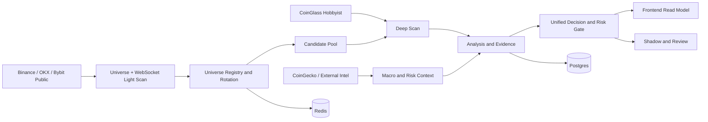

# Market Radar Comprehensive Audit Report

生成日期：2026-07-10
审计类型：全系统只读架构审计与强化路线设计
当前结论：`可运行但不完整 / 不能支撑实战`
综合评分：`53 / 100`

## Executive Summary

Market Radar 已经不是演示壳。它具备真实的多交易所公开市场发现、CoinGlass 深扫、Redis 运行协调、Postgres 持久化、多个 worker、严格状态语义、3:1 结构盈亏比门禁、研究型回测、生产证据验证和腾讯云 Docker Compose 运行底座。

但它还不是专业 CEX 合约雷达，核心差距不是“功能数量”，而是三件更基础的事：

1. **事实层仍会污染展示。** 候选展示会合成方向、新鲜度、更新时间、评分、情绪和量能倍数；复盘会把未知最大浮盈/最大回撤变成 0，并把未命中样本显示成“超时未达”；市场页把轻扫覆盖率直接当作数据可信度。
2. **交易能力尚未通过系统自己的专业审计。** 最近一次 10x10 专业审计中，扫描 50.74、分析 46.57、策略 22.48，100 个节点没有一个 `TRADE_PLAN_READY`，WAIT 计划先到目标率为 0%。
3. **Shadow 与复盘尚未形成可学习闭环。** 本地基线仍是 `shadowTrackingStarted=false`，48 个到期 checkpoint 因缺少观测价格进入 `pending_with_error`，`recorded=0`；生产 runner 虽已有监督与自动循环代码，但本地、生产和交接文档的 run 状态并未形成单一事实源。

因此当前准确定位是：

- 工程底座：**较强的生产型研究平台**。
- 全市场发现：**真实可运行，但深扫吞吐和口径仍不足**。
- 交易辅助：**研究级 beta，不能作为成熟交易决策系统**。
- Shadow / Review：**框架已搭建，统计学习价值尚未证明**。
- Production Grade：**部分达到，端到端尚未达到**。

距离专业系统不是补几张卡片，而是还差“事实层收口、数据质量统一、交易认知验证、Shadow 真 outcome、用户复盘闭环”五个能力台阶。六阶段路线全部通过后，才有资格重新评估是否进入专业交易辅助系统等级。

## Current System Assessment

### 证据来源

本报告同时使用四类证据，避免把某一层的事实冒充全系统事实：

| 证据层 | 本轮使用内容 | 边界 |
| --- | --- | --- |
| 当前工作树 | 约 12.3 万行 TypeScript/TSX、414 个源码文件、145 个测试文件 | 含前序未提交改动，不等于已合并 Git 主线 |
| 本地验证 | typecheck、lint、835 market、17 worker、4 historical、build、16 golden、15 evidence tests | 证明工程门禁，不证明交易有效性 |
| 生产只读观察 | Edge 生产页面和 OrcaTerm 内只读 `/api/health` | 单点/短时证据，不替代最终 evidence validate |
| 历史能力审计 | 2026-07-05 专业回测、Shadow baseline、最近生产报告 | 部分结果已老化，不能冒充当前正式重跑 |

### 当前生产快照

2026-07-10 本轮只读采样显示：

- `/api/health`：HTTP 200，`level=ready`。
- scan：`status=ready`、`freshness=fresh`、`scannedCount=38`、`candidateCount=24`。
- Redis / Postgres：healthy / ready。
- scanner、websocket-light、coinglass、signal、dynamic-scan-scheduler、macro 六个 worker：当前均 healthy。
- CoinGlass：生产页面显示 ready，但深扫 46/651 clean rows，clean rate 约 7.1%，交易所覆盖 1/3，主动买卖数据仍未接通。

必须保留的生产边界：上一份最终 production evidence 在 2026-07-09T17:31Z 仍因 `signal-worker=degraded` 判定 `production_health=partial`、`production_status=partial`。本轮任务禁止修改生产，因此没有重新生成证据包。当前只能写“实时健康已恢复”，不能写“最终 production evidence 已 PASS”。

## Architecture Review

### Repository Architecture Review

| 领域 | 主要目录 / 模块 | 当前职责 | 判断 |
| --- | --- | --- | --- |
| Frontend | `src/app`、`src/components` | Next.js App Router 页面、前端合同消费、状态和信息分层 | 页面职责清楚，但展示适配层越权生成事实 |
| Backend | `src/lib/api`、`src/app/api` | health、backend/frontend contracts、admin protected routes | 合同丰富，但 `frontend-contract.ts` / `system-health.ts` 过大 |
| Market / Scan | `src/lib/market` | universe、公开轻扫、CoinGlass 深扫、轮转、扫描状态池 | 真实链路完整，模块数量多且口径分散 |
| Analysis | `src/lib/analysis`、`v2`、`v3` | 异动、结构、证据融合、关键位、等待计划 | 能力广，但旧 planner、v2、v3 并存，调用链复杂 |
| Decision / Risk | `src/lib/decision`、`src/lib/risk` | 统一决策、RR、个人仓位镜头 | 后端门禁严格，展示适配仍可制造方向感 |
| Persistence | `src/lib/persistence` | Postgres / Neon / memory adapters、repository | adapter 边界真实且有多个实现，结构较好 |
| Cache / Runtime | Redis、`src/lib/runtime` | 锁、预算、心跳、实时快照、运行探针 | 关键单点；缺失时多处进入 fallback |
| Workers | `deploy/workers`、Docker Compose | 扫描、WebSocket、CoinGlass、signal、macro、Shadow | 角色清楚，但靠 protected HTTP 协调，没有成熟任务队列 |
| Shadow | `src/lib/shadow`、`src/scripts/shadow` | 事件、checkpoint、outcome、runner runtime | research-only 防线强，事实源和运行结果仍分裂 |
| Review / Backtest | `src/lib/review`、`journal`、`backtest` | 归因、专业审计、权重建议、回放 | 研究能力强，真实样本和用户闭环弱 |
| Deployment | `deploy`、`scripts/production`、`.github/workflows` | build、smoke、evidence、backup、rollback、manual gate | 有完整工具箱，但生产发布仍存在手工覆盖和 Git 漂移 |

### 架构优点

- SCAN / ANALYSIS / STRATEGY / BACKTEST 的规则边界在代码和测试中被大量显式保护。
- Postgres / Neon / memory repository 已形成真实的存储边界，不是只有一个 adapter 的假抽象。
- Binance / OKX / Bybit discovery adapters 和 CoinGlass adapter 已形成可扩展的数据源结构。
- 统一决策引擎对 WAIT、BLOCKED、READY 和 RR>=3 有明确防线。
- 生产 evidence validator 不允许 partial、stale、auth_error 或 worker down 被包装为 pass。

### 架构问题

1. `src/lib/api/frontend-contract.ts` 约 5661 行，同时承担类型、展示转换、复盘合同、候选补位、Shadow read model 等多种职责，Interface 过宽，Depth 不足，Locality 很差。
2. `src/lib/backtest/professional-audit-round.ts` 约 5383 行，扫描、分析、策略、指标、报告和问题归因集中在一个 Module，测试只能覆盖大量内部细节。
3. `src/lib/api/system-health.ts` 约 2834 行，运行探针、业务能力、复盘统计和策略权重状态混在一起。
4. `src/lib/analysis/strategy-planner.ts`、analysis v2、analysis v3 和 unified decision 同时存在。当前调用链能工作，但维护者必须跨多个 Module 才能判断“最终谁有权决定”。
5. 前端展示适配器成为第二套业务推导实现，破坏 backend contract 的单一事实源。

### Deepening Opportunities

1. **Market Fact Quality Module**
   - Files：`src/lib/market/types.ts`、`data-source-capabilities.ts`、providers、`frontend-display-adapters.ts`。
   - Problem：source、status、age、coverage、missing、confidence 分散在多个调用者。
   - Solution：建立单一 `MarketFactEnvelope` Interface，所有 Adapter 必须输出 value/null、source、observedAt、age、status、quality reasons。
   - Benefit：调用者不再猜 0 是真实值还是缺失值，获得更高 Leverage 和 Locality。

2. **Scan Orchestrator Module**
   - Files：`radar-snapshot.ts`、`provider-registry.ts`、`scan-runtime.ts`、`scan-coordinator.ts`、`universe-registry.ts`。
   - Problem：扫描生命周期和预算决策跨多个 Module。
   - Solution：保留 providers 作为 Adapter，把一次扫描的输入、预算、选币、深扫、持久化和状态输出收进一个深 Module。
   - Benefit：Interface 成为真正的测试 surface，故障和配额行为集中。

3. **Decision Read Model Module**
   - Files：`analysis`、`decision/unified-decision-engine.ts`、`frontend-contract.ts`。
   - Problem：前端仍需要重新推导候选方向、成熟度和评分。
   - Solution：后端输出完整的只读 decision read model；前端 Adapter 只格式化，不推导。
   - Benefit：删除平行实现，杜绝展示强于后端。

4. **Review Outcome Module**
   - Files：`journal/outcome-*`、`shadow/storage.ts`、`frontend-contract.ts`。
   - Problem：pending、expired、missing metrics 和 shadow outcome 有多套映射。
   - Solution：统一 outcome state machine 和 nullable metric Interface。
   - Benefit：pending 不再变 timeout，unknown 不再变 0，Shadow 与 Review 共用同一验证 surface。

5. **Runtime Evidence Module**
   - Files：`system-health.ts`、`runtime/*`、`scripts/production/observability.mjs`。
   - Problem：页面 health、evidence health、worker status 和部署状态有多套摘要。
   - Solution：生成一个带 provenance 的运行状态快照，再由页面和 evidence 使用不同 Adapter。
   - Benefit：实时状态与验收状态不再互相覆盖。

## Data Layer Review

### 当前数据路径



### 已具备能力

- 三家公开交易所 USDT 永续 universe 与 ticker 汇总。
- WebSocket 秒级价格、成交、盘口和主动成交代理。
- CoinGlass OI / Funding / pairs markets 深扫，带配额、pacing、429 cooldown 和 circuit breaker。
- 数据源 capability 分类可区分 auth_error、rate_limited、upgrade_required、unavailable。
- Redis 存锁、预算、heartbeat 和轻扫快照；Postgres 存 archive、journal、daily movers、OHLCV、rotation state、macro 等。

### 关键问题

1. `src/lib/frontend-display-adapters.ts:591-608` 把轻扫 coverage 直接作为 `trust`，同时把 `awaitingDeepScan` 作为 missing。生产页面出现 missing=549、trust=100%、degraded=否，口径自相矛盾。
2. `src/lib/frontend-display-adapters.ts:611-631` 把衍生品数值当作必填 number；上游 unavailable/blocked 被 0 占位后，生产页面把主动买卖未接入显示为 `0.00`。
3. 生产页面 CoinGlass deep scan clean rate 仅约 7.1%，交易所覆盖 1/3，但资源仍以“实时”主标签展示，缺少可操作的 partial 分级。
4. 深扫队列估算完整轮转约 1395 分钟，难以满足“提前发现后快速验证”的专业目标。
5. public universe 显示 1316 accepted / 3113 observed，另一个 scan proof 使用 1140 total / 593 eligible。两套 denominator 都有意义，但没有统一术语，用户无法判断覆盖率代表什么。
6. Redis、CoinGlass key 和单机 Postgres 都是单点。服务能重启，但没有高可用或自动故障转移。

### 数据层结论

数据接入广度达到研究平台水平；数据质量语义、深扫时效和缺失值处理未达到专业雷达水平。当前最大危险不是“没有数据”，而是“缺失数据被显示成 0、live 或 100% 可信”。

## Scanner Review

### 能否提前发现

| 场景 | 当前能力 | 结论 |
| --- | --- | --- |
| 启动前异动 | 有压缩、volume z-score、盘口、主动成交代理和 early score | 有能力，但专业审计启动前捕获率 23.53%，不稳定 |
| 趋势启动 | 有结构、相对强弱、多周期和 breakout edge | 能识别部分样本，排序质量不足 |
| 爆量突破 | ticker / WebSocket / volume anomaly 完整 | 能发现，晚到与假突破过滤仍需验证 |
| 资金进入 | OI / Funding / taker proxy / orderbook | OI/Funding 可用，真实 taker/CVD 不完整 |
| 异常波动 | 三所 public ticker + WebSocket | 当前最成熟的能力 |

### 生产表现

- public leaderboard 覆盖约 1316 个 ticker。
- 当前深扫每轮约 24 个资产，clean 46/651 rows。
- 机会观察池当前 62 条：0 计划就绪、0 证据观察、6 深度确认、32 快速轻扫、24 风控阻断。
- dashboard 另一处又显示证据观察 24，说明相同事实的分组口径不一致。

### 专业审计表现

- 扫描分：50.74 / 100。
- 结构可行动机会池 TopN 捕获率：26.42%。
- 启动前捕获率：23.53%。
- Top10 / Top20 / Top30 捕获率约 33.96% / 54.72% / 79.25%，说明系统不是完全看不见机会，而是前排排序和名额预算不足。

### Scanner 结论

当前扫描层可以作为广覆盖异常发现器，但还不能稳定完成“早发现、快验证、低漏判”的专业雷达职责。深扫轮转时间和候选排序是主要瓶颈。

## Trading Intelligence Review

### 已实现认知

- BTC / ETH 环境和 4h-1d、3-7d、30-90d、1d+1w 分层。
- 支撑、压力、箱体、HH/HL、LH/LL、突破、假突破、role flip。
- OI、Funding、盘口、主动成交代理、成交量和波动率证据。
- WAIT 条件、确认条件、结构失效、结构止损、目标位和 RR>=3。
- 追涨追空、晚到、噪音、假突破、数据 stale 等硬拦截。

### 当前不足

- 最近专业审计：分析 46.57，策略 22.48，均不合格。
- 100 个节点 `TRADE_PLAN_READY=0`。
- 33 次 RR<3、29 次 RR 不足或未知、19 次止损过宽。
- 12 个 WAIT 计划中 5 个触发，0 个先到目标，3 个先到止损。
- taker/CVD、真实 orderflow 和跨交易所衍生品覆盖不完整。
- 前端展示 Adapter 又生成候选方向和分数，破坏“分析结论只能来自后端”的原则。

### Trading Intelligence 结论

系统懂得大量专业概念，也能严格拒绝差计划，但“概念齐全”不等于“判断有效”。当前更像谨慎的结构研究引擎，还不是稳定的交易辅助决策引擎。

## Risk Review

### 强项

- 不自动下单，不接交易所下单 API。
- RR 最低 3:1 没有被放宽。
- WAIT / BLOCKED / OBSERVE / TRADE_PLAN_READY 有独立语义和测试。
- research-only 模块明确禁止自动调权、自动执行和回写 production ranking。
- production evidence validator 会阻断 partial / stale / worker down / auth_error。

### P0 防误导问题

1. `src/lib/frontend-display-adapters.ts:347-384` 从榜单种类和涨跌幅生成方向、成熟度、`freshness='live'` 和合成更新时间。
2. `src/lib/frontend-display-adapters.ts:663-705` 再生成 score、volume multiplier、bull sentiment，并按生成分排序；公开榜单候选还固定标成 exchange=`CoinGlass`。
3. `src/components/token/token-dossier.tsx:44-51` 把 24h change percent 放入 L3 `Price` 字段，并用中文“暂无”触发 UI schema guard。
4. `src/components/ui-information-layers.tsx:26-33` 正确阻断错误数据，却把 `l3_*_must_not_contain_chinese_explanation` 内部枚举直接展示给用户。
5. `src/lib/api/frontend-contract.ts:5080-5099` 把 null MFE/MAE 变成 0，把非 short 一律标成“多”。
6. `src/components/review/review-evolution.tsx:1349-1355` 对任何未先到 TP/SL 的记录都显示“超时未达”，没有检查 `timedOut`。

### 风险结论

后端交易门禁强，前端事实门禁弱。系统不太容易直接生成错误 READY，但容易让用户误判“数据是实时的、方向已经存在、复盘结果已经失败或超时”。

## Shadow Review

### 已证明

- 1h / 4h / 24h checkpoint schema。
- research-only guard、幂等、dry-run、missing price error 和 future-leak 防线。
- Docker `shadow-runner`、heartbeat、pid/runtimeId、stale lock 和 duplicate runner guard 已进入当前工作树。
- 生产历史证据曾观察到自动 capture 和 due sweep。

### 未证明

- 本地 current-run 仍是 baseline readiness，`shadowTrackingStarted=false`。
- 72 个 checkpoint 中 48 个因缺 `priceAtObservation` 进入 `pending_with_error`，recorded=0。
- 本地、生产 reports volume、PROJECT_CONTEXT 和页面没有统一 run registry。
- 当前 `/system` 页面没有展示 shadow-runner、runId、capture age、due pending、recorded rate。
- 尚无足量、可复现、跨市场状态的 1h/4h/24h有效 outcome 样本。

### Shadow 结论

当前 Shadow 是“安全且不污染生产的实验框架”，还不是“能证明系统判断有效的学习系统”。

## Review System Review

### 已具备

- 系统信号生命周期、最大浮盈/最大回撤、先到 TP/SL、超时和 missed opportunity 模块。
- 专业回测、黄金案例、策略权重 shadow/read-only/manual activation gate。
- 用户 trade journal 数据结构、纪律分和 local fallback。

### 缺失

- 页面没有 SYSTEM / USER / HYBRID 三种明确模式。
- 用户真实交易的纪律、情绪、入场偏差、止损偏差、目标偏差和 R-multiple 没有形成主流程。
- production review 当前显示 120 样本、55 closed，但 metric samples=0；“可统计”和“胜率样本不足”并列，语义冲突。
- pending 记录被显示为超时、null MFE/MAE 被显示为 0，当前统计不能用于学习结论。
- 历史回测页面仍引用约 173 小时前报告，必须清楚区分旧报告和当前系统能力。

### Review 结论

系统复盘工具很多，但真正的反馈闭环仍未建立。当前更像“研究报告中心”，不是“系统能力验证 + 用户交易训练中心”。

## Frontend Review

### 信息架构

页面骨架基本符合专业终端工作流：

- `/dashboard`：运行状态和扫描证明。
- `/signals`：候选与计划就绪区。
- `/token/[id]`：单币档案。
- `/leaderboard`：榜单观察。
- `/market`：宏观与衍生品。
- `/review`：系统复盘。
- `/system`：运行健康。

### 优点

- 主入口直接进入工作界面，不是营销落地页。
- 候选、计划就绪、阻断和复盘有明显区分。
- 计划就绪为空时没有用候选补位。
- 单币页明确说明 TradingView 只负责看图，计划必须由后端输出。
- 视觉密度、颜色和终端感与 CEX 研究工具相符。

### 问题

- dashboard 有两张“全市场扫描证明”，第二张在生产显示全 0，与第一张真实 593/1140 冲突。
- dashboard 显示证据观察 24，signals 显示证据观察 0 / 风控阻断 24。
- market 页将 unavailable 显示为 0.00，并在 missing=549 时显示 trust=100%。
- token 页显示内部 schema error，且价格/成交额/24h change 在不同卡片出现口径冲突。
- review 页信息量很大，但没有系统复盘、用户复盘、混合复盘的任务导向。
- `/system` 只展示 6 个业务 worker、Redis/Postgres 和 CoinGlass 用量；缺 Caddy、shadow-runner、部署 commit、evidence 状态、rollback target、backup age、磁盘和 archive 持久化详情。
- 大量 9-11px 字号和长卡片降低快速扫描效率；小屏只能依赖纵向堆叠，没有经过 E2E 证据验证。

### 专业终端目标布局

- 顶部：全局健康、数据新鲜度、当前 scan cycle、风险模式。
- 左栏：universe / candidate / blocked / review filters。
- 中区：所选币价格结构、关键位、multi-timeframe 和事件时间线。
- 右栏：Decision / Reason / Evidence / Technical 四层，固定显示数据质量和阻断原因。
- 底部：Shadow outcome、系统事件、用户 journal 三条时间线，可切 SYSTEM / USER / HYBRID。
- 任一核心 source partial/stale 时使用全局降级带，不允许局部绿色“实时”掩盖。

## Engineering Review

### 已达到的 Production Grade 能力

- Next.js production build 可通过。
- Docker Compose 包含 web、Caddy、Postgres、Redis、6 个业务 worker 和 shadow-runner。
- 835 market tests、17 worker tests、4 historical tests、16 golden cases、15 evidence tests。
- GitHub Actions 有 forbidden files、secret patterns、typecheck、lint、market tests、build、golden、security gate。
- deploy / rollback 默认 dry-run，真实动作需要显式确认。
- Postgres backup、restore guard、production drill、smoke、evidence validator 均存在。

### 未达到的 Production Grade 能力

- 没有 Playwright/Cypress E2E、移动端、可访问性和视觉回归门禁。
- 没有负载、WebSocket soak、故障注入、Redis/Postgres 恢复时间和 CoinGlass 限流压力测试。
- backup 脚本存在，但 Docker Compose / CI 中没有证明自动调度、异地备份、保留策略和恢复 RPO/RTO。
- 单机是 web、worker、Redis、Postgres、Caddy 的共同故障域。
- 当前本地分支有约 29 个修改文件、多个未跟踪文件和约 1.6 万行 diff；生产又使用过 allowlist 文件覆盖，Git commit 与生产内容无法直接证明一致。
- production evidence 体系严格，但最新正式 evidence 尚未在当前健康状态下重跑 pass。

### 工程结论

代码质量门禁接近 Production Grade；发布可复现性、端到端测试、容灾和运行证明尚未达到 Production Grade。

## Score Card

| 维度 | 评分 | 主要依据 |
| --- | ---: | --- |
| 架构 | 68/100 | 分层和 Adapter 较完整，但三个超大 Module、v1/v2/v3 并存、展示层平行推导 |
| 数据 | 44/100 | 多源真实接入；缺失值、质量口径、1/3 衍生品覆盖和深扫时效不足 |
| 扫描 | 55/100 | 广覆盖可用；专业扫描分 50.74、TopN 和轮转不足 |
| 交易逻辑 | 39/100 | 结构概念齐全；分析 46.57、策略 22.48、READY=0 |
| 风险控制 | 66/100 | 后端 RR/状态门禁强；前端存在事实污染 P0 |
| Shadow | 32/100 | research-only 和 runner 框架有；真实 recorded outcome 未证明 |
| 复盘 | 38/100 | 研究模块多；SYSTEM/USER/HYBRID 和真实指标闭环缺失 |
| 前端 | 54/100 | 专业终端骨架可用；重复、矛盾、内部枚举和 0 值误导 |
| 工程 | 71/100 | 测试/CI/Docker/evidence 强；E2E、HA、备份证明和 Git 对齐不足 |
| 未来扩展 | 62/100 | 多 Adapter / repository seam 良好；大 Module 和单机耦合限制扩展 |
| **综合** | **53/100** | **较强研究平台，尚非专业 CEX 合约雷达** |

## Critical Weaknesses

### P0

1. 前端候选 Adapter 合成方向、新鲜度、年龄、来源、评分、情绪和量能倍数。
2. Review 把 pending/unknown 误显示为 timeout/0/long。
3. 数据质量把 light coverage 冒充 trust，把 unavailable 衍生品冒充 0。
4. 当前实时 health ready，但最终 production evidence 和 Git/content alignment 未闭环。

### P1

1. CoinGlass deep clean rate 低、1/3 exchange coverage、完整轮转约 23 小时。
2. 专业审计三大核心均不合格，WAIT 触发质量差。
3. Shadow recorded outcome 和 7-14 天样本未形成。
4. Review 不支持 SYSTEM / USER / HYBRID 完整工作流。
5. `frontend-contract.ts`、`professional-audit-round.ts`、`system-health.ts` 过大。
6. `/system` 缺 Shadow、commit、evidence、backup、rollback、disk 和 archive 关键运行事实。

### P2

1. dashboard 重复模块和页面间统计口径不一致。
2. 内部枚举、sourceId 和英文错误泄露到用户界面。
3. 缺 E2E、视觉回归、移动端、可访问性、负载和灾难恢复证据。
4. 文档历史很完整，但最新事实散落且互相覆盖，审计成本高。

## Enhancement Roadmap

### Phase 1 - 基础稳定性强化

**目标**：消除所有 P0 事实污染，建立单一运行事实源，并重新完成 production evidence PASS。

**为什么需要**：事实不可信时，后续扫描和策略评分都没有意义。

**涉及文件**：

- `src/lib/frontend-display-adapters.ts`
- `src/lib/api/frontend-contract.ts`
- `src/lib/radar-contract.ts`
- `src/components/ui-information-layers.tsx`
- `src/components/scan-proof.tsx`
- `src/components/dashboard/radar-control.tsx`
- `src/components/review/review-evolution.tsx`
- `src/app/market/market-page-client.tsx`
- `src/lib/api/system-health.ts`
- `scripts/production/observability.mjs`

**收益**：用户看到的 live、partial、0、unknown、direction 和 timeout 都与后端事实一致。

**风险**：修复后页面数字会减少、空态会增加，短期看起来“不如现在热闹”。这是正确结果。

**验证方式**：

- 为 candidate freshness/source/age、unknown derivatives、pending lifecycle、neutral direction 建红绿回归测试。
- Playwright 检查 dashboard / signals / token / market / review / system。
- 30-60 分钟生产观察：scan ready/fresh、scannedCount>0、workers healthy。
- 重新生成 real production evidence，validator pass。
- server content hash / Git commit 对齐。

### Phase 2 - 数据能力强化

**目标**：建立统一 Quality Gateway、跨所 instrument identity 和可计算的 coverage / completeness / freshness / confidence。

**为什么需要**：当前多源已经接入，但每个调用者仍在自行解释缺失和质量。

**涉及文件**：

- `src/lib/market/types.ts`
- `src/lib/market/data-source-capabilities.ts`
- `src/lib/market/providers/*`
- `src/lib/market/universe-registry.ts`
- `src/lib/market/ws-light-scan.ts`
- `src/lib/market/radar-snapshot.ts`
- `src/lib/persistence/persistence-contract.ts`
- `src/lib/persistence/persistence-store.ts`
- 建议新增 `src/lib/market/quality/market-fact.ts`
- 建议新增 `src/lib/market/quality/quality-gateway.ts`

**收益**：减少假 0、重复币、别名冲突、单源污染；深扫预算优先给真正高价值候选。

**风险**：schema 和 cache key 迁移可能影响历史数据；CoinGlass 限额仍是硬约束。

**验证方式**：

- stale/empty/partial/auth/rate-limit fault injection。
- Binance/OKX/Bybit 同币种和别名 dedupe fixtures。
- coverage denominator contract test。
- 统计 P50/P95 source latency、missing ratio、deep clean rate、full rotation minutes。
- 目标不是扩大请求量，而是在同预算下明显缩短高优先级候选的验证等待时间。

### Phase 3 - 交易认知强化

**目标**：让扫描、分析、策略分别只回答自己的问题，并提升结构判断、目标/止损质量和 WAIT 有效率。

**为什么需要**：当前系统能拦截坏计划，但无法稳定把好机会转成有效等待或计划。

**涉及文件**：

- `src/lib/analysis/anomaly-engine.ts`
- `src/lib/analysis/v2/*`
- `src/lib/analysis/v3/*`
- `src/lib/decision/unified-decision-engine.ts`
- `src/lib/market-regime/market-regime.ts`
- `src/lib/market/signal-maturity.ts`
- `src/lib/backtest/professional-audit*.ts`

**收益**：提高早期候选前排率、降低误杀和假阳性、让 WAIT 具备真实可验证条件。

**风险**：容易对最近 10x10 样本过拟合；任何改动都可能无意中降低 RR 或放松风控。

**验证方式**：

- 先过 16/16 golden，不改 RR>=3。
- 按市场状态做时间外 holdout，不使用 future MFE/MAE 参与生产分数。
- 单独报告 scan / analysis / strategy，不用总分掩盖退步。
- 重点指标：TopN early capture、analysis quality hit、false positive、WAIT trigger/TP-first/SL-first。

### Phase 4 - Shadow 学习强化

**目标**：形成唯一 live run registry，真实记录 observation price 和 1h/4h/24h outcome。

**为什么需要**：没有 recorded outcome，系统无法判断自己的实时判断是否有效。

**涉及文件**：

- `src/lib/shadow/storage.ts`
- `src/lib/shadow/runner-runtime.ts`
- `src/lib/shadow/enrichment.ts`
- `src/scripts/shadow/shadow-tracking.ts`
- `docker-compose.yml`
- `src/lib/persistence/*`
- `src/lib/api/system-health.ts`

**收益**：Shadow 从运行证明升级为效果证明。

**风险**：future leak、错误历史价格、重复 outcome、reports volume 增长和 runner 双实例。

**验证方式**：

- 连续 7-14 天运行。
- 每个 checkpoint 必须有 observation price provenance、checkpoint window 和真实 price source。
- duePending 长期为 0；recorded/error/retry 分布可解释。
- 幂等重跑零重复；Shadow 结果不改变 production ranking / strategy weights。

### Phase 5 - 复盘强化

**目标**：建立 SYSTEM / USER / HYBRID 三种复盘模式和 R 统计。

**为什么需要**：系统能力验证和用户执行训练是两类问题，当前被混在研究页面中。

**涉及文件**：

- `src/lib/journal/*`
- `src/lib/review/*`
- `src/lib/journal-store.ts`
- `src/lib/api/frontend-contract.ts`
- `src/components/review/review-evolution.tsx`
- `src/app/review/page.tsx`
- `src/lib/persistence/*`

**收益**：可以区分系统判断错误、用户执行错误和两者共同错误；形成纪律、情绪和 R-multiple 训练。

**风险**：用户记录与系统信号对齐复杂；主观情绪字段容易被误当客观证据。

**验证方式**：

- SYSTEM 只用系统 signal/outcome。
- USER 只用用户 entry/exit/stop/target/emotion/discipline。
- HYBRID 用稳定 correlation id 对齐，不能覆盖原始记录。
- R 统计必须按真实 entry/stop/exit 计算；缺值显示 unavailable。
- 校准建议必须人工确认，不自动调权。

### Phase 6 - 前端专业化

**目标**：把现有卡片长页重构为快速扫描、比较、钻取和复盘的专业工作台。

**为什么需要**：当前信息丰富，但重复、长滚动和小字号降低决策速度。

**涉及文件**：

- `src/app/dashboard/page.tsx`
- `src/app/signals/page.tsx`
- `src/app/token/[id]/page.tsx`
- `src/app/review/page.tsx`
- `src/app/system/page.tsx`
- `src/components/dashboard/*`
- `src/components/signals/*`
- `src/components/token/*`
- `src/components/review/*`
- `src/components/system/*`
- `src/app/globals.css`

**收益**：减少滚动和重复解释，让用户先看决策、风险和变化，再展开证据与技术细节。

**风险**：视觉重构可能掩盖数据问题；必须在 Phase 1-5 的合同稳定后实施。

**验证方式**：

- Desktop / tablet / mobile Playwright screenshots。
- 关键工作流：发现候选→打开单币→查看阻断→进入 Shadow/Review。
- 无重叠、无截断、键盘可达、状态颜色与文案一致。
- visual regression 只验证显示，不替代合同测试。

## Priority Ranking

| 优先级 | 任务 | 原因 |
| ---: | --- | --- |
| 1 | Phase 1 事实层收口 | 当前存在直接误导，所有后续能力都依赖它 |
| 2 | production evidence + Git/content 对齐 | 没有可复现生产基线，后续比较无效 |
| 3 | Quality Gateway + 深扫轮转 | 决定能否更快验证真正候选 |
| 4 | Trading Intelligence | 当前三大专业审计均不合格 |
| 5 | Shadow true outcomes | 没有 outcome 就没有自我提升 |
| 6 | SYSTEM/USER/HYBRID Review | 把系统学习和用户训练真正接起来 |
| 7 | Frontend professionalization | 等事实和合同稳定后再做，避免反复返工 |

## Recommended Next Actions

唯一建议的下一轮任务：

```text
Phase 1A - Frontend Truth Contract Repair
```

范围只处理四类 P0：

1. 删除候选展示层合成的 direction / freshness / age / source / score / sentiment / volMult。
2. 修复 pending / timeout / null MFE-MAE / neutral side 映射。
3. 修复 market data trust、unavailable derivatives 和重复 scan proof。
4. 把 UI schema guard 内部错误转换成用户可读降级状态，同时保留诊断日志。

本轮不要同时改扫描排序、策略权重、Shadow 算法或视觉主题。完成后跑基础门禁、前端合同回归、生产页面 smoke 和 real production evidence validate，再决定是否进入 Phase 2。

## Appendix A - 本轮交付记录

### 1. 本轮目标

对全系统进行代码事实、数据流、系统行为和生产页面四层审计，输出当前水平、差距、评分和路线。

### 2. 范围边界

本轮只读审计和文档设计；未修改业务代码、生产、数据库、Redis、策略权重。

### 3. 修改文件清单

- 本报告。
- `market-radar-comprehensive-audit-summary.json`。
- `PROJECT_CONTEXT_FOR_CHATGPT.md`。
- `CHANGELOG_FOR_CHATGPT.md`。

### 4. 对核心链路的影响

没有改变运行链路；识别了发现、深扫、分析、策略和复盘的真实阻断点。

### 5. 分层边界影响

未改变 scan / analysis / strategy / backtest / frontend / API / DB / Redis / worker / deployment / secret。

### 6. 风险说明

报告揭示 P0，但本轮未实施修复；当前生产实时健康不等于最终 evidence pass。

### 7. 执行命令

- `npm run typecheck`
- `npm run lint`
- `npm run test:market`
- `npm run build`
- `npm run backtest:golden`
- `npm run test:production-evidence`
- `npm run ci:forbidden-files`
- `npm run ci:secret-patterns`
- `npm run security:check`
- 生产只读 `/api/health` 和页面检查

### 8. 测试结果

- typecheck：pass。
- lint：pass。
- market：835/835 pass。
- workers：17/17 pass。
- historical：4/4 pass。
- build：pass。
- golden：16/16 pass。
- production evidence tests：15/15 pass。
- forbidden / secret / security：pass。
- formal：未运行。

### 9. 失败项

四个并行只读审计 agent 因使用额度限制未产出结果；报告结论不依赖这些 agent。

### 10. 是否更新 PROJECT_CONTEXT_FOR_CHATGPT.md

已更新。

### 11. 是否更新 CHANGELOG_FOR_CHATGPT.md

已更新。

### 12. 是否可以进入下一轮

可以进入 Phase 1A 事实层修复；不可以跳到策略增强、Shadow 学习或实盘。

### 13. 下一轮建议

只做 `Phase 1A - Frontend Truth Contract Repair`。
